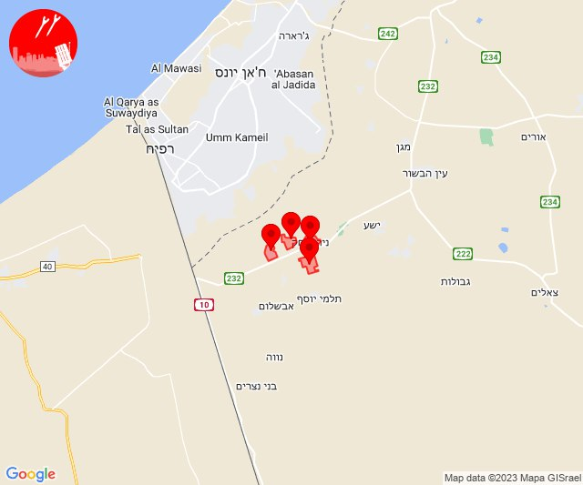
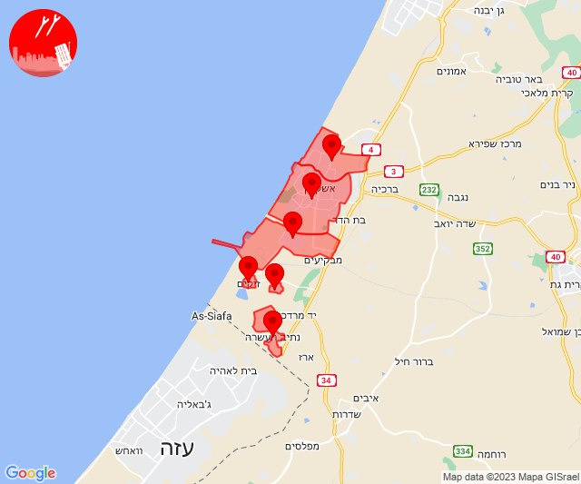

# Alerts for 2023-10-10

## 00:31

🔴 צבע אדום (10/10/2023):

03:31:
• עוטף עזה: כפר עזה, נחל עוז, סעד, עלומים (15 שניות)

צופר - צבע אדום

## 00:31

## 00:37

🔴 צבע אדום (10/10/2023):

03:37:
• עוטף עזה: נחל עוז, עלומים (15 שניות)

צופר - צבע אדום

## 00:37

## 00:55

🔴 צבע אדום (10/10/2023):

03:55:
• עוטף עזה: נחל עוז, עלומים (15 שניות)

צופר - צבע אדום

## 00:55

## 01:01

🔴 צבע אדום (10/10/2023):

04:01:
• עוטף עזה: נחל עוז, עלומים (15 שניות)

צופר - צבע אדום

## 01:01

## 01:21

🔴 צבע אדום (10/10/2023):

04:21:
• עוטף עזה: כפר עזה, סעד (15 שניות)

צופר - צבע אדום

## 01:21

## 07:09

🔴 צבע אדום (10/10/2023):

10:09:
• עוטף עזה: כיסופים, עין השלושה (15 שניות)

צופר - צבע אדום

## 07:09

## 07:24

🔴 צבע אדום (10/10/2023):

10:24:
• מערב לכיש: אזור תעשייה הדרומי אשקלון (30 שניות)
• עוטף עזה: זיקים, נתיב העשרה (15 שניות)

צופר - צבע אדום

## 07:24

## 07:48

🔴 צבע אדום (10/10/2023):

10:48:
• עוטף עזה: חולית, סופה, פרי גן, ניר יצחק (15 שניות)

צופר - צבע אדום

## 07:48

## 08:00

🔴 צבע אדום (10/10/2023):

11:00:
• עוטף עזה: שדרות, איבים, ניר עם, מטווח ניר עם, מפלסים, גבים, מכללת ספיר (15 שניות)

צופר - צבע אדום

## 08:00

## 08:59

🔴 צבע אדום (10/10/2023):

11:59:
• מערב לכיש: אזור תעשייה הדרומי אשקלון, אשקלון - דרום (30 שניות)
• עוטף עזה: כרמיה, זיקים (15 שניות)

צופר - צבע אדום

## 08:59

## 09:07

🔴 צבע אדום (10/10/2023):

12:07:
• עוטף עזה: כפר עזה (15 שניות)

צופר - צבע אדום

## 09:07

## 09:16

🔴 צבע אדום (10/10/2023):

12:15:
• עוטף עזה: זיקים, נתיב העשרה (15 שניות)
• מערב לכיש: אזור תעשייה הדרומי אשקלון (30 שניות)

12:16:
• עוטף עזה: כרמיה (15 שניות)

צופר - צבע אדום

## 09:16

## 09:22

🔴 צבע אדום (10/10/2023):

12:22:
• עוטף עזה: נחל עוז (15 שניות)

צופר - צבע אדום

## 09:22

## 09:39

🔴 צבע אדום (10/10/2023):

12:39:
• מרכז הנגב: באר שבע - צפון, לקיה והפזורה, עומר (דקה)
• מערב הנגב: פעמי תש''ז, שדה צבי (30 שניות)

צופר - צבע אדום

## 09:39

## 10:01

🔴 צבע אדום (10/10/2023):

13:01:
• עוטף עזה: בארי (15 שניות)

צופר - צבע אדום

## 10:01

## 10:10

✈️ חדירת כלי טיס עוין (10/10/2023):

13:10:
• עוטף עזה: מטווח ניר עם, מפלסים 

צופר - צבע אדום

## 10:10

## 10:12

✈️ חדירת כלי טיס עוין (10/10/2023):

13:12:
• עוטף עזה: שדרות, איבים, ניר עם 

צופר - צבע אדום

## 10:12

## 10:37

🔴 צבע אדום (10/10/2023):

13:37:
• עוטף עזה: מפלסים (15 שניות)

צופר - צבע אדום

## 10:37

## 11:05

🔴 צבע אדום (10/10/2023):

14:04:
• מערב לכיש: אשקלון - דרום, אזור תעשייה הדרומי אשקלון (30 שניות)

14:05:
• עוטף עזה: זיקים, כרמיה, נתיב העשרה (15 שניות)

צופר - צבע אדום

## 11:05

## 11:19

🔴 צבע אדום (10/10/2023):

14:19:
• מערב הנגב: גבולות (30 שניות)
• עוטף עזה: מבטחים, עמיעוז, ישע, צוחר, אוהד (15 שניות)

צופר - צבע אדום

## 11:19

## 11:51

🔴 צבע אדום (10/10/2023):

14:51:
• עוטף עזה: כיסופים (15 שניות)

צופר - צבע אדום

## 11:51

## 11:53

🔴 צבע אדום (10/10/2023):

14:53:
• עוטף עזה: שדרות, איבים, ניר עם, מפלסים, מטווח ניר עם, גבים, מכללת ספיר (15 שניות)

צופר - צבע אדום

## 11:53

## 11:58

🔴 צבע אדום (10/10/2023):

14:58:
• עוטף עזה: שדרות, איבים, ניר עם, מפלסים, מטווח ניר עם (15 שניות)

צופר - צבע אדום

## 11:58

## 12:20

🔴 צבע אדום (10/10/2023):

15:20:
• עוטף עזה: מפלסים, כפר עזה, סעד (15 שניות)

צופר - צבע אדום

## 12:20

## 12:24

🔴 צבע אדום (10/10/2023):

15:22:
• לכיש: פלמחים (דקה וחצי)
• השפלה: פארק תעשיות פלמחים, ראשון לציון - מערב, גן שורק, נטעים (דקה וחצי)
• דן: תל אביב - דרום העיר ויפו, תל אביב - מזרח, תל אביב - מרכז העיר, בת-ים, חולון, מקווה ישראל (דקה וחצי)

15:23:
• לכיש: אשדוד - אזור תעשייה צפוני ונמל, אשדוד - א,ב,ד,ה, אשדוד - ג,ו,ז, אשדוד - ח,ט,י,יג,יד,טז, אשדוד - יא,יב,טו,יז,מרינה,סיטי, יבנה (45 שניות, דקה)
• דן: בני ברק, גבעת שמואל, פתח תקווה, רמת גן - מערב (דקה וחצי)

15:24:
• השפלה: ראשון לציון - מזרח, אירוס, בית חנן, בית עובד (דקה וחצי)

צופר - צבע אדום

## 12:24

## 12:37

🔴 צבע אדום (10/10/2023):

15:37:
• דן: אזור, חולון (דקה וחצי)
• השפלה: ראשון לציון - מזרח, בית דגן, חמד, משמר השבעה, גנות (דקה וחצי)

צופר - צבע אדום

## 12:37

## 12:38

🔴 צבע אדום (10/10/2023):

15:38:
• השפלה: ראשון לציון - מערב (דקה וחצי)

צופר - צבע אדום

## 12:38

## 12:47

🔴 צבע אדום (10/10/2023):

15:46:
• דן: הרצליה - מערב, הרצליה - מרכז וגליל ים, כפר שמריהו, מתחם פי גלילות, סינמה סיטי גלילות, רמת השרון, תל אביב - עבר הירקון (דקה וחצי)

15:47:
• דן: תל אביב - מרכז העיר (דקה וחצי)

צופר - צבע אדום

## 12:47

## 12:55

🔴 צבע אדום (10/10/2023):

15:55:
• עוטף עזה: כפר עזה (15 שניות)

צופר - צבע אדום

## 12:55

## 13:30

🔴 צבע אדום (10/10/2023):

16:30:
• דרום הנגב: כסייפה והפזורה, מרעית, תל ערד והפזורה, סעייה-מולדה והפזורה, אבו-תלול והפזורה (דקה וחצי)
• מרכז הנגב: אל סייד והפזורה, נבטים, תל שבע, אום בטין והפזורה, באר שבע - דרום, חצרים, באר שבע - מערב (דקה וחצי, דקה)

צופר - צבע אדום

## 13:30

## 13:33

🔴 צבע אדום (10/10/2023):

16:33:
• עוטף עזה: שדרות, איבים, ניר עם (15 שניות)

צופר - צבע אדום

## 13:33

## 13:45

🔴 צבע אדום (10/10/2023):

16:44:
• דן: תל אביב - מרכז העיר, תל אביב - עבר הירקון, תל אביב - דרום העיר ויפו (דקה וחצי)

16:45:
• דן: הרצליה - מערב, הרצליה - מרכז וגליל ים, כפר שמריהו, סינמה סיטי גלילות, מתחם פי גלילות (דקה וחצי)
• שרון: רשפון (דקה וחצי)

צופר - צבע אדום

## 13:45

## 14:00

🔴 צבע אדום (10/10/2023):

16:59:
• מערב לכיש: אזור תעשייה הדרומי אשקלון, אשקלון - צפון, אשקלון - דרום, אזור תעשייה צפוני אשקלון, באר גנים (30 שניות)
• עוטף עזה: כפר עזה, נתיב העשרה (15 שניות)

17:00:
• עוטף עזה: זיקים, כרמיה, יד מרדכי, שדרות, איבים, ניר עם, אור הנר, ארז (15 שניות)
• מערב לכיש: כפר סילבר, בת הדר, תלמי יפה, בית שקמה, גיאה, מבקיעים, משען, ברכיה (30 שניות)

צופר - צבע אדום

## 14:00

## 14:03

🔴 צבע אדום (10/10/2023):

17:03:
• ואדי ערה: באקה אל גרבייה, ג'ת (דקה וחצי)
• שומרון: חיננית, ריחן, שקד, טל מנשה (דקה וחצי)

צופר - צבע אדום

## 14:03

## 14:05

🔴 צבע אדום (10/10/2023):

17:05:
• עוטף עזה: זיקים, יד מרדכי, כרמיה, נתיב העשרה (15 שניות)

צופר - צבע אדום

## 14:05

## 14:07

🔴 צבע אדום (10/10/2023):

17:07:
• מערב לכיש: אזור תעשייה צפוני אשקלון, אזור תעשייה הדרומי אשקלון, אשקלון - דרום, אשקלון - צפון, מבקיעים, מבקיעים, כפר סילבר (30 שניות)

צופר - צבע אדום

## 14:07

## 14:13

🔴 צבע אדום (10/10/2023):

17:12:
• עוטף עזה: סופה, פרי גן, ניר יצחק (15 שניות)
• מערב לכיש: אשקלון - דרום, אזור תעשייה צפוני אשקלון, כפר סילבר, אשקלון - צפון (30 שניות)

17:13:
• מערב לכיש: אזור תעשייה הדרומי אשקלון, מבקיעים (30 שניות)
• עוטף עזה: זיקים (15 שניות)

צופר - צבע אדום

## 14:13

## 14:18

🔴 צבע אדום (10/10/2023):

17:17:
• עוטף עזה: כרמיה (15 שניות)

17:18:
• מערב לכיש: אשקלון - דרום, אשקלון - צפון (30 שניות)

צופר - צבע אדום

## 14:18

## 14:27

🔴 צבע אדום (10/10/2023):

17:27:
• קו העימות: מצובה, בצת, שלומי, אזור תעשייה אכזיב מילואות, לימן, חניתה (מיידי)

צופר - צבע אדום

## 14:27

## 14:32

🔴 צבע אדום (10/10/2023):

17:30:
• מערב לכיש: אזור תעשייה צפוני אשקלון, אשקלון - דרום, אשקלון - צפון, באר גנים, אזור תעשייה הדרומי אשקלון (30 שניות)

17:31:
• קו העימות: גורן, גורנות הגליל (מיידי)
• עוטף עזה: זיקים (15 שניות)
• מערב לכיש: ברכיה, כפר סילבר, ניר ישראל (30 שניות)

17:32:
• עוטף עזה: כרמיה (15 שניות)
• קו העימות: בצת, לימן, שלומי, מצובה (מיידי)

צופר - צבע אדום

## 14:32

## 14:58

🔴 צבע אדום (10/10/2023):

17:58:
• עוטף עזה: כיסופים, נירים, עין השלושה (15 שניות)

צופר - צבע אדום

## 14:58

## 15:29

🔴 צבע אדום (10/10/2023):

18:29:
• מערב לכיש: אזור תעשייה הדרומי אשקלון, אשקלון - דרום, אשקלון - צפון, באר גנים (30 שניות)
• עוטף עזה: זיקים (15 שניות)

צופר - צבע אדום

## 15:29

## 16:00

🔴 צבע אדום (10/10/2023):

19:00:
• מערב לכיש: אשקלון - דרום, אשקלון - צפון, אזור תעשייה הדרומי אשקלון, מבקיעים (30 שניות)

צופר - צבע אדום

## 16:00

## 16:05

🔴 צבע אדום (10/10/2023):

19:05:
• עוטף עזה: זיקים, כרמיה, נתיב העשרה (15 שניות)
• מערב לכיש: אזור תעשייה הדרומי אשקלון, אשקלון - דרום (30 שניות)

צופר - צבע אדום

## 16:05

## 16:29

🔴 צבע אדום (10/10/2023):

19:29:
• מערב לכיש: אזור תעשייה הדרומי אשקלון, אשקלון - דרום, אשקלון - צפון (30 שניות)

צופר - צבע אדום

## 16:29

## 16:32

🔴 צבע אדום (10/10/2023):

19:32:
• עוטף עזה: זיקים (15 שניות)

צופר - צבע אדום

## 16:32

## 18:01

🔴 צבע אדום (10/10/2023):

21:00:
• מערב לכיש: אזור תעשייה הדרומי אשקלון, אשקלון - דרום, אשקלון - צפון (30 שניות)
• עוטף עזה: זיקים (15 שניות)

21:01:
• עוטף עזה: כרמיה, נתיב העשרה (15 שניות)

צופר - צבע אדום

## 18:01

## 19:34

🔴 צבע אדום (10/10/2023):

22:34:
• עוטף עזה: זמרת, שובה, כפר עזה, סעד, עלומים (15 שניות)

צופר - צבע אדום

## 19:34

## 19:37

🔴 צבע אדום (10/10/2023):

22:37:
• עוטף עזה: נחל עוז (15 שניות)

צופר - צבע אדום

## 19:37

## 19:44

🔴 צבע אדום (10/10/2023):

22:44:
• עוטף עזה: זמרת, שובה, כפר עזה, סעד, עלומים (15 שניות)

צופר - צבע אדום

## 19:44

## 20:03

🔴 צבע אדום (10/10/2023):

23:03:
• עוטף עזה: נחל עוז (15 שניות)

צופר - צבע אדום

## 20:03

