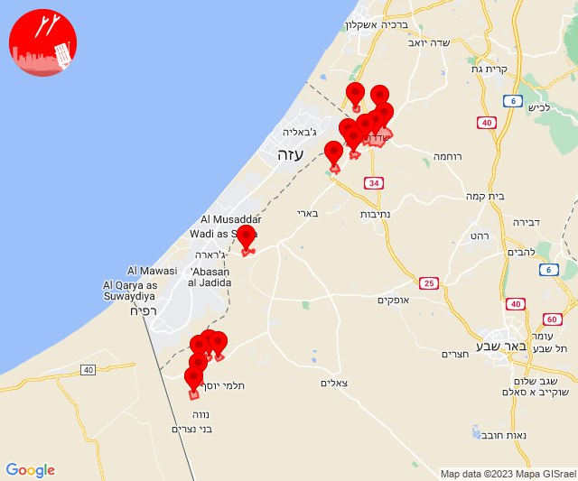
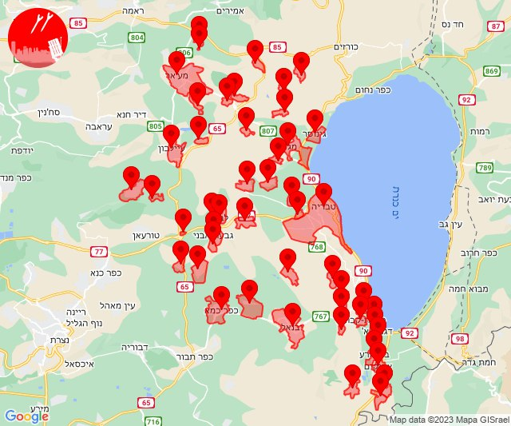

# Alerts for 2023-10-11

## 00:17

🔴 צבע אדום (11/10/2023):

03:17:
• עוטף עזה: נתיב העשרה (15 שניות)

צופר - צבע אדום

## 00:17

## 05:05

🔴 צבע אדום (11/10/2023):

08:05:
• עוטף עזה: שדרות, איבים, ניר עם (15 שניות)

צופר - צבע אדום

## 05:05

## 05:43

🔴 צבע אדום (11/10/2023):

08:43:
• עוטף עזה: נירים (15 שניות)

צופר - צבע אדום

## 05:43

## 06:08

🔴 צבע אדום (11/10/2023):

09:08:
• עוטף עזה: שדרות, איבים, ניר עם (15 שניות)

צופר - צבע אדום

## 06:08

## 07:41

🔴 צבע אדום (11/10/2023):

10:41:
• עוטף עזה: נתיב העשרה (15 שניות)

צופר - צבע אדום

## 07:41

## 08:28

🔴 צבע אדום (11/10/2023):

11:27:
• עוטף עזה: שדרות, איבים, ניר עם, ארז, אור הנר (15 שניות)

11:28:
• עוטף עזה: גבים, מכללת ספיר (15 שניות)

צופר - צבע אדום

## 08:28

## 08:56

🔴 צבע אדום (11/10/2023):

11:56:
• קו העימות: ערב אל עראמשה (מיידי)

צופר - צבע אדום

## 08:56

## 09:02

🔴 צבע אדום (11/10/2023):

12:01:
• לכיש: זוהר (30 שניות)

12:02:
• לכיש: שדה דוד, ניר ח''ן (30 שניות)

צופר - צבע אדום

## 09:02

## 09:12

🔴 צבע אדום (11/10/2023):

12:12:
• עוטף עזה: זיקים, כרמיה (15 שניות)
• מערב לכיש: אזור תעשייה הדרומי אשקלון, אשקלון - דרום, אשקלון - צפון (30 שניות)

צופר - צבע אדום

## 09:12

## 09:47

🔴 צבע אדום (11/10/2023):

12:47:
• עוטף עזה: ארז, נתיב העשרה (15 שניות)

צופר - צבע אדום

## 09:47

## 10:08

🔴 צבע אדום (11/10/2023):

13:08:
• עוטף עזה: מטווח ניר עם (15 שניות)

צופר - צבע אדום

## 10:08

## 10:21

🔴 צבע אדום (11/10/2023):

13:21:
• מערב לכיש: אזור תעשייה הדרומי אשקלון (30 שניות)

צופר - צבע אדום

## 10:21

## 10:24

🔴 צבע אדום (11/10/2023):

13:24:
• מערב לכיש: אשקלון - דרום, אשקלון - צפון, אזור תעשייה צפוני אשקלון (30 שניות)
• עוטף עזה: זיקים (15 שניות)

צופר - צבע אדום

## 10:24

## 10:29

🔴 צבע אדום (11/10/2023):

13:27:
• מערב לכיש: אזור תעשייה הדרומי אשקלון, באר גנים (30 שניות)
• עוטף עזה: כרמיה, נתיב העשרה (15 שניות)

13:28:
• מערב לכיש: מבקיעים, כפר סילבר, בית שקמה, ברכיה, בת הדר, משען, ניר ישראל, ניצנים, גיאה, ניצן (30 שניות, 45 שניות)
• לכיש: בית עזרא (45 שניות)

13:29:
• לכיש: אזור תעשייה עד הלום, אשדוד - ח,ט,י,יג,יד,טז, אשדוד - יא,יב,טו,יז,מרינה,סיטי (45 שניות)
• מערב לכיש: אשקלון - צפון, אשקלון - דרום, אזור תעשייה צפוני אשקלון (30 שניות)
• עוטף עזה: זיקים (15 שניות)

צופר - צבע אדום

## 10:29

## 10:34

🔴 צבע אדום (11/10/2023):

13:34:
• מערב לכיש: אשקלון - דרום, אשקלון - צפון, באר גנים, אזור תעשייה הדרומי אשקלון, אזור תעשייה צפוני אשקלון (30 שניות)
• עוטף עזה: זיקים (15 שניות)

צופר - צבע אדום

## 10:34

## 10:36

🔴 צבע אדום (11/10/2023):

13:36:
• עוטף עזה: כרמיה, נתיב העשרה (15 שניות)

צופר - צבע אדום

## 10:36

## 10:43

🔴 צבע אדום (11/10/2023):

13:43:
• עוטף עזה: עין השלושה (15 שניות)

צופר - צבע אדום

## 10:43

## 10:49

✈️ חדירת כלי טיס עוין (11/10/2023):

13:49:
• עוטף עזה: ניר עוז 

צופר - צבע אדום

## 10:49

## 11:00

🔴 צבע אדום (11/10/2023):

14:00:
• עוטף עזה: נחל עוז (15 שניות)

צופר - צבע אדום

## 11:00

## 11:07

✈️ חדירת כלי טיס עוין (11/10/2023):

14:07:
• לכיש: אשדוד - א,ב,ד,ה 

צופר - צבע אדום

## 11:07

## 11:08

🔴 צבע אדום (11/10/2023):

14:08:
• מערב לכיש: אזור תעשייה הדרומי אשקלון, אשקלון - דרום, אשקלון - צפון, באר גנים, אזור תעשייה צפוני אשקלון (30 שניות)
• עוטף עזה: זיקים, כרמיה (15 שניות)

צופר - צבע אדום

## 11:08

## 12:01

🔴 צבע אדום (11/10/2023):

15:00:
• עוטף עזה: נתיב העשרה, יד מרדכי (15 שניות)

15:01:
• מערב לכיש: אזור תעשייה הדרומי אשקלון, מבקיעים (30 שניות)

צופר - צבע אדום

## 12:01

## 12:03

🔴 צבע אדום (11/10/2023):

15:02:
• עוטף עזה: כרם שלום (15 שניות)

צופר - צבע אדום

## 12:03

## 12:27

🔴 צבע אדום (11/10/2023):

15:26:
• דן: חולון (דקה וחצי)
• השפלה: ראשון לציון - מערב, רחובות, ישרש, לוד, ניר צבי, רמלה, סתריה, אחיעזר, זיתן, יגל (דקה וחצי)
• ירקון: בני עטרות (דקה וחצי)

15:27:
• לכיש: בית אלעזרי, גבעת ברנר (דקה, דקה וחצי)
• השפלה: גן שלמה, קריית עקרון, נצר סרני, ראשון לציון - מזרח, באר יעקב, נס ציונה, תעשיון צריפין (דקה וחצי)

צופר - צבע אדום

## 12:27

## 12:46

שלום לכולם

צופר היא מערכת המופעלת בהתנדבות מלאה, אשר פותחה למען תושבי מדינת ישראל.

בייחוד בשעות הקשות האלו מפתחי צופר עובדים ומתחזקים את המערכות במטרה להמשיך ולספק לכם שירות התרעות אמין, מהיר ומציל חיים.

עקב ריבוי המשתמשים אנו נאלצים להרחיב ולשדרג את השרתים מעת לעת

תרומות יסייעו לנו בהמשך הפעלת האפליקציה ותשלום על השרתים
paypal.me/tzevaadom

לתרומות דרך ״ביט״ או ״פייבוקס״: @itaigu

בתקווה לימים שקטים יותר🇮🇱

איתכם בכל זמן,
מערכת צופר

## 12:58

🔴 צבע אדום (11/10/2023):

15:58:
• מערב לכיש: אזור תעשייה הדרומי אשקלון, אשקלון - דרום (30 שניות)
• עוטף עזה: כרמיה, זיקים, נתיב העשרה (15 שניות)

צופר - צבע אדום

## 12:58

## 12:59

🔴 צבע אדום (11/10/2023):

15:59:
• לכיש: אשדוד - אזור תעשייה צפוני ונמל (45 שניות)

צופר - צבע אדום

## 12:59

## 13:02

🔴 צבע אדום (11/10/2023):

16:01:
• עוטף עזה: כיסופים, עין השלושה (15 שניות)

16:02:
• עוטף עזה: נחל עוז (15 שניות)

צופר - צבע אדום

## 13:02

## 13:10

🔴 צבע אדום (11/10/2023):

16:10:
• מערב לכיש: אשקלון - דרום, אשקלון - צפון, באר גנים, אזור תעשייה הדרומי אשקלון, מבקיעים (30 שניות)
• עוטף עזה: זיקים, כרמיה, נתיב העשרה (15 שניות)

צופר - צבע אדום

## 13:10

## 13:17

🔴 צבע אדום (11/10/2023):

16:15:
• עוטף עזה: זיקים (15 שניות)

16:16:
• לכיש: אביגדור, אזור תעשייה באר טוביה, כפר ורבורג, תימורים, אזור תעשייה תימורים (45 שניות)
• דן: תל אביב - דרום העיר ויפו, בת-ים, חולון (דקה וחצי)
• מערב לכיש: אזור תעשייה הדרומי אשקלון (30 שניות)
• עוטף עזה: כרמיה, נתיב העשרה, מגן, ניר עוז, נירים (15 שניות)

16:17:
• השפלה: ראשון לציון - מערב (דקה וחצי)

צופר - צבע אדום

## 13:17

## 13:21

🔴 צבע אדום (11/10/2023):

16:18:
• עוטף עזה: יתד (15 שניות)

16:19:
• עוטף עזה: יבול, חולית, ניר יצחק, סופה, כיסופים (15 שניות)

16:20:
• עוטף עזה: כפר עזה, מפלסים, מטווח ניר עם, שדרות, איבים, ניר עם (15 שניות)

16:21:
• עוטף עזה: אור הנר, ארז (15 שניות)

צופר - צבע אדום

## 13:21

## 13:24

🔴 צבע אדום (11/10/2023):

16:24:
• מערב הנגב: אופקים (45 שניות)

צופר - צבע אדום

## 13:24

## 13:26

🔴 צבע אדום (11/10/2023):

16:26:
• לכיש: אשדוד - יא,יב,טו,יז,מרינה,סיטי (45 שניות)

צופר - צבע אדום

## 13:26

## 13:33

🔴 צבע אדום (11/10/2023):

16:33:
• עוטף עזה: כיסופים (15 שניות)

צופר - צבע אדום

## 13:33

## 13:37

🔴 צבע אדום (11/10/2023):

16:37:
• עוטף עזה: סופה (15 שניות)

צופר - צבע אדום

## 13:37

## 13:45

🔴 צבע אדום (11/10/2023):

16:45:
• עוטף עזה: ניר יצחק, סופה, חולית (15 שניות)

צופר - צבע אדום

## 13:45

## 13:56

🔴 צבע אדום (11/10/2023):

16:55:
• מערב לכיש: אזור תעשייה הדרומי אשקלון (30 שניות)
• עוטף עזה: שדרות, איבים, ניר עם, נתיב העשרה, זיקים (15 שניות)

16:56:
• עוטף עזה: כרמיה (15 שניות)

צופר - צבע אדום

## 13:56

## 14:01

🔴 צבע אדום (11/10/2023):

17:00:
• עוטף עזה: יד מרדכי (15 שניות)

17:01:
• מערב לכיש: אזור תעשייה הדרומי אשקלון, גיאה, מבקיעים (30 שניות)

צופר - צבע אדום

## 14:01

## 14:07

🔴 צבע אדום (11/10/2023):

17:07:
• עוטף עזה: שדרות, איבים, ניר עם (15 שניות)

צופר - צבע אדום

## 14:07

## 14:16

🔴 צבע אדום (11/10/2023):

17:16:
• מערב לכיש: אזור תעשייה הדרומי אשקלון (30 שניות)
• עוטף עזה: זיקים, כרמיה, נתיב העשרה (15 שניות)

צופר - צבע אדום

## 14:16

## 14:25

הודעת מערכת צופר - עדכון לאפליקציה באנדרואיד

עקב בעיות שחוו חלק מהמשתמשים עם גרסאות אנדרואיד חדשות, לפני מספר דקות פורסם עדכון חדש לאפליקציה באנדרואיד בחנות האפליקציות.

העדכון מתקן מספר תקלות ובהן החיבור הרציף לשרת, מהירות ואמינות ההתרעות וקריסות במכשירי סמסונג עם אנדרואיד 13 ומעלה.
 
צוות צופר ממשיך לעבוד כל העת על מנת לפתור בעיות שונות במהירות המירבית, וזאת בזכות הדיווחים שאתם שולחים לנו.

  קישור לדף האפליקציה בחנות: https://play.google.com/store/apps/details?id=com.redalert.tzevaadom

## 14:52

✈️ חדירת כלי טיס עוין (11/10/2023):

17:52:
• קו העימות: אביבים 

צופר - צבע אדום

## 14:52

## 15:01

🔴 צבע אדום (11/10/2023):

18:01:
• מערב לכיש: אשקלון - דרום, אשקלון - צפון, באר גנים, ניצן, ניצנים (30 שניות, 45 שניות)
• לכיש: בית עזרא, אשדוד - יא,יב,טו,יז,מרינה,סיטי, אזור תעשייה עד הלום, אשדוד - א,ב,ד,ה, אשדוד - אזור תעשייה צפוני ונמל, אשדוד - ג,ו,ז, אשדוד - ח,ט,י,יג,יד,טז (45 שניות)
• מערב הנגב: נתיבות, גילת, אשל הנשיא, תפרח (30 שניות, 45 שניות)
• עוטף עזה: זמרת, שובה, כפר מימון ותושיה, חוות יזרעם, תקומה (15 שניות)
• מרכז הנגב: באר שבע - מערב, באר שבע - דרום, תראבין א-צאנע והפזורה, אתר דודאים (דקה, 45 שניות)

צופר - צבע אדום

## 15:01

## 15:17

🔴 צבע אדום (11/10/2023):

18:17:
• עוטף עזה: נתיב העשרה (15 שניות)

צופר - צבע אדום

## 15:17

## 15:18

🔴 צבע אדום (11/10/2023):

18:18:
• עוטף עזה: סופה, ניר יצחק, חולית, פרי גן (15 שניות)

צופר - צבע אדום

## 15:18

## 15:19

✈️ חדירת כלי טיס עוין (11/10/2023):

18:19:
• בקעת בית שאן: בית שאן 
• גליל תחתון: טבריה 
• גליל עליון: צפת 

צופר - צבע אדום

## 15:19

## 15:21

✈️ חדירת כלי טיס עוין (11/10/2023):

18:20:
• קו העימות: בית הלל, בן עמי, גשר הזיו, הילה, חוסן, כפר גלעדי, כפר ורדים, כפר יובל, מטולה, מנרה, מעונה, מעיין ברוך, מעיליא, מעלות תרשיחא, מרגליות, משגב עם, נהריה, סער, עברון, קריית שמונה, תל חי, אביבים, אבירים, אבן מנחם, אדמית, אזור תעשייה אכזיב מילואות, אזור תעשייה רמת דלתון, אילון, אלקוש, בית ספר שדה מירון, בצת, ברעם, ג'ש - גוש חלב, גונן, גורן, פסוטה, פקיעין, צבעון, צוריאל, קיבוץ דן, ראש הנקרה, ריחאנייה, רמות נפתלי, שאר ישוב, שדה נחמיה, שומרה, שלומי, שמיר, שניר, שתולה, גורנות הגליל, געתון, דוב''ב, דישון, דלתון, דפנה, הגושרים, זרעית, חורפיש, חניתה, יחיעם, יערה, יפתח, יראון, כברי, כפר בלום, כפר סאלד, כרם בן זמרה, להבות הבשן, לימן, מרכז אזורי מבואות חרמון, מלכיה, מנות, מצובה, מתת, נאות מרדכי, נווה זיו, נטועה, סאסא, עבדון, ע'ג'ר, עין יעקב, עלמה, עמיר, ערב אל עראמשה 
• גליל עליון: שבי ציון, מזרעה 

18:21:
• קו העימות: מעונה, מעיין ברוך, מעיליא, מעלות תרשיחא, מרגליות, משגב עם, נהריה, סער, עברון, קריית שמונה, תל חי, אביבים, אבירים, אבן מנחם, אדמית, אזור תעשייה אכזיב מילואות, אזור תעשייה רמת דלתון, אילון, אלקוש, בית ספר שדה מירון, בצת, ברעם, ג'ש - גוש חלב, גונן, גורן, גורנות הגליל, געתון, דוב''ב, דישון, דלתון, דפנה, הגושרים, זרעית, חורפיש, חניתה, יחיעם, יערה, יפתח, יראון, כברי, כפר בלום, כפר סאלד, כרם בן זמרה, להבות הבשן, לימן, מלכיה, מנות, מצובה, מרכז אזורי מבואות חרמון, מתת, נאות מרדכי, נווה זיו, נטועה, סאסא, ע'ג'ר, עבדון, עין יעקב, עלמה, עמיר, ערב אל עראמשה, פסוטה, פקיעין, בית הלל, בן עמי, גשר הזיו, קיבוץ דן, הילה, חוסן, כפר גלעדי, כפר ורדים, כפר יובל, מטולה, מנרה, צבעון, צוריאל, ראש הנקרה, ריחאנייה, רמות נפתלי, שאר ישוב, שדה נחמיה, שומרה, שלומי, שמיר, שניר, שתולה 
• גליל עליון: נחף, נס עמים, נתיב השיירה, סאג'ור, עין אל אסד, עין המפרץ, עכו - אזור תעשייה, עכו, עמיעד, צורית גילון, צפת, ראמה, ראש פינה, שבי ציון, שומרת, שזור, שייח' דנון, אבו סנאן, אור הגנוז, איילת השחר, אמירים, אשרת, בר יוחאי, ג'וליס, גדות, גיתה, חולתה, טל-אל, ינוח-ג'ת, יסוד המעלה, ירכא, כיסרא סמיע, כישור, כליל, כפר יסיף, כפר שמאי, לוחמי הגטאות, לפידות, מזרעה, מירון, מרכז אזורי מרום גליל, משמר הירדן, ספסופה - כפר חושן, עין כמונים, עמוקה, עמקה, פלך, פרוד, אזור תעשייה חצור הגלילית, אזור תעשייה כרמיאל, אזור תעשייה צ.ח.ר, אליפלט, אמנון, בוסתן הגליל, ביריה, בית ג'אן, בית העמק, בענה, ג'דידה מכר, דיר אל-אסד, הר-חלוץ, חצור הגלילית, חרשים, טובא זנגריה, כורזים ורד הגליל, כפר הנשיא, כפר מסריק, כרכום, כרמיאל, לבון, מג'דל כרום, מחניים, מנחת מחניים, קדיתא, רגבה, שדה אליעזר, שפר, תובל 
• דרום הגולן: אבני איתן, אלוני הבשן, אלי עד, אניעם, אפיק, בני יהודה וגבעת יואב, גשור, האון, חד נס, חספין, יונתן, כנף, כפר חרוב, מבוא חמה, מיצר, מסדה, מעגן, מעלה גמלא, נאות גולן, נוב, נטור, עין גב, אזור תעשייה בני יהודה, אלמגור, חמת גדר, קדמת צבי, קצרין, קצרין - אזור תעשייה, קשת, רמות, רמת מגשימים, שער הגולן, תל קציר 
• צפון הגולן: אודם, אורטל, אל רום, בוקעתא, מג'דל שמס, מסעדה, מרום גולן, נווה אטי''ב, נמרוד, עין זיוון, עין קנייא, קלע, שעל 
• גליל תחתון: אזור תעשייה צמח, המכללה האקדמית כנרת 

צופר - צבע אדום

## 15:21

## 15:24

✈️ חדירת כלי טיס עוין (11/10/2023):

18:24:
• גליל תחתון: טבריה, כפר נהר הירדן, מצפה, אזור תעשייה קדמת גליל, אלומות, אפיקים, ארבל, אתר ההנצחה גולני, בית זרע, בית ירח, גבעת אבני, גינוסר, דגניה א, דגניה ב, הודיות, הזורעים, ואדי אל חמאם, חוקוק, יבנאל, כינרת מושבה, כינרת קבוצה, כפר זיתים, כפר חיטים, כפר כמא, לביא, לבנים, מגדל, פוריה כפר עבודה, פוריה נווה עובד, פוריה עילית, רביד, שדה אילן, שרונה 
• העמקים: אילניה 
• דרום הגולן: אשדות יעקב איחוד, אשדות יעקב מאוחד 
• מרכז הגליל: בועיינה-נוג'ידאת, בית סוהר צלמון, טפחות, כלנית, כפר חנניה, מסד, מע'אר, מצפה נטופה, עילבון, עינבר 
• גליל עליון: כחל, קדרים 
• בקעת בית שאן: מנחמיה 

צופר - צבע אדום

## 15:24

## 15:26

✈️ חדירת כלי טיס עוין (11/10/2023):

18:26:
• בקעת בית שאן: בית שאן 
• קו העימות: דישון, עלמה 
• גליל תחתון: טבריה 
• גליל עליון: צפת 
• העמקים: רם און 

צופר - צבע אדום

## 15:26

## 15:29

✈️ חדירת כלי טיס עוין (11/10/2023):

18:29:
• בקעת בית שאן: בית שאן 
• גליל תחתון: טבריה 
• גליל עליון: צפת 
• קו העימות: דישון, עלמה 

צופר - צבע אדום

## 15:29

## 15:31

🔴 צבע אדום (11/10/2023):

18:31:
• הכרמל: כרם מהר''ל, עופר (דקה)

צופר - צבע אדום

## 15:31

## 15:33

🔓 חשש לחדירת מחבלים (11/10/2023):

18:30:
• קו העימות: מעיין ברוך 

צופר - חדירת מחבלים

## 15:33

## 15:36

✈️ חדירת כלי טיס עוין (11/10/2023):

18:35:
• העמקים: כפר תקווה, נופית, עדי, קריית טבעון - בית זייד, ראס עלי, שער העמקים, אילניה, אל-ח'וואלד מערב, ח'וואלד, סואעד חמירה, תחנת רכבת כפר יהושוע, אום אל-גנם, אזור תעשייה אלון התבור, אזור תעשייה מבואות הגלבוע, אזור תעשייה ציפורית, אחוזת ברק, אכסאל, אלוני אבא, בית לחם הגלילית, בית סוהר שיטה וגלבוע, בית קשת, בית שערים, בלפוריה, קבוצת גבע, גבעת אלה, גבת, גדעונה, גזית, גן נר, גניגר, דבוריה, דברת, דחי, הושעיה, היוגב, הסוללים, זרזיר, חג'אג'רה, טמרה בגלבוע, יזרעאל, יפיע, יפעת, ישובי אומן, מרכז חבר, ישובי יעל, כדורי, כעביה, כעביה טבאש, כפר ברוך, כפר גדעון, כפר החורש, כפר טבאש, כפר יהושע, כפר יחזקאל, כפר כנא, כפר מצר, כפר קיש, כפר תבור, מגדל העמק, מגן שאול, מוקיבלה, מזרע, מנשית זבדה, מרחביה מושב, מרחביה קיבוץ, משהד, נעורה, נהלל, נורית, נין, נצרת, נוף הגליל, סולם, סנדלה, עילוט, עין דור, עין חרוד, עין מאהל, עפולה, ציפורי, ריינה, רם און, רמת דוד, רמת ישי, רמת צבי, שבלי, שדה יעקב, שדמות דבורה, שמשית, שריד, תל יוסף, תל עדשים, תמרת, הרדוף, אורנים, אלון הגליל, אלונים, בסמת טבעון 
• גליל עליון: כרכום, כרמיאל, לבון, מג'דל כרום, מחניים, נחף, נס עמים, נתיב השיירה, סאג'ור, עין אל אסד, עין המפרץ, עכו - אזור תעשייה, עכו, עמיעד, צורית גילון, צפת, ראמה, ראש פינה, שבי ציון, שומרת, שזור, שייח' דנון, אבו סנאן, אור הגנוז, איילת השחר, אמירים, אשרת, בר יוחאי, ג'וליס, גדות, עין כמונים, עמוקה, עמקה, פלך, פרוד, קדיתא, קדרים, רגבה, שדה אליעזר, שפר, תובל, מנחת מחניים, אזור תעשייה שער נעמן, אפק, גיתה, ג'דידה מכר, דיר אל-אסד, הר-חלוץ, חצור הגלילית, חרשים, טובא זנגריה, יסעור, כורזים ורד הגליל, כפר הנשיא, כפר מסריק, כחל, כיסרא סמיע, כישור, כליל, כמון, כפר יסיף, כפר שמאי, לוחמי הגטאות, לפידות, מזרעה, מירון, מכמנים, מרכז אזורי מרום גליל, משמר הירדן, ספסופה - כפר חושן, אזור תעשייה בר-לב, אזור תעשייה חצור הגלילית, אזור תעשייה כרמיאל, אזור תעשייה צ.ח.ר, אחיהוד, אליפלט, אמנון, בוסתן הגליל, ביריה, בית ג'אן, בית העמק, בענה, חולתה, טל-אל, ינוח-ג'ת, יסוד המעלה, ירכא 
• מרכז הגליל: מורשת, מנוף, מצפה אבי''ב, מרכז אזורי משגב, עצמון - שגב, ערב אל-נעים, קורנית, רקפת, שורשים, שכניה, שעב, שפרעם, אבטליון, אזור תעשייה תרדיון, אשבל, אשחר, בועיינה-נוג'ידאת, בית סוהר צלמון, בית רימון, עינבר, עראבה, ראס אל-עין, רומאנה, רומת אל הייב, דיר חנא, טורעאן, דמיידה, חנתון, טמרה, יובלים, יודפת, יעד, כאבול, כאוכב אבו אלהיג'א, כפר מנדא, כלנית, כפר חנניה, לוטם וחמדון, מורן, מסד, מע'אר, מעלה צביה, מצפה נטופה, סכנין, סלמה, עוזייר, עילבון, אעבלין, ביר אלמכסור, הררית יחד, חוסנייה, חזון, טפחות 
• קו העימות: מטולה, מנרה, מעונה, מעיין ברוך, מעיליא, מעלות תרשיחא, מרגליות, משגב עם, נהריה, סער, עברון, קריית שמונה, תל חי, אביבים, אבירים, אבן מנחם, אדמית, אזור תעשייה אכזיב מילואות, אזור תעשייה רמת דלתון, אילון, אלקוש, בית ספר שדה מירון, בצת, ברעם, ג'ש - גוש חלב, גונן, גורן, גורנות הגליל, עלמה, עמיר, ערב אל עראמשה, פסוטה, פקיעין, צבעון, צוריאל, קיבוץ דן, ראש הנקרה, ריחאנייה, רמות נפתלי, שאר ישוב, שדה נחמיה, שומרה, שלומי, שמיר, שניר, שתולה, געתון, דוב''ב, דישון, דלתון, דפנה, הגושרים, גשר הזיו, הילה, חוסן, כפר גלעדי, כפר ורדים, כפר יובל, כפר בלום, כפר סאלד, כרם בן זמרה, להבות הבשן, לימן, מלכיה, מנות, מצובה, מרכז אזורי מבואות חרמון, מתת, נאות מרדכי, נווה זיו, נטועה, סאסא, ע'ג'ר, עבדון, עין יעקב, בית הלל, בן עמי, זרעית, חורפיש, חניתה, יחיעם, יערה, יפתח, יראון, כברי 
• גליל תחתון: מצפה, אזור תעשייה צמח, אזור תעשייה קדמת גליל, אלומות, אפיקים, ארבל, אתר ההנצחה גולני, בית זרע, בית ירח, גבעת אבני, פוריה כפר עבודה, פוריה נווה עובד, פוריה עילית, רביד, שדה אילן, שרונה, המכללה האקדמית כנרת, גינוסר, דגניה א, דגניה ב, טבריה, כפר נהר הירדן, כינרת מושבה, כינרת קבוצה, כפר זיתים, כפר חיטים, כפר כמא, לביא, לבנים, מגדל, הודיות, הזורעים, ואדי אל חמאם, חוקוק, יבנאל 
• המפרץ: רכסים, בית עלמין תל רגב, אושה, חיפה - כרמל ועיר תחתית, חיפה - מערב, חיפה - נווה שאנן ורמות כרמל, חיפה - קריית חיים ושמואל, חיפה - מפרץ, כפר ביאליק, כפר המכבי, קריית אתא, קריית ביאליק, קריית ים, החותרים, טירת כרמל, יגור, כפר גלים, כפר חסידים, קריית מוצקין, רמת יוחנן, נשר, איבטין

## 15:36

• דרום הגולן: אבני איתן, אלוני הבשן, אלי עד, אניעם, אפיק, אשדות יעקב איחוד, אשדות יעקב מאוחד, בני יהודה וגבעת יואב, קדמת צבי, קצרין - אזור תעשייה, קצרין, קשת, רמות, רמת מגשימים, שער הגולן, תל קציר, אזור תעשייה בני יהודה, גשור, האון, חמת גדר, כנף, כפר חרוב, מבוא חמה, מיצר, מסדה, מעגן, מעלה גמלא, נאות גולן, נוב, נטור, עין גב, אלמגור, חד נס, חספין, יונתן 
• צפון הגולן: אודם, אורטל, אל רום, בוקעתא, עין קנייא, קלע, שעל, מג'דל שמס, מסעדה, מרום גולן, נווה אטי''ב, נמרוד, עין זיוון 
• הכרמל: בית סוהר קישון 
• בקעת בית שאן: טייבה בגלבוע, מנחמיה 

צופר - צבע אדום

## 15:36

## 16:00

🔓 חשש לחדירת מחבלים (11/10/2023):

18:59:
• קו העימות: מעלות תרשיחא 

צופר - חדירת מחבלים

## 16:00

## 16:50

🔴 צבע אדום (11/10/2023):

19:49:
• השפלה: נצר סרני, רחובות, באר יעקב, נס ציונה, ראשון לציון - מזרח (דקה וחצי)

19:50:
• השפלה: גאליה, גיבתון, גן שלמה (דקה, דקה וחצי)
• לכיש: כפר הנגיד, גבעת ברנר (דקה, דקה וחצי)

צופר - צבע אדום

## 16:50

## 17:46

🔴 צבע אדום (11/10/2023):

20:46:
• עוטף עזה: שדרות, איבים, ניר עם (15 שניות)

צופר - צבע אדום

## 17:46

## 17:54

🔴 צבע אדום (11/10/2023):

20:54:
• מערב לכיש: אזור תעשייה הדרומי אשקלון (30 שניות)
• עוטף עזה: נתיב העשרה, זיקים, כרמיה (15 שניות)

צופר - צבע אדום

## 17:54

## 18:01

🔴 צבע אדום (11/10/2023):

20:59:
• עוטף עזה: מטווח ניר עם, מפלסים, שדרות, איבים, ניר עם (15 שניות)

21:00:
• עוטף עזה: נתיב העשרה, זיקים (15 שניות)
• מערב לכיש: אזור תעשייה הדרומי אשקלון (30 שניות)

21:01:
• עוטף עזה: כרמיה (15 שניות)

צופר - צבע אדום

## 18:01

## 18:09

🔴 צבע אדום (11/10/2023):

21:09:
• עוטף עזה: מפלסים, כפר עזה, נחל עוז, מטווח ניר עם, גבים, מכללת ספיר, שדרות, איבים, ניר עם, יכיני (15 שניות)
• מערב הנגב: דורות (30 שניות)

צופר - צבע אדום

## 18:10

## 18:31

🔴 צבע אדום (11/10/2023):

21:31:
• עוטף עזה: שדרות, איבים, ניר עם (15 שניות)

צופר - צבע אדום

## 18:31

## 19:04

🔴 צבע אדום (11/10/2023):

22:04:
• עוטף עזה: נחל עוז, עלומים (15 שניות)

צופר - צבע אדום

## 19:04

## 20:43

✈️ חדירת כלי טיס עוין (11/10/2023):

23:43:
• עוטף עזה: נחל עוז 

צופר - צבע אדום

## 20:43

