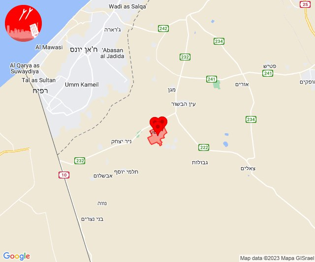
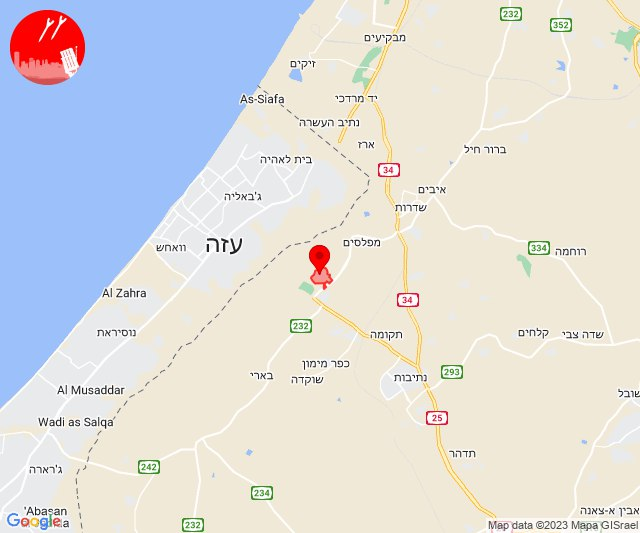

# Alerts for 2023-10-12

## 05:39

🔴 צבע אדום (12/10/2023):

08:39:
• שרון: טייבה, כוכב יאיר - צור יגאל, צור יצחק, צור נתן, סלעית, גאולים, פרדסיה, צור משה, קדימה-צורן, ינוב, כפר יונה, אבן יהודה (דקה וחצי)
• שומרון: אריאל (דקה וחצי)

צופר - צבע אדום

## 05:39

## 05:40

🔴 צבע אדום (12/10/2023):

08:40:
• שרון: בני דרור (דקה וחצי)

צופר - צבע אדום

## 05:40

## 06:35

🔴 צבע אדום (12/10/2023):

09:35:
• עוטף עזה: עין השלושה, נירים, כיסופים (15 שניות)

צופר - צבע אדום

## 06:35

## 06:47

🔴 צבע אדום (12/10/2023):

09:47:
• עוטף עזה: כיסופים (15 שניות)

צופר - צבע אדום

## 06:47

## 07:15

🔴 צבע אדום (12/10/2023):

10:15:
• עוטף עזה: נחל עוז (15 שניות)

צופר - צבע אדום

## 07:15

## 07:20

🔴 צבע אדום (12/10/2023):

10:20:
• עוטף עזה: נחל עוז (15 שניות)

צופר - צבע אדום

## 07:20

## 07:28

🔴 צבע אדום (12/10/2023):

10:28:
• עוטף עזה: נחל עוז (15 שניות)

צופר - צבע אדום

## 07:28

## 08:17

🔴 צבע אדום (12/10/2023):

11:17:
• עוטף עזה: ניר עוז (15 שניות)

צופר - צבע אדום

## 08:17

## 08:28

🔴 צבע אדום (12/10/2023):

11:28:
• עוטף עזה: שדרות, איבים, ניר עם, גבים, מכללת ספיר (15 שניות)

צופר - צבע אדום

## 08:28

## 08:30

🔴 צבע אדום (12/10/2023):

11:30:
• עוטף עזה: כיסופים (15 שניות)

צופר - צבע אדום

## 08:30

## 08:49

🔴 צבע אדום (12/10/2023):

11:49:
• עוטף עזה: נתיב העשרה, יד מרדכי (15 שניות)

צופר - צבע אדום

## 08:49

## 09:28

🔴 צבע אדום (12/10/2023):

12:28:
• עוטף עזה: מבטחים, עמיעוז, ישע (15 שניות)

צופר - צבע אדום

## 09:28

## 10:26

🔴 צבע אדום (12/10/2023):

13:26:
• עוטף עזה: נחל עוז (15 שניות)

צופר - צבע אדום

## 10:26

## 10:34

🔴 צבע אדום (12/10/2023):

13:34:
• עוטף עזה: נחל עוז (15 שניות)

צופר - צבע אדום

## 10:34

## 10:37

🔴 צבע אדום (12/10/2023):

13:37:
• עוטף עזה: כפר עזה (15 שניות)

צופר - צבע אדום

## 10:37

## 10:39

🔴 צבע אדום (12/10/2023):

13:39:
• עוטף עזה: נתיב העשרה (15 שניות)

צופר - צבע אדום

## 10:39

## 10:50

🔴 צבע אדום (12/10/2023):

13:48:
• שפלת יהודה: אזור תעשייה ברוש, בית שמש, זנוח (דקה וחצי)

13:49:
• שפלת יהודה: שדות מיכה (דקה)

13:50:
• שפלת יהודה: זכריה (דקה)

צופר - צבע אדום

## 10:50

## 10:54

🔴 צבע אדום (12/10/2023):

13:54:
• עוטף עזה: נתיב העשרה (15 שניות)

צופר - צבע אדום

## 10:54

## 11:52

🔴 צבע אדום (12/10/2023):

14:52:
• עוטף עזה: יד מרדכי, נתיב העשרה (15 שניות)
• מערב לכיש: אזור תעשייה הדרומי אשקלון, מבקיעים (30 שניות)

צופר - צבע אדום

## 11:52

## 12:05

🔴 צבע אדום (12/10/2023):

15:05:
• עוטף עזה: ארז, נתיב העשרה (15 שניות)

צופר - צבע אדום

## 12:05

## 12:50

🔴 צבע אדום (12/10/2023):

15:50:
• עוטף עזה: עין השלושה, נירים (15 שניות)

צופר - צבע אדום

## 12:50

## 13:29

🔴 צבע אדום (12/10/2023):

16:28:
• לכיש: אשדוד - א,ב,ד,ה, אשדוד - ח,ט,י,יג,יד,טז, אשדוד - יא,יב,טו,יז,מרינה,סיטי (45 שניות)

16:29:
• לכיש: אשדוד - ג,ו,ז (45 שניות)

צופר - צבע אדום

## 13:29

## 13:56

🔴 צבע אדום (12/10/2023):

16:55:
• עוטף עזה: שדרות, איבים, ניר עם, מטווח ניר עם (15 שניות)

16:56:
• עוטף עזה: מפלסים, גבים, מכללת ספיר (15 שניות)

צופר - צבע אדום

## 13:56

## 14:08

🔴 צבע אדום (12/10/2023):

17:08:
• קו העימות: דפנה, הגושרים, שאר ישוב (מיידי)

צופר - צבע אדום

## 14:08

## 14:15

🔴 צבע אדום (12/10/2023):

17:15:
• עוטף עזה: כיסופים (15 שניות)

צופר - צבע אדום

## 14:15

## 14:25

🔴 צבע אדום (12/10/2023):

17:25:
• עוטף עזה: כרם שלום (15 שניות)

צופר - צבע אדום

## 14:25

## 14:32

🔴 צבע אדום (12/10/2023):

17:30:
• לכיש: אשדוד - ח,ט,י,יג,יד,טז, אשדוד - יא,יב,טו,יז,מרינה,סיטי, גן הדרום, גן יבנה, אשדוד - א,ב,ד,ה, אשדוד - אזור תעשייה צפוני ונמל, שתולים, מתחם בני דרום, בני דרום, ניר גלים, אשדוד - ג,ו,ז (45 שניות, דקה)
• מערב לכיש: אזור תעשייה צפוני אשקלון, אשקלון - דרום, אשקלון - צפון, אזור תעשייה הדרומי אשקלון (30 שניות)
• עוטף עזה: זיקים, כרמיה (15 שניות)

17:31:
• לכיש: אזור תעשייה עד הלום (45 שניות)
• עוטף עזה: כרם שלום (15 שניות)

17:32:
• עוטף עזה: כיסופים (15 שניות)

צופר - צבע אדום

## 14:32

## 14:48

🔴 צבע אדום (12/10/2023):

17:48:
• עוטף עזה: זיקים, כרמיה, נתיב העשרה (15 שניות)
• מערב לכיש: אשקלון - צפון, אשקלון - דרום, אזור תעשייה צפוני אשקלון, באר גנים, אזור תעשייה הדרומי אשקלון, מבקיעים (30 שניות)

צופר - צבע אדום

## 14:48

## 14:54

🔴 צבע אדום (12/10/2023):

17:54:
• קו העימות: מטולה (מיידי)
• עוטף עזה: כיסופים (15 שניות)

צופר - צבע אדום

## 14:54

## 15:28

🔴 צבע אדום (12/10/2023):

18:28:
• עוטף עזה: יד מרדכי (15 שניות)

צופר - צבע אדום

## 15:28

## 15:30

🔴 צבע אדום (12/10/2023):

18:30:
• מערב לכיש: אזור תעשייה הדרומי אשקלון, מבקיעים, אשקלון - דרום, אשקלון - צפון (30 שניות)
• עוטף עזה: זיקים, כרמיה, עלומים (15 שניות)

צופר - צבע אדום

## 15:30

## 15:51

🔴 צבע אדום (12/10/2023):

18:51:
• מערב לכיש: אזור תעשייה הדרומי אשקלון (30 שניות)
• עוטף עזה: זיקים, נתיב העשרה, כרמיה (15 שניות)

צופר - צבע אדום

## 15:51

## 16:26

🔴 צבע אדום (12/10/2023):

19:26:
• עוטף עזה: נחל עוז, סעד, כפר עזה (15 שניות)
• מערב הנגב: נתיבות (30 שניות)

צופר - צבע אדום

## 16:26

## 17:04

🔴 צבע אדום (12/10/2023):

20:03:
• מרכז הנגב: אל סייד והפזורה, אום בטין והפזורה, באר שבע - מזרח, באר שבע - מערב, לקיה והפזורה, שגב שלום והפזורה, עומר (דקה וחצי, דקה)
• דרום הנגב: ואדי אל נעם דרום (דקה וחצי)

20:04:
• מרכז הנגב: באר שבע - דרום (דקה)

צופר - צבע אדום

## 17:04

## 17:13

🔴 צבע אדום (12/10/2023):

20:12:
• מרכז הנגב: לקיה והפזורה (דקה)

20:13:
• מרכז הנגב: באר שבע - דרום, באר שבע - מערב, חצרים (דקה)

צופר - צבע אדום

## 17:13

## 17:18

🔴 צבע אדום (12/10/2023):

20:18:
• מרכז הנגב: באר שבע - צפון, לקיה והפזורה (דקה)

צופר - צבע אדום

## 17:18

## 17:47

🔴 צבע אדום (12/10/2023):

20:47:
• קו העימות: כפר גלעדי, מרגליות, משגב עם, קריית שמונה, תל חי (מיידי)

צופר - צבע אדום

## 17:47

## 17:59

🔴 צבע אדום (12/10/2023):

20:59:
• עוטף עזה: נחל עוז (15 שניות)

צופר - צבע אדום

## 17:59

## 18:36

🔴 צבע אדום (12/10/2023):

21:36:
• עוטף עזה: נחל עוז (15 שניות)

צופר - צבע אדום

## 18:36

## 19:10

🔓 חשש לחדירת מחבלים (12/10/2023):

22:08:
• מערב הנגב: פטיש 

צופר - חדירת מחבלים

## 19:10

## 22:06

🔴 צבע אדום (13/10/2023):

01:06:
• עוטף עזה: נתיב העשרה (15 שניות)

צופר - צבע אדום

## 22:06

