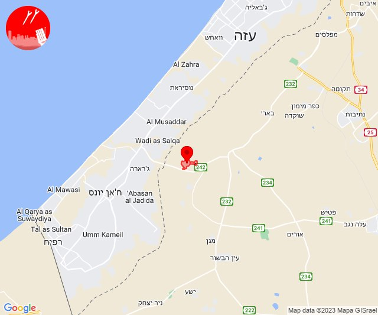
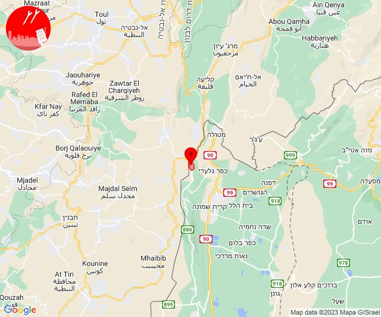
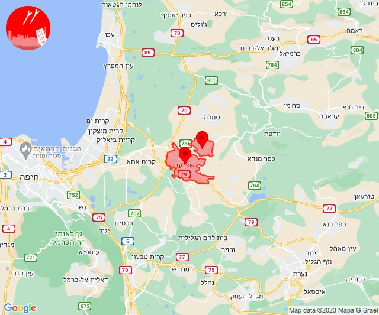

# Alerts for 2023-10-13

## 08:29

🔴 צבע אדום (13/10/2023):

11:28:
• מערב לכיש: אשקלון - דרום, אזור תעשייה הדרומי אשקלון, אשקלון - צפון, אזור תעשייה צפוני אשקלון, בת הדר, כפר סילבר, באר גנים, מבקיעים (30 שניות)
• עוטף עזה: זיקים (15 שניות)

11:29:
• עוטף עזה: כרמיה, נתיב העשרה (15 שניות)
• מערב לכיש: בית שקמה, גיאה (30 שניות)

צופר - צבע אדום

## 08:29

## 09:05

🔴 צבע אדום (13/10/2023):

12:05:
• מערב לכיש: אזור תעשייה הדרומי אשקלון, אשקלון - דרום, אשקלון - צפון (30 שניות)
• עוטף עזה: זיקים, כרמיה (15 שניות)

צופר - צבע אדום

## 09:05

## 09:15

🔴 התרעה (13/10/2023):

12:15:
• לכיש: קדרון 

צופר - צבע אדום

## 09:15

## 09:15

🔴 צבע אדום (13/10/2023):

12:14:
• השפלה: גני יוחנן, כפר ביל''ו, סתריה, קריית עקרון (דקה וחצי)
• לכיש: בית אלעזרי (דקה)
• עוטף עזה: נירים (15 שניות)

12:15:
• לכיש: גדרה, אזור תעשייה כנות, ביצרון, בני עי''ש, גן יבנה, חצב, כנות, מישר, משגב דב, נווה מבטח, עשרת, פארק תעשייה ראם (דקה, 45 שניות)

צופר - צבע אדום

## 09:15

## 09:18

🔴 צבע אדום (13/10/2023):

12:18:
• מערב לכיש: אשקלון - דרום, אזור תעשייה הדרומי אשקלון, אזור תעשייה צפוני אשקלון, אשקלון - צפון, ברכיה, הודיה, משען, ניר ישראל, באר גנים, כפר סילבר, מבקיעים (30 שניות)
• עוטף עזה: זיקים (15 שניות)

צופר - צבע אדום

## 09:18

## 09:28

🔴 צבע אדום (13/10/2023):

12:28:
• עוטף עזה: בארי (15 שניות)

צופר - צבע אדום

## 09:28

## 09:34

🔴 צבע אדום (13/10/2023):

12:33:
• עוטף עזה: שדרות, איבים, ניר עם (15 שניות)

צופר - צבע אדום

## 09:34

## 09:48

✈️ חדירת כלי טיס עוין (13/10/2023):

12:48:
• עוטף עזה: נחל עוז 

צופר - צבע אדום

## 09:48

## 10:04

🔴 צבע אדום (13/10/2023):

13:02:
• עוטף עזה: נירים, עין השלושה, ניר עוז (15 שניות)

13:03:
• עוטף עזה: חולית, סופה, שדה אברהם, דקל, אבשלום, יתד (15 שניות)

13:04:
• עוטף עזה: תלמי יוסף (15 שניות)

צופר - צבע אדום

## 10:04

## 10:09

✈️ חדירת כלי טיס עוין (13/10/2023):

13:09:
• עוטף עזה: נחל עוז 

צופר - צבע אדום

## 10:09

## 10:15

🔴 צבע אדום (13/10/2023):

13:15:
• עוטף עזה: שדרות, איבים, ניר עם, מטווח ניר עם, מפלסים (15 שניות)

צופר - צבע אדום

## 10:15

## 10:21

🔴 צבע אדום (13/10/2023):

13:20:
• עוטף עזה: זיקים (15 שניות)
• מערב לכיש: אשקלון - דרום, אזור תעשייה הדרומי אשקלון, אשקלון - צפון (30 שניות)

13:21:
• מערב לכיש: אזור תעשייה צפוני אשקלון (30 שניות)

צופר - צבע אדום

## 10:21

## 10:32

🔴 צבע אדום (13/10/2023):

13:32:
• עוטף עזה: בארי (15 שניות)

צופר - צבע אדום

## 10:32

## 10:55

🔴 צבע אדום (13/10/2023):

13:54:
• עוטף עזה: נחל עוז (15 שניות)

13:55:
• עוטף עזה: זמרת, שובה (15 שניות)

צופר - צבע אדום

## 10:55

## 11:00

🔴 צבע אדום (13/10/2023):

14:00:
• מערב לכיש: ניצן, אשקלון - דרום, אשקלון - צפון, באר גנים (45 שניות, 30 שניות)

צופר - צבע אדום

## 11:00

## 11:48

🔴 צבע אדום (13/10/2023):

14:48:
• עוטף עזה: מטווח ניר עם (15 שניות)

צופר - צבע אדום

## 11:48

## 12:03

🔴 צבע אדום (13/10/2023):

15:02:
• גליל עליון: ביריה, צפת, עמוקה (30 שניות)
• מרכז הגליל: דמיידה, כאוכב אבו אלהיג'א, מורשת, מנוף, קורנית, שכניה, כפר מנדא, מרכז אזורי משגב, רקפת (דקה)

15:03:
• העמקים: אלון הגליל, אלוני אבא, אלונים, בית לחם הגלילית, בית שערים, בסמת טבעון, הסוללים, הרדוף, זרזיר, חג'אג'רה, כעביה טבאש, כעביה, כפר טבאש, מנשית זבדה, נופית, עדי, קריית טבעון - בית זייד, ראס עלי, רמת ישי, אל-ח'וואלד מערב, ח'וואלד, סואעד חמירה (דקה)
• מרכז הגליל: ביר אלמכסור, שפרעם (דקה)
• המפרץ: בית עלמין תל רגב (דקה)

צופר - צבע אדום

## 12:03

## 12:07

🔴 צבע אדום (13/10/2023):

15:07:
• עוטף עזה: כיסופים (15 שניות)

צופר - צבע אדום

## 12:07

## 12:19

🔴 צבע אדום (13/10/2023):

15:19:
• עוטף עזה: שדרות, איבים, ניר עם, גבים, מכללת ספיר (15 שניות)

צופר - צבע אדום

## 12:19

## 12:30

🔴 צבע אדום (13/10/2023):

15:30:
• עוטף עזה: בארי, מטווח ניר עם (15 שניות)

צופר - צבע אדום

## 12:30

## 12:53

🔴 צבע אדום (13/10/2023):

15:53:
• עוטף עזה: בארי (15 שניות)

צופר - צבע אדום

## 12:53

## 13:05

✈️ חדירת כלי טיס עוין (13/10/2023):

16:05:
• עוטף עזה: בני נצרים 

צופר - צבע אדום

## 13:05

## 13:57

🔴 צבע אדום (13/10/2023):

16:57:
• עוטף עזה: כפר עזה, נחל עוז, סעד, עלומים (15 שניות)

צופר - צבע אדום

## 13:57

## 14:01

🔴 צבע אדום (13/10/2023):

17:00:
• השפלה: רחובות, ישרש, רמלה, סתריה, ראשון לציון - מערב (דקה וחצי)
• דן: בת-ים, חולון, תל אביב - דרום העיר ויפו, תל אביב - מרכז העיר, תל אביב - עבר הירקון (דקה וחצי)

17:01:
• לכיש: גבעת ברנר, בית אלעזרי, בית גמליאל (דקה וחצי, דקה)
• השפלה: קריית עקרון (דקה וחצי)

צופר - צבע אדום

## 14:01

## 14:49

🔴 צבע אדום (13/10/2023):

17:49:
• מערב הנגב: אופקים, דניאל, קריית חינוך מרחבים (45 שניות)

צופר - צבע אדום

## 14:49

## 15:26

🔴 צבע אדום (13/10/2023):

18:26:
• קו העימות: משגב עם (מיידי)

צופר - צבע אדום

## 15:26

## 16:00

🔴 צבע אדום (13/10/2023):

19:00:
• עוטף עזה: עלומים, נחל עוז (15 שניות)

צופר - צבע אדום

## 16:00

## 16:03

🔴 צבע אדום (13/10/2023):

19:03:
• מערב לכיש: אשקלון - דרום, אזור תעשייה הדרומי אשקלון (30 שניות)
• עוטף עזה: זיקים, כרמיה (15 שניות)

צופר - צבע אדום

## 16:03

## 16:11

🔴 צבע אדום (13/10/2023):

19:11:
• עוטף עזה: זיקים (15 שניות)

צופר - צבע אדום

## 16:11

## 17:08

🔴 צבע אדום (13/10/2023):

20:07:
• השפלה: באר יעקב, לוד, ניר צבי, רמלה, אחיעזר, זיתן, יגל (דקה וחצי)

20:08:
• השפלה: נצר סרני, ישרש (דקה וחצי)

צופר - צבע אדום

## 17:08

## 17:18

🔴 צבע אדום (13/10/2023):

20:18:
• עוטף עזה: יד מרדכי, כרמיה, נתיב העשרה (15 שניות)

צופר - צבע אדום

## 17:18

## 17:52

🔴 צבע אדום (13/10/2023):

20:51:
• מערב לכיש: אזור תעשייה הדרומי אשקלון (30 שניות)

20:52:
• עוטף עזה: נתיב העשרה, כרמיה (15 שניות)
• מערב לכיש: מבקיעים, אזור תעשייה צפוני אשקלון, אשקלון - דרום, בית שקמה, בת הדר (30 שניות)

צופר - צבע אדום

## 17:52

## 18:01

🔴 צבע אדום (13/10/2023):

21:00:
• מערב לכיש: אשקלון - דרום, אזור תעשייה הדרומי אשקלון (30 שניות)
• עוטף עזה: זיקים (15 שניות)
• לכיש: אשדוד - אזור תעשייה צפוני ונמל, אשדוד - אזור תעשייה צפוני ונמל, ניר גלים (45 שניות)

21:01:
• עוטף עזה: כיסופים (15 שניות)

צופר - צבע אדום

## 18:01

## 18:04

🔴 צבע אדום (13/10/2023):

21:03:
• לכיש: אשדוד - א,ב,ד,ה, אשדוד - ח,ט,י,יג,יד,טז, אשדוד - יא,יב,טו,יז,מרינה,סיטי (45 שניות)

21:04:
• לכיש: אשדוד - ג,ו,ז (45 שניות)

צופר - צבע אדום

## 18:04

## 19:00

🔴 צבע אדום (13/10/2023):

21:59:
• דן: חולון, תל אביב - מזרח, אזור, בני ברק, גבעת שמואל, גבעתיים, רמת גן - מזרח, רמת גן - מערב, תל אביב - עבר הירקון, הרצליה - מערב, תל אביב - מרכז העיר (דקה וחצי)
• השפלה: ראשון לציון - מזרח, ראשון לציון - מערב, משמר השבעה, גנות (דקה וחצי)
• לכיש: אשדוד - ג,ו,ז, אשדוד - ח,ט,י,יג,יד,טז (45 שניות)

22:00:
• לכיש: אזור תעשייה עד הלום, אשדוד - יא,יב,טו,יז,מרינה,סיטי, שדה עוזיהו, שתולים (45 שניות)

צופר - צבע אדום

## 19:00

## 19:34

🔴 צבע אדום (13/10/2023):

22:34:
• עוטף עזה: נתיב העשרה (15 שניות)

צופר - צבע אדום

## 19:34

## 19:55

🔴 צבע אדום (13/10/2023):

22:55:
• עוטף עזה: נחל עוז, עלומים, זמרת, שובה (15 שניות)

צופר - צבע אדום

## 19:55

## 20:58

🔴 צבע אדום (13/10/2023):

23:58:
• עוטף עזה: שדרות, איבים, ניר עם, מטווח ניר עם, גבים, מכללת ספיר, מפלסים (15 שניות)

צופר - צבע אדום

## 20:58

## 22:11

✈️ חדירת כלי טיס עוין (14/10/2023):

01:10:
• מרכז הגליל: אעבלין 

01:11:
• מרכז הגליל: שפרעם 

צופר - צבע אדום

## 22:11

