# Alerts for 2023-10-14

## 06:45

🔴 צבע אדום (14/10/2023):

09:45:
• עוטף עזה: שדרות, איבים, ניר עם, מטווח ניר עם, גבים, מכללת ספיר (15 שניות)

צופר - צבע אדום

## 06:45

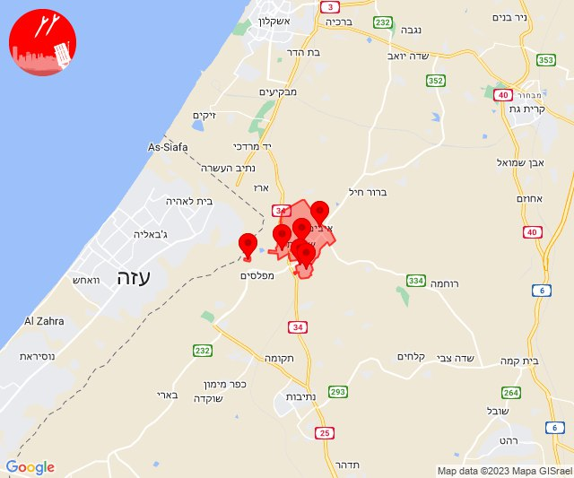

## 07:05

🔴 צבע אדום (14/10/2023):

10:05:
• מערב לכיש: תלמי יפה (30 שניות)

צופר - צבע אדום

## 07:05

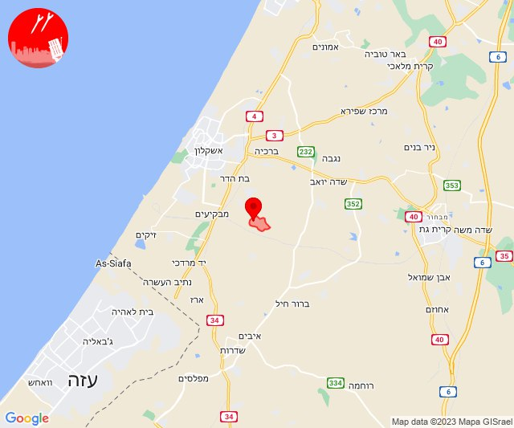

## 08:03

🔴 צבע אדום (14/10/2023):

11:03:
• עוטף עזה: נירים (15 שניות)

צופר - צבע אדום

## 08:03

## 08:14

🔴 צבע אדום (14/10/2023):

11:14:
• עוטף עזה: מטווח ניר עם, מפלסים (15 שניות)

צופר - צבע אדום

## 08:14

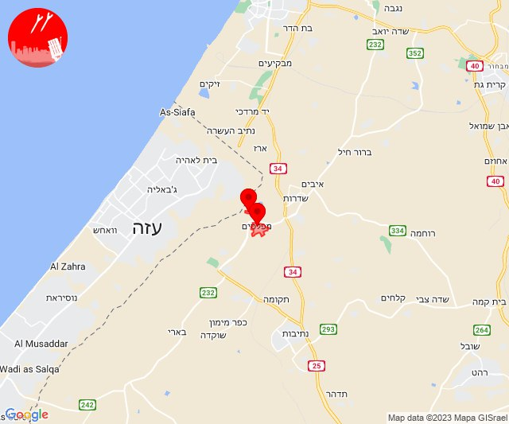

## 08:31

🔴 צבע אדום (14/10/2023):

11:30:
• מערב לכיש: אזור תעשייה צפוני אשקלון, אשקלון - דרום, אזור תעשייה הדרומי אשקלון, בית שקמה, בת הדר, גיאה, מבקיעים, אשקלון - צפון, ברכיה, כפר סילבר, משען (30 שניות)
• לכיש: בית גמליאל, בניה, שדמה, כפר מרדכי (דקה)
• דן: בת-ים, תל אביב - דרום העיר ויפו, אור יהודה, אזור, רמת גן - מזרח, רמת גן - מערב, חולון (דקה וחצי)
• השפלה: ראשון לציון - מערב, ראשון לציון - מזרח, בית דגן, חמד, משמר השבעה, גנות (דקה וחצי)
• עוטף עזה: כרמיה (15 שניות)

11:31:
• השפלה: פארק תעשיות פלמחים, בית חנן, נטעים, נס ציונה, גן שורק (דקה וחצי)
• לכיש: גבעת וושינגטון, כפר אביב, כרם ביבנה, משגב דב, נווה מבטח, עשרת, קבוצת יבנה (דקה)

צופר - צבע אדום

## 08:31

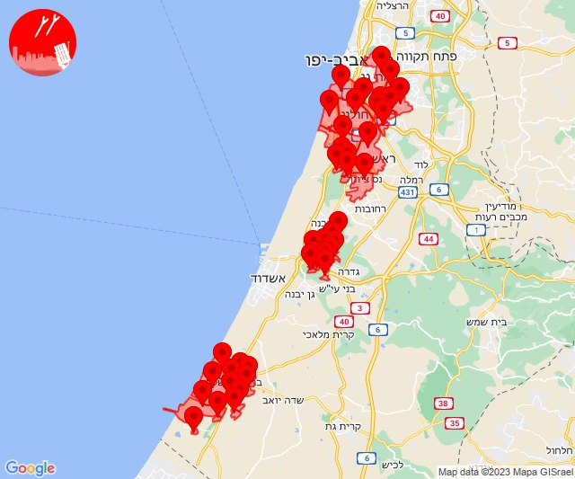

## 08:47

🔴 צבע אדום (14/10/2023):

11:47:
• מערב לכיש: אזור תעשייה הדרומי אשקלון (30 שניות)
• עוטף עזה: זיקים (15 שניות)

צופר - צבע אדום

## 08:47

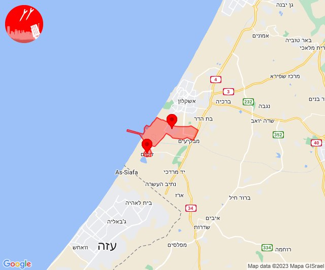

## 09:30

🔴 צבע אדום (14/10/2023):

12:30:
• מערב לכיש: אשקלון - דרום, אשקלון - צפון, אזור תעשייה הדרומי אשקלון (30 שניות)
• עוטף עזה: זיקים (15 שניות)

צופר - צבע אדום

## 09:30

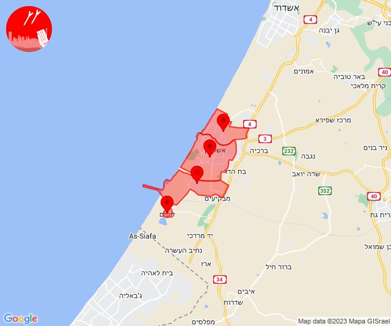

## 09:34

🔴 צבע אדום (14/10/2023):

12:34:
• עוטף עזה: מטווח ניר עם, מפלסים (15 שניות)

צופר - צבע אדום

## 09:34

## 09:44

🔴 צבע אדום (14/10/2023):

12:44:
• עוטף עזה: עלומים (15 שניות)

צופר - צבע אדום

## 09:44

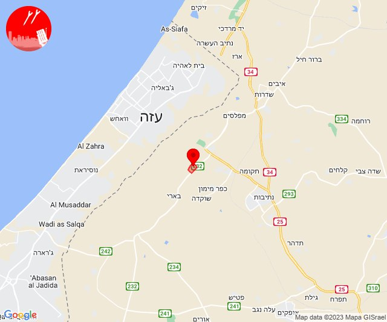

## 09:51

✈️ חדירת כלי טיס עוין (14/10/2023):

12:51:
• קו העימות: גורנות הגליל 

צופר - צבע אדום

## 09:51

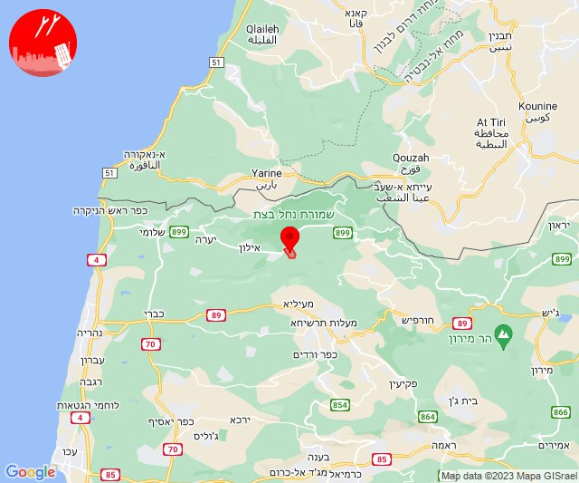

## 09:54

🔴 צבע אדום (14/10/2023):

12:54:
• עוטף עזה: נירים (15 שניות)

צופר - צבע אדום

## 09:54

## 10:42

🔴 צבע אדום (14/10/2023):

13:42:
• עוטף עזה: נירים (15 שניות)

צופר - צבע אדום

## 10:42

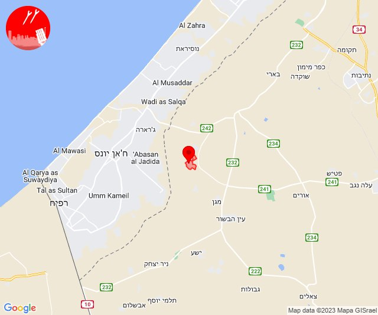

## 11:01

🔴 צבע אדום (14/10/2023):

14:00:
• מרכז הנגב: באר שבע - מזרח, באר שבע - מערב, באר שבע - צפון (דקה)

14:01:
• מרכז הנגב: לקיה והפזורה, עומר, באר שבע - דרום, אתר דודאים (דקה, 45 שניות)
• מערב הנגב: אורים (30 שניות)
• מערב לכיש: אשקלון - דרום, אזור תעשייה הדרומי אשקלון (30 שניות)
• עוטף עזה: נתיב העשרה (15 שניות)

צופר - צבע אדום

## 11:01

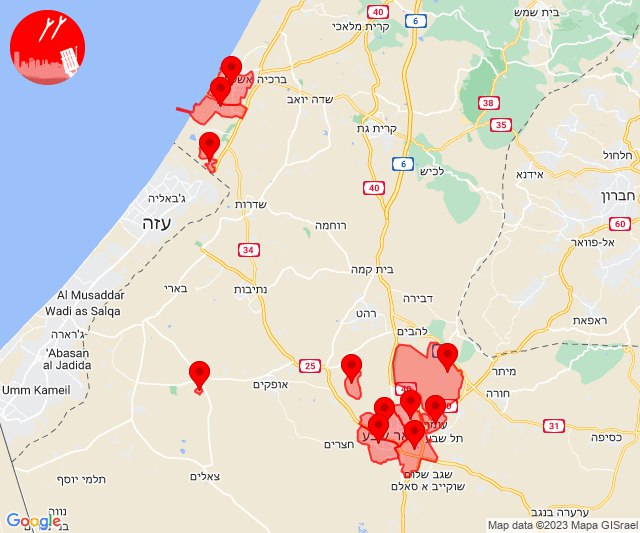

## 11:33

🔴 צבע אדום (14/10/2023):

14:33:
• עוטף עזה: כיסופים, עין השלושה (15 שניות)

צופר - צבע אדום

## 11:33

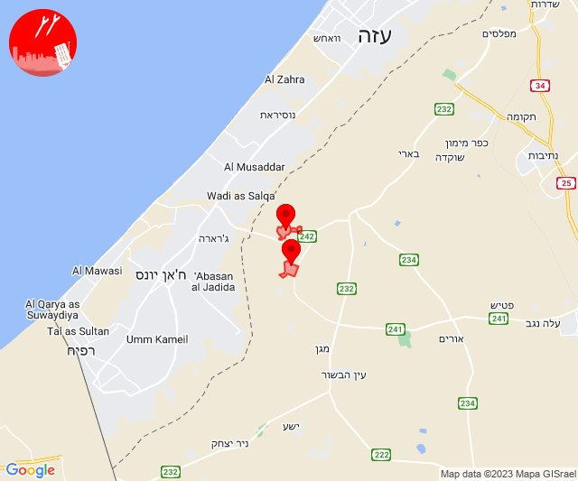

## 11:41

🔴 צבע אדום (14/10/2023):

14:41:
• עוטף עזה: כיסופים, עין השלושה (15 שניות)

צופר - צבע אדום

## 11:41

## 12:24

🔴 צבע אדום (14/10/2023):

15:24:
• עוטף עזה: נירים (15 שניות)

צופר - צבע אדום

## 12:25

## 13:04

🔴 צבע אדום (14/10/2023):

16:03:
• עוטף עזה: שדרות, איבים, ניר עם, מטווח ניר עם, סעד (15 שניות)

16:04:
• מערב לכיש: אזור תעשייה הדרומי אשקלון, אשקלון - דרום, אשקלון - צפון (30 שניות)
• עוטף עזה: זיקים, כרמיה, נתיב העשרה (15 שניות)

צופר - צבע אדום

## 13:04

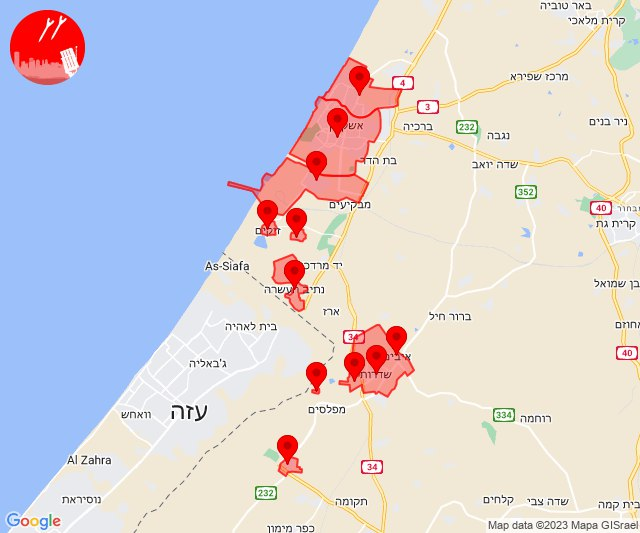

## 13:30

🔴 צבע אדום (14/10/2023):

16:30:
• עוטף עזה: כיסופים (15 שניות)

צופר - צבע אדום

## 13:30

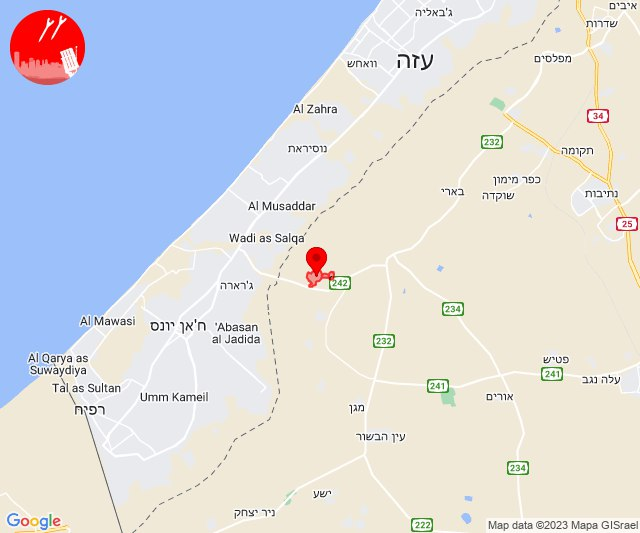

## 14:02

🔴 צבע אדום (14/10/2023):

17:00:
• עוטף עזה: כרמיה, יד מרדכי, נתיב העשרה (15 שניות)

17:01:
• דן: יהוד-מונוסון, מעש, סביון, פתח תקווה, מגשימים (דקה וחצי)
• ירקון: בארות יצחק, מזור, נחלים (דקה וחצי)
• מערב לכיש: אזור תעשייה צפוני אשקלון, אשקלון - דרום, אזור תעשייה הדרומי אשקלון, בת הדר, כפר סילבר, מבקיעים, אשקלון - צפון (30 שניות)
• לכיש: אשדוד - יא,יב,טו,יז,מרינה,סיטי (45 שניות)

17:02:
• דן: אור יהודה (דקה וחצי)
• השפלה: חמד, צפריה (דקה וחצי)

צופר - צבע אדום

## 14:02

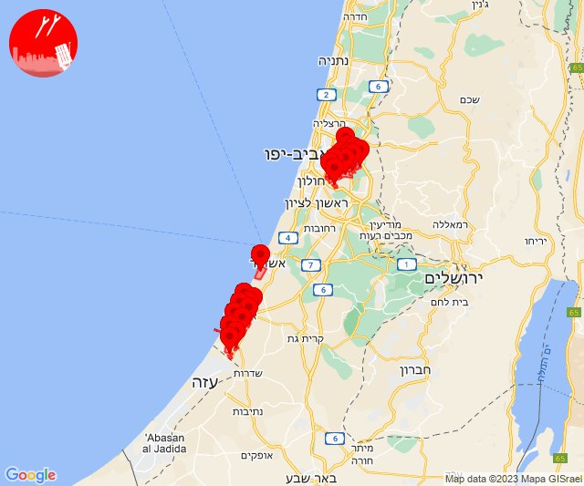

## 14:04

🔴 צבע אדום (14/10/2023):

17:04:
• עוטף עזה: כיסופים (15 שניות)

צופר - צבע אדום

## 14:04

## 14:09

🔴 צבע אדום (14/10/2023):

17:09:
• עוטף עזה: נחל עוז (15 שניות)

צופר - צבע אדום

## 14:09

## 14:36

🔴 צבע אדום (14/10/2023):

17:36:
• עוטף עזה: נחל עוז (15 שניות)

צופר - צבע אדום

## 14:36

## 14:55

🔴 צבע אדום (14/10/2023):

17:54:
• עוטף עזה: סופה (15 שניות)

17:55:
• עוטף עזה: חולית (15 שניות)

צופר - צבע אדום

## 14:55

## 14:59

🔴 צבע אדום (14/10/2023):

17:59:
• עוטף עזה: נחל עוז (15 שניות)

צופר - צבע אדום

## 14:59

## 16:57

🔴 צבע אדום (14/10/2023):

19:57:
• עוטף עזה: יד מרדכי, נתיב העשרה (15 שניות)

צופר - צבע אדום

## 16:57

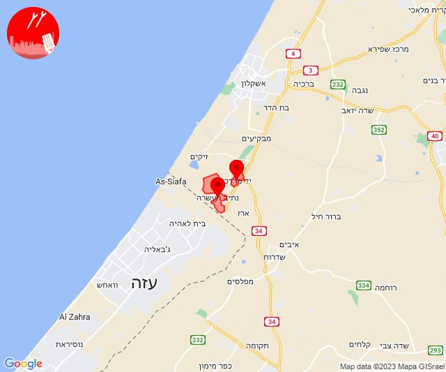

## 17:43

🔴 צבע אדום (14/10/2023):

20:42:
• לכיש: אשדוד - יא,יב,טו,יז,מרינה,סיטי, אשדוד - ח,ט,י,יג,יד,טז, גן הדרום, גן יבנה, שתולים, אזור תעשייה עד הלום, שדה עוזיהו (45 שניות, דקה)
• מערב לכיש: אזור תעשייה הדרומי אשקלון, ניצן, אשקלון - צפון, באר גנים (30 שניות, 45 שניות)

20:43:
• לכיש: אמונים, בית עזרא, עזר (45 שניות)

צופר - צבע אדום

## 17:43

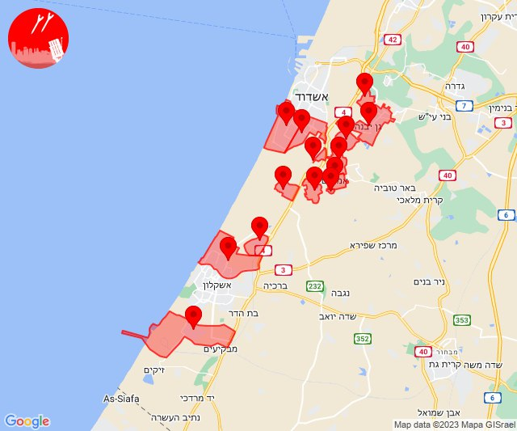

## 17:58

🔴 צבע אדום (14/10/2023):

20:58:
• מערב לכיש: אזור תעשייה הדרומי אשקלון, אשקלון - דרום, אשקלון - צפון, אזור תעשייה צפוני אשקלון (30 שניות)
• עוטף עזה: זיקים (15 שניות)

צופר - צבע אדום

## 17:58

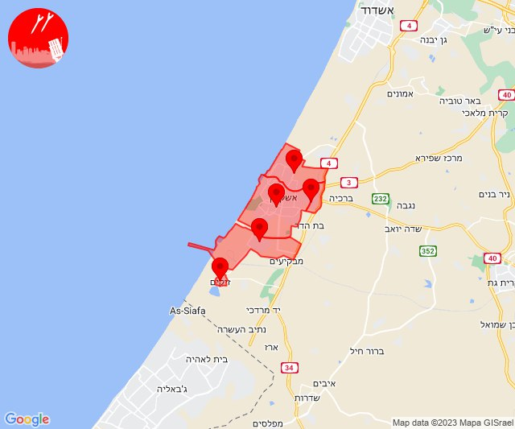

## 18:02

🔴 צבע אדום (14/10/2023):

21:00:
• דן: תל אביב - דרום העיר ויפו, בת-ים, חולון, תל אביב - מרכז העיר, תל אביב - עבר הירקון, בני ברק, רמת גן - מערב, רמת השרון (דקה וחצי)
• השפלה: ראשון לציון - מערב, אחיסמך, בן שמן, גינתון, כפר נוער בן שמן, לוד, אזור תעשייה נשר - רמלה (דקה וחצי)
• עוטף עזה: חולית (15 שניות)
• ירקון: בית נחמיה, חדיד (דקה וחצי)

21:01:
• דן: פתח תקווה, תל אביב - מזרח, אזור, גבעתיים, מקווה ישראל (דקה וחצי)
• שרון: נווה ירק, מרכז אזורי דרום השרון, ג'לג'וליה, חגור, ירחיב, מתן, שדי חמד, אורנית, חורשים, כפר ברא, כפר קאסם, נירית (דקה וחצי)
• השפלה: רמלה (דקה וחצי)
• עוטף עזה: סופה (15 שניות)
• ירקון: ראש העין, אזור תעשייה אפק ולב הארץ (דקה וחצי)

21:02:
• השפלה: מצליח (דקה וחצי)
• דן: גבעת השלושה, כפר סירקין (דקה וחצי)
• ירקון: אלעד, מזור, נופך, נחלים, נחשונים, עינת, רינתיה, תעשיון חצב (דקה וחצי)

צופר - צבע אדום

## 18:02

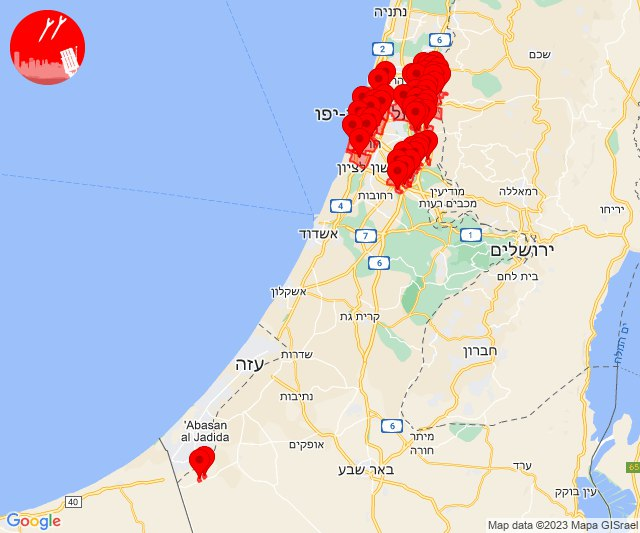

## 18:05

🔴 צבע אדום (14/10/2023):

21:05:
• מערב לכיש: אזור תעשייה הדרומי אשקלון (30 שניות)

צופר - צבע אדום

## 18:05

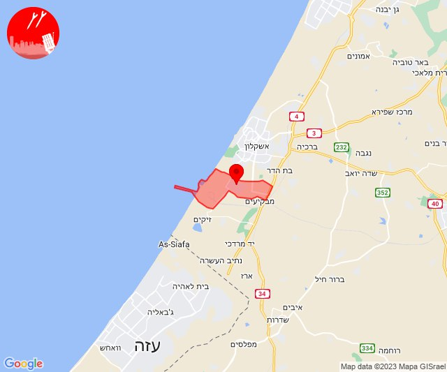

## 18:23

🔴 צבע אדום (14/10/2023):

21:23:
• מערב לכיש: אשקלון - צפון, אזור תעשייה הדרומי אשקלון, אשקלון - דרום (30 שניות)

צופר - צבע אדום

## 18:23

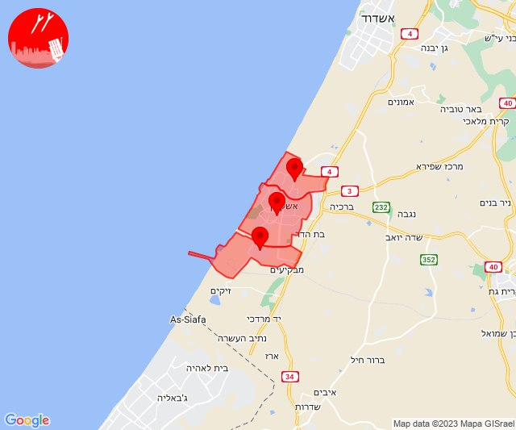

## 18:54

🔴 צבע אדום (14/10/2023):

21:53:
• קו העימות: עלמה (מיידי)

21:54:
• דרום הגולן: אבני איתן (מיידי)

צופר - צבע אדום

## 18:54

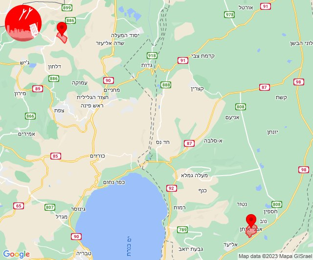

