# Alerts for 2023-10-15

## 03:43

🔴 צבע אדום (15/10/2023):

06:43:
• גליל עליון: שדה אליעזר (30 שניות)

צופר - צבע אדום

## 03:43

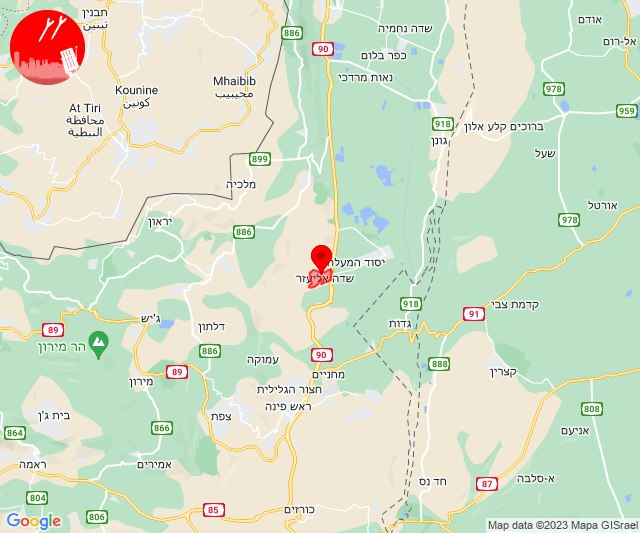

## 07:12

🔴 צבע אדום (15/10/2023):

10:12:
• עוטף עזה: נחל עוז (15 שניות)

צופר - צבע אדום

## 07:12

## 07:31

🔴 צבע אדום (15/10/2023):

10:31:
• עוטף עזה: מפלסים (15 שניות)

צופר - צבע אדום

## 07:31

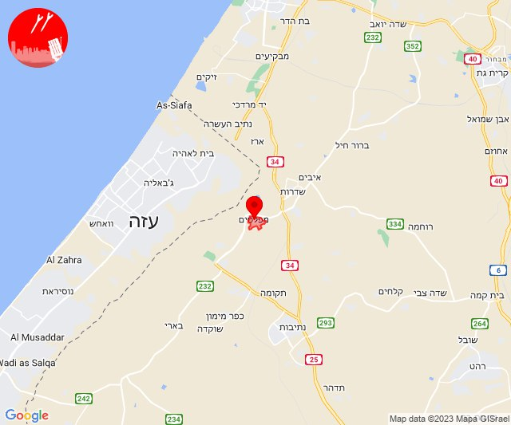

## 07:32

🔴 צבע אדום (15/10/2023):

10:32:
• עוטף עזה: נחל עוז (15 שניות)

צופר - צבע אדום

## 07:32

## 08:15

🔴 צבע אדום (15/10/2023):

11:15:
• עוטף עזה: שדרות, איבים, ניר עם (15 שניות)

צופר - צבע אדום

## 08:15

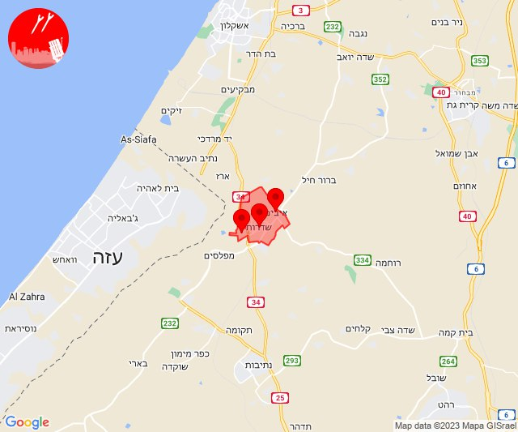

## 09:01

🔴 צבע אדום (15/10/2023):

12:01:
• עוטף עזה: נחל עוז (15 שניות)

צופר - צבע אדום

## 09:01

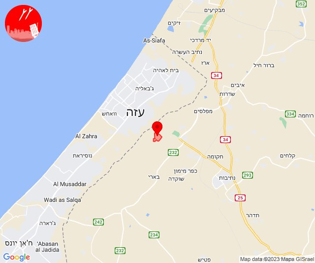

## 09:44

🔴 צבע אדום (15/10/2023):

12:44:
• עוטף עזה: רעים (15 שניות)

צופר - צבע אדום

## 09:44

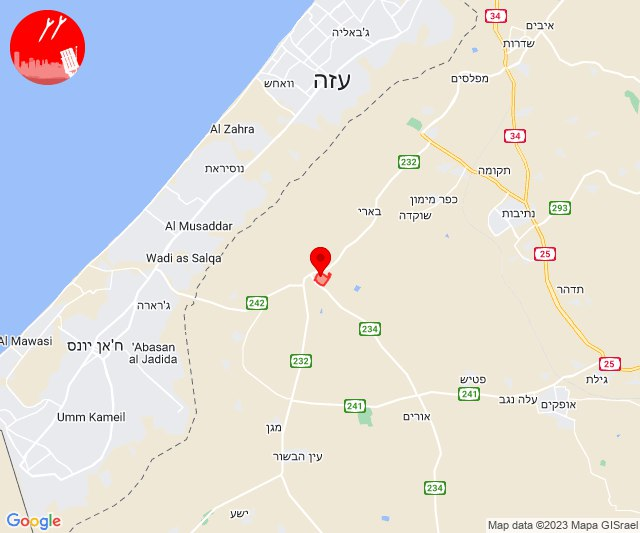

## 09:59

🔴 צבע אדום (15/10/2023):

12:59:
• עוטף עזה: שדרות, איבים, ניר עם (15 שניות)

צופר - צבע אדום

## 09:59

## 10:00

🔴 צבע אדום (15/10/2023):

13:00:
• עוטף עזה: מבטחים, עמיעוז, ישע (15 שניות)

צופר - צבע אדום

## 10:00

## 10:09

🔴 צבע אדום (15/10/2023):

13:09:
• עוטף עזה: כפר עזה, סעד (15 שניות)

צופר - צבע אדום

## 10:09

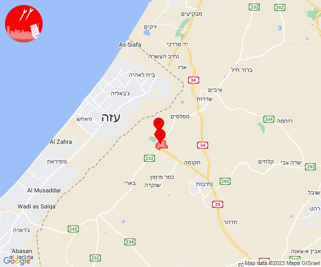

## 10:31

🔴 צבע אדום (15/10/2023):

13:31:
• עוטף עזה: כרם שלום (15 שניות)

צופר - צבע אדום

## 10:31

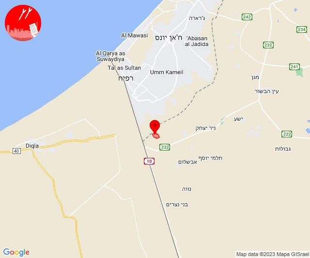

## 10:38

🔴 צבע אדום (15/10/2023):

13:38:
• עוטף עזה: נחל עוז, סעד (15 שניות)

צופר - צבע אדום

## 10:38

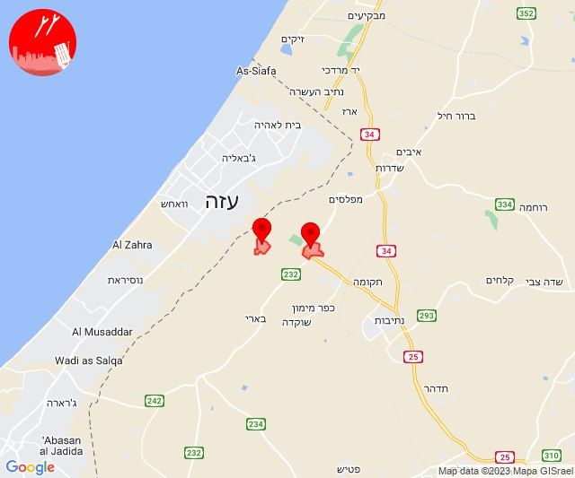

## 10:55

🔴 צבע אדום (15/10/2023):

13:54:
• דן: תל אביב - עבר הירקון, הרצליה - מערב, הרצליה - מרכז וגליל ים, רמת השרון, סינמה סיטי גלילות, מתחם פי גלילות (דקה וחצי)

13:55:
• דן: תל אביב - מרכז העיר (דקה וחצי)

צופר - צבע אדום

## 10:55

## 12:08

🔴 צבע אדום (15/10/2023):

15:08:
• עוטף עזה: נחל עוז (15 שניות)

צופר - צבע אדום

## 12:08

## 12:10

🔴 צבע אדום (15/10/2023):

15:10:
• עוטף עזה: מבטחים, עמיעוז, ישע (15 שניות)

צופר - צבע אדום

## 12:10

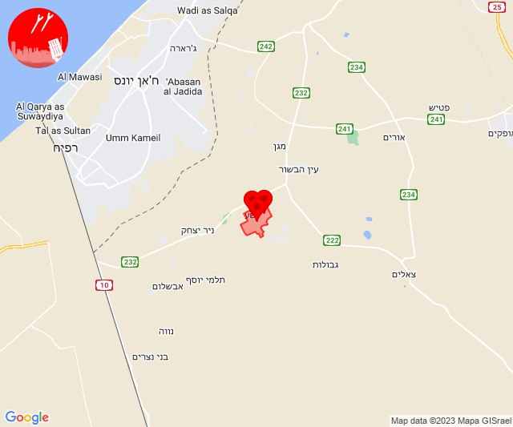

## 13:07

🔴 צבע אדום (15/10/2023):

16:07:
• קו העימות: שלומי, בצת (מיידי)

צופר - צבע אדום

## 13:07

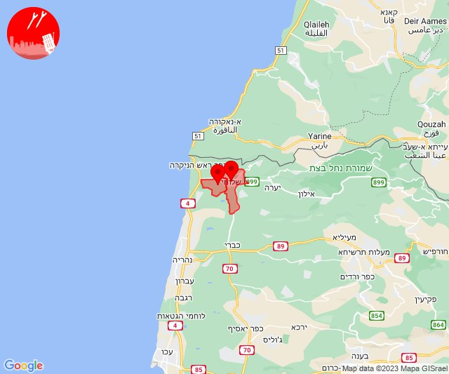

## 13:10

🔴 צבע אדום (15/10/2023):

16:09:
• קו העימות: ראש הנקרה, חניתה (מיידי)

16:10:
• קו העימות: גשר הזיו, נהריה, לימן, אזור תעשייה אכזיב מילואות, שלומי, בצת (מיידי, 15 שניות)

צופר - צבע אדום

## 13:10

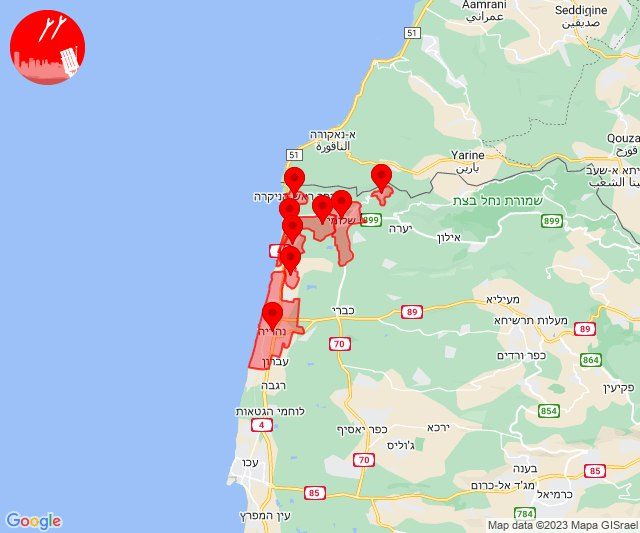

## 13:34

🔴 צבע אדום (15/10/2023):

16:34:
• עוטף עזה: נחל עוז (15 שניות)

צופר - צבע אדום

## 13:34

## 14:04

🔴 צבע אדום (15/10/2023):

17:04:
• עוטף עזה: נירים, ניר עוז (15 שניות)

צופר - צבע אדום

## 14:04

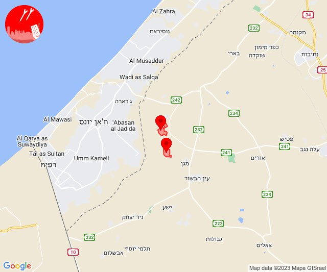

## 14:06

🔴 צבע אדום (15/10/2023):

17:06:
• עוטף עזה: עין השלושה (15 שניות)

צופר - צבע אדום

## 14:06

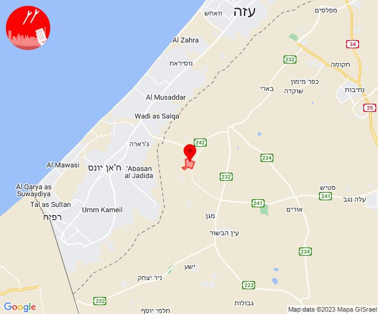

## 14:16

🔴 צבע אדום (15/10/2023):

17:16:
• עוטף עזה: נחל עוז (15 שניות)

צופר - צבע אדום

## 14:16

## 14:20

🔴 צבע אדום (15/10/2023):

17:20:
• עוטף עזה: סופה, חולית, ניר יצחק, פרי גן (15 שניות)

צופר - צבע אדום

## 14:20

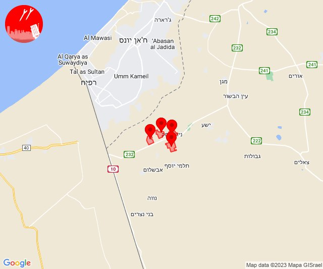

## 15:00

🔴 צבע אדום (15/10/2023):

17:59:
• מערב לכיש: אשקלון - דרום, אזור תעשייה הדרומי אשקלון, אשקלון - צפון (30 שניות)
• עוטף עזה: זיקים, כרמיה (15 שניות)

18:00:
• מערב לכיש: אזור תעשייה צפוני אשקלון, מבקיעים (30 שניות)
• עוטף עזה: מבטחים, עמיעוז, ישע (15 שניות)

צופר - צבע אדום

## 15:00

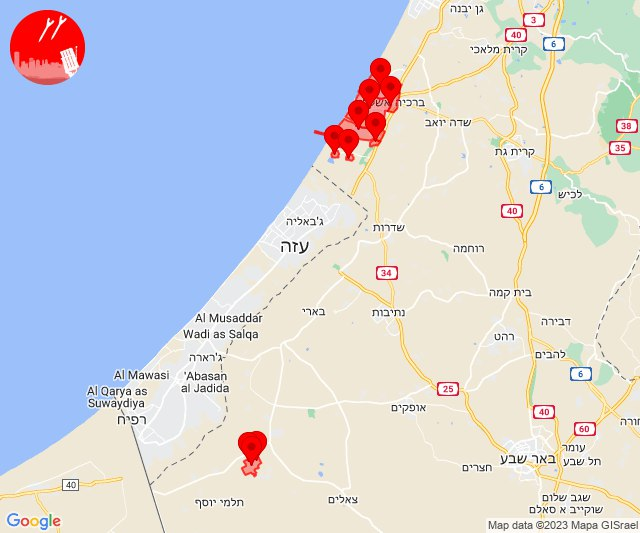

## 15:57

🔴 צבע אדום (15/10/2023):

18:55:
• דן: תל אביב - מזרח, בני ברק, גבעתיים, תל אביב - דרום העיר ויפו, בת-ים, חולון, יהוד-מונוסון, סביון, אור יהודה, אזור, גבעת שמואל, קריית אונו, רמת גן - מזרח, רמת גן - מערב (דקה וחצי)
• השפלה: ראשון לציון - מערב, כפר חב''ד, צפריה, חמד, משמר השבעה, גנות (דקה וחצי)

18:56:
• השפלה: ראשון לציון - מזרח, תעשיון צריפין, בית דגן (דקה וחצי)

18:57:
• דן: מקווה ישראל (דקה וחצי)

צופר - צבע אדום

## 15:57

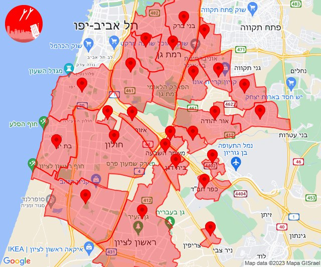

## 16:10

🔴 צבע אדום (15/10/2023):

19:10:
• עוטף עזה: כיסופים (15 שניות)

צופר - צבע אדום

## 16:10

## 17:48

🔴 צבע אדום (15/10/2023):

20:48:
• עוטף עזה: נתיב העשרה (15 שניות)

צופר - צבע אדום

## 17:48

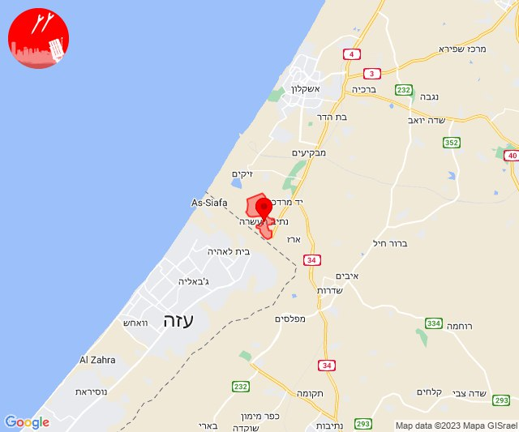

## 18:32

🔴 צבע אדום (15/10/2023):

21:32:
• השפלה: רחובות, ישרש, מצליח, רמלה, כפר ביל''ו, נען, סתריה (דקה וחצי)
• לכיש: אשדוד - אזור תעשייה צפוני ונמל (45 שניות)

צופר - צבע אדום

## 18:32

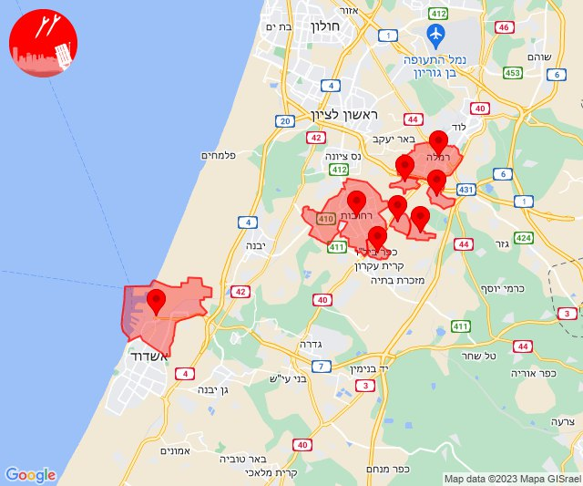

## 20:00

🔴 צבע אדום (15/10/2023):

23:00:
• עוטף עזה: מטווח ניר עם, שדרות, איבים, ניר עם (15 שניות)

צופר - צבע אדום

## 20:00

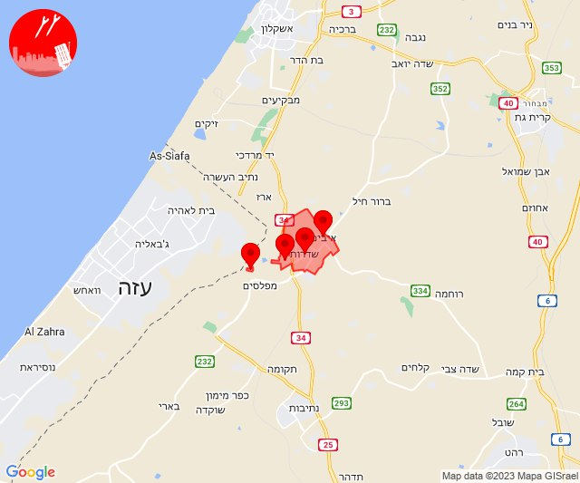

