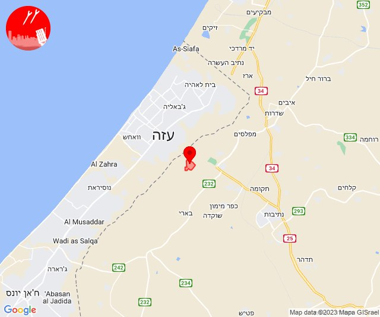
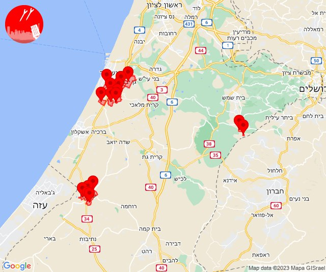

# Alerts for 2023-10-16

## 05:39

🔴 צבע אדום (16/10/2023):

08:39:
• עוטף עזה: נחל עוז (15 שניות)

צופר - צבע אדום

## 05:39

## 06:00

🔴 צבע אדום (16/10/2023):

09:00:
• עוטף עזה: בארי (15 שניות)

צופר - צבע אדום

## 06:00

## 08:07

🔴 צבע אדום (16/10/2023):

11:07:
• השפלה: כפר בן נון, כפר שמואל, כרמי יוסף, משמר איילון (דקה וחצי)
• ירקון: מודיעין - ישפרו סנטר (דקה וחצי)

צופר - צבע אדום

## 08:07

## 08:34

🔴 צבע אדום (16/10/2023):

11:34:
• עוטף עזה: מטווח ניר עם (15 שניות)

צופר - צבע אדום

## 08:34

## 08:41

🔴 צבע אדום (16/10/2023):

11:41:
• לכיש: גן יבנה, אזור תעשייה עד הלום, אשדוד - ח,ט,י,יג,יד,טז, שדה עוזיהו, שתולים, אשדוד - א,ב,ד,ה, אשדוד - יא,יב,טו,יז,מרינה,סיטי, בית עזרא (45 שניות)
• מערב לכיש: ברכיה, אזור תעשייה צפוני אשקלון, אשקלון - דרום, אזור תעשייה הדרומי אשקלון, בית שקמה, בת הדר, משען, ניצן (30 שניות, 45 שניות)

צופר - צבע אדום

## 08:42

## 09:05

🔴 צבע אדום (16/10/2023):

12:05:
• עוטף עזה: סעד, נחל עוז (15 שניות)

צופר - צבע אדום

## 09:05

## 09:12

🔴 צבע אדום (16/10/2023):

12:12:
• עוטף עזה: נחל עוז (15 שניות)

צופר - צבע אדום

## 09:12

## 09:29

🔴 צבע אדום (16/10/2023):

12:29:
• עוטף עזה: חולית, סופה (15 שניות)

צופר - צבע אדום

## 09:29

## 10:32

🔴 צבע אדום (16/10/2023):

13:32:
• לכיש: אשדוד - א,ב,ד,ה, אשדוד - ג,ו,ז, אשדוד - ח,ט,י,יג,יד,טז, אשדוד - יא,יב,טו,יז,מרינה,סיטי (45 שניות)

צופר - צבע אדום

## 10:32

## 10:42

🔴 צבע אדום (16/10/2023):

13:41:
• מרכז הנגב: שגב שלום והפזורה, באר שבע - דרום, באר שבע - מזרח, באר שבע - מערב (דקה וחצי, דקה)

13:42:
• מרכז הנגב: חצרים, אתר דודאים (דקה, 45 שניות)

צופר - צבע אדום

## 10:42

## 10:48

🔴 צבע אדום (16/10/2023):

13:48:
• עוטף עזה: נחל עוז (15 שניות)

צופר - צבע אדום

## 10:48

## 10:59

🔴 צבע אדום (16/10/2023):

13:59:
• מערב לכיש: אשקלון - דרום, אזור תעשייה הדרומי אשקלון, מבקיעים (30 שניות)
• עוטף עזה: כרמיה, נתיב העשרה (15 שניות)

צופר - צבע אדום

## 10:59

## 11:23

🔴 צבע אדום (16/10/2023):

14:23:
• עוטף עזה: כרם שלום (15 שניות)

צופר - צבע אדום

## 11:23

## 11:33

🔴 צבע אדום (16/10/2023):

14:32:
• עוטף עזה: כיסופים, עין השלושה (15 שניות)

14:33:
• עוטף עזה: רעים (15 שניות)

צופר - צבע אדום

## 11:33

## 11:42

🔴 צבע אדום (16/10/2023):

14:42:
• עוטף עזה: שדרות, איבים, ניר עם (15 שניות)

צופר - צבע אדום

## 11:42

## 12:45

🔴 צבע אדום (16/10/2023):

15:45:
• עוטף עזה: נירים (15 שניות)

צופר - צבע אדום

## 12:45

## 13:00

🔴 צבע אדום (16/10/2023):

16:00:
• עוטף עזה: מבטחים, עמיעוז, ישע (15 שניות)

צופר - צבע אדום

## 13:00

## 13:46

🔴 צבע אדום (16/10/2023):

16:44:
• דן: גת רימון, מעש, סביון, פתח תקווה, קריית אונו, גני תקווה, תל אביב - דרום העיר ויפו, תל אביב - מזרח, תל אביב - מרכז העיר, גבעתיים, חולון, מקווה ישראל (דקה וחצי)

16:45:
• דן: אזור, בני ברק, רמת גן - מזרח, רמת גן - מערב, מגשימים (דקה וחצי)
• שפלת יהודה: בית שמש, הר אדר, מעלה החמישה (דקה וחצי)
• ירושלים: גבעת זאב, ירושלים - דרום, ירושלים - מזרח (דקה וחצי)

16:46:
• דן: אור יהודה, בת-ים (דקה וחצי)
• השפלה: בית דגן, חמד, כפר חב''ד, משמר השבעה, צפריה, גנות, ראשון לציון - מערב (דקה וחצי)
• יהודה: הר גילה (דקה וחצי)

צופר - צבע אדום

## 13:46

## 14:11

🔴 צבע אדום (16/10/2023):

17:11:
• עוטף עזה: ניר עוז (15 שניות)

צופר - צבע אדום

## 14:11

## 14:18

🔴 צבע אדום (16/10/2023):

17:16:
• דן: תל אביב - דרום העיר ויפו, תל אביב - מזרח, אזור, גבעתיים, חולון, מקווה ישראל, רמת גן - מערב (דקה וחצי)

17:18:
• דן: בת-ים (דקה וחצי)
• השפלה: ראשון לציון - מערב (דקה וחצי)

צופר - צבע אדום

## 14:18

## 14:35

🔴 צבע אדום (16/10/2023):

17:35:
• עוטף עזה: נחל עוז (15 שניות)

צופר - צבע אדום

## 14:35

## 15:02

🔴 צבע אדום (16/10/2023):

18:01:
• מערב לכיש: אשקלון - דרום, אזור תעשייה הדרומי אשקלון, אזור תעשייה צפוני אשקלון, מבקיעים, אשקלון - צפון (30 שניות)
• עוטף עזה: זיקים, כרמיה (15 שניות)

18:02:
• עוטף עזה: ניר יצחק, סופה, מבטחים, עמיעוז, ישע, צוחר, אוהד (15 שניות)

צופר - צבע אדום

## 15:02

## 16:01

🔴 צבע אדום (16/10/2023):

19:00:
• עוטף עזה: מבטחים, עמיעוז, ישע, שדה ניצן (15 שניות)

19:01:
• עוטף עזה: עין הבשור, צוחר, אוהד (15 שניות)

צופר - צבע אדום

## 16:01

## 16:38

🔴 צבע אדום (16/10/2023):

19:38:
• עוטף עזה: עין השלושה, נירים (15 שניות)

צופר - צבע אדום

## 16:38

## 16:42

🔴 צבע אדום (16/10/2023):

19:42:
• עוטף עזה: נירים, עין השלושה, כיסופים (15 שניות)

צופר - צבע אדום

## 16:42

## 17:00

🔴 צבע אדום (16/10/2023):

19:59:
• דן: תל אביב - דרום העיר ויפו, תל אביב - מזרח, תל אביב - מרכז העיר, גבעתיים, רמת גן - מערב (דקה וחצי)

20:00:
• דן: בת-ים, חולון, מקווה ישראל (דקה וחצי)

צופר - צבע אדום

## 17:00

## 17:57

🔴 צבע אדום (16/10/2023):

20:57:
• עוטף עזה: כפר עזה, סעד, נחל עוז (15 שניות)

צופר - צבע אדום

## 17:57

## 18:00

🔴 צבע אדום (16/10/2023):

21:00:
• עוטף עזה: עין השלושה (15 שניות)

צופר - צבע אדום

## 18:00

## 18:03

🔴 צבע אדום (16/10/2023):

21:02:
• עוטף עזה: שדרות, איבים, ניר עם, גבים, מכללת ספיר (15 שניות)
• שפלת יהודה: גבעות עדן, נווה מיכאל - רוגלית (דקה וחצי)
• לכיש: גן יבנה, אזור תעשייה עד הלום, אשדוד - ח,ט,י,יג,יד,טז, שתולים (45 שניות)

21:03:
• לכיש: אמונים, בית עזרא, עזר, שדה עוזיהו (45 שניות)
• מערב לכיש: ניצן (45 שניות)

צופר - צבע אדום

## 18:03

## 18:43

🔴 צבע אדום (16/10/2023):

21:42:
• דן: אזור, בת-ים, חולון, מקווה ישראל, תל אביב - דרום העיר ויפו, תל אביב - מזרח, תל אביב - מרכז העיר, גבעתיים, רמת גן - מערב, אור יהודה (דקה וחצי)
• השפלה: ראשון לציון - מערב, ראשון לציון - מזרח, בית דגן, חמד, משמר השבעה, גנות (דקה וחצי)

21:43:
• לכיש: פלמחים (דקה וחצי)
• השפלה: פארק תעשיות פלמחים, אירוס, בית חנן, גן שורק, נטעים, נס ציונה (דקה וחצי)

צופר - צבע אדום

## 18:43

