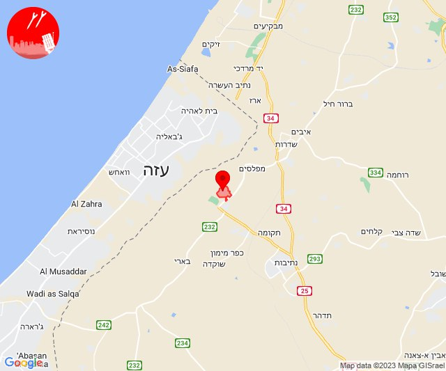
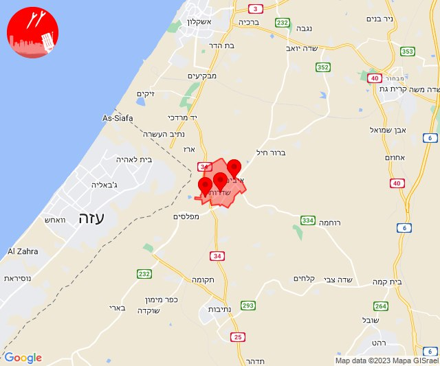

# Alerts for 2023-10-17

## 05:46

🔴 צבע אדום (17/10/2023):

08:46:
• מערב הנגב: צאלים (30 שניות)

צופר - צבע אדום

## 05:46

## 07:12

🔴 צבע אדום (17/10/2023):

10:11:
• עוטף עזה: נירים, עין השלושה (15 שניות)

10:12:
• עוטף עזה: ניר עוז (15 שניות)

צופר - צבע אדום

## 07:12

## 08:34

🔴 צבע אדום (17/10/2023):

11:34:
• מרכז הנגב: תל שבע, באר שבע - מערב, באר שבע - צפון (דקה וחצי, דקה)

צופר - צבע אדום

## 08:34

## 10:09

🔴 צבע אדום (17/10/2023):

13:09:
• עוטף עזה: נחל עוז (15 שניות)

צופר - צבע אדום

## 10:09

## 10:37

🔴 צבע אדום (17/10/2023):

13:37:
• השפלה: פארק תעשיות פלמחים, ראשון לציון - מזרח, ראשון לציון - מערב, בית חנן, גן שורק, נטעים (דקה וחצי)

צופר - צבע אדום

## 10:37

## 11:16

🔴 צבע אדום (17/10/2023):

14:16:
• מערב לכיש: אזור תעשייה הדרומי אשקלון, אשקלון - צפון, אשקלון - דרום (30 שניות)

צופר - צבע אדום

## 11:16

## 11:46

🔴 צבע אדום (17/10/2023):

14:46:
• עוטף עזה: ניר עוז (15 שניות)

צופר - צבע אדום

## 11:46

## 11:48

🔴 צבע אדום (17/10/2023):

14:48:
• עוטף עזה: נחל עוז (15 שניות)

צופר - צבע אדום

## 11:48

## 11:56

🔴 צבע אדום (17/10/2023):

14:56:
• עוטף עזה: כיסופים (15 שניות)

צופר - צבע אדום

## 11:56

## 12:52

🔴 צבע אדום (17/10/2023):

15:52:
• עוטף עזה: עין השלושה, כיסופים (15 שניות)

צופר - צבע אדום

## 12:52

## 12:57

🔴 צבע אדום (17/10/2023):

15:57:
• עוטף עזה: שדרות, איבים, ניר עם (15 שניות)

צופר - צבע אדום

## 12:57

## 13:00

🔴 צבע אדום (17/10/2023):

16:00:
• עוטף עזה: כיסופים (15 שניות)

צופר - צבע אדום

## 13:00

## 13:04

🔴 צבע אדום (17/10/2023):

16:04:
• עוטף עזה: בארי, כפר מימון ותושיה, עלומים, שוקדה (15 שניות)
• מערב הנגב: נתיבות, בית הגדי (30 שניות)

צופר - צבע אדום

## 13:04

## 13:23

🔴 צבע אדום (17/10/2023):

16:23:
• עוטף עזה: עין השלושה (15 שניות)

צופר - צבע אדום

## 13:23

## 13:39

🔴 צבע אדום (17/10/2023):

16:39:
• קו העימות: בית הלל, קריית שמונה (מיידי)

צופר - צבע אדום

## 13:39

## 13:45

🔴 צבע אדום (17/10/2023):

16:45:
• עוטף עזה: כפר עזה (15 שניות)

צופר - צבע אדום

## 13:45

## 13:57

🔴 צבע אדום (17/10/2023):

16:57:
• עוטף עזה: כיסופים (15 שניות)

צופר - צבע אדום

## 13:57

## 13:59

🔴 צבע אדום (17/10/2023):

16:59:
• עוטף עזה: שדרות, איבים, ניר עם (15 שניות)

צופר - צבע אדום

## 13:59

## 14:00

🔴 צבע אדום (17/10/2023):

17:00:
• עוטף עזה: שדה ניצן, מבטחים, עמיעוז, ישע, צוחר, אוהד (15 שניות)

צופר - צבע אדום

## 14:00

## 14:30

🔴 צבע אדום (17/10/2023):

17:30:
• עוטף עזה: מבטחים, עמיעוז, ישע (15 שניות)

צופר - צבע אדום

## 14:30

## 15:06

🔴 צבע אדום (17/10/2023):

18:05:
• דן: חולון (דקה וחצי)
• השפלה: פארק תעשיות פלמחים, ראשון לציון - מזרח, ראשון לציון - מערב, בית דגן, גנות, משמר השבעה (דקה וחצי)

18:06:
• השפלה: גן שורק, נטעים (דקה וחצי)

צופר - צבע אדום

## 15:06

## 15:13

🔴 צבע אדום (17/10/2023):

18:13:
• עוטף עזה: כרמיה, נתיב העשרה (15 שניות)
• מערב לכיש: מבקיעים (30 שניות)

צופר - צבע אדום

## 15:13

🔴 צבע אדום (17/10/2023):

18:13:
• עוטף עזה: כרמיה, נתיב העשרה (15 שניות)
• מערב לכיש: מבקיעים, אזור תעשייה הדרומי אשקלון (30 שניות)

צופר - צבע אדום

## 15:13

## 15:32

🔴 צבע אדום (17/10/2023):

18:32:
• השפלה: פארק תעשיות פלמחים, ראשון לציון - מזרח, ראשון לציון - מערב, גן שורק, נטעים (דקה וחצי)
• לכיש: יבנה (דקה)

צופר - צבע אדום

## 15:32

## 15:48

🔴 צבע אדום (17/10/2023):

18:48:
• מערב לכיש: אזור תעשייה הדרומי אשקלון (30 שניות)

צופר - צבע אדום

## 15:48

## 16:02

🔴 צבע אדום (17/10/2023):

18:59:
• עוטף עזה: שדרות, איבים, ניר עם, כפר עזה, נחל עוז, סעד (15 שניות)
• לכיש: אורות, פארק תעשייה ראם, ינון, ערוגות, אזור תעשייה תימורים, ביצרון, גן יבנה, משגב דב, נווה מבטח, זרחיה, מרכז שפירא, משואות יצחק, עין צורים, שפיר (45 שניות, דקה)

19:00:
• לכיש: אזור תעשייה עד הלום, אשדוד - ח,ט,י,יג,יד,טז, אמונים, עזריקם, שדה עוזיהו, שתולים, אביגדור, אזור תעשייה באר טוביה, באר טוביה, כפר ורבורג, קריית מלאכי, תימורים (45 שניות)

19:01:
• השפלה: ראשון לציון - מזרח, כפר חב''ד, צפריה, ראשון לציון - מערב, בית דגן, אחיעזר, יגל, תעשיון צריפין (דקה וחצי)
• דן: בת-ים, חולון, יהוד-מונוסון, מגשימים, אור יהודה, בני ברק, גבעת שמואל, פתח תקווה, קריית אונו, רמת גן - מזרח, רמת גן - מערב (דקה וחצי)

19:02:
• דן: אזור (דקה וחצי)
• השפלה: נצר סרני, באר יעקב, נס ציונה (דקה וחצי)

צופר - צבע אדום

## 16:02

## 16:29

🔴 צבע אדום (17/10/2023):

19:28:
• מערב לכיש: אזור תעשייה הדרומי אשקלון, מבקיעים, ניצן (30 שניות, 45 שניות)
• לכיש: ביצרון, גן הדרום, גן יבנה, כפר אביב, כרם ביבנה, קבוצת יבנה, אשדוד - א,ב,ד,ה, אשדוד - אזור תעשייה צפוני ונמל, אשדוד - ג,ו,ז, אזור תעשייה עד הלום, אשדוד - ח,ט,י,יג,יד,טז, אשדוד - יא,יב,טו,יז,מרינה,סיטי, בית עזרא (דקה, 45 שניות)

19:29:
• לכיש: אמונים, עזריקם, שדה עוזיהו, שתולים (45 שניות)

צופר - צבע אדום

## 16:29

## 16:34

🔴 צבע אדום (17/10/2023):

19:33:
• דן: אזור, חולון, תל אביב - מזרח, גבעתיים, מקווה ישראל, רמת גן - מערב, תל אביב - דרום העיר ויפו, בת-ים (דקה וחצי)
• השפלה: ראשון לציון - מזרח, ראשון לציון - מערב, נס ציונה, חמד, משמר השבעה, גנות (דקה וחצי)

19:34:
• השפלה: גאליה, רחובות, עיינות, פארק תעשיות פלמחים, אירוס, בית עובד (דקה, דקה וחצי)
• לכיש: כפר הנגיד (דקה)

צופר - צבע אדום

## 16:34

## 17:01

🔴 צבע אדום (17/10/2023):

19:59:
• דן: תל אביב - מזרח, אזור, גבעתיים, חולון, רמת גן - מערב, אור יהודה, יהוד-מונוסון, מעש, סביון, קריית אונו, גני תקווה, תל אביב - מרכז העיר, תל אביב - עבר הירקון, גבעת שמואל, פתח תקווה (דקה וחצי)
• השפלה: ראשון לציון - מערב, בית דגן, חמד, צפריה (דקה וחצי)
• שרון: הוד השרון, ירקונה, עדנים (דקה וחצי)
• ירקון: אלעד, בני עטרות, גבעת כ''ח, מזור, נחשונים, ראש העין, רינתיה, תעשיון חצב (דקה וחצי)

20:00:
• השפלה: משמר השבעה, לוד, ניר צבי, תעשיון צריפין, אחיעזר, זיתן, יגל, כפר חב''ד (דקה וחצי)
• דן: בני ברק, רמת גן - מזרח (דקה וחצי)
• ירקון: נופך (דקה וחצי)
• מערב לכיש: אזור תעשייה הדרומי אשקלון (30 שניות)

20:01:
• השפלה: גנות (דקה וחצי)
• דן: מקווה ישראל (דקה וחצי)
• מערב לכיש: אשקלון - צפון, אשקלון - דרום (30 שניות)
• עוטף עזה: זיקים, כרמיה (15 שניות)

צופר - צבע אדום

## 17:01

## 17:16

🔴 צבע אדום (17/10/2023):

20:16:
• קו העימות: דישון, מלכיה (מיידי)

צופר - צבע אדום

## 17:16

## 17:27

🔴 צבע אדום (17/10/2023):

20:27:
• עוטף עזה: ניר עוז, מגן, עין הבשור (15 שניות)

צופר - צבע אדום

## 17:27

## 18:00

🔴 צבע אדום (17/10/2023):

21:00:
• עוטף עזה: נתיב העשרה, כרמיה (15 שניות)
• מערב לכיש: מבקיעים (30 שניות)

צופר - צבע אדום

## 18:01

## 18:02

🔴 צבע אדום (17/10/2023):

21:02:
• מערב לכיש: אזור תעשייה צפוני אשקלון, ברכיה, משען, אשקלון - דרום, אזור תעשייה הדרומי אשקלון, בית שקמה, בת הדר, גיאה (30 שניות)

צופר - צבע אדום

## 18:02

## 19:01

🔴 צבע אדום (17/10/2023):

21:59:
• מערב לכיש: אזור תעשייה הדרומי אשקלון (30 שניות)
• לכיש: יבנה, כפר הנגיד, בן זכאי (דקה)
• השפלה: פארק תעשיות פלמחים, גן שורק (דקה וחצי)

22:00:
• דן: יהוד-מונוסון, סביון, מגשימים (דקה וחצי)
• ירקון: בארות יצחק, בני עטרות, מזור, נופך, נחלים, רינתיה (דקה וחצי)

22:01:
• השפלה: ראשון לציון - מזרח, תעשיון צריפין, משמר השבעה, אחיעזר, בית דגן, יגל, כפר חב''ד, צפריה (דקה וחצי)

צופר - צבע אדום

## 19:01

