# Alerts for 2023-10-18

## 07:12

🔴 צבע אדום (18/10/2023):

10:12:
• עוטף עזה: נחל עוז (15 שניות)

צופר - צבע אדום

## 07:12

## 08:09

🔴 צבע אדום (18/10/2023):

11:09:
• עוטף עזה: כיסופים (15 שניות)

צופר - צבע אדום

## 08:09

## 09:26

🔴 צבע אדום (18/10/2023):

12:26:
• עוטף עזה: כיסופים (15 שניות)

צופר - צבע אדום

## 09:26

## 09:33

🔴 צבע אדום (18/10/2023):

12:33:
• עוטף עזה: כיסופים (15 שניות)

צופר - צבע אדום

## 09:33

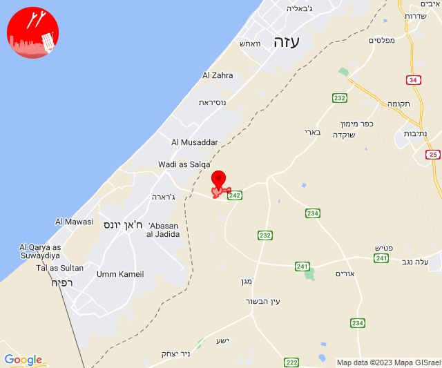

## 09:35

🔴 צבע אדום (18/10/2023):

12:35:
• עוטף עזה: גבים, מכללת ספיר, שדרות, איבים, ניר עם (15 שניות)

צופר - צבע אדום

## 09:35

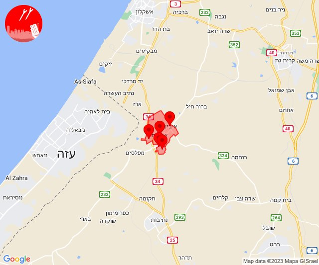

## 10:51

🔴 צבע אדום (18/10/2023):

13:51:
• עוטף עזה: מטווח ניר עם, שדרות, איבים, ניר עם (15 שניות)

צופר - צבע אדום

## 10:51

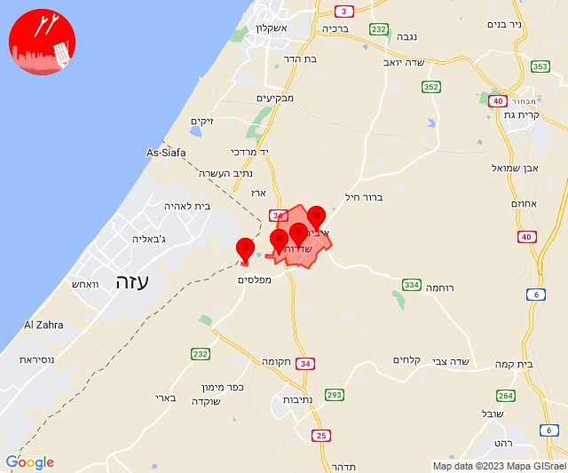

## 11:55

🔴 צבע אדום (18/10/2023):

14:55:
• עוטף עזה: נחל עוז (15 שניות)

צופר - צבע אדום

## 11:55

## 11:59

🔴 צבע אדום (18/10/2023):

14:59:
• עוטף עזה: נחל עוז (15 שניות)

צופר - צבע אדום

## 11:59

## 12:02

🔴 צבע אדום (18/10/2023):

15:02:
• עוטף עזה: מגן (15 שניות)

צופר - צבע אדום

## 12:02

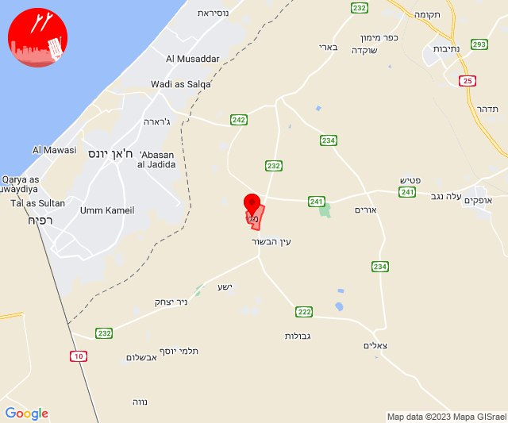

## 12:04

🔴 צבע אדום (18/10/2023):

15:03:
• עוטף עזה: יבול (15 שניות)

15:04:
• עוטף עזה: שלומית (30 שניות)
• מרכז הנגב: חצרים, באר שבע - דרום, באר שבע - מערב (דקה)

צופר - צבע אדום

## 12:04

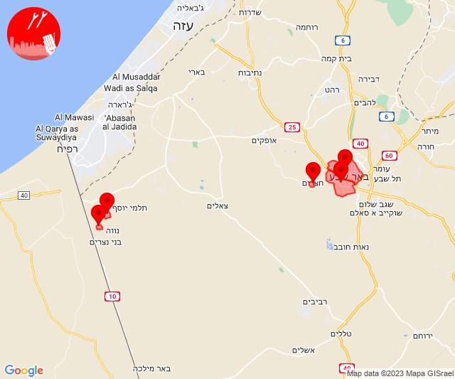

## 12:11

🔴 צבע אדום (18/10/2023):

15:11:
• עוטף עזה: כיסופים (15 שניות)

צופר - צבע אדום

## 12:11

## 12:42

🔴 צבע אדום (18/10/2023):

15:42:
• עוטף עזה: נירים, עין השלושה (15 שניות)

צופר - צבע אדום

## 12:42

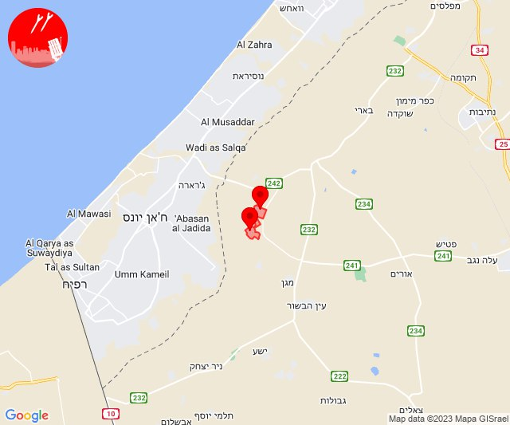

## 13:05

🔴 צבע אדום (18/10/2023):

16:05:
• עוטף עזה: סופה (15 שניות)

צופר - צבע אדום

## 13:05

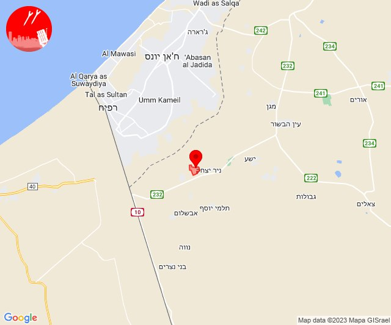

## 13:08

שלום לכולם

צופר היא מערכת המופעלת בהתנדבות מלאה, אשר פותחה למען תושבי מדינת ישראל.

בייחוד בשעות הקשות האלו מפתחי צופר עובדים ומתחזקים את המערכות במטרה להמשיך ולספק לכם שירות התרעות אמין, מהיר ומציל חיים.

עקב ריבוי המשתמשים אנו נאלצים להרחיב ולשדרג את השרתים מעת לעת

תרומות יסייעו לנו בהמשך הפעלת האפליקציה ותשלום על השרתים
paypal.me/tzevaadom

לתרומות דרך ״ביט״ או ״פייבוקס״: @itaigu

בתקווה לימים שקטים יותר🇮🇱

איתכם בכל זמן,
מערכת צופר

## 14:20

🔴 צבע אדום (18/10/2023):

17:20:
• עוטף עזה: רעים, כיסופים (15 שניות)

צופר - צבע אדום

## 14:20

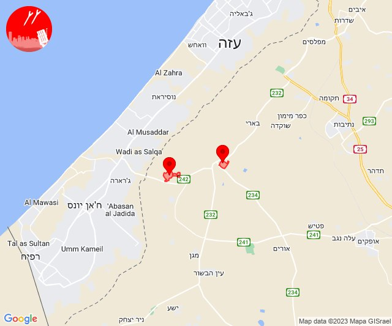

## 14:27

🔴 צבע אדום (18/10/2023):

17:26:
• קו העימות: מנרה, קריית שמונה, כפר יובל, מעיין ברוך, מרגליות (מיידי)

17:27:
• קו העימות: ע'ג'ר, תל חי, כפר גלעדי (מיידי)

צופר - צבע אדום

## 14:27

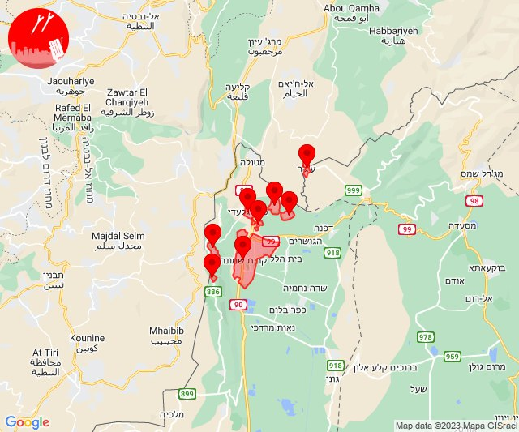

## 15:28

🔴 צבע אדום (18/10/2023):

18:28:
• דן: פתח תקווה (דקה וחצי)
• שרון: גני עם, הוד השרון, ירקונה, עדנים (דקה וחצי)

צופר - צבע אדום

## 15:28

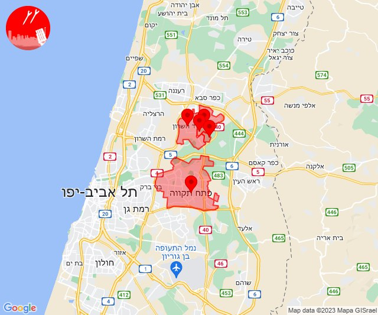

## 16:30

🔴 צבע אדום (18/10/2023):

19:29:
• דן: תל אביב - דרום העיר ויפו, תל אביב - מרכז העיר, בת-ים, חולון (דקה וחצי)

19:30:
• השפלה: ראשון לציון - מערב (דקה וחצי)

צופר - צבע אדום

## 16:30

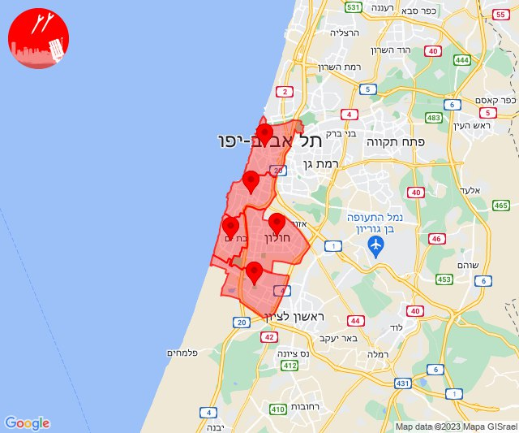

## 17:31

🔴 צבע אדום (18/10/2023):

20:31:
• דן: תל אביב - מרכז העיר, תל אביב - עבר הירקון (דקה וחצי)

צופר - צבע אדום

## 17:31

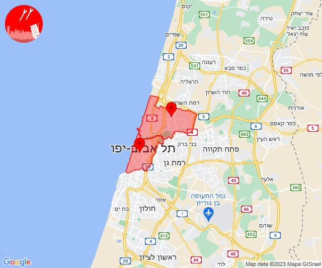

## 19:00

🔴 צבע אדום (18/10/2023):

22:00:
• דן: תל אביב - דרום העיר ויפו, תל אביב - מזרח, אזור, בת-ים, חולון, מקווה ישראל (דקה וחצי)
• השפלה: ראשון לציון - מערב (דקה וחצי)

צופר - צבע אדום

## 19:00

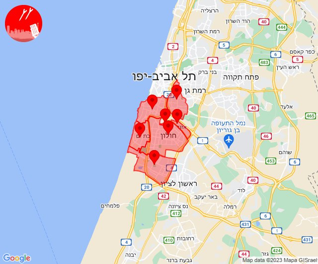

