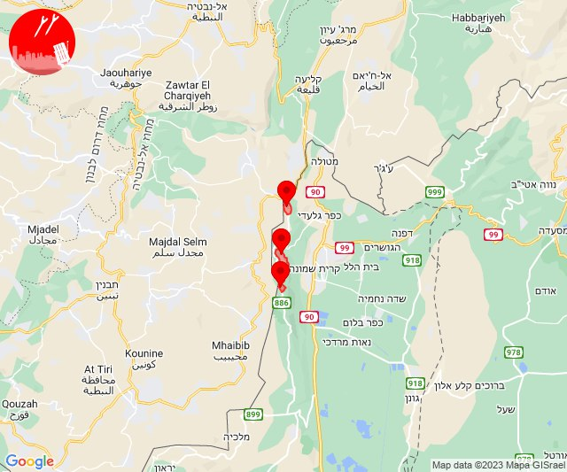

# Alerts for 2023-10-19

## 09:47

🔴 צבע אדום (19/10/2023):

12:47:
• מערב לכיש: אשקלון - דרום, אזור תעשייה הדרומי אשקלון (30 שניות)
• עוטף עזה: זיקים, כרמיה (15 שניות)

צופר - צבע אדום

## 09:47

## 10:47

🔴 צבע אדום (19/10/2023):

13:47:
• עוטף עזה: אבשלום, דקל (15 שניות)

צופר - צבע אדום

## 10:47

## 11:33

🔴 צבע אדום (19/10/2023):

14:32:
• דן: תל אביב - מזרח, אור יהודה, בני ברק, גבעת שמואל, קריית אונו, רמת גן - מזרח, רמת גן - מערב, אזור, תל אביב - מרכז העיר (דקה וחצי)
• השפלה: חמד (דקה וחצי)

14:33:
• דן: חולון, מקווה ישראל (דקה וחצי)
• השפלה: ראשון לציון - מזרח, בית דגן, משמר השבעה, גנות (דקה וחצי)

צופר - צבע אדום

## 11:33

## 11:40

🔴 צבע אדום (19/10/2023):

14:39:
• עוטף עזה: זמרת, שובה, סעד, תקומה, חוות יזרעם, כפר מימון ותושיה (15 שניות)
• מערב הנגב: נתיבות, בית הגדי, מעגלים, גבעולים, מלילות, שיבולים, שרשרת (30 שניות)

14:40:
• עוטף עזה: כפר עזה (15 שניות)

צופר - צבע אדום

## 11:40

## 12:03

🔴 צבע אדום (19/10/2023):

15:03:
• עוטף עזה: יתד, שדה אברהם (15 שניות)

צופר - צבע אדום

## 12:03

## 12:04

🔴 צבע אדום (19/10/2023):

15:04:
• עוטף עזה: שדרות, איבים, ניר עם (15 שניות)

צופר - צבע אדום

## 12:04

## 12:51

🔴 צבע אדום (19/10/2023):

15:51:
• עוטף עזה: סופה, חולית (15 שניות)

צופר - צבע אדום

## 12:51

## 13:00

🔴 צבע אדום (19/10/2023):

16:00:
• מערב לכיש: אזור תעשייה הדרומי אשקלון, ניצן (30 שניות, 45 שניות)
• לכיש: אשדוד - ח,ט,י,יג,יד,טז, אשדוד - יא,יב,טו,יז,מרינה,סיטי (45 שניות)

צופר - צבע אדום

## 13:00

## 13:03

🔴 צבע אדום (19/10/2023):

16:02:
• עוטף עזה: נירים, עין השלושה, כיסופים (15 שניות)
• קו העימות: שומרה, אבן מנחם (מיידי)

16:03:
• עוטף עזה: מטווח ניר עם, שדרות, איבים, ניר עם (15 שניות)
• קו העימות: אבירים, פסוטה (מיידי)

צופר - צבע אדום

## 13:03

## 13:31

🔴 צבע אדום (19/10/2023):

16:30:
• מרכז הנגב: נבטים, שגב שלום והפזורה, אל סייד והפזורה, אום בטין והפזורה, תל שבע (דקה וחצי)
• דרום הנגב: אבו-תלול והפזורה (דקה וחצי)

16:31:
• מרכז הנגב: לקיה והפזורה, באר שבע - מזרח, באר שבע - דרום (דקה)
• דרום הנגב: ואדי אל נעם דרום (דקה וחצי)

צופר - צבע אדום

## 13:31

## 13:44

🔴 צבע אדום (19/10/2023):

16:43:
• קו העימות: שלומי, בצת, חניתה (מיידי)

16:44:
• קו העימות: אזור תעשייה אכזיב מילואות, גשר הזיו, לימן, נהריה, ראש הנקרה (מיידי, 15 שניות)

צופר - צבע אדום

## 13:44

## 13:46

🔴 צבע אדום (19/10/2023):

16:46:
• עוטף עזה: כיסופים (15 שניות)

צופר - צבע אדום

## 13:46

## 13:47

🔴 צבע אדום (19/10/2023):

16:47:
• קו העימות: אזור תעשייה אכזיב מילואות, גשר הזיו, לימן, בצת, ראש הנקרה, שלומי (מיידי)

צופר - צבע אדום

## 13:48

## 13:54

🔴 צבע אדום (19/10/2023):

16:53:
• קו העימות: לימן, ראש הנקרה, שלומי (מיידי)

16:54:
• קו העימות: אזור תעשייה אכזיב מילואות, גשר הזיו, בצת (מיידי)

צופר - צבע אדום

## 13:54

## 14:00

🔴 צבע אדום (19/10/2023):

17:00:
• מערב לכיש: אזור תעשייה הדרומי אשקלון (30 שניות)
• עוטף עזה: זיקים, נתיב העשרה (15 שניות)
• קו העימות: אזור תעשייה אכזיב מילואות, שלומי, גשר הזיו, לימן (מיידי)

צופר - צבע אדום

## 14:01

## 14:32

🔴 צבע אדום (19/10/2023):

17:30:
• מרכז הנגב: תל שבע, אום בטין והפזורה (דקה וחצי)

17:31:
• מרכז הנגב: באר שבע - מזרח, באר שבע - צפון, עומר, לקיה והפזורה, כרמים, כרמית (דקה, דקה וחצי)
• קו העימות: קריית שמונה (מיידי)

17:32:
• מרכז הנגב: באר שבע - מערב (דקה)

צופר - צבע אדום

## 14:32

## 14:34

🔴 צבע אדום (19/10/2023):

17:34:
• קו העימות: קריית שמונה, כפר גלעדי, תל חי (מיידי)

צופר - צבע אדום

## 14:34

## 14:37

🔴 צבע אדום (19/10/2023):

17:37:
• קו העימות: מנרה, מרגליות, משגב עם (מיידי)

צופר - צבע אדום

## 14:37

## 14:45

🔴 צבע אדום (19/10/2023):

17:45:
• קו העימות: מנרה (מיידי)

צופר - צבע אדום

## 14:45

## 17:32

🔴 צבע אדום (19/10/2023):

20:31:
• השפלה: גן שורק, ראשון לציון - מערב (דקה וחצי)
• דן: בת-ים, חולון (דקה וחצי)
• לכיש: יבנה (דקה)

20:32:
• לכיש: אשדוד - אזור תעשייה צפוני ונמל (45 שניות)

צופר - צבע אדום

## 17:32

## 17:44

🔴 צבע אדום (19/10/2023):

20:44:
• עוטף עזה: ניר יצחק, פרי גן, נתיב העשרה (15 שניות)

צופר - צבע אדום

## 17:44

## 17:47

🔴 צבע אדום (19/10/2023):

20:47:
• עוטף עזה: חולית, סופה (15 שניות)

צופר - צבע אדום

## 17:47

## 18:01

🔴 צבע אדום (19/10/2023):

21:00:
• עוטף עזה: נתיב העשרה, זיקים, כרמיה (15 שניות)
• מערב לכיש: אשקלון - דרום, אזור תעשייה הדרומי אשקלון, אשקלון - צפון (30 שניות)

21:01:
• עוטף עזה: שדרות, איבים, ניר עם, מטווח ניר עם (15 שניות)

צופר - צבע אדום

## 18:01

## 19:58

🔴 צבע אדום (19/10/2023):

22:58:
• דן: תל אביב - דרום העיר ויפו, תל אביב - מרכז העיר, בת-ים, חולון (דקה וחצי)
• השפלה: ראשון לציון - מערב (דקה וחצי)

צופר - צבע אדום

## 19:58

