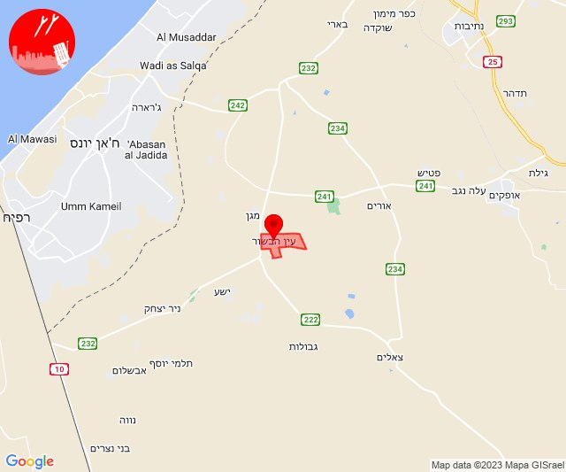

# Alerts for 2023-10-20

## 06:57

🔴 צבע אדום (20/10/2023):

09:57:
• עוטף עזה: מטווח ניר עם, מפלסים (15 שניות)

צופר - צבע אדום

## 06:57

## 07:49

🔴 צבע אדום (20/10/2023):

10:49:
• עוטף עזה: שדרות, איבים, ניר עם (15 שניות)

צופר - צבע אדום

## 07:49

## 08:17

🔴 צבע אדום (20/10/2023):

11:17:
• עוטף עזה: כיסופים (15 שניות)

צופר - צבע אדום

## 08:17

## 08:50

🔴 צבע אדום (20/10/2023):

11:50:
• עוטף עזה: כפר עזה (15 שניות)

צופר - צבע אדום

## 08:50

## 09:04

🔴 צבע אדום (20/10/2023):

12:03:
• מערב לכיש: אשקלון - דרום, אשקלון - צפון, אזור תעשייה הדרומי אשקלון, ניצן (30 שניות, 45 שניות)
• לכיש: שתולים, אשדוד - א,ב,ד,ה, אשדוד - אזור תעשייה צפוני ונמל, אשדוד - ח,ט,י,יג,יד,טז, אשדוד - יא,יב,טו,יז,מרינה,סיטי, בית עזרא, אזור תעשייה עד הלום (45 שניות)

12:04:
• לכיש: שדה עוזיהו (45 שניות)
• עוטף עזה: כפר עזה (15 שניות)

צופר - צבע אדום

## 09:04

## 10:00

🔴 צבע אדום (20/10/2023):

13:00:
• שפלת יהודה: אדרת (דקה וחצי)

צופר - צבע אדום

## 10:00

## 10:06

🔴 צבע אדום (20/10/2023):

13:06:
• עוטף עזה: עין הבשור (15 שניות)

צופר - צבע אדום

## 10:06

## 11:23

🔴 צבע אדום (20/10/2023):

14:23:
• שפלת יהודה: לטרון, נחשון, נס הרים (דקה וחצי)
• ירקון: נוף איילון (דקה וחצי)

צופר - צבע אדום

## 11:23

## 13:04

🔴 צבע אדום (20/10/2023):

16:04:
• קו העימות: דוב''ב (מיידי)

צופר - צבע אדום

## 13:05

## 13:32

שלום רב

אנו מתזכרים אתכם ואת שומרי השבת, באפליקציית צופר אפשרות להפעלת חיווי קולי - הקראה של שמות היישובים, ובכך ניתן להשתמש כ-״גל שקט״ ולהתעדכן גם מבלי לגעת בטלפון במהלך השבת.

החיווי הקולי קיים בפלטפורמות הבאות:

• אפליקציית צופר לאנדרואיד
• תוסף צופר לגוגל כרום
• דף אינטרנט אותו יש להשאיר פתוח בדפדפן (www.tzevaadom.co.il)

לשאר הפלטפורמות הנוספות:
www.tzevaadom.co.il/systems

בתקווה לימים שקטים יותר 🇮🇱

איתכם בכל זמן,
מערכת צופר

## 14:02

🔴 צבע אדום (20/10/2023):

17:01:
• עוטף עזה: מפלסים (15 שניות)

17:02:
• עוטף עזה: מטווח ניר עם (15 שניות)

צופר - צבע אדום

## 14:02

## 15:11

🔴 צבע אדום (20/10/2023):

18:11:
• קו העימות: מטולה (מיידי)

צופר - צבע אדום

## 15:11

## 16:17

🔴 צבע אדום (20/10/2023):

19:17:
• מערב לכיש: אזור תעשייה הדרומי אשקלון, אשקלון - דרום (30 שניות)
• עוטף עזה: זיקים (15 שניות)

צופר - צבע אדום

## 16:17

## 16:59

🔴 צבע אדום (20/10/2023):

19:59:
• עוטף עזה: נתיב העשרה (15 שניות)

צופר - צבע אדום

## 16:59

## 17:01

🔴 צבע אדום (20/10/2023):

20:00:
• מערב לכיש: אזור תעשייה צפוני אשקלון, אשקלון - דרום, אזור תעשייה הדרומי אשקלון, בת הדר, מבקיעים, אשקלון - צפון (30 שניות)

20:01:
• מערב לכיש: ניצן, ניצנים, באר גנים, ברכיה, כפר סילבר (45 שניות, 30 שניות)
• לכיש: אשדוד - ח,ט,י,יג,יד,טז, אשדוד - א,ב,ד,ה, אזור תעשייה עד הלום, אשדוד - ג,ו,ז, אשדוד - יא,יב,טו,יז,מרינה,סיטי, בית עזרא (45 שניות)

צופר - צבע אדום

## 17:01

## 17:07

🔴 צבע אדום (20/10/2023):

20:07:
• עוטף עזה: שדרות, איבים, ניר עם (15 שניות)

צופר - צבע אדום

## 17:07

## 17:17

🔴 צבע אדום (20/10/2023):

20:17:
• עוטף עזה: יד מרדכי, נתיב העשרה (15 שניות)

צופר - צבע אדום

## 17:17

## 17:38

🔴 צבע אדום (20/10/2023):

20:37:
• עוטף עזה: שדרות, איבים, ניר עם (15 שניות)

20:38:
• עוטף עזה: מטווח ניר עם (15 שניות)

צופר - צבע אדום

## 17:38

## 17:56

🔴 צבע אדום (20/10/2023):

20:56:
• מערב לכיש: אשקלון - דרום, אזור תעשייה הדרומי אשקלון (30 שניות)
• עוטף עזה: זיקים (15 שניות)

צופר - צבע אדום

## 17:56

## 18:03

🔴 צבע אדום (20/10/2023):

21:01:
• מערב לכיש: אשקלון - דרום, אזור תעשייה צפוני אשקלון, אזור תעשייה הדרומי אשקלון (30 שניות)

21:02:
• עוטף עזה: מטווח ניר עם, שדרות, איבים, ניר עם, מפלסים, סעד (15 שניות)

21:03:
• לכיש: אורות, פארק תעשייה ראם, באר טוביה, אשדוד - א,ב,ד,ה, אשדוד - ג,ו,ז, אשדוד - ח,ט,י,יג,יד,טז, אשדוד - יא,יב,טו,יז,מרינה,סיטי (45 שניות, דקה)
• עוטף עזה: יד מרדכי, כרמיה (15 שניות)
• מערב לכיש: מבקיעים (30 שניות)

צופר - צבע אדום

## 18:03

## 18:11

🔴 צבע אדום (20/10/2023):

21:11:
• עוטף עזה: שדרות, איבים, ניר עם, גבים, מכללת ספיר, מטווח ניר עם (15 שניות)

צופר - צבע אדום

## 18:11

## 18:17

🔴 צבע אדום (20/10/2023):

21:17:
• עוטף עזה: שדרות, איבים, ניר עם, גבים, מכללת ספיר, מפלסים, מטווח ניר עם (15 שניות)

צופר - צבע אדום

## 18:17

## 19:00

🔴 צבע אדום (20/10/2023):

22:00:
• מערב לכיש: אזור תעשייה הדרומי אשקלון, אשקלון - דרום, אשקלון - צפון (30 שניות)
• עוטף עזה: זיקים (15 שניות)

צופר - צבע אדום

## 19:00

## 20:02

🔴 צבע אדום (20/10/2023):

23:02:
• עוטף עזה: שדרות, איבים, ניר עם, גבים, מכללת ספיר (15 שניות)

צופר - צבע אדום

## 20:02

