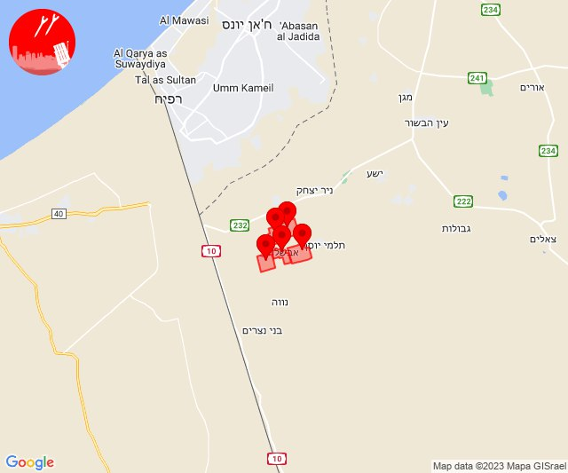
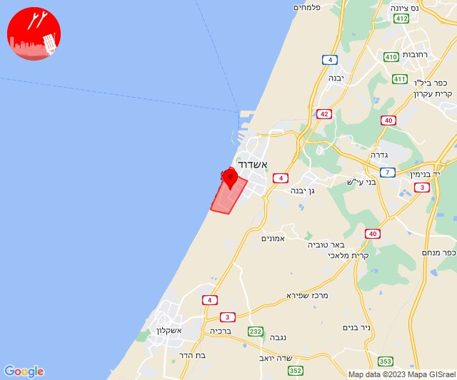
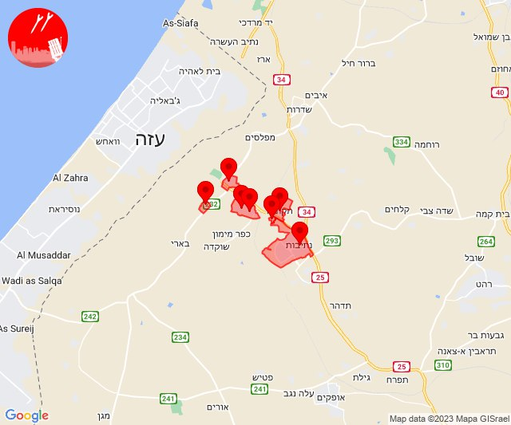
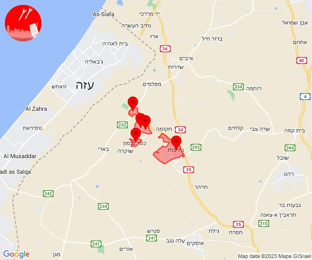
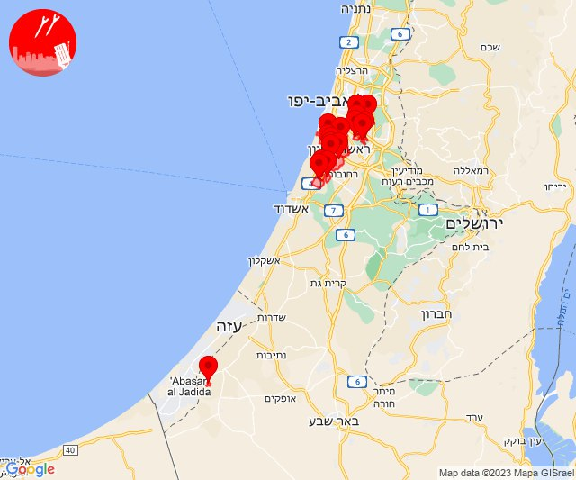
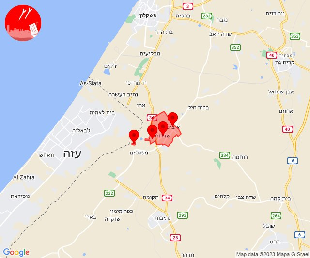
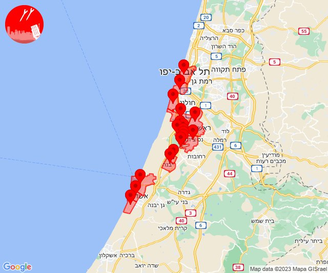
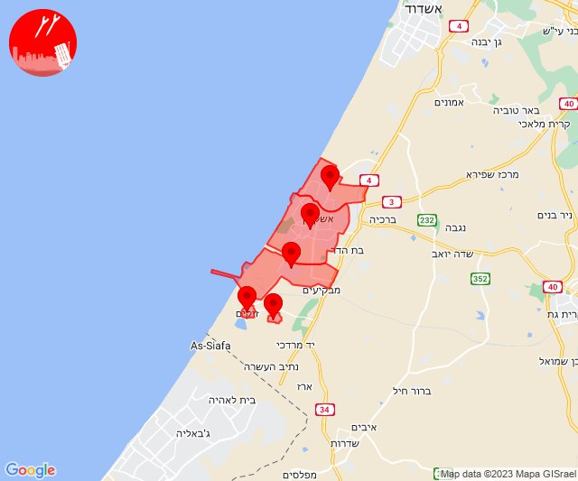
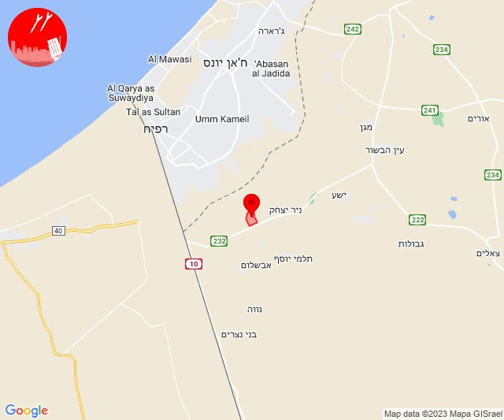
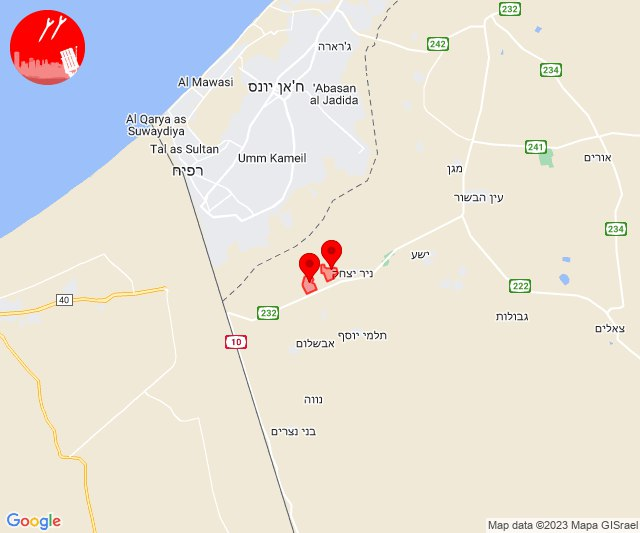

# Alerts for 2023-10-21

## 00:00

🔴 צבע אדום (21/10/2023):

03:00:
• עוטף עזה: אבשלום, יבול, יתד, דקל, שדה אברהם (15 שניות)

צופר - צבע אדום

## 00:00

## 06:01

🔴 צבע אדום (21/10/2023):

09:01:
• לכיש: אשדוד - יא,יב,טו,יז,מרינה,סיטי (45 שניות)

צופר - צבע אדום

## 06:01

## 09:00

🔴 צבע אדום (21/10/2023):

12:00:
• מערב הנגב: נתיבות (30 שניות)
• עוטף עזה: זמרת, שובה, סעד, עלומים, תקומה, חוות יזרעם (15 שניות)

צופר - צבע אדום

## 09:00

## 09:06

🔴 צבע אדום (21/10/2023):

12:06:
• עוטף עזה: נחל עוז (15 שניות)

צופר - צבע אדום

## 09:06

## 09:30

🔴 צבע אדום (21/10/2023):

12:30:
• מערב הנגב: נתיבות (30 שניות)
• עוטף עזה: כפר מימון ותושיה, זמרת, שובה, סעד (15 שניות)

צופר - צבע אדום

## 09:30

## 10:32

🔴 צבע אדום (21/10/2023):

13:30:
• השפלה: פארק תעשיות פלמחים, ראשון לציון - מזרח, ראשון לציון - מערב, אירוס, בית חנן, נטעים, נס ציונה, אחיעזר, יגל, כפר חב''ד, צפריה (דקה וחצי)
• דן: אור יהודה, יהוד-מונוסון (דקה וחצי)

13:31:
• השפלה: גאליה (דקה)
• לכיש: יבנה, כפר הנגיד (דקה)

13:32:
• עוטף עזה: עין השלושה (15 שניות)

צופר - צבע אדום

## 10:32

## 11:00

🔴 צבע אדום (21/10/2023):

14:00:
• עוטף עזה: שדרות, איבים, ניר עם, מטווח ניר עם (15 שניות)

צופר - צבע אדום

## 11:00

## 11:01

🔴 צבע אדום (21/10/2023):

14:01:
• עוטף עזה: נירים (15 שניות)

צופר - צבע אדום

## 11:01

## 11:03

🔴 צבע אדום (21/10/2023):

14:03:
• עוטף עזה: עין השלושה (15 שניות)

צופר - צבע אדום

## 11:03

## 13:13

🔴 צבע אדום (21/10/2023):

16:12:
• השפלה: פארק תעשיות פלמחים, ראשון לציון - מזרח, ראשון לציון - מערב, אירוס, בית חנן, בית עובד, נטעים, נס ציונה, עיינות, גן שורק (דקה וחצי)
• דן: תל אביב - דרום העיר ויפו, תל אביב - מרכז העיר (דקה וחצי)
• לכיש: אשדוד - א,ב,ד,ה, אשדוד - אזור תעשייה צפוני ונמל, אשדוד - יא,יב,טו,יז,מרינה,סיטי (45 שניות)

16:13:
• לכיש: יבנה, כפר הנגיד (דקה)
• דן: בת-ים (דקה וחצי)

צופר - צבע אדום

## 13:13

## 16:56

🔴 צבע אדום (21/10/2023):

19:56:
• מערב לכיש: אשקלון - דרום, אשקלון - צפון, אזור תעשייה הדרומי אשקלון (30 שניות)
• עוטף עזה: זיקים, כרמיה (15 שניות)

צופר - צבע אדום

## 16:56

## 21:20

🔴 צבע אדום (22/10/2023):

00:20:
• עוטף עזה: חולית (15 שניות)

צופר - צבע אדום

## 21:20

## 22:09

🔴 צבע אדום (22/10/2023):

01:09:
• עוטף עזה: סופה, חולית (15 שניות)

צופר - צבע אדום

## 22:09

