# Alerts for 2023-10-22

## 06:01

🔴 צבע אדום (22/10/2023):

09:01:
• דן: בת-ים, חולון (דקה וחצי)
• השפלה: ראשון לציון - מערב (דקה וחצי)

צופר - צבע אדום

## 06:01

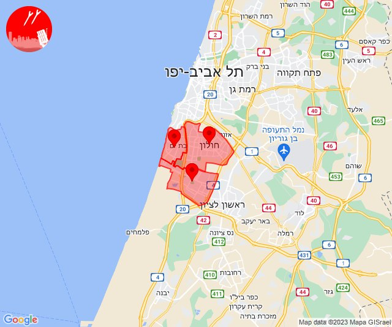

## 07:07

🔴 צבע אדום (22/10/2023):

10:07:
• עוטף עזה: כיסופים (15 שניות)

צופר - צבע אדום

## 07:07

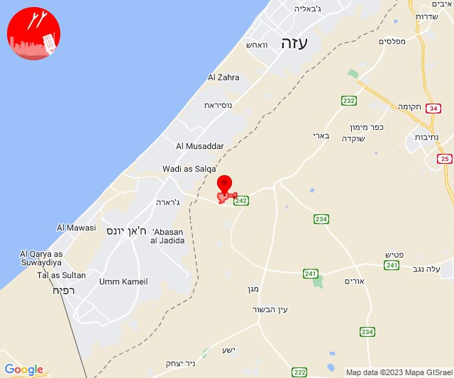

## 07:16

🔴 צבע אדום (22/10/2023):

10:16:
• עוטף עזה: נתיב העשרה, כרמיה (15 שניות)
• מערב לכיש: אשקלון - דרום, אזור תעשייה הדרומי אשקלון (30 שניות)

צופר - צבע אדום

## 07:16

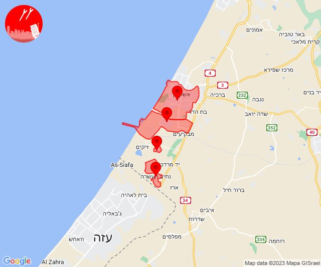

## 08:04

🔴 צבע אדום (22/10/2023):

11:03:
• מערב לכיש: אזור תעשייה הדרומי אשקלון, גיאה, מבקיעים (30 שניות)
• עוטף עזה: יד מרדכי, כרמיה, נתיב העשרה (15 שניות)

11:04:
• מערב לכיש: אשקלון - דרום (30 שניות)

צופר - צבע אדום

## 08:04

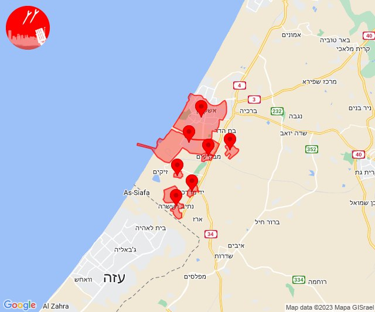

## 08:12

🔴 צבע אדום (22/10/2023):

11:12:
• עוטף עזה: כרם שלום (15 שניות)

צופר - צבע אדום

## 08:12

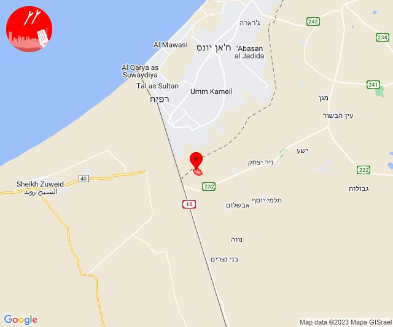

## 08:33

🔴 צבע אדום (22/10/2023):

11:33:
• עוטף עזה: נחל עוז (15 שניות)

צופר - צבע אדום

## 08:33

## 10:00

🔴 צבע אדום (22/10/2023):

12:58:
• שפלת יהודה: אזור תעשייה ברוש, בית שמש, זנוח, ישעי, נתיב הל''ה, מחסיה, רטורנו - גבעת שמש (דקה וחצי)

12:59:
• שפלת יהודה: שריגים - ליאון, גבעת ישעיהו, שדות מיכה, זכריה, לוזית, עגור, גפן (דקה)
• לכיש: אזור תעשייה קריית גת, גת, קריית גת, כרמי גת, אל עזי, אלומה, ורדון, זבדיאל, זרחיה, מנוחה, נחלה, ניר בנים, סגולה, קדמה, קוממיות, רווחה, זוהר, יד נתן, נהורה, נוגה, ניר ח''ן, עוצם, שדה דוד, שדה יואב, שחר (45 שניות, 30 שניות)
• מערב לכיש: חלץ, כוכב מיכאל (30 שניות)
• עוטף עזה: נחל עוז (15 שניות)

13:00:
• שפלת יהודה: תירוש (דקה)

צופר - צבע אדום

## 10:00

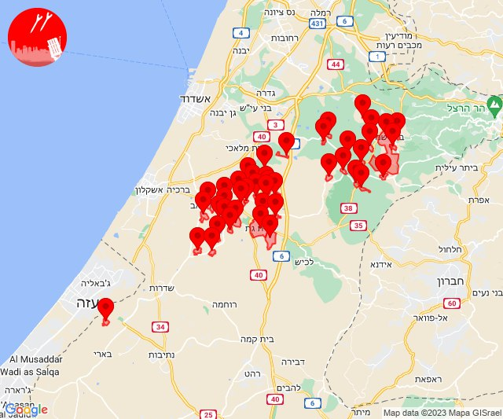

## 10:09

צופר - שיפור מהירות ההתרעה למשתמשי האייפון

לאחר מאמצים רבים בימים האחרונים, אנו שמחים לבשר על שיפור משמעותי במהירות קבלת ההתרעות עבור משתמשי אפליקציית הIOS של צופר.

צוות צופר ממשיך לעבוד ולתחזק את המערכות בייחוד בשעות הקשות האלו, במטרה להמשיך ולספק לכם שירות התרעות אמין, מהיר ומציל חיים.

איתכם בכל זמן,
מערכת צופר

## 10:29

🔴 צבע אדום (22/10/2023):

13:29:
• עוטף עזה: רעים (15 שניות)

צופר - צבע אדום

## 10:29

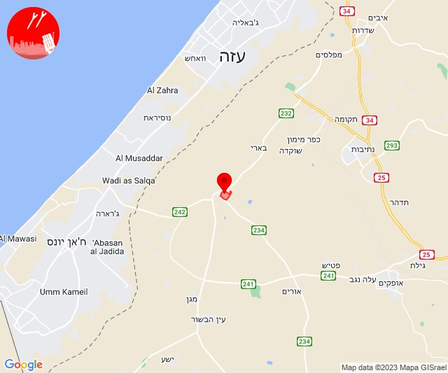

## 10:39

🔴 צבע אדום (22/10/2023):

13:39:
• עוטף עזה: נירים (15 שניות)

צופר - צבע אדום

## 10:39

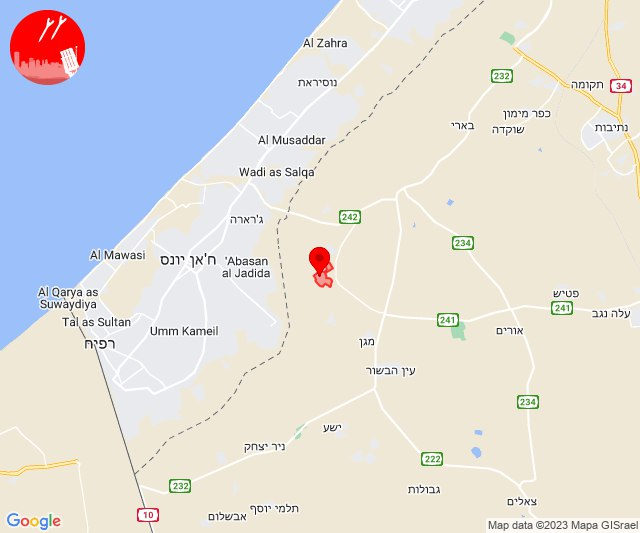

## 11:02

🔴 צבע אדום (22/10/2023):

14:02:
• קו העימות: יפתח (מיידי)

צופר - צבע אדום

## 11:02

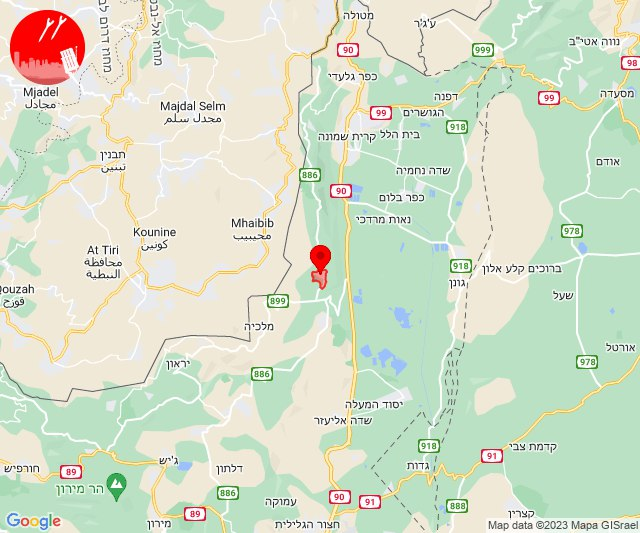

## 11:06

🔴 צבע אדום (22/10/2023):

14:06:
• עוטף עזה: כיסופים (15 שניות)

צופר - צבע אדום

## 11:06

## 11:40

🔴 צבע אדום (22/10/2023):

14:40:
• עוטף עזה: מטווח ניר עם, מפלסים, שדרות, איבים, ניר עם (15 שניות)

צופר - צבע אדום

## 11:40

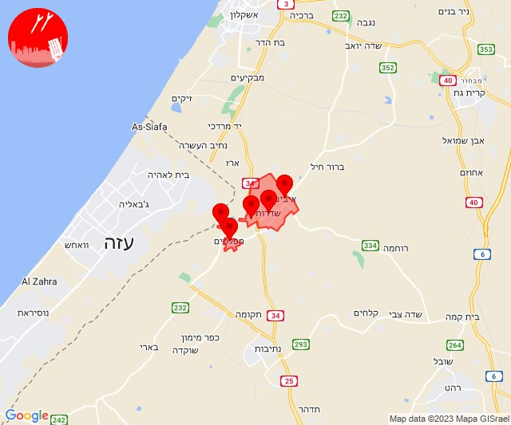

## 14:01

🔴 צבע אדום (22/10/2023):

17:00:
• מערב הנגב: נתיבות, בית הגדי, אזור תעשייה נ.ע.מ, מעגלים, גבעולים, מלילות, שרשרת, שיבולים, יושיביה (30 שניות, 15 שניות)
• עוטף עזה: כפר מימון ותושיה, עלומים, שוקדה, חוות יזרעם, תקומה, זמרת, שובה (15 שניות)

17:01:
• עוטף עזה: רעים (15 שניות)

צופר - צבע אדום

## 14:01

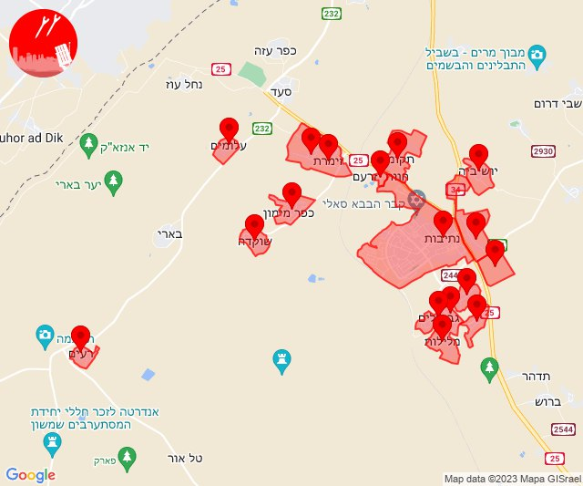

## 15:10

🔴 צבע אדום (22/10/2023):

18:10:
• עוטף עזה: בארי (15 שניות)

צופר - צבע אדום

## 15:10

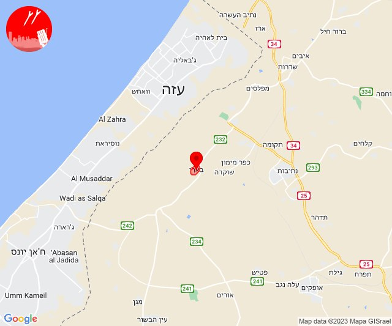

## 16:00

🔴 צבע אדום (22/10/2023):

19:00:
• מרכז הנגב: חצרים, באר שבע - דרום, באר שבע - מערב, אתר דודאים (דקה, 45 שניות)
• מערב הנגב: אופקים, גילת (45 שניות)

צופר - צבע אדום

## 16:00

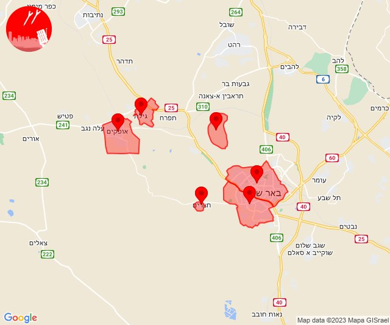

## 16:14

🔴 צבע אדום (22/10/2023):

19:14:
• עוטף עזה: ארז (15 שניות)

צופר - צבע אדום

## 16:14

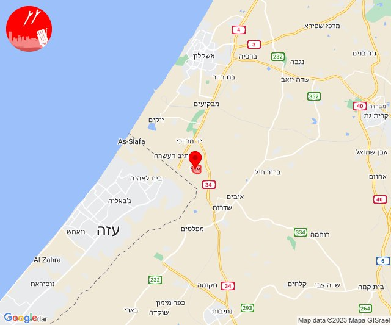

## 18:00

🔴 צבע אדום (22/10/2023):

21:00:
• מערב הנגב: נתיבות (30 שניות)

צופר - צבע אדום

## 18:00

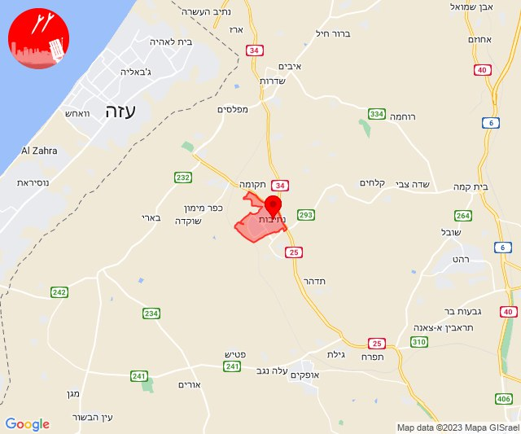

