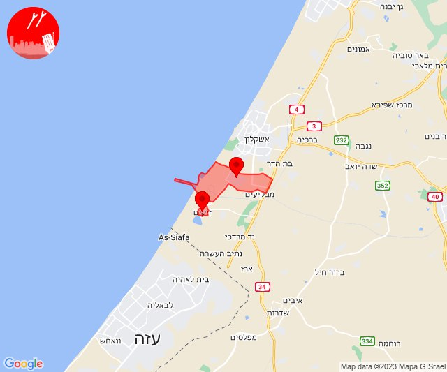
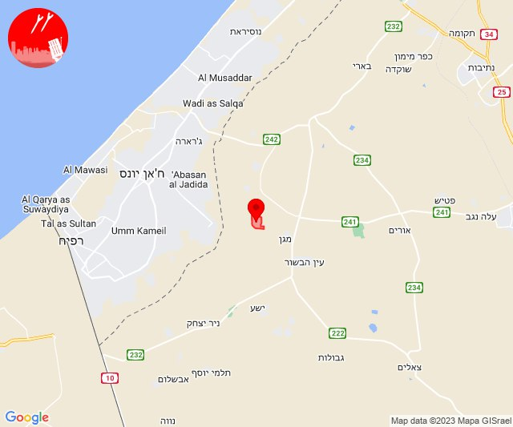
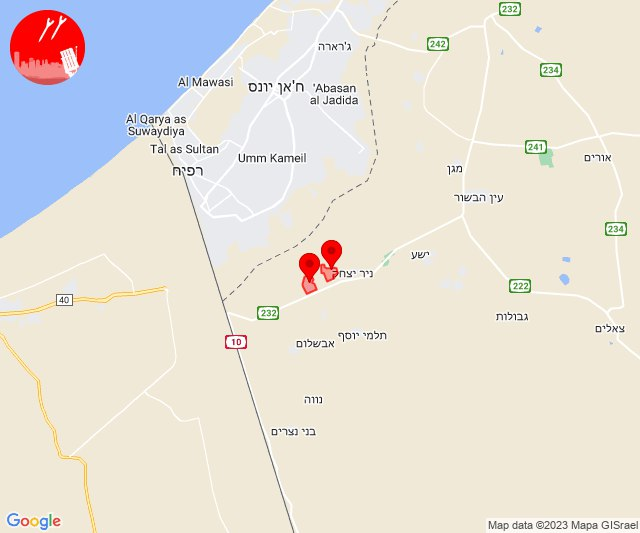

# Alerts for 2023-10-23

## 08:30

🔴 צבע אדום (23/10/2023):

11:30:
• מערב לכיש: אשקלון - דרום, אזור תעשייה הדרומי אשקלון, בת הדר, מבקיעים, אשקלון - צפון, אזור תעשייה צפוני אשקלון, כפר סילבר (30 שניות)
• עוטף עזה: יד מרדכי, נתיב העשרה, כרמיה, ארז (15 שניות)

צופר - צבע אדום

## 08:30

## 08:40

🔴 צבע אדום (23/10/2023):

11:40:
• מערב לכיש: אזור תעשייה הדרומי אשקלון (30 שניות)
• עוטף עזה: זיקים (15 שניות)

צופר - צבע אדום

## 08:40

## 09:17

🔴 צבע אדום (23/10/2023):

12:17:
• עוטף עזה: מבטחים, עמיעוז, ישע (15 שניות)

צופר - צבע אדום

## 09:17

## 10:01

🔴 צבע אדום (23/10/2023):

13:00:
• עוטף עזה: נחל עוז (15 שניות)
• מרכז הנגב: אום בטין והפזורה, אל סייד והפזורה, באר שבע - מערב, באר שבע - צפון, לקיה והפזורה (דקה וחצי, דקה)

13:01:
• מרכז הנגב: באר שבע - דרום, באר שבע - מזרח, עומר (דקה)

צופר - צבע אדום

## 10:01

## 11:03

🔴 צבע אדום (23/10/2023):

14:03:
• עוטף עזה: סופה, ניר יצחק (15 שניות)

צופר - צבע אדום

## 11:03

## 11:40

✈️ חדירת כלי טיס עוין (23/10/2023):

14:40:
• עוטף עזה: ניר עוז 

צופר - צבע אדום

## 11:40

## 11:47

✈️ חדירת כלי טיס עוין (23/10/2023):

14:47:
• עוטף עזה: עין הבשור 

צופר - צבע אדום

## 11:47

## 12:27

🔴 צבע אדום (23/10/2023):

15:27:
• גליל עליון: כפר מסריק, עין המפרץ (30 שניות)

צופר - צבע אדום

## 12:27

## 12:31

🔴 צבע אדום (23/10/2023):

15:31:
• עוטף עזה: חולית, סופה (15 שניות)

צופר - צבע אדום

## 12:31

## 12:59

🔴 צבע אדום (23/10/2023):

15:59:
• עוטף עזה: שדרות, איבים, ניר עם (15 שניות)

צופר - צבע אדום

## 12:59

## 13:01

🔴 צבע אדום (23/10/2023):

16:01:
• מרכז הנגב: באר שבע - מערב, אתר דודאים (דקה, 45 שניות)
• מערב הנגב: אשל הנשיא (45 שניות)

צופר - צבע אדום

## 13:01

## 13:52

🔴 צבע אדום (23/10/2023):

16:52:
• קו העימות: קריית שמונה (מיידי)

צופר - צבע אדום

## 13:52

## 18:02

🔴 צבע אדום (23/10/2023):

21:02:
• עוטף עזה: שדרות, איבים, ניר עם (15 שניות)

צופר - צבע אדום

## 18:02

