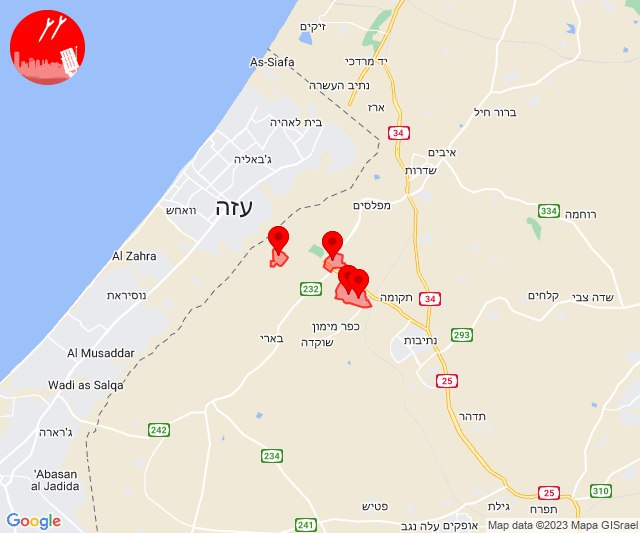
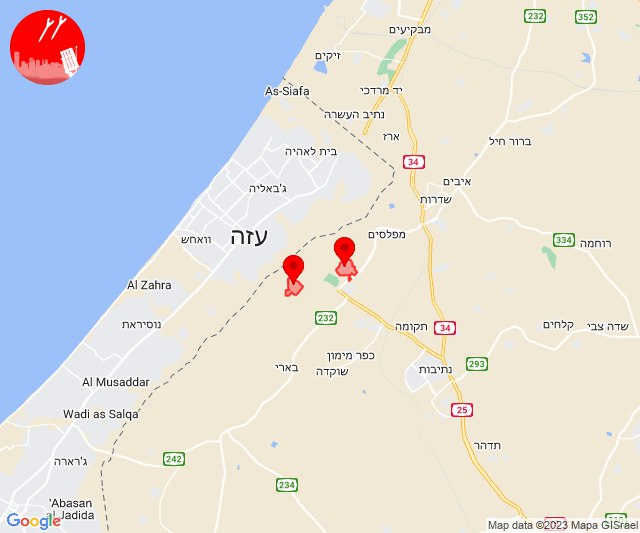

# Alerts for 2023-10-24

## 04:53

🔴 צבע אדום (24/10/2023):

07:53:
• עוטף עזה: נירים (15 שניות)

צופר - צבע אדום

## 04:53

## 07:52

🔴 צבע אדום (24/10/2023):

10:52:
• עוטף עזה: מבטחים, עמיעוז, ישע, צוחר, אוהד, שדה ניצן, תלמי אליהו (15 שניות)

צופר - צבע אדום

## 07:52

## 08:19

🔴 צבע אדום (24/10/2023):

11:19:
• עוטף עזה: נחל עוז, סעד, זמרת, שובה (15 שניות)

צופר - צבע אדום

## 08:19

## 10:30

🔴 צבע אדום (24/10/2023):

13:30:
• עוטף עזה: יד מרדכי, נתיב העשרה (15 שניות)
• מערב לכיש: מבקיעים (30 שניות)

צופר - צבע אדום

## 10:31

## 10:59

🔴 צבע אדום (24/10/2023):

13:59:
• מרכז הנגב: באר שבע - דרום (דקה)

צופר - צבע אדום

## 10:59

## 11:09

🔴 צבע אדום (24/10/2023):

14:09:
• לכיש: אשדוד - ח,ט,י,יג,יד,טז, אשדוד - יא,יב,טו,יז,מרינה,סיטי (45 שניות)
• עוטף עזה: נחל עוז (15 שניות)
• מערב לכיש: ניצן (45 שניות)

צופר - צבע אדום

## 11:09

## 11:22

🔴 צבע אדום (24/10/2023):

14:22:
• עוטף עזה: נירים, עין השלושה (15 שניות)

צופר - צבע אדום

## 11:22

## 11:44

🔴 צבע אדום (24/10/2023):

14:44:
• עוטף עזה: נחל עוז (15 שניות)

צופר - צבע אדום

## 11:44

## 12:17

🔴 צבע אדום (24/10/2023):

15:16:
• שרון: אלקנה, עץ אפרים, שערי תקווה, אלפי מנשה, צופים (דקה וחצי)
• ירקון: בארות יצחק, בני עטרות, גבעת כ''ח, טירת יהודה, נופך, רינתיה (דקה וחצי)
• דן: יהוד-מונוסון (דקה וחצי)
• השפלה: יגל, אחיעזר, זיתן, באר יעקב, לוד, ניר צבי, תעשיון צריפין, רמלה, נצר סרני (דקה וחצי)

15:17:
• השפלה: רחובות, נס ציונה, גיבתון, גן שלמה, גאליה (דקה וחצי, דקה)
• ירקון: אלעד, נחשונים, ראש העין, תעשיון חצב (דקה וחצי)
• לכיש: גבעת ברנר (דקה וחצי)

צופר - צבע אדום

## 12:17

## 12:33

🔴 צבע אדום (24/10/2023):

15:30:
• מרכז הנגב: תל שבע, באר שבע - מערב, באר שבע - צפון, אתר דודאים, באר שבע - דרום, באר שבע - מזרח (דקה וחצי, דקה, 45 שניות)

15:31:
• מרכז הנגב: חצרים (דקה)
• דן: אור יהודה, יהוד-מונוסון (דקה וחצי)
• השפלה: אחיעזר, יגל, כפר חב''ד, צפריה (דקה וחצי)
• לכיש: פלמחים (דקה וחצי)

15:32:
• ירקון: אלעד, מזור, נופך, נחשונים, עינת, ראש העין, רינתיה, תעשיון חצב (דקה וחצי)
• לכיש: אשדוד - אזור תעשייה צפוני ונמל (45 שניות)

15:33:
• לכיש: יבנה, כפר הנגיד (דקה)
• ירקון: בארות יצחק, בני עטרות (דקה וחצי)

צופר - צבע אדום

## 12:33

## 12:52

🔴 צבע אדום (24/10/2023):

15:52:
• עוטף עזה: חולית (15 שניות)

צופר - צבע אדום

## 12:52

## 13:23

🔴 צבע אדום (24/10/2023):

16:23:
• עוטף עזה: נחל עוז (15 שניות)

צופר - צבע אדום

## 13:23

## 13:34

🔴 צבע אדום (24/10/2023):

16:33:
• עוטף עזה: נחל עוז (15 שניות)

16:34:
• עוטף עזה: כפר עזה (15 שניות)

צופר - צבע אדום

## 13:34

## 14:02

🔴 צבע אדום (24/10/2023):

17:01:
• דן: אור יהודה, בת-ים, חולון, מקווה ישראל, תל אביב - מזרח, אזור, רמת גן - מערב, תל אביב - דרום העיר ויפו, תל אביב - מרכז העיר, תל אביב - עבר הירקון, גבעתיים, גבעת שמואל, פתח תקווה, יהוד-מונוסון, סביון, בני ברק, קריית אונו, רמת גן - מזרח, גבעת השלושה, גת רימון, מעש, גני תקווה, מגשימים, הרצליה - מערב, הרצליה - מרכז וגליל ים, כפר שמריהו, רמת השרון, סינמה סיטי גלילות, מתחם פי גלילות (דקה וחצי)
• השפלה: ראשון לציון - מזרח, תעשיון צריפין, אחיעזר, יגל, כפר חב''ד, צפריה, בית דגן, חמד, משמר השבעה, ראשון לציון - מערב, פארק תעשיות פלמחים, גיבתון, גן שלמה, נצר סרני, רחובות, אירוס, באר יעקב, בית עובד, ניר צבי, עיינות, רמלה, גנות, נס ציונה, נטעים, גן שורק (דקה וחצי)
• לכיש: פלמחים, גבעת ברנר, אזור תעשייה עד הלום, אשדוד - א,ב,ד,ה, אשדוד - אזור תעשייה צפוני ונמל, אשדוד - ג,ו,ז, אשדוד - ח,ט,י,יג,יד,טז, אשדוד - יא,יב,טו,יז,מרינה,סיטי, ניר גלים, שתולים (דקה וחצי, 45 שניות)
• שרון: אלישמע, גני עם, הוד השרון, ירקונה, כפר סבא, נווה ימין, ניר אליהו, עדנים, צופית, מרכז אזורי דרום השרון, נווה ירק, רעננה, ארסוף, געש, רשפון, שפיים (דקה וחצי)
• מערב לכיש: ניצן, אזור תעשייה הדרומי אשקלון (45 שניות, 30 שניות)
• ירקון: בארות יצחק, נחלים, מזור (דקה וחצי)

17:02:
• ירקון: נופך, רינתיה (דקה וחצי)
• לכיש: יבנה, בית גמליאל, בן זכאי, מעון צופיה, כפר הנגיד (דקה)
• השפלה: בית חנן (דקה וחצי)

צופר - צבע אדום

## 14:02

## 14:22

🔴 צבע אדום (24/10/2023):

17:22:
• קו העימות: אלקוש (מיידי)

צופר - צבע אדום

## 14:22

## 14:28

🔴 צבע אדום (24/10/2023):

17:28:
• קו העימות: נטועה (מיידי)

צופר - צבע אדום

## 14:28

## 16:01

🔴 צבע אדום (24/10/2023):

19:01:
• מערב לכיש: באר גנים (30 שניות)

צופר - צבע אדום

## 16:01

## 17:11

🔴 צבע אדום (24/10/2023):

20:11:
• עוטף עזה: חולית, סופה (15 שניות)

צופר - צבע אדום

## 17:11

## 17:16

🔴 צבע אדום (24/10/2023):

20:16:
• דרום הגולן: בני יהודה וגבעת יואב, נאות גולן (15 שניות)

צופר - צבע אדום

## 17:16

## 22:03

🔴 צבע אדום (25/10/2023):

01:03:
• עוטף עזה: סופה (15 שניות)

צופר - צבע אדום

## 22:03

## 23:02

🔴 צבע אדום (25/10/2023):

02:02:
• עוטף עזה: עין השלושה (15 שניות)

צופר - צבע אדום

## 23:02

