# Alerts for 2023-10-25

## 01:05

🔴 צבע אדום (25/10/2023):

04:05:
• עוטף עזה: כיסופים (15 שניות)

צופר - צבע אדום

## 01:05

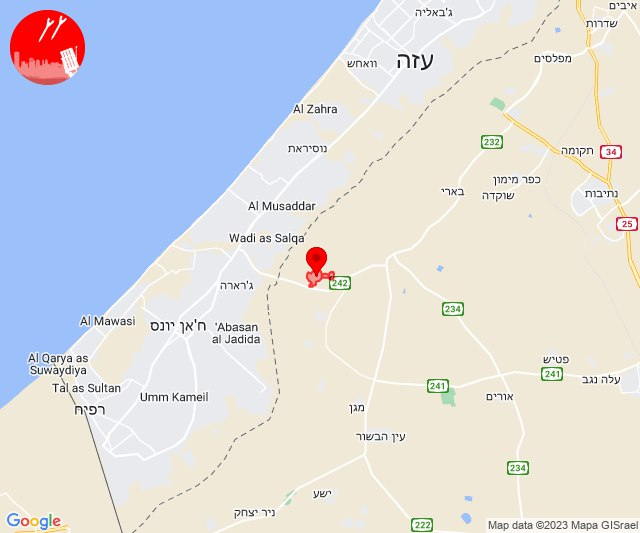

## 06:02

🔴 צבע אדום (25/10/2023):

09:01:
• מערב לכיש: אזור תעשייה הדרומי אשקלון (30 שניות)

09:02:
• עוטף עזה: זיקים, כרמיה (15 שניות)

צופר - צבע אדום

## 06:02

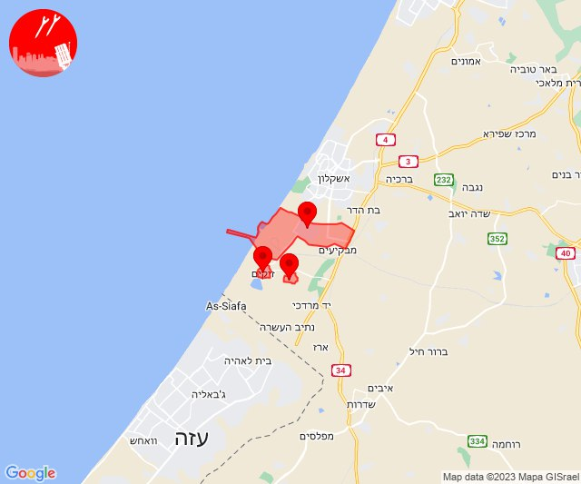

## 07:00

🔴 צבע אדום (25/10/2023):

09:59:
• עוטף עזה: כיסופים, עין השלושה (15 שניות)

צופר - צבע אדום

## 07:00

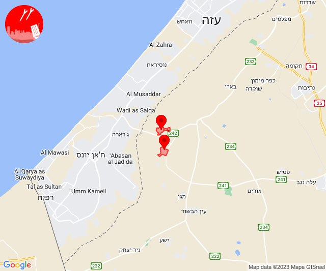

## 07:29

🔴 צבע אדום (25/10/2023):

10:29:
• עוטף עזה: עין השלושה (15 שניות)

צופר - צבע אדום

## 07:29

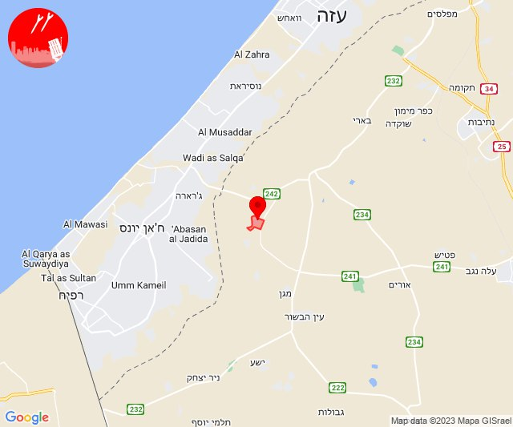

## 09:46

🔴 צבע אדום (25/10/2023):

12:46:
• עוטף עזה: נחל עוז (15 שניות)

צופר - צבע אדום

## 09:46

## 10:01

🔴 צבע אדום (25/10/2023):

13:01:
• הכרמל: דלית אל כרמל, כרם מהר''ל (דקה)

צופר - צבע אדום

## 10:01

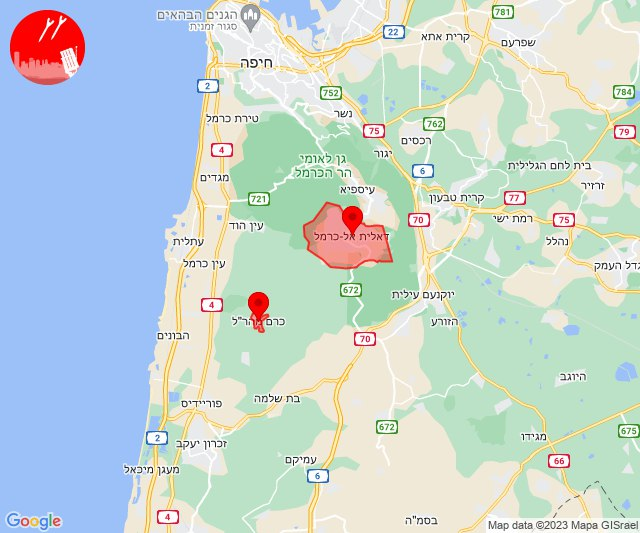

## 11:57

🔴 צבע אדום (25/10/2023):

14:57:
• עוטף עזה: נחל עוז (15 שניות)

צופר - צבע אדום

## 11:57

## 13:13

🔴 צבע אדום (25/10/2023):

16:13:
• מערב לכיש: אזור תעשייה הדרומי אשקלון, אשקלון - דרום (30 שניות)
• עוטף עזה: זיקים (15 שניות)

צופר - צבע אדום

## 13:13

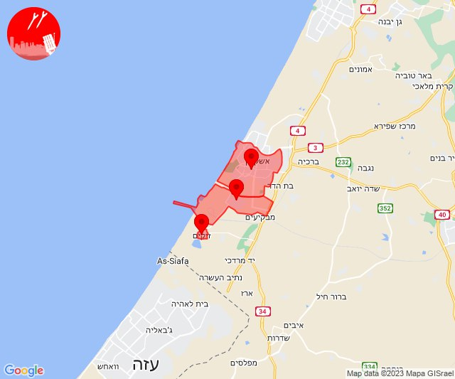

## 13:23

🔴 צבע אדום (25/10/2023):

16:23:
• קו העימות: קריית שמונה (מיידי)

צופר - צבע אדום

## 13:23

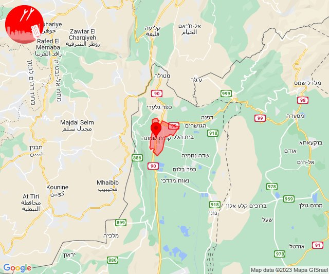

## 13:25

🔴 צבע אדום (25/10/2023):

16:25:
• קו העימות: כפר גלעדי, תל חי (מיידי)

צופר - צבע אדום

## 13:25

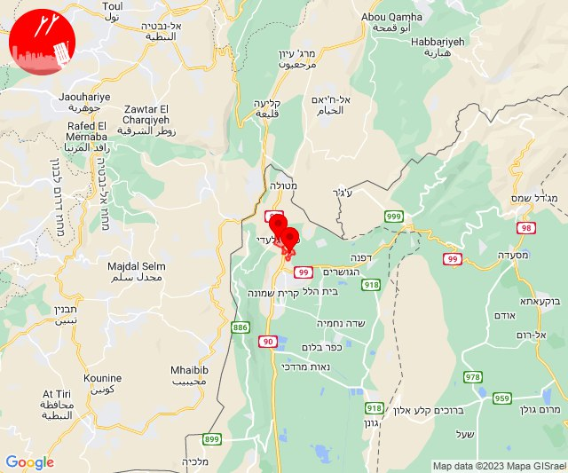

## 14:50

🔴 צבע אדום (25/10/2023):

17:50:
• עוטף עזה: סופה (15 שניות)

צופר - צבע אדום

## 14:50

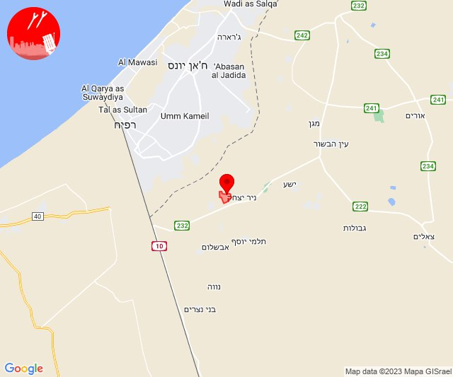

## 15:28

🔴 צבע אדום (25/10/2023):

18:28:
• עוטף עזה: נתיב העשרה (15 שניות)

צופר - צבע אדום

## 15:28

## 15:33

🔴 צבע אדום (25/10/2023):

18:33:
• עוטף עזה: מגן, ניר עוז, נירים (15 שניות)
• מערב לכיש: אשקלון - דרום (30 שניות)

צופר - צבע אדום

## 15:33

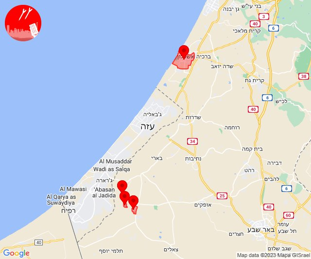

## 16:05

🔴 צבע אדום (25/10/2023):

19:04:
• השפלה: ראשון לציון - מזרח, ראשון לציון - מערב, פארק תעשיות פלמחים, בית חנן, נטעים (דקה וחצי)

19:05:
• השפלה: נס ציונה, אירוס, גן שורק (דקה וחצי)

צופר - צבע אדום

## 16:05

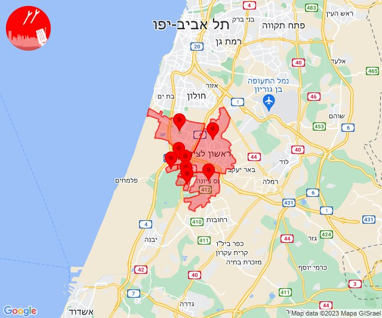

## 17:54

🔴 צבע אדום (25/10/2023):

20:54:
• עוטף עזה: ארז (15 שניות)

צופר - צבע אדום

## 17:54

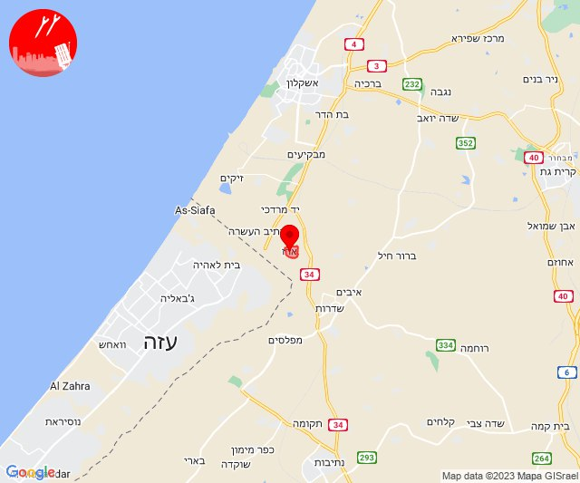

## 18:07

🔴 צבע אדום (25/10/2023):

21:07:
• עוטף עזה: זיקים, נתיב העשרה (15 שניות)

צופר - צבע אדום

## 18:07

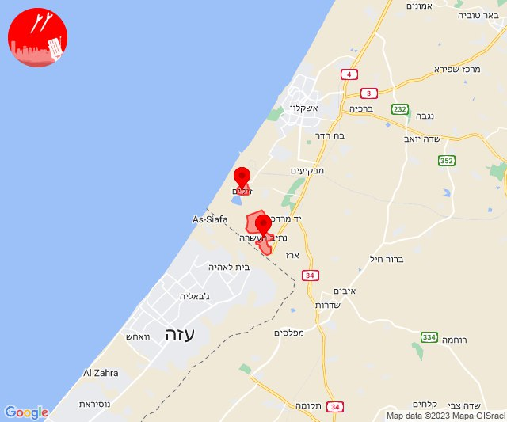

## 18:32

🔴 צבע אדום (25/10/2023):

21:30:
• דן: אזור, חולון, בת-ים (דקה וחצי)
• השפלה: ראשון לציון - מזרח, ראשון לציון - מערב, משמר השבעה, גנות (דקה וחצי)

21:31:
• דן: גבעת השלושה, כפר סירקין, פתח תקווה (דקה וחצי)
• ירקון: אלעד, מזור, נחלים, נחשונים, עינת, ראש העין, תעשיון חצב, אזור תעשייה אפק ולב הארץ (דקה וחצי)

21:32:
• מערב לכיש: באר גנים, כפר סילבר (30 שניות)

צופר - צבע אדום

## 18:32

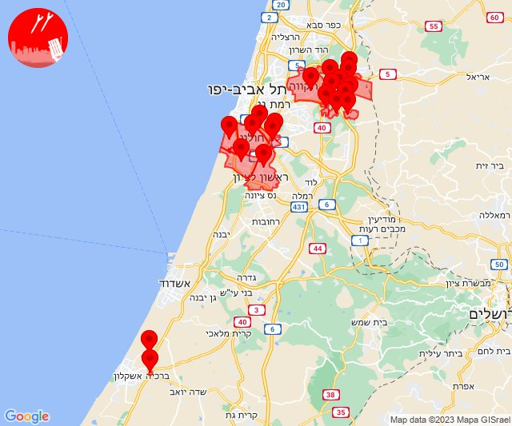

## 18:59

🔴 צבע אדום (25/10/2023):

21:58:
• לכיש: אשדוד - ח,ט,י,יג,יד,טז, אשדוד - יא,יב,טו,יז,מרינה,סיטי (45 שניות)

21:59:
• מערב לכיש: ניצן (45 שניות)

צופר - צבע אדום

## 18:59

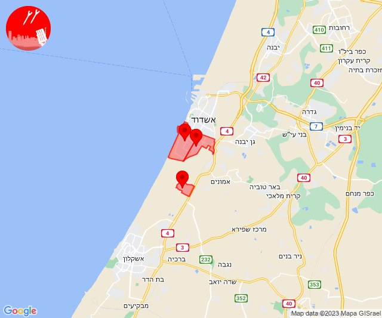

