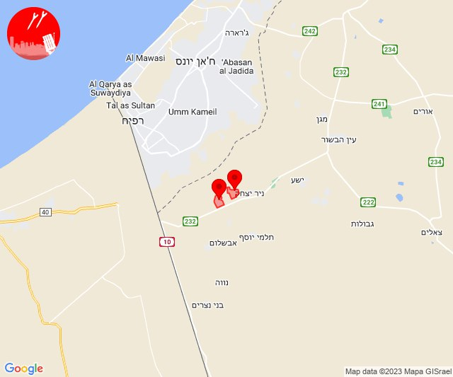

# Alerts for 2023-10-26

## 07:30

🔴 צבע אדום (26/10/2023):

10:30:
• עוטף עזה: כיסופים (15 שניות)

צופר - צבע אדום

## 07:30

## 07:34

🔴 צבע אדום (26/10/2023):

10:34:
• עוטף עזה: כיסופים, שדרות, איבים, ניר עם (15 שניות)

צופר - צבע אדום

## 07:34

## 07:37

🔴 צבע אדום (26/10/2023):

10:37:
• עוטף עזה: כפר עזה (15 שניות)

צופר - צבע אדום

## 07:37

## 08:50

🔴 צבע אדום (26/10/2023):

11:50:
• עוטף עזה: נירים (15 שניות)

צופר - צבע אדום

## 08:50

## 10:18

🔴 צבע אדום (26/10/2023):

13:18:
• עוטף עזה: כיסופים (15 שניות)

צופר - צבע אדום

## 10:18

## 10:31

🔴 צבע אדום (26/10/2023):

13:31:
• השפלה: ראשון לציון - מזרח, באר יעקב, נס ציונה, כפר חב''ד, צפריה, פארק תעשיות פלמחים, ראשון לציון - מערב, רחובות, אירוס, בית חנן, בית עובד, גן שורק, נטעים, עיינות, בית דגן, חמד, משמר השבעה, גנות (דקה וחצי)
• דן: תל אביב - דרום העיר ויפו, תל אביב - מזרח, אזור, בת-ים, חולון, מקווה ישראל, תל אביב - עבר הירקון, אור יהודה, בני ברק, גבעת שמואל, גבעתיים, גת רימון, יהוד-מונוסון, מעש, סביון, פתח תקווה, קריית אונו, רמת גן - מזרח, רמת גן - מערב, גני תקווה (דקה וחצי)
• לכיש: פלמחים (דקה וחצי)
• שרון: גני עם, ירקונה, עדנים, מרכז אזורי דרום השרון, הוד השרון (דקה וחצי)

צופר - צבע אדום

## 10:31

## 11:14

🔴 צבע אדום (26/10/2023):

14:14:
• עוטף עזה: כיסופים (15 שניות)

צופר - צבע אדום

## 11:14

## 11:21

🔴 צבע אדום (26/10/2023):

14:21:
• עוטף עזה: נירים (15 שניות)

צופר - צבע אדום

## 11:21

## 11:54

🔴 צבע אדום (26/10/2023):

14:54:
• עוטף עזה: כרם שלום (15 שניות)

צופר - צבע אדום

## 11:54

## 12:06

🔴 צבע אדום (26/10/2023):

15:06:
• עוטף עזה: כרם שלום (15 שניות)

צופר - צבע אדום

## 12:06

## 12:28

🔴 צבע אדום (26/10/2023):

15:28:
• עוטף עזה: עין השלושה (15 שניות)

צופר - צבע אדום

## 12:28

## 13:01

🔴 צבע אדום (26/10/2023):

16:00:
• מערב לכיש: אזור תעשייה הדרומי אשקלון, אשקלון - דרום, אשקלון - צפון (30 שניות)
• מערב הנגב: יושיביה, שיבולים, נתיבות, מעגלים, גבעולים, מלילות (15 שניות, 30 שניות)
• עוטף עזה: זיקים (15 שניות)
• לכיש: אשדוד - א,ב,ד,ה, אשדוד - יא,יב,טו,יז,מרינה,סיטי (45 שניות)

16:01:
• לכיש: אשדוד - ח,ט,י,יג,יד,טז, אשדוד - אזור תעשייה צפוני ונמל (45 שניות)

צופר - צבע אדום

## 13:01

## 13:14

🔴 צבע אדום (26/10/2023):

16:14:
• עוטף עזה: זיקים (15 שניות)
• מערב לכיש: אשקלון - דרום, אזור תעשייה הדרומי אשקלון, אשקלון - צפון (30 שניות)

צופר - צבע אדום

## 13:14

## 15:05

🔴 צבע אדום (26/10/2023):

18:03:
• דן: תל אביב - דרום העיר ויפו, תל אביב - מזרח, תל אביב - מרכז העיר, תל אביב - עבר הירקון, בת-ים, גבעתיים, הרצליה - מרכז וגליל ים, חולון, מקווה ישראל, רמת גן - מערב, רמת השרון, סינמה סיטי גלילות, מתחם פי גלילות (דקה וחצי)
• לכיש: פלמחים (דקה וחצי)
• השפלה: ראשון לציון - מערב (דקה וחצי)

18:04:
• השפלה: בית דגן, חמד, משמר השבעה, גנות, ראשון לציון - מזרח, צפריה (דקה וחצי)
• דן: אור יהודה, סביון, קריית אונו, רמת גן - מזרח, יהוד-מונוסון, גני תקווה, אזור (דקה וחצי)

18:05:
• השפלה: כפר חב''ד (דקה וחצי)

צופר - צבע אדום

## 15:05

## 15:08

🔴 צבע אדום (26/10/2023):

18:08:
• עוטף עזה: חולית, סופה (15 שניות)

צופר - צבע אדום

## 15:08

## 19:02

🔴 צבע אדום (26/10/2023):

22:01:
• ירקון: אזור תעשייה חבל מודיעין, בית נחמיה, בית עריף, ברקת, כפר טרומן, שהם (דקה וחצי)
• השפלה: רחובות, ישרש, מצליח, רמלה, סתריה, ראשון לציון - מזרח, בית דגן, חמד, משמר השבעה, גנות, כפר חב''ד, צפריה (דקה וחצי)
• דן: אור יהודה, אזור, חולון, תל אביב - מזרח, בני ברק, גבעתיים, רמת גן - מערב, גבעת שמואל, פתח תקווה, קריית אונו, רמת גן - מזרח (דקה וחצי)

22:02:
• השפלה: אזור תעשייה נשר - רמלה, אחיסמך, בן שמן, גינתון, לוד, ניר צבי, ראשון לציון - מערב, פארק תעשיות פלמחים (דקה וחצי)
• דן: תל אביב - דרום העיר ויפו, מקווה ישראל (דקה וחצי)

צופר - צבע אדום

## 19:02

## 23:51

🔴 צבע אדום (27/10/2023):

02:51:
• עוטף עזה: בארי (15 שניות)

צופר - צבע אדום

## 23:51

