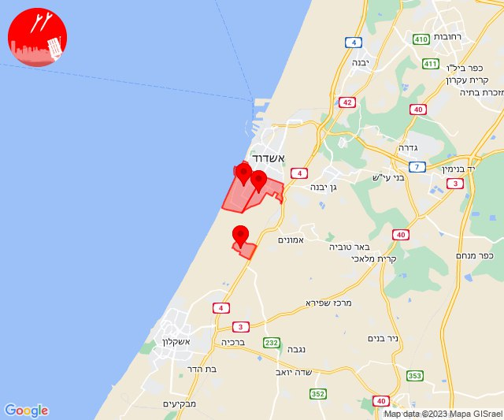

# Alerts for 2023-10-27

## 09:44

🔴 צבע אדום (27/10/2023):

12:43:
• עוטף עזה: כיסופים (15 שניות)

12:44:
• עוטף עזה: כרם שלום (15 שניות)

צופר - צבע אדום

## 09:44

## 10:42

🔴 צבע אדום (27/10/2023):

13:42:
• לכיש: אשדוד - ח,ט,י,יג,יד,טז, אשדוד - יא,יב,טו,יז,מרינה,סיטי (45 שניות)
• מערב לכיש: ניצן (45 שניות)

צופר - צבע אדום

## 10:42

## 11:04

🔴 צבע אדום (27/10/2023):

14:02:
• עוטף עזה: נתיב העשרה (15 שניות)
• דן: תל אביב - דרום העיר ויפו, תל אביב - מזרח, תל אביב - מרכז העיר, תל אביב - עבר הירקון, גבעתיים, רמת גן - מערב, חולון, בני ברק (דקה וחצי)
• השפלה: ראשון לציון - מערב (דקה וחצי)

14:03:
• דן: בת-ים (דקה וחצי)
• עוטף עזה: זיקים, כרמיה (15 שניות)

14:04:
• דן: אזור, מקווה ישראל (דקה וחצי)

צופר - צבע אדום

## 11:04

## 11:31

🔴 צבע אדום (27/10/2023):

14:30:
• עוטף עזה: עלומים, נחל עוז (15 שניות)
• השפלה: ראשון לציון - מזרח, רחובות, נס ציונה, אירוס, בית עובד, עיינות (דקה וחצי)
• דן: תל אביב - מרכז העיר, תל אביב - עבר הירקון, גבעת שמואל, גת רימון, סביון, פתח תקווה, קריית אונו, רמת גן - מזרח, גני תקווה, תל אביב - דרום העיר ויפו (דקה וחצי)
• לכיש: אשדוד - אזור תעשייה צפוני ונמל (45 שניות)

14:31:
• דן: אור יהודה, אזור, חולון (דקה וחצי)
• השפלה: בית דגן, חמד, משמר השבעה, גנות (דקה וחצי)

צופר - צבע אדום

## 11:31

## 13:19

🔴 צבע אדום (27/10/2023):

16:19:
• מערב לכיש: אשקלון - דרום, אזור תעשייה הדרומי אשקלון, אשקלון - צפון, באר גנים, אזור תעשייה צפוני אשקלון, כפר סילבר, ניצנים, ניצן, מבקיעים (30 שניות, 45 שניות)
• לכיש: אשדוד - ח,ט,י,יג,יד,טז, אשדוד - יא,יב,טו,יז,מרינה,סיטי, אשדוד - א,ב,ד,ה, אשדוד - ג,ו,ז (45 שניות)

צופר - צבע אדום

