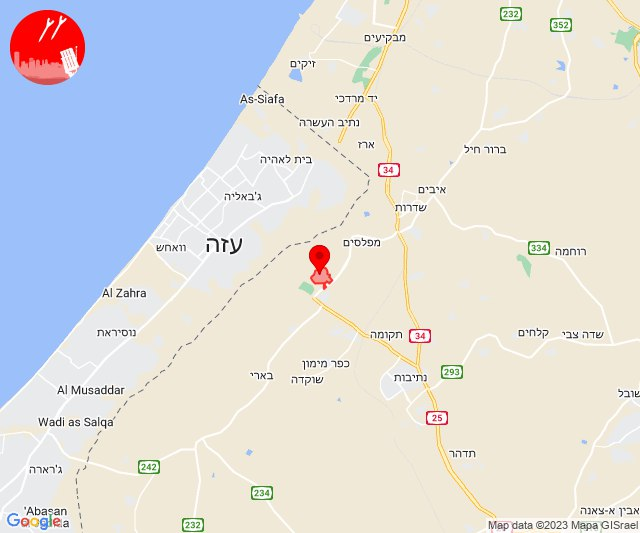

# Alerts for 2023-10-27

## 09:44

🔴 צבע אדום (27/10/2023):

12:43:
• עוטף עזה: כיסופים (15 שניות)

12:44:
• עוטף עזה: כרם שלום (15 שניות)

צופר - צבע אדום

## 09:44

## 10:42

🔴 צבע אדום (27/10/2023):

13:42:
• לכיש: אשדוד - ח,ט,י,יג,יד,טז, אשדוד - יא,יב,טו,יז,מרינה,סיטי (45 שניות)
• מערב לכיש: ניצן (45 שניות)

צופר - צבע אדום

## 10:42

## 11:04

🔴 צבע אדום (27/10/2023):

14:02:
• עוטף עזה: נתיב העשרה (15 שניות)
• דן: תל אביב - דרום העיר ויפו, תל אביב - מזרח, תל אביב - מרכז העיר, תל אביב - עבר הירקון, גבעתיים, רמת גן - מערב, חולון, בני ברק (דקה וחצי)
• השפלה: ראשון לציון - מערב (דקה וחצי)

14:03:
• דן: בת-ים (דקה וחצי)
• עוטף עזה: זיקים, כרמיה (15 שניות)

14:04:
• דן: אזור, מקווה ישראל (דקה וחצי)

צופר - צבע אדום

## 11:04

## 11:31

🔴 צבע אדום (27/10/2023):

14:30:
• עוטף עזה: עלומים, נחל עוז (15 שניות)
• השפלה: ראשון לציון - מזרח, רחובות, נס ציונה, אירוס, בית עובד, עיינות (דקה וחצי)
• דן: תל אביב - מרכז העיר, תל אביב - עבר הירקון, גבעת שמואל, גת רימון, סביון, פתח תקווה, קריית אונו, רמת גן - מזרח, גני תקווה, תל אביב - דרום העיר ויפו (דקה וחצי)
• לכיש: אשדוד - אזור תעשייה צפוני ונמל (45 שניות)

14:31:
• דן: אור יהודה, אזור, חולון (דקה וחצי)
• השפלה: בית דגן, חמד, משמר השבעה, גנות (דקה וחצי)

צופר - צבע אדום

## 11:31

## 13:19

🔴 צבע אדום (27/10/2023):

16:19:
• מערב לכיש: אשקלון - דרום, אזור תעשייה הדרומי אשקלון, אשקלון - צפון, באר גנים, אזור תעשייה צפוני אשקלון, כפר סילבר, ניצנים, ניצן, מבקיעים (30 שניות, 45 שניות)
• לכיש: אשדוד - ח,ט,י,יג,יד,טז, אשדוד - יא,יב,טו,יז,מרינה,סיטי, אשדוד - א,ב,ד,ה, אשדוד - ג,ו,ז (45 שניות)

צופר - צבע אדום

## 13:19

## 13:56

🔴 צבע אדום (27/10/2023):

16:56:
• עוטף עזה: נתיב העשרה (15 שניות)

צופר - צבע אדום

## 13:56

## 13:59

מערכת ״צופר״ מפעילה גל שקט במהלך השבת

לקראת השבת אנו מתזכרים אתכם ואת שומרי השבת, באפליקציית ״צופר״ ניתן להפעיל חיווי קולי - הקראה של שמות היישובים, ובכך להשתמש כ-״גל שקט״ ולהתעדכן גם מבלי לגעת בטלפון במהלך השבת.

החיווי הקולי קיים במספר פלטפורמות:
• אפליקציית צופר לאנדרואיד
• תוסף צופר לכרום
• אתר אינטרנט - (www.tzevaadom.co.il)

הודעות מערכת עבור משתמשי האנדרואיד:
אנו ממליצים לבטל אופטימיזציה של סוללה עבור האפליקציה בכדי להבטיח פעילות מיטבית של החיווי הקולי ועבור קבלת ההתרעות במיידיות.

משתמשי אנדרואיד 14 שחוו בעיות עליכם לעדכן את האפליקציה - עדכון חדש פורסם בחנות.

למידע נוסף ופלטפורמות נוספות:
www.tzevaadom.co.il/systems

איתכם בכל זמן,
מערכת צופר

## 15:02

🔴 צבע אדום (27/10/2023):

18:01:
• עוטף עזה: סופה (15 שניות)

18:02:
• עוטף עזה: ניר יצחק (15 שניות)

צופר - צבע אדום

## 15:02

## 16:32

🔴 צבע אדום (27/10/2023):

19:30:
• השפלה: אחיעזר, כפר חב''ד, צפריה, זיתן, יגל, חמד, משמר השבעה, גנות, ראשון לציון - מזרח (דקה וחצי)
• דן: אור יהודה, אזור, רמת גן - מזרח, רמת גן - מערב, יהוד-מונוסון, חולון (דקה וחצי)
• ירקון: חשמונאים, כפר רות, לפיד, מודיעין עילית, מודיעין, מתתיהו, שילת, כפר האורנים (דקה וחצי)

19:31:
• לכיש: אשדוד - א,ב,ד,ה, אשדוד - אזור תעשייה צפוני ונמל, אשדוד - ג,ו,ז, בני דרום, ניר גלים (45 שניות)
• דן: גני תקווה, גת רימון, מעש, סביון, קריית אונו (דקה וחצי)
• מערב לכיש: אזור תעשייה הדרומי אשקלון, אשקלון - דרום, מבקיעים (30 שניות)
• ירקון: נוף איילון, שעלבים, מודיעין - ישפרו סנטר (דקה וחצי)
• השפלה: כפר בן נון, כפר שמואל, משמר איילון (דקה וחצי)

19:32:
• השפלה: בית דגן (דקה וחצי)

צופר - צבע אדום

## 16:32

## 16:51

🔴 צבע אדום (27/10/2023):

19:51:
• עוטף עזה: חולית (15 שניות)

צופר - צבע אדום

## 16:51

## 17:49

🔴 צבע אדום (27/10/2023):

20:49:
• מערב לכיש: מבקיעים, אזור תעשייה הדרומי אשקלון, גיאה, אשקלון - דרום (30 שניות)
• עוטף עזה: נתיב העשרה, כרמיה, יד מרדכי (15 שניות)

צופר - צבע אדום

## 17:49

## 18:00

🔴 צבע אדום (27/10/2023):

20:59:
• עוטף עזה: שדרות, איבים, ניר עם, מטווח ניר עם, גבים, מכללת ספיר, מפלסים (15 שניות)

21:00:
• מערב לכיש: אשקלון - דרום, אזור תעשייה הדרומי אשקלון (30 שניות)

צופר - צבע אדום

## 18:00

## 18:03

🔴 צבע אדום (27/10/2023):

21:03:
• עוטף עזה: כפר עזה (15 שניות)

צופר - צבע אדום

## 18:03

## 18:09

🔴 צבע אדום (27/10/2023):

21:09:
• עוטף עזה: נתיב העשרה (15 שניות)

צופר - צבע אדום

## 18:09

## 22:55

🔴 צבע אדום (28/10/2023):

01:55:
• עוטף עזה: נתיב העשרה (15 שניות)

צופר - צבע אדום

## 22:55

