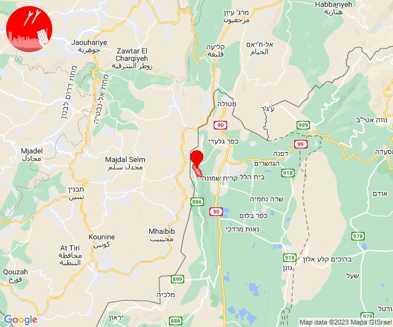

# Alerts for 2023-10-28

## 07:20

🔴 צבע אדום (28/10/2023):

10:20:
• עוטף עזה: ניר עוז (15 שניות)

צופר - צבע אדום

## 07:20

## 07:35

🔴 צבע אדום (28/10/2023):

10:35:
• עוטף עזה: נחל עוז (15 שניות)

צופר - צבע אדום

## 07:35

## 07:47

🔴 צבע אדום (28/10/2023):

10:47:
• עוטף עזה: מגן (15 שניות)

צופר - צבע אדום

## 07:47

## 08:32

🔴 צבע אדום (28/10/2023):

11:32:
• עוטף עזה: כיסופים (15 שניות)

צופר - צבע אדום

## 08:32

## 08:48

🔴 צבע אדום (28/10/2023):

11:48:
• עוטף עזה: נתיב העשרה (15 שניות)

צופר - צבע אדום

## 08:48

## 10:00

🔴 צבע אדום (28/10/2023):

12:59:
• עוטף עזה: יד מרדכי, נתיב העשרה (15 שניות)
• מערב לכיש: אזור תעשייה הדרומי אשקלון (30 שניות)

13:00:
• עוטף עזה: זיקים (15 שניות)

צופר - צבע אדום

## 10:00

## 10:02

🔴 צבע אדום (28/10/2023):

13:02:
• עוטף עזה: יד מרדכי, נתיב העשרה, כרמיה (15 שניות)

צופר - צבע אדום

## 10:02

## 10:06

🔴 צבע אדום (28/10/2023):

13:06:
• עוטף עזה: ניר יצחק, סופה, פרי גן (15 שניות)

צופר - צבע אדום

## 10:06

## 10:44

🔴 צבע אדום (28/10/2023):

13:44:
• עוטף עזה: נתיב העשרה (15 שניות)

צופר - צבע אדום

## 10:44

## 11:01

🔴 צבע אדום (28/10/2023):

14:01:
• דן: תל אביב - דרום העיר ויפו, בת-ים (דקה וחצי)

צופר - צבע אדום

## 11:01

## 11:30

🔴 צבע אדום (28/10/2023):

14:30:
• קו העימות: משגב עם, מרגליות (מיידי)

צופר - צבע אדום

## 11:30

## 11:38

🔴 צבע אדום (28/10/2023):

14:38:
• קו העימות: ערב אל עראמשה (מיידי)

צופר - צבע אדום

## 11:38

## 11:41

🔴 צבע אדום (28/10/2023):

14:41:
• קו העימות: ערב אל עראמשה (מיידי)

צופר - צבע אדום

## 11:41

## 11:44

🔴 צבע אדום (28/10/2023):

14:44:
• עוטף עזה: כיסופים (15 שניות)

צופר - צבע אדום

## 11:44

## 12:00

🔴 צבע אדום (28/10/2023):

15:00:
• עוטף עזה: רעים (15 שניות)

צופר - צבע אדום

## 12:00

## 12:04

🔴 צבע אדום (28/10/2023):

15:04:
• מרכז הנגב: באר שבע - מערב, באר שבע - דרום (דקה)

צופר - צבע אדום

## 12:04

## 12:12

🔴 צבע אדום (28/10/2023):

15:12:
• מערב לכיש: אזור תעשייה הדרומי אשקלון, אשקלון - דרום, אזור תעשייה צפוני אשקלון, בית שקמה, בת הדר, מבקיעים, גיאה, משען, אשקלון - צפון (30 שניות)

צופר - צבע אדום

## 12:12

## 14:18

🔴 צבע אדום (28/10/2023):

17:15:
• דרום הנגב: אבו קרינאת והפזורה, קצר-א-סיר והפזורה, ערערה בנגב (דקה וחצי)

17:16:
• דרום הנגב: אבו-תלול והפזורה, ממשית (דקה וחצי)

17:18:
• עוטף עזה: נתיב העשרה (15 שניות)

צופר - צבע אדום

## 14:18

## 14:23

🔴 צבע אדום (28/10/2023):

17:22:
• עוטף עזה: נתיב העשרה (15 שניות)

17:23:
• עוטף עזה: ארז (15 שניות)

צופר - צבע אדום

## 14:23

## 15:02

🔴 צבע אדום (28/10/2023):

18:02:
• קו העימות: שתולה (מיידי)

צופר - צבע אדום

## 15:02

## 15:11

🔴 צבע אדום (28/10/2023):

18:10:
• מערב לכיש: אשקלון - דרום, אזור תעשייה הדרומי אשקלון (30 שניות)
• עוטף עזה: זיקים (15 שניות)
• ירקון: בני עטרות, בארות יצחק, מזור, נופך, נחלים, רינתיה, עינת, ראש העין, אזור תעשייה אפק ולב הארץ, אלעד, נחשונים, תעשיון חצב (דקה וחצי)
• השפלה: אחיעזר, זיתן, יגל, ראשון לציון - מזרח, בית דגן, חמד, משמר השבעה, גנות, כפר חב''ד, צפריה (דקה וחצי)
• דן: אור יהודה, רמת גן - מזרח, תל אביב - דרום העיר ויפו, תל אביב - מרכז העיר, גבעתיים, מקווה ישראל, תל אביב - מזרח, אזור, חולון, רמת גן - מערב, גת רימון, יהוד-מונוסון, כפר סירקין, מעש, סביון, פתח תקווה, קריית אונו, גני תקווה, מגשימים, גבעת השלושה, בני ברק, גבעת שמואל (דקה וחצי)
• שרון: אורנית, ג'לג'וליה, חורשים, ירחיב, מתן, נירית, אלפי מנשה, צופים, חגור, כפר ברא, כפר קאסם, נווה ירק, תחנת רכבת ראש העין (דקה וחצי)

18:11:
• דן: בת-ים (דקה וחצי)
• השפלה: פארק תעשיות פלמחים, ראשון לציון - מערב, אירוס, בית חנן, גן שורק, נטעים, נס ציונה (דקה וחצי)

צופר - צבע אדום

## 15:11

## 15:22

🔴 צבע אדום (28/10/2023):

18:22:
• עוטף עזה: זיקים (15 שניות)

צופר - צבע אדום

## 15:22

## 15:47

🔴 צבע אדום (28/10/2023):

18:47:
• עוטף עזה: בארי (15 שניות)

צופר - צבע אדום

## 15:47

## 16:01

🔴 צבע אדום (28/10/2023):

19:01:
• השפלה: נצר סרני, ראשון לציון - מזרח, רחובות, באר יעקב, נס ציונה, אחיעזר, בית דגן, חמד, יגל, כפר חב''ד, צפריה, משמר השבעה, גנות, פארק תעשיות פלמחים, ראשון לציון - מערב, גן שורק, נטעים (דקה וחצי)
• דן: אור יהודה, יהוד-מונוסון, חולון, אזור (דקה וחצי)

צופר - צבע אדום

## 16:01

## 16:17

🔴 צבע אדום (28/10/2023):

19:17:
• קו העימות: מרגליות (מיידי)

צופר - צבע אדום

## 16:17

## 18:00

🔴 צבע אדום (28/10/2023):

20:59:
• השפלה: גאליה, גן שורק, רחובות, בית עובד, נס ציונה, עיינות (דקה, דקה וחצי)
• לכיש: כפר הנגיד (דקה)

21:00:
• לכיש: יבנה, בן זכאי, מעון צופיה (דקה)
• מערב לכיש: אשקלון - דרום, אזור תעשייה הדרומי אשקלון (30 שניות)

צופר - צבע אדום

## 18:00

## 18:13

🔴 צבע אדום (28/10/2023):

21:12:
• עוטף עזה: מבטחים, עמיעוז, ישע, שדה ניצן (15 שניות)

21:13:
• עוטף עזה: צוחר, אוהד (15 שניות)

צופר - צבע אדום

## 18:13

## 19:03

🔴 צבע אדום (28/10/2023):

22:03:
• לכיש: אשדוד - יא,יב,טו,יז,מרינה,סיטי, אשדוד - א,ב,ד,ה, אשדוד - ג,ו,ז, אשדוד - ח,ט,י,יג,יד,טז, בית עזרא (45 שניות)
• מערב לכיש: ניצן, אזור תעשייה צפוני אשקלון, אשקלון - דרום, אשקלון - צפון, באר גנים, כפר סילבר (45 שניות, 30 שניות)

צופר - צבע אדום

## 19:03

## 19:59

🔴 צבע אדום (28/10/2023):

22:59:
• מערב לכיש: אזור תעשייה הדרומי אשקלון, אשקלון - דרום (30 שניות)

צופר - צבע אדום

## 19:59

