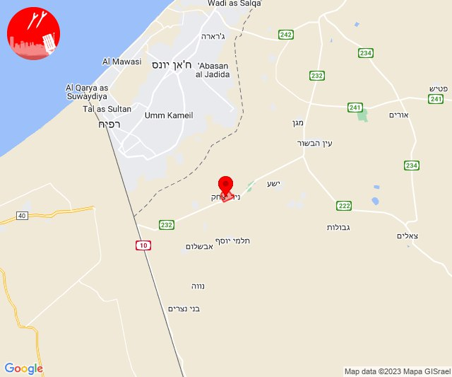

# Alerts for 2023-10-29

## 04:27

🔴 צבע אדום (29/10/2023):

06:27:
• עוטף עזה: נתיב העשרה (15 שניות)

צופר - צבע אדום

## 04:27

## 07:59

🔴 צבע אדום (29/10/2023):

09:59:
• עוטף עזה: ניר עוז (15 שניות)

צופר - צבע אדום

## 07:59

## 08:02

🔴 צבע אדום (29/10/2023):

10:02:
• עוטף עזה: מגן (15 שניות)

צופר - צבע אדום

## 08:02

## 08:05

🔴 צבע אדום (29/10/2023):

10:04:
• עוטף עזה: ניר עוז, נירים (15 שניות)

צופר - צבע אדום

## 08:05

## 08:06

🔴 צבע אדום (29/10/2023):

10:06:
• עוטף עזה: נחל עוז (15 שניות)

צופר - צבע אדום

## 08:06

## 08:14

🔴 צבע אדום (29/10/2023):

10:14:
• עוטף עזה: נחל עוז (15 שניות)

צופר - צבע אדום

## 08:14

## 08:31

🔴 צבע אדום (29/10/2023):

10:31:
• עוטף עזה: ניר יצחק (15 שניות)

צופר - צבע אדום

## 08:31

## 08:59

🔴 צבע אדום (29/10/2023):

10:59:
• עוטף עזה: נירים (15 שניות)

צופר - צבע אדום

## 08:59

## 10:03

🔴 צבע אדום (29/10/2023):

12:00:
• שרון: גבעת חן, רעננה, הוד השרון, כפר מל''ל, כפר סבא, רמות השבים (דקה וחצי)
• דן: הרצליה - מרכז וגליל ים (דקה וחצי)

12:01:
• דן: חולון (דקה וחצי)
• השפלה: ראשון לציון - מזרח, ראשון לציון - מערב, משמר השבעה (דקה וחצי)

12:02:
• דן: תל אביב - עבר הירקון, רמת השרון (דקה וחצי)

12:03:
• השפלה: גן שורק, נטעים, פארק תעשיות פלמחים (דקה וחצי)

צופר - צבע אדום

## 10:03

## 11:26

🔴 צבע אדום (29/10/2023):

13:26:
• עוטף עזה: נתיב העשרה (15 שניות)

צופר - צבע אדום

## 11:26

## 11:31

🔴 צבע אדום (29/10/2023):

13:31:
• עוטף עזה: כפר עזה (15 שניות)

צופר - צבע אדום

## 11:31

## 12:30

🔴 צבע אדום (29/10/2023):

14:30:
• עוטף עזה: נירים, עין השלושה (15 שניות)
• מערב הנגב: פטיש (30 שניות)

צופר - צבע אדום

## 12:30

## 12:42

🔴 צבע אדום (29/10/2023):

14:42:
• עוטף עזה: נתיב העשרה (15 שניות)

צופר - צבע אדום

## 12:42

## 12:45

🔴 צבע אדום (29/10/2023):

14:45:
• עוטף עזה: נתיב העשרה (15 שניות)

צופר - צבע אדום

## 12:45

## 12:50

🔴 צבע אדום (29/10/2023):

14:50:
• עוטף עזה: נתיב העשרה (15 שניות)

צופר - צבע אדום

## 12:50

## 12:54

🔴 צבע אדום (29/10/2023):

14:54:
• עוטף עזה: נתיב העשרה (15 שניות)

צופר - צבע אדום

## 12:54

## 14:05

🔴 צבע אדום (29/10/2023):

16:05:
• עוטף עזה: סופה (15 שניות)

צופר - צבע אדום

## 14:05

## 14:54

🔴 צבע אדום (29/10/2023):

16:53:
• גליל עליון: טובא זנגריה (30 שניות)

16:54:
• גליל עליון: אזור תעשייה חצור הגלילית, אזור תעשייה צ.ח.ר, כפר הנשיא, מחניים, מנחת מחניים, משמר הירדן, ראש פינה, איילת השחר, חצור הגלילית (30 שניות)

צופר - צבע אדום

## 14:54

## 15:04

🔴 צבע אדום (29/10/2023):

17:04:
• עוטף עזה: בארי (15 שניות)

צופר - צבע אדום

## 15:04

## 15:32

🔴 צבע אדום (29/10/2023):

17:32:
• קו העימות: קריית שמונה (מיידי)

צופר - צבע אדום

## 15:32

## 16:13

🔴 צבע אדום (29/10/2023):

18:13:
• קו העימות: בצת, שלומי, מצובה (מיידי)

צופר - צבע אדום

## 16:13

## 16:15

🔴 צבע אדום (29/10/2023):

18:15:
• קו העימות: אזור תעשייה אכזיב מילואות, לימן, גשר הזיו, נהריה (מיידי, 15 שניות)

צופר - צבע אדום

## 16:15

## 16:23

🔴 צבע אדום (29/10/2023):

18:23:
• עוטף עזה: נירים, עין השלושה (15 שניות)

צופר - צבע אדום

## 16:23

## 16:45

🔴 צבע אדום (29/10/2023):

18:45:
• עוטף עזה: כיסופים (15 שניות)

צופר - צבע אדום

## 16:46

## 17:31

🔴 צבע אדום (29/10/2023):

19:31:
• עוטף עזה: ארז (15 שניות)

צופר - צבע אדום

## 17:31

## 18:05

🔴 צבע אדום (29/10/2023):

20:05:
• עוטף עזה: מטווח ניר עם, שדרות, איבים, ניר עם (15 שניות)

צופר - צבע אדום

## 18:05

## 18:19

🔴 צבע אדום (29/10/2023):

20:19:
• עוטף עזה: נירים, זיקים (15 שניות)

צופר - צבע אדום

## 18:19

## 18:51

🔴 צבע אדום (29/10/2023):

20:51:
• עוטף עזה: זיקים (15 שניות)

צופר - צבע אדום

## 18:51

## 18:54

🔴 צבע אדום (29/10/2023):

20:54:
• עוטף עזה: נתיב העשרה (15 שניות)

צופר - צבע אדום

## 18:54

## 20:11

🔴 צבע אדום (29/10/2023):

22:11:
• עוטף עזה: נירים (15 שניות)

צופר - צבע אדום

## 20:11

## 20:15

🔴 צבע אדום (29/10/2023):

22:15:
• עוטף עזה: נירים (15 שניות)

צופר - צבע אדום

## 20:15

## 20:18

🔴 צבע אדום (29/10/2023):

22:18:
• עוטף עזה: נירים (15 שניות)

צופר - צבע אדום

## 20:18

## 20:25

🔴 צבע אדום (29/10/2023):

22:25:
• עוטף עזה: נירים (15 שניות)

צופר - צבע אדום

## 20:25

## 20:29

🔴 צבע אדום (29/10/2023):

22:29:
• עוטף עזה: נירים (15 שניות)

צופר - צבע אדום

## 20:29

## 21:45

🔴 צבע אדום (29/10/2023):

23:45:
• עוטף עזה: כיסופים (15 שניות)

צופר - צבע אדום

## 21:45

## 21:48

🔴 צבע אדום (29/10/2023):

23:48:
• עוטף עזה: כיסופים (15 שניות)

צופר - צבע אדום

## 21:48

## 22:59

🔴 צבע אדום (30/10/2023):

00:59:
• עוטף עזה: שדרות, איבים, ניר עם (15 שניות)

צופר - צבע אדום

## 22:59

