# Alerts for 2023-10-30

## 02:42

🔴 צבע אדום (30/10/2023):

04:42:
• עוטף עזה: נתיב העשרה (15 שניות)

צופר - צבע אדום

## 02:42

## 06:50

🔴 צבע אדום (30/10/2023):

08:49:
• מערב הנגב: בית הגדי, נתיבות, אזור תעשייה נ.ע.מ, מעגלים, גבעולים, מלילות, שרשרת, שיבולים (30 שניות)
• עוטף עזה: נחל עוז, זמרת, שובה, כפר מימון ותושיה, תקומה, חוות יזרעם, עלומים (15 שניות)

08:50:
• עוטף עזה: שוקדה (15 שניות)

צופר - צבע אדום

## 06:50

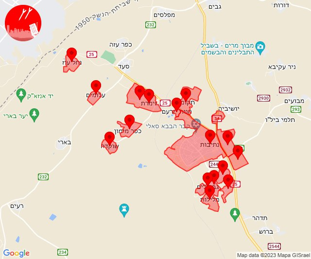

## 08:24

🔴 צבע אדום (30/10/2023):

10:24:
• עוטף עזה: נירים (15 שניות)

צופר - צבע אדום

## 08:24

## 08:51

🔴 צבע אדום (30/10/2023):

10:51:
• עוטף עזה: כיסופים (15 שניות)

צופר - צבע אדום

## 08:51

## 09:26

🔴 צבע אדום (30/10/2023):

11:24:
• מערב לכיש: אזור תעשייה הדרומי אשקלון (30 שניות)
• עוטף עזה: כרמיה (15 שניות)
• לכיש: אשדוד - א,ב,ד,ה, אשדוד - אזור תעשייה צפוני ונמל (45 שניות)

11:25:
• לכיש: אשדוד - ח,ט,י,יג,יד,טז, אשדוד - יא,יב,טו,יז,מרינה,סיטי, בני דרום, אשדוד - ג,ו,ז, ניר גלים, גן הדרום, שתולים, מתחם בני דרום (45 שניות, דקה)
• מערב לכיש: ניצן (45 שניות)

11:26:
• עוטף עזה: כיסופים (15 שניות)

צופר - צבע אדום

## 09:26

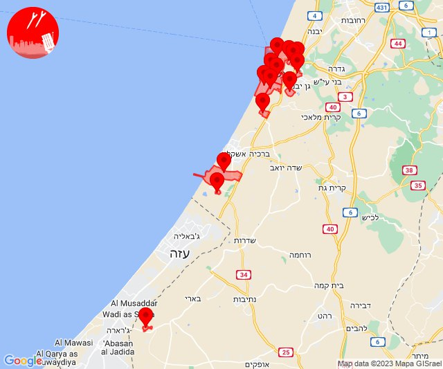

## 11:35

🔴 צבע אדום (30/10/2023):

13:35:
• עוטף עזה: נתיב העשרה (15 שניות)

צופר - צבע אדום

## 11:35

## 12:00

🔴 צבע אדום (30/10/2023):

14:00:
• מרכז הנגב: חצרים, באר שבע - דרום, באר שבע - מערב, אתר דודאים, באר שבע - מזרח, באר שבע - צפון (דקה, 45 שניות)
• מערב הנגב: אופקים (45 שניות)

צופר - צבע אדום

## 12:00

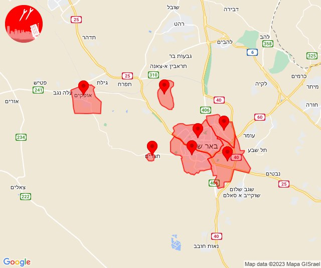

## 12:30

🔴 צבע אדום (30/10/2023):

14:29:
• שפלת יהודה: בית מאיר, נווה אילן, שורש (דקה וחצי)
• ירושלים: ירושלים - מערב, אבן ספיר, ירושלים - דרום, אורה, עמינדב (דקה וחצי)
• יהודה: אפרת, נווה דניאל (דקה וחצי)

14:30:
• שפלת יהודה: אזור תעשייה הר טוב - צרעה, אשתאול, מסילת ציון, נחם (דקה וחצי)

צופר - צבע אדום

## 12:30

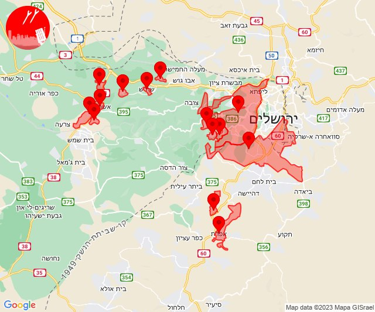

## 12:48

🔴 צבע אדום (30/10/2023):

14:48:
• עוטף עזה: נתיב העשרה (15 שניות)

צופר - צבע אדום

## 12:48

## 13:00

🔴 צבע אדום (30/10/2023):

15:00:
• קו העימות: בצת, חניתה, מצובה, ראש הנקרה, שלומי (מיידי)

צופר - צבע אדום

## 13:00

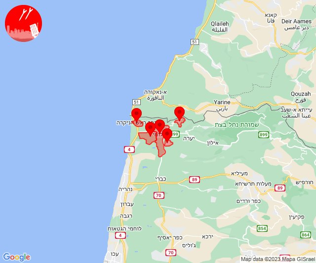

## 13:05

🔴 צבע אדום (30/10/2023):

15:03:
• קו העימות: אזור תעשייה אכזיב מילואות, בצת, לימן, ראש הנקרה, שלומי (מיידי)

15:04:
• עוטף עזה: אבשלום, יבול, שדה אברהם, שלומית, פרי גן (15 שניות, 30 שניות)

15:05:
• עוטף עזה: תלמי יוסף (15 שניות)

צופר - צבע אדום

## 13:05

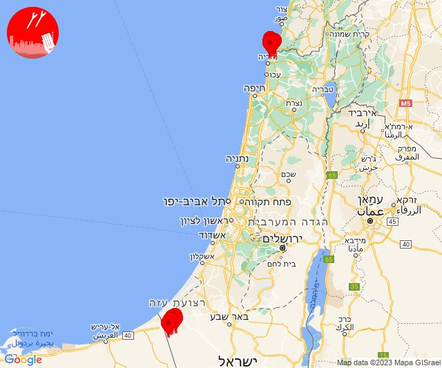

## 14:09

🔴 צבע אדום (30/10/2023):

16:09:
• קו העימות: אלקוש (מיידי)

צופר - צבע אדום

## 14:09

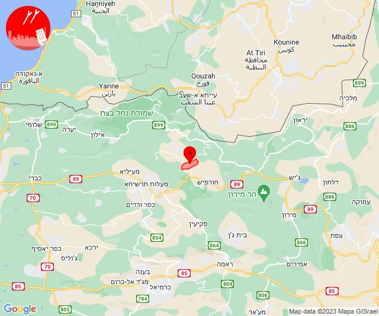

## 14:28

🔴 צבע אדום (30/10/2023):

16:28:
• עוטף עזה: רעים (15 שניות)

צופר - צבע אדום

## 14:28

## 15:09

🔴 צבע אדום (30/10/2023):

17:09:
• עוטף עזה: נירים (15 שניות)

צופר - צבע אדום

## 15:09

## 15:31

🔴 צבע אדום (30/10/2023):

17:30:
• השפלה: ראשון לציון - מזרח, בית דגן, משמר השבעה, חמד, לוד, ניר צבי, תעשיון צריפין, אחיעזר, זיתן, יגל (דקה וחצי)

17:31:
• השפלה: פארק תעשיות פלמחים, אירוס, בית חנן, בית עובד, גן שורק, נטעים, נס ציונה, עיינות (דקה וחצי)

צופר - צבע אדום

## 15:31

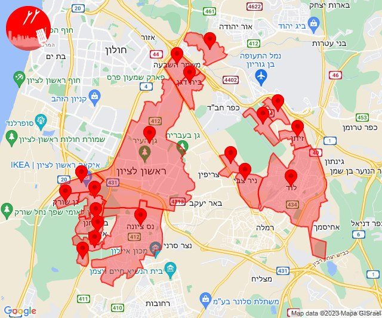

## 15:47

🔴 צבע אדום (30/10/2023):

17:47:
• עוטף עזה: כיסופים, עין השלושה (15 שניות)

צופר - צבע אדום

## 15:47

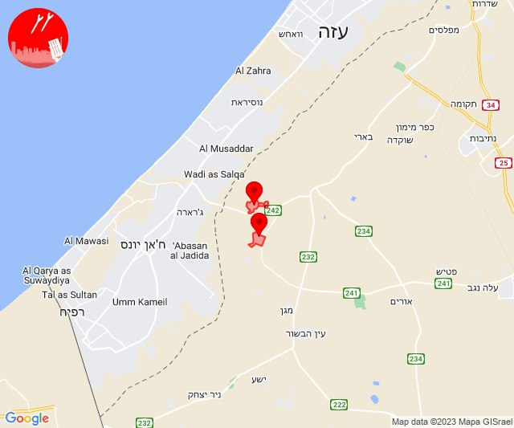

## 15:54

🔴 צבע אדום (30/10/2023):

17:54:
• עוטף עזה: נירים, עין השלושה (15 שניות)

צופר - צבע אדום

## 15:54

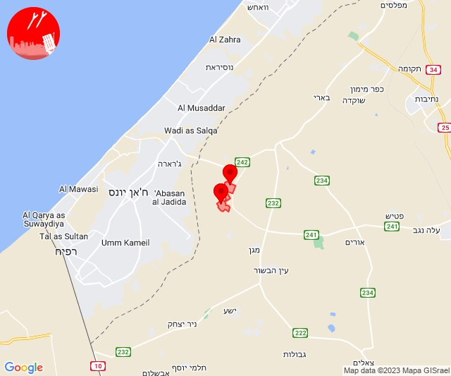

## 18:00

🔴 צבע אדום (30/10/2023):

19:59:
• מערב לכיש: אזור תעשייה הדרומי אשקלון, בית שקמה, בת הדר, גיאה (30 שניות)

20:00:
• מערב לכיש: אשקלון - דרום, מבקיעים (30 שניות)

צופר - צבע אדום

## 18:00

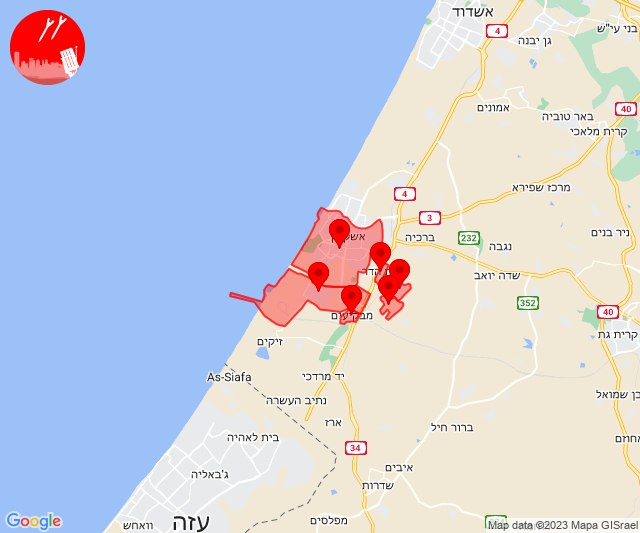

## 18:40

🔴 צבע אדום (30/10/2023):

20:40:
• עוטף עזה: נחל עוז (15 שניות)

צופר - צבע אדום

## 18:40

## 19:05

🔴 צבע אדום (30/10/2023):

21:05:
• עוטף עזה: שדרות, איבים, ניר עם (15 שניות)

צופר - צבע אדום

## 19:05

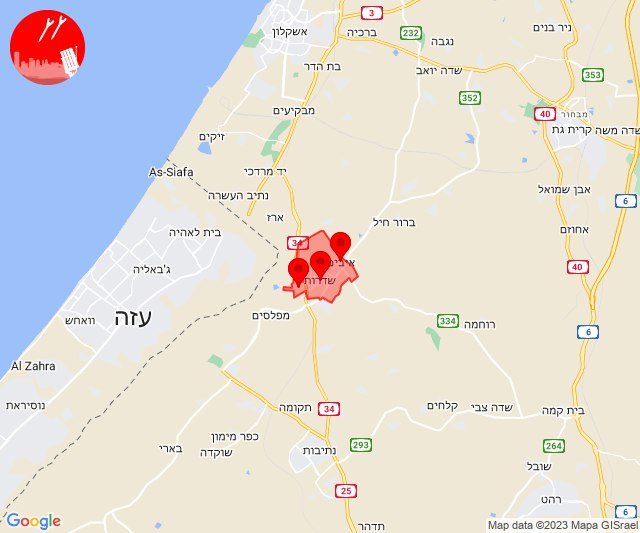

## 19:25

🔴 צבע אדום (30/10/2023):

21:25:
• עוטף עזה: נתיב העשרה (15 שניות)

צופר - צבע אדום

## 19:25

## 19:28

🔴 צבע אדום (30/10/2023):

21:27:
• השפלה: בית דגן, משמר השבעה, ראשון לציון - מזרח, ראשון לציון - מערב, חמד, גנות (דקה וחצי)
• דן: חולון, אור יהודה, אזור, רמת גן - מערב (דקה וחצי)

21:28:
• השפלה: פארק תעשיות פלמחים, אירוס, בית חנן, בית עובד, גן שורק, נטעים, נס ציונה (דקה וחצי)

צופר - צבע אדום

## 19:28

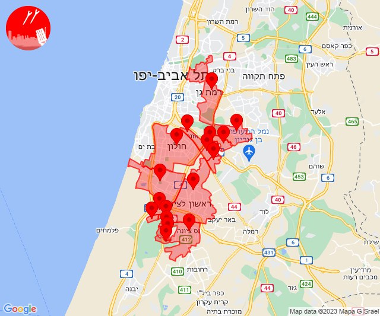

## 22:31

🔴 צבע אדום (31/10/2023):

00:31:
• מערב הנגב: זרועה (30 שניות)
• עוטף עזה: מפלסים (15 שניות)

צופר - צבע אדום

## 22:31

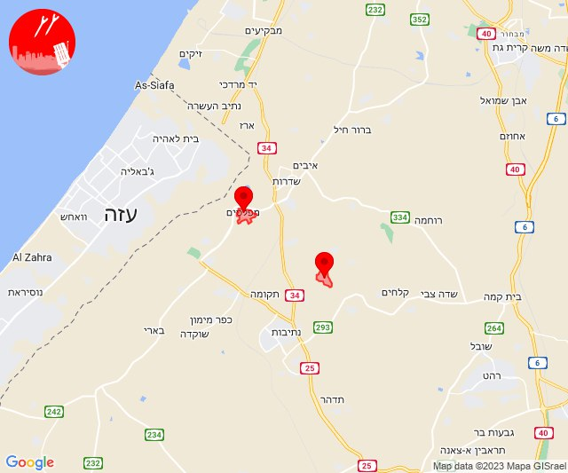

## 23:55

🔴 צבע אדום (31/10/2023):

01:55:
• מערב לכיש: אזור תעשייה הדרומי אשקלון (30 שניות)

צופר - צבע אדום

## 23:55

