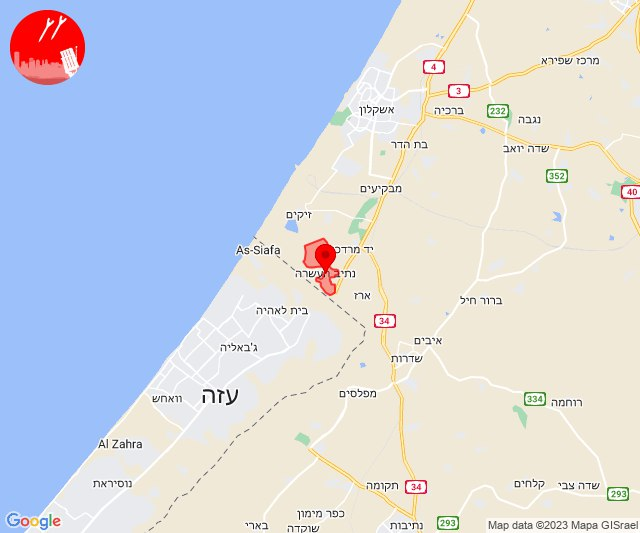
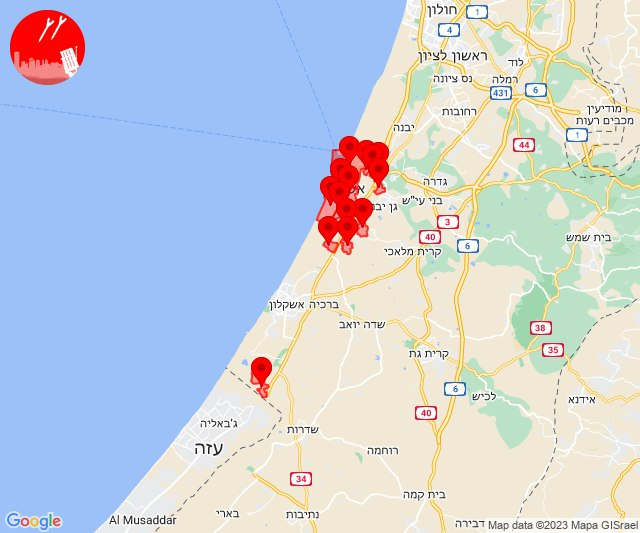

# Alerts for 2023-10-31

## 00:47

🔴 צבע אדום (31/10/2023):

02:47:
• עוטף עזה: נתיב העשרה (15 שניות)

צופר - צבע אדום

## 00:47

## 04:55

בוקר טוב

בעקבות תקלה רחבה שמקורה בשרתי טלגרם ושירות ה-API שלהם לבוטים, ההתרעה האחרונה (06:08 כיסופים) לא הופצה בטלגרם. ערוצי טלגרם רבים מושפעים ואנו מקווים כי טלגרם תפתור את העניין בהקדם.

אנו מדגישים כי צופר פעלה וממשיכה לפעול באופן מלא בשאר הפלטפורמות האחרות:
www.tzevaadom.co.il/systems

תודה,
מערכת צופר

## 07:34

🔴 צבע אדום (31/10/2023):

09:34:
• עוטף עזה: כיסופים (15 שניות)

צופר - צבע אדום

## 07:34

## 08:02

🔴 צבע אדום (31/10/2023):

10:02:
• עוטף עזה: כיסופים (15 שניות)

צופר - צבע אדום

## 08:02

## 08:09

🔴 צבע אדום (31/10/2023):

10:09:
• עוטף עזה: נתיב העשרה (15 שניות)

צופר - צבע אדום

## 08:09

## 08:31

🔴 צבע אדום (31/10/2023):

10:31:
• עוטף עזה: נירים (15 שניות)

צופר - צבע אדום

## 08:31

## 08:49

🔴 צבע אדום (31/10/2023):

10:49:
• עוטף עזה: ניר עוז (15 שניות)

צופר - צבע אדום

## 08:50

## 11:02

🔴 צבע אדום (31/10/2023):

13:02:
• קו העימות: מטולה (מיידי)

צופר - צבע אדום

## 11:03

## 11:29

🔴 צבע אדום (31/10/2023):

13:29:
• מרכז הנגב: אל סייד והפזורה, לקיה והפזורה, אום בטין והפזורה (דקה וחצי, דקה)
• דרום הנגב: סעייה-מולדה והפזורה, כסייפה והפזורה (דקה וחצי)

צופר - צבע אדום

## 11:29

## 12:00

🔴 צבע אדום (31/10/2023):

14:00:
• עוטף עזה: ניר יצחק, סופה (15 שניות)

צופר - צבע אדום

## 12:00

## 12:32

🔴 צבע אדום (31/10/2023):

14:31:
• דן: הרצליה - מערב, הרצליה - מרכז וגליל ים (דקה וחצי)
• שרון: גבעת חן, רעננה, כפר סבא, בצרה (דקה וחצי)
• עוטף עזה: כיסופים (15 שניות)

14:32:
• דן: תל אביב - עבר הירקון, פתח תקווה, בני ברק, רמת גן - מערב, רמת השרון, מתחם פי גלילות (דקה וחצי)

צופר - צבע אדום

## 12:32

## 12:37

🔴 צבע אדום (31/10/2023):

14:36:
• שרון: אלישמע, ג'לג'וליה, הוד השרון, כפר סבא, נווה ימין, נווה ירק, שדי חמד (דקה וחצי)

14:37:
• דן: גבעת השלושה, פתח תקווה (דקה וחצי)
• שרון: עדנים, מרכז אזורי דרום השרון (דקה וחצי)

צופר - צבע אדום

## 12:37

## 12:52

🔴 צבע אדום (31/10/2023):

14:52:
• עוטף עזה: חולית, סופה (15 שניות)

צופר - צבע אדום

## 12:52

## 13:11

🔴 צבע אדום (31/10/2023):

15:11:
• עוטף עזה: שדרות, איבים, ניר עם (15 שניות)

צופר - צבע אדום

## 13:11

## 13:32

🔴 צבע אדום (31/10/2023):

15:32:
• עוטף עזה: סופה, פרי גן, יתד, שדה אברהם, דקל, תלמי יוסף, ניר יצחק (15 שניות)

צופר - צבע אדום

## 13:32

## 14:01

🔴 צבע אדום (31/10/2023):

16:00:
• עוטף עזה: נתיב העשרה (15 שניות)
• לכיש: אשדוד - ג,ו,ז, אשדוד - אזור תעשייה צפוני ונמל, ניר גלים, בני דרום, גן הדרום, מתחם בני דרום, אשדוד - א,ב,ד,ה, אשדוד - יא,יב,טו,יז,מרינה,סיטי (45 שניות, דקה)

16:01:
• לכיש: אזור תעשייה עד הלום, אשדוד - ח,ט,י,יג,יד,טז, בית עזרא, שדה עוזיהו (45 שניות)
• מערב לכיש: ניצן (45 שניות)

צופר - צבע אדום

## 14:01

## 16:28

🔴 צבע אדום (31/10/2023):

18:27:
• דן: תל אביב - מזרח, תל אביב - עבר הירקון, בני ברק, גבעתיים, רמת גן - מערב, תל אביב - דרום העיר ויפו, אזור, חולון, מקווה ישראל (דקה וחצי)

18:28:
• דן: בת-ים (דקה וחצי)
• השפלה: ראשון לציון - מערב (דקה וחצי)

צופר - צבע אדום

## 16:28

## 19:03

🔴 צבע אדום (31/10/2023):

21:00:
• מערב לכיש: אשקלון - דרום (30 שניות)

21:01:
• מערב לכיש: אזור תעשייה הדרומי אשקלון (30 שניות)
• דן: תל אביב - דרום העיר ויפו, תל אביב - מזרח, תל אביב - מרכז העיר, גבעתיים, רמת גן - מערב (דקה וחצי)

21:02:
• דן: תל אביב - עבר הירקון, בני ברק, פתח תקווה, רמת השרון (דקה וחצי)

21:03:
• דן: בת-ים, חולון, מקווה ישראל (דקה וחצי)

צופר - צבע אדום

## 19:03

## 21:59

🔴 צבע אדום (31/10/2023):

23:59:
• עוטף עזה: נתיב העשרה (15 שניות)

צופר - צבע אדום

## 21:59

