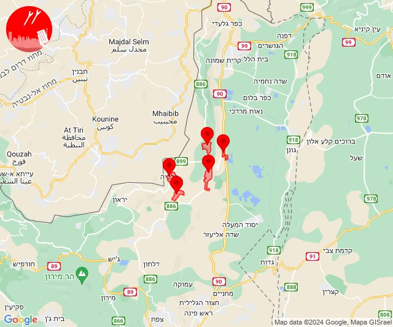
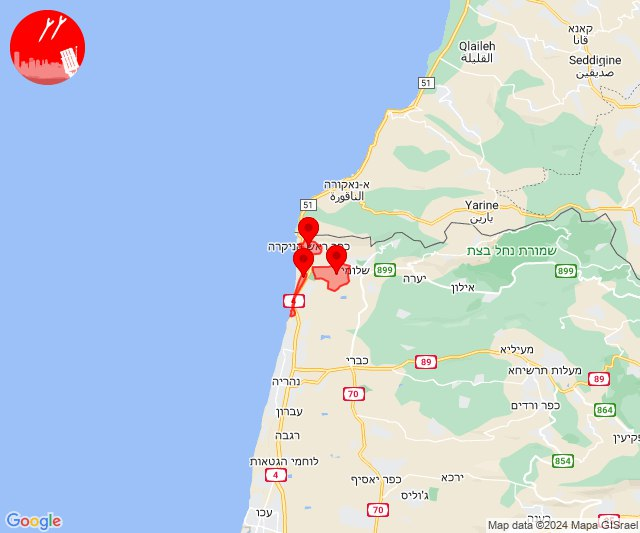
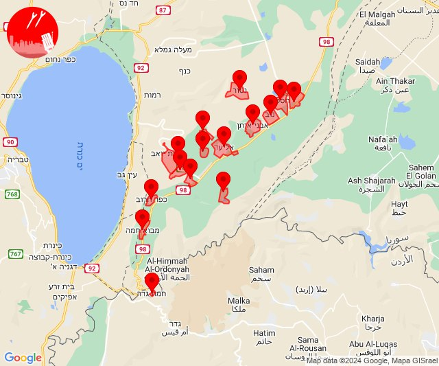
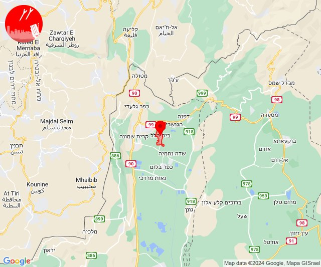

# Alerts for 2024-04-01

## 14:59

✈️ חדירת כלי טיס עוין (01/04/2024):

17:59:
• קו העימות: דישון, יפתח, מלכיה, מרכז אזורי מבואות חרמון, רמות נפתלי 

צופר - צבע אדום

## 14:59

## 18:35

🔴 צבע אדום (01/04/2024):

21:33:
• קו העימות: אזור תעשייה אכזיב מילואות, בצת (מיידי)

21:34:
• קו העימות: ראש הנקרה (מיידי)

21:35:
• קו העימות: אזור תעשייה אכזיב מילואות, בצת (מיידי)

צופר - צבע אדום

## 18:35

## 20:03

✈️ חדירת כלי טיס עוין (01/04/2024):

23:03:
• דרום הגולן: חמת גדר, אבני איתן, אלי עד, אפיק, בני יהודה וגבעת יואב, גשור, חספין, כפר חרוב, מבוא חמה, מיצר, נאות גולן, נוב, נטור, רמת מגשימים, אזור תעשייה בני יהודה 

צופר - צבע אדום

## 20:03

## 22:29

🔴 צבע אדום (02/04/2024):

01:29:
• קו העימות: בית הלל (מיידי)

צופר - צבע אדום

## 22:29

