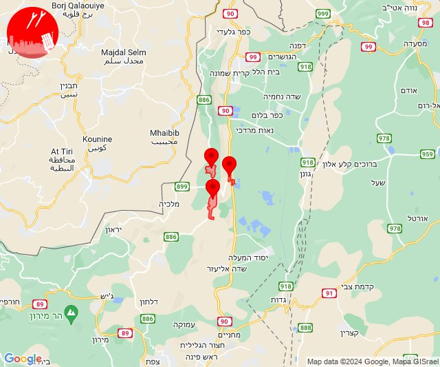
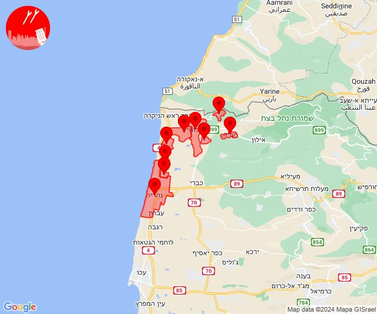
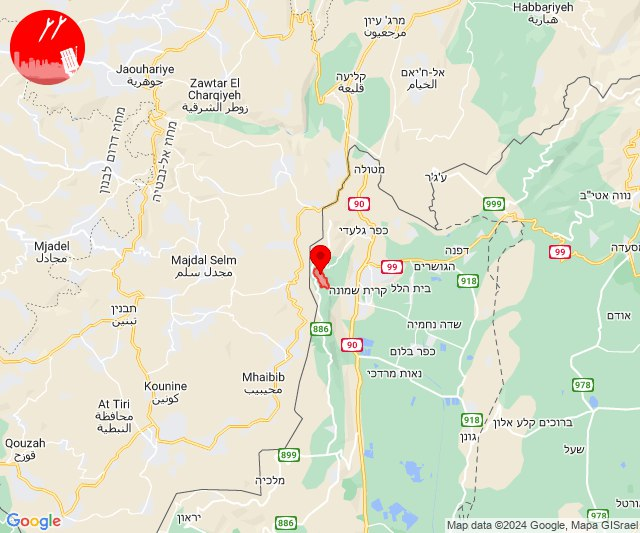
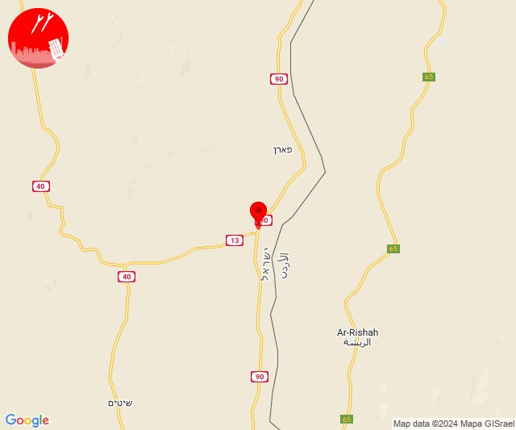

# Alerts for 2024-04-02

## 02:40

🔴 צבע אדום (02/04/2024):

05:40:
• קו העימות: יפתח, מרכז אזורי מבואות חרמון, רמות נפתלי (מיידי)

צופר - צבע אדום

## 02:40

## 16:38

🔴 צבע אדום (02/04/2024):

19:37:
• קו העימות: גשר הזיו, נהריה, סער (מיידי, 15 שניות)

19:38:
• קו העימות: חניתה, יערה, מצובה, שלומי, בצת, לימן (מיידי)

צופר - צבע אדום

## 16:38

## 17:07

🔴 צבע אדום (02/04/2024):

20:07:
• קו העימות: מרגליות (מיידי)

צופר - צבע אדום

## 17:07

## 22:01

✈️ חדירת כלי טיס עוין (03/04/2024):

01:01:
• ערבה: כושי רמון 

צופר - צבע אדום

## 22:01

