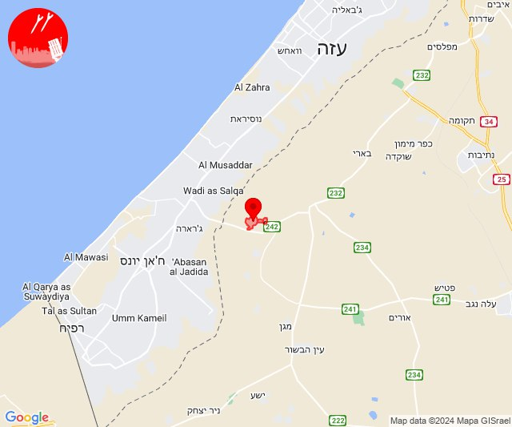
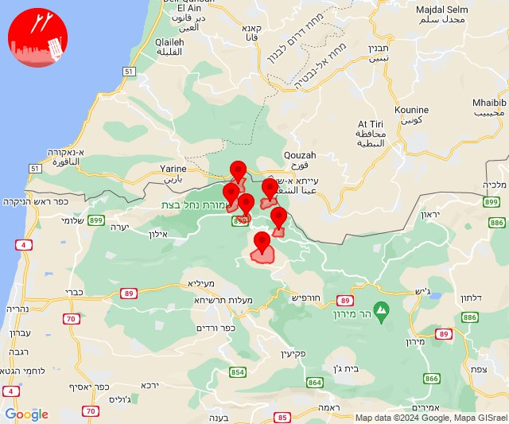
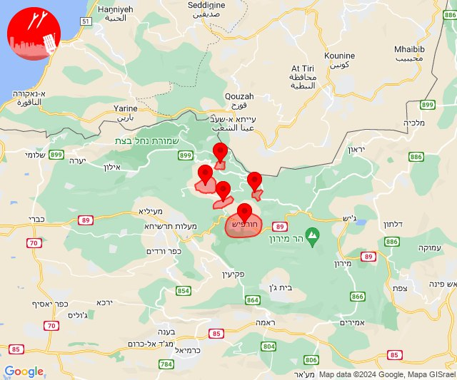
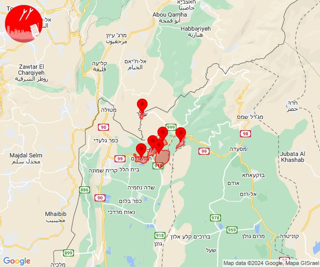
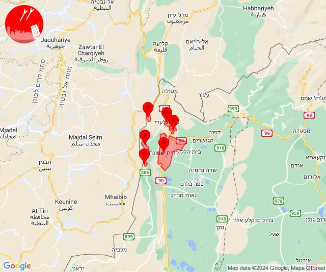
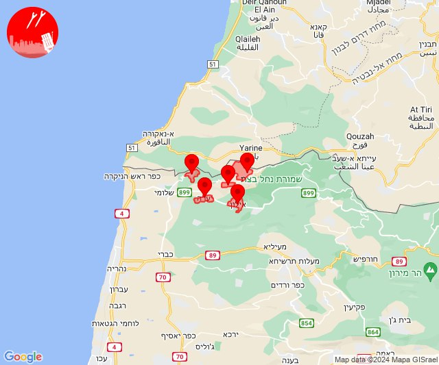
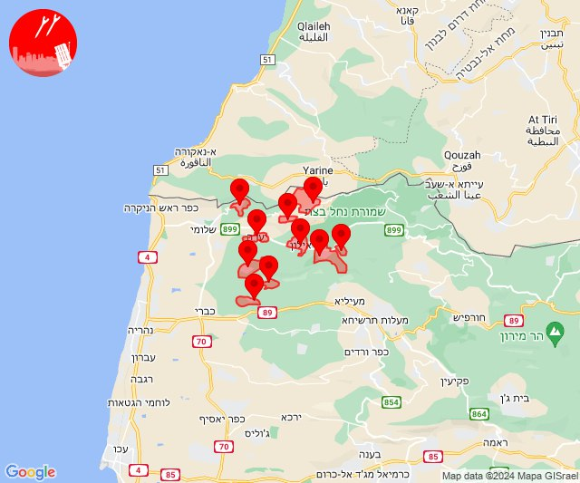
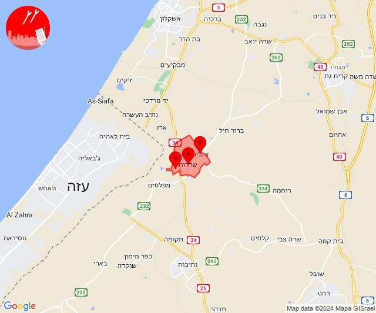
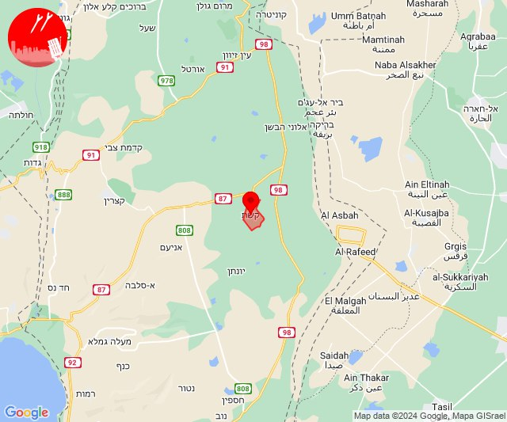

# Alerts for 2024-04-03

## 02:20

🔴 צבע אדום (03/04/2024):

05:20:
• עוטף עזה: כיסופים (15 שניות)

צופר - צבע אדום

## 02:20

## 05:53

🔴 צבע אדום (03/04/2024):

08:53:
• קו העימות: אבן מנחם, זרעית, נטועה, פסוטה, שומרה, שתולה (מיידי)

צופר - צבע אדום

## 05:53

## 07:00

🔴 צבע אדום (03/04/2024):

10:00:
• קו העימות: אלקוש, מתת, נטועה, פסוטה, חורפיש (מיידי)

צופר - צבע אדום

## 07:00

## 07:16

🔴 צבע אדום (03/04/2024):

10:16:
• קו העימות: אלקוש, מתת, נטועה, פסוטה, חורפיש (מיידי)

צופר - צבע אדום

## 07:16

## 11:31

✈️ חדירת כלי טיס עוין (03/04/2024):

14:31:
• קו העימות: דפנה, הגושרים, ע'ג'ר, קיבוץ דן, שאר ישוב, שניר 

צופר - צבע אדום

## 11:31

## 12:52

🔴 צבע אדום (03/04/2024):

15:52:
• קו העימות: כפר גלעדי, מנרה, מרגליות, משגב עם, קריית שמונה, תל חי (מיידי)

צופר - צבע אדום

## 12:52

## 12:53

✈️ חדירת כלי טיס עוין (03/04/2024):

15:53:
• קו העימות: בית הלל, כפר גלעדי, כפר יובל, מטולה, מנרה, מעיין ברוך, מרגליות, משגב עם, קריית שמונה, תל חי 

צופר - צבע אדום

## 12:53

## 12:56

🔴 צבע אדום (03/04/2024):

15:56:
• קו העימות: אדמית, אילון, חניתה, יערה, ערב אל עראמשה (מיידי)

צופר - צבע אדום

## 12:56

## 12:57

✈️ חדירת כלי טיס עוין (03/04/2024):

15:57:
• קו העימות: אדמית, אילון, גורן, גורנות הגליל, חניתה, יערה, מנות, נווה זיו, עבדון, ערב אל עראמשה 

צופר - צבע אדום

## 12:57

## 16:15

🔴 צבע אדום (03/04/2024):

19:15:
• עוטף עזה: כיסופים (15 שניות)

צופר - צבע אדום

## 16:15

## 20:00

🔴 צבע אדום (03/04/2024):

23:00:
• עוטף עזה: שדרות, איבים, ניר עם (15 שניות)

צופר - צבע אדום

## 20:01

## 22:00

🔴 צבע אדום (04/04/2024):

01:00:
• דרום הגולן: קשת (מיידי)

צופר - צבע אדום

## 22:00

