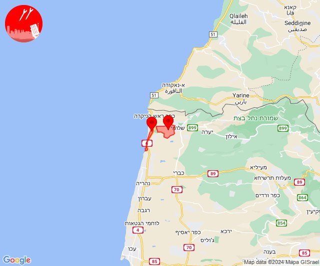
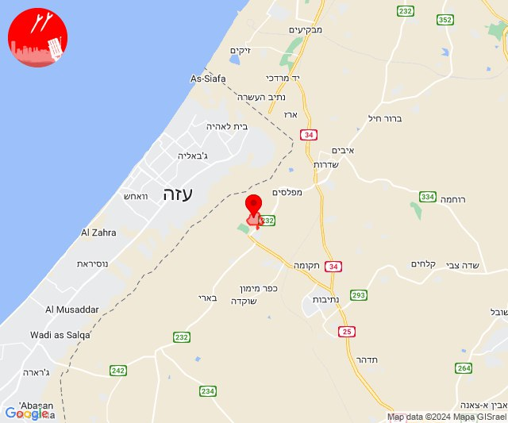
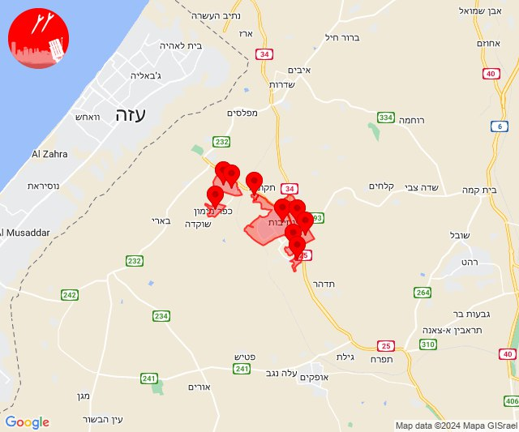
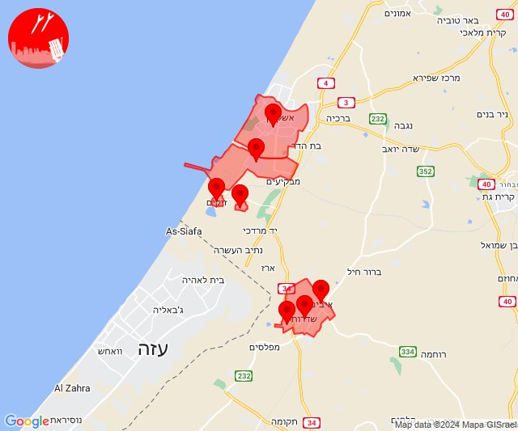
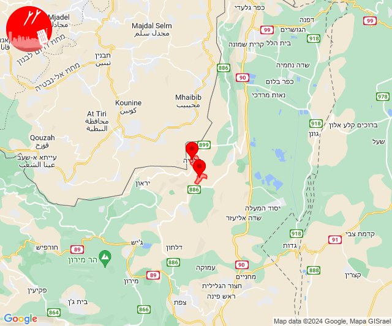

# Alerts for 2024-04-04

## 10:50

🔴 צבע אדום (04/04/2024):

13:49:
• קו העימות: בצת (מיידי)

13:50:
• קו העימות: אזור תעשייה אכזיב מילואות, בצת (מיידי)

צופר - צבע אדום

## 10:50

## 13:47

🔴 צבע אדום (04/04/2024):

16:47:
• עוטף עזה: כפר עזה (15 שניות)

צופר - צבע אדום

## 13:47

## 17:43

🔴 צבע אדום (04/04/2024):

20:43:
• מערב הנגב: אזור תעשייה נ.ע.מ, בית הגדי, נתיבות, שיבולים, שרשרת (30 שניות)
• עוטף עזה: זמרת, שובה, כפר מימון ותושיה, חוות יזרעם (15 שניות)

צופר - צבע אדום

## 17:43

## 19:01

🔴 צבע אדום (04/04/2024):

21:59:
• עוטף עזה: שדרות, איבים, ניר עם (15 שניות)

22:01:
• עוטף עזה: זיקים, כרמיה (15 שניות)
• מערב לכיש: אשקלון - דרום, אזור תעשייה הדרומי אשקלון (30 שניות)

צופר - צבע אדום

## 19:01

## 21:51

🔴 צבע אדום (05/04/2024):

00:51:
• קו העימות: דישון, מלכיה (מיידי)

צופר - צבע אדום

## 21:51

