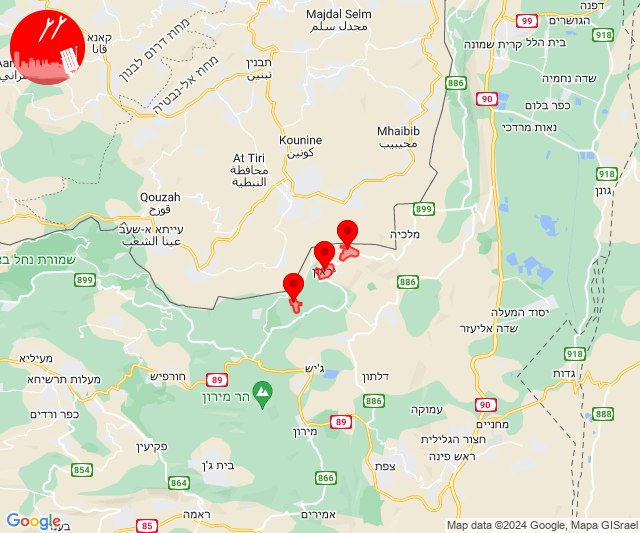

# Alerts for 2024-04-05

## 09:48

✈️ חדירת כלי טיס עוין (05/04/2024):

12:48:
• קו העימות: בית הלל, כפר גלעדי, כפר יובל, מטולה, מנרה, מעיין ברוך, מרגליות, משגב עם, קריית שמונה, תל חי, דפנה, הגושרים, ע'ג'ר, קיבוץ דן, שאר ישוב, שניר 

צופר - צבע אדום

## 09:48

## 10:40

🔴 צבע אדום (05/04/2024):

13:40:
• קו העימות: עבדון, אדמית, אילון, גורן, חניתה, יערה, ערב אל עראמשה (מיידי)

צופר - צבע אדום

## 10:40

## 10:43

🔴 צבע אדום (05/04/2024):

13:42:
• קו העימות: אדמית, אילון, חניתה, יערה, ערב אל עראמשה (מיידי)

13:43:
• קו העימות: מנות, נווה זיו, עבדון (מיידי)

צופר - צבע אדום

## 10:43

## 10:43

✈️ חדירת כלי טיס עוין (05/04/2024):

13:43:
• קו העימות: מנות, נווה זיו, עבדון 

צופר - צבע אדום

## 10:43

## 12:59

🔴 צבע אדום (05/04/2024):

15:58:
• קו העימות: מנרה (מיידי)

15:59:
• קו העימות: מרגליות, קריית שמונה, מנרה (מיידי)

צופר - צבע אדום

## 12:59

## 23:14

🔴 צבע אדום (06/04/2024):

02:14:
• קו העימות: אביבים, ברעם, יראון (מיידי)

צופר - צבע אדום

## 23:14

