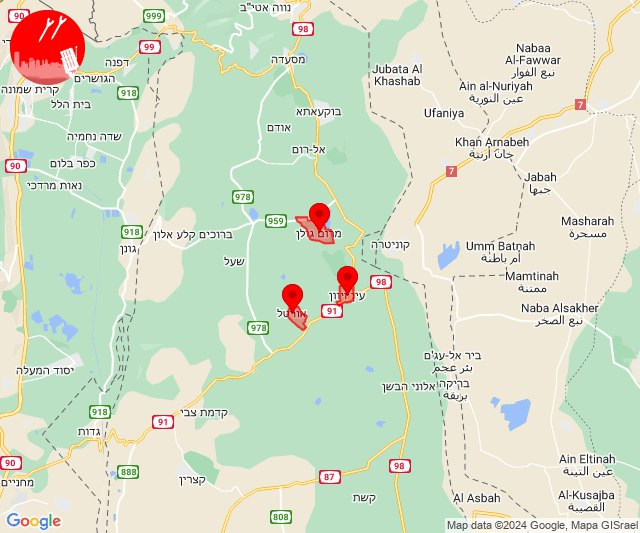
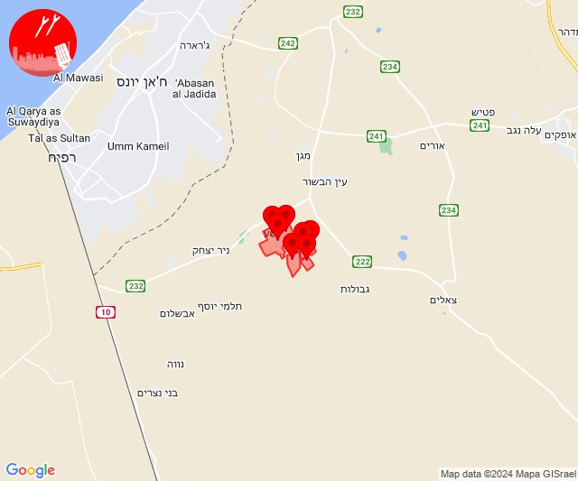
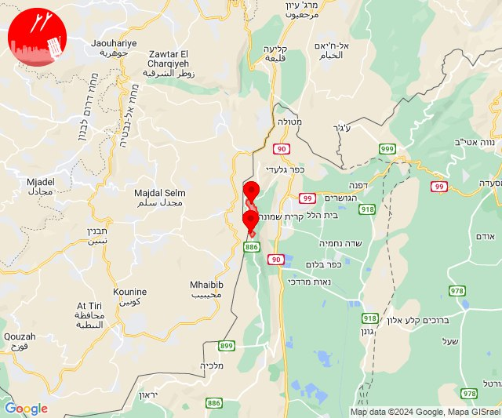
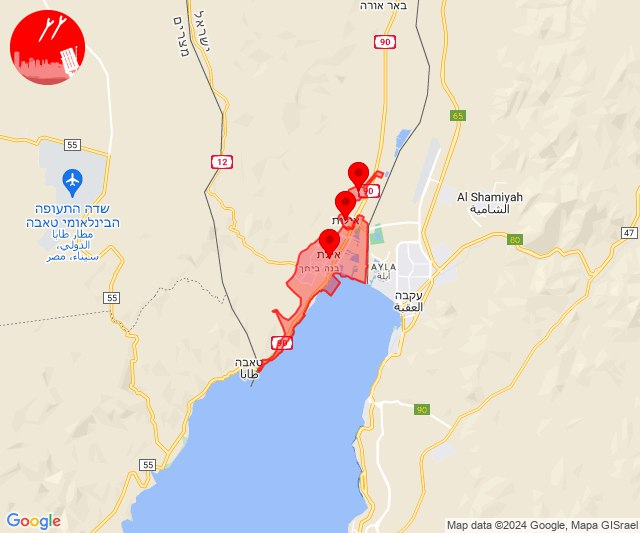
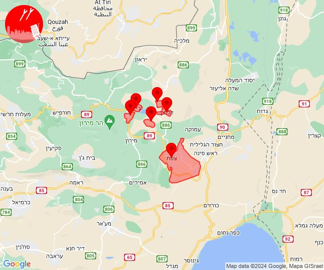

# Alerts for 2024-04-07

## 08:00

🔴 צבע אדום (07/04/2024):

11:00:
• צפון הגולן: מרום גולן, אורטל, עין זיוון (מיידי)

צופר - צבע אדום

## 08:00

## 09:55

🔴 צבע אדום (07/04/2024):

12:55:
• עוטף עזה: מבטחים, עמיעוז, ישע, צוחר, אוהד, שדה ניצן, תלמי אליהו (15 שניות)

צופר - צבע אדום

## 09:55

## 10:42

🔴 צבע אדום (07/04/2024):

13:42:
• קו העימות: מנרה, מרגליות (מיידי)

צופר - צבע אדום

## 10:42

## 11:27

✈️ חדירת כלי טיס עוין (07/04/2024):

14:27:
• אילת: אילות, אילת, אזור תעשייה שחורת 

צופר - צבע אדום

## 11:27

## 17:31

🔴 צבע אדום (07/04/2024):

20:31:
• גליל עליון: צפת, ספסופה - כפר חושן, קדיתא (30 שניות)
• קו העימות: אזור תעשייה רמת דלתון, ג'ש - גוש חלב, דלתון (מיידי)

צופר - צבע אדום

## 17:31

