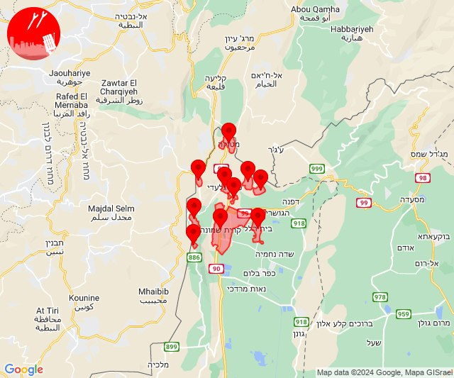
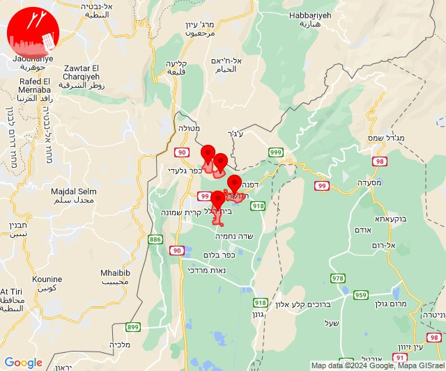

# Alerts for 2024-04-08

## 10:40

✈️ חדירת כלי טיס עוין (08/04/2024):

13:40:
• קו העימות: אזור תעשייה אכזיב מילואות, בצת, לימן, מצובה, ראש הנקרה, שלומי 

צופר - צבע אדום

## 10:40

## 11:19

✈️ חדירת כלי טיס עוין (08/04/2024):

14:19:
• קו העימות: דישון, יפתח, מלכיה, מרכז אזורי מבואות חרמון, רמות נפתלי 

צופר - צבע אדום

## 11:19

## 13:46

✈️ חדירת כלי טיס עוין (08/04/2024):

16:46:
• קו העימות: בית הלל, כפר גלעדי, כפר יובל, מטולה, מנרה, מעיין ברוך, מרגליות, משגב עם, קריית שמונה, תל חי 

צופר - צבע אדום

## 13:46

## 13:49

🔴 צבע אדום (08/04/2024):

16:49:
• קו העימות: קריית שמונה, תל חי (מיידי)

צופר - צבע אדום

## 13:49

## 13:53

🔴 צבע אדום (08/04/2024):

16:52:
• קו העימות: בית הלל, מעיין ברוך, הגושרים (מיידי)

16:53:
• קו העימות: כפר יובל (מיידי)

צופר - צבע אדום

## 13:53

## 15:59

🔴 צבע אדום (08/04/2024):

18:57:
• קו העימות: חניתה (מיידי)

18:58:
• קו העימות: יערה (מיידי)

18:59:
• קו העימות: אדמית (מיידי)

צופר - צבע אדום

## 15:59

## 16:05

🔴 צבע אדום (08/04/2024):

19:04:
• קו העימות: חניתה (מיידי)

19:05:
• קו העימות: חניתה (מיידי)

צופר - צבע אדום

## 16:05

## 17:47

🔴 צבע אדום (08/04/2024):

20:47:
• דרום הגולן: יונתן (מיידי)

צופר - צבע אדום

## 17:47

## 20:32

✈️ חדירת כלי טיס עוין (08/04/2024):

23:32:
• אילת: אילות, אילת, אזור תעשייה שחורת 

צופר - צבע אדום

## 20:32

