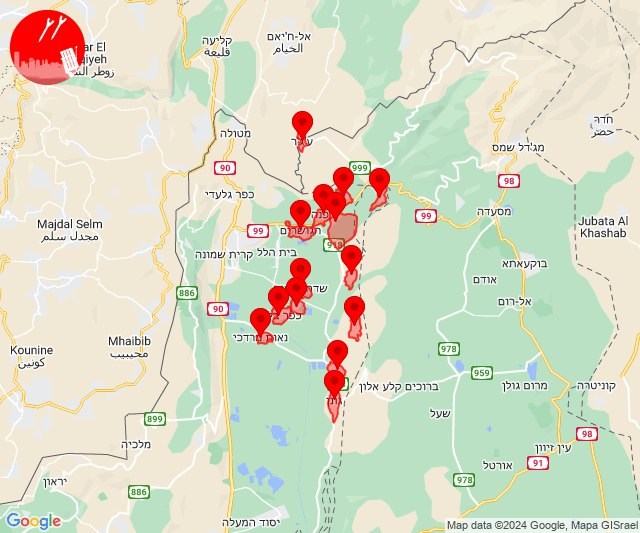
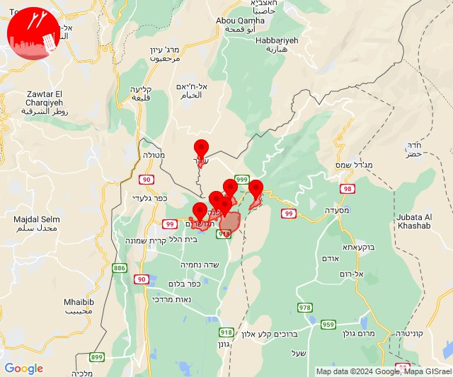
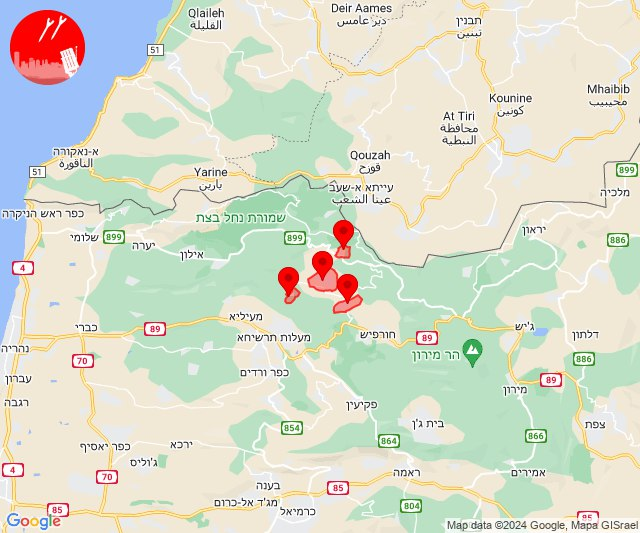
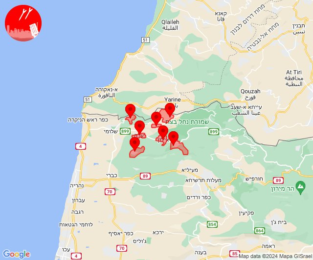
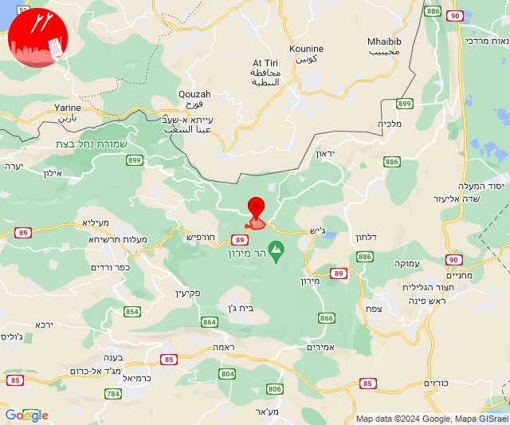
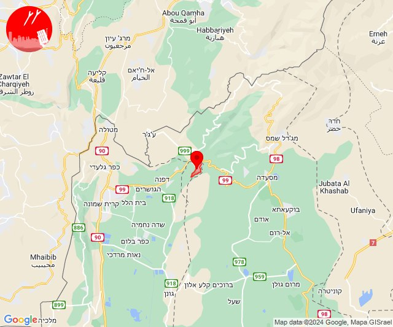
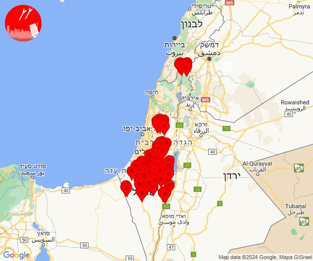
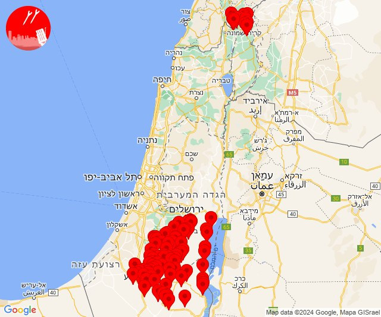
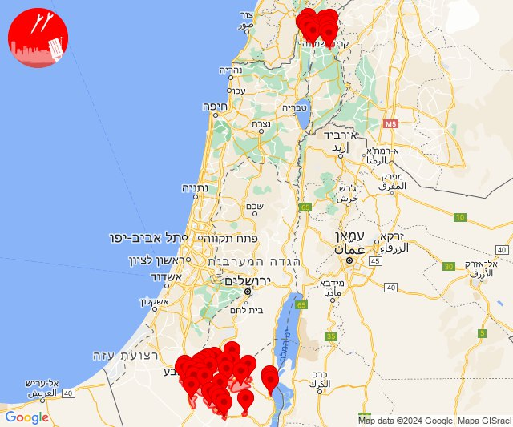

# Alerts for 2024-04-13

## 08:50

✈️ חדירת כלי טיס עוין (13/04/2024):

11:49:
• קו העימות: דפנה, הגושרים, ע'ג'ר, קיבוץ דן, שאר ישוב, שניר 

11:50:
• קו העימות: גונן, כפר בלום, כפר סאלד, להבות הבשן, נאות מרדכי, עמיר, שדה נחמיה, שמיר 

צופר - צבע אדום

## 08:50

## 08:52

✈️ חדירת כלי טיס עוין (13/04/2024):

11:52:
• קו העימות: דפנה, ע'ג'ר, קיבוץ דן, הגושרים, שניר, שאר ישוב 

צופר - צבע אדום

## 08:52

## 09:55

✈️ חדירת כלי טיס עוין (13/04/2024):

12:55:
• קו העימות: אבירים, אלקוש, נטועה, פסוטה 

צופר - צבע אדום

## 09:55

## 12:09

🔴 צבע אדום (13/04/2024):

15:09:
• קו העימות: עבדון, אדמית, אילון, גורן, חניתה, יערה, ערב אל עראמשה (מיידי)

צופר - צבע אדום

## 12:09

## 13:58

🔴 צבע אדום (13/04/2024):

16:58:
• קו העימות: סאסא (מיידי)

צופר - צבע אדום

## 13:58

## 14:33

🔴 צבע אדום (13/04/2024):

17:33:
• קו העימות: אלקוש, מתת, נטועה, פסוטה, חורפיש (מיידי)

צופר - צבע אדום

## 14:33

## 21:28

🔴 צבע אדום (14/04/2024):

00:28:
• קו העימות: שניר (מיידי)

צופר - צבע אדום

## 21:28

## 22:46

🔴 צבע אדום (14/04/2024):

01:42:
• דרום הנגב: אבו קרינאת והפזורה, כסייפה והפזורה, מרעית, ערערה בנגב, קצר-א-סיר והפזורה, סעייה-מולדה והפזורה, אבו-תלול והפזורה, ואדי אל נעם דרום, אבו קרינאת והפזורה, ערערה בנגב, סעייה-מולדה והפזורה, אבו-תלול והפזורה (דקה וחצי)
• מרכז הנגב: אל סייד והפזורה, חורה, נבטים, שגב שלום והפזורה, תל שבע, אום בטין והפזורה, מתחם צומת שוקת, באר שבע - דרום, באר שבע - מזרח, באר שבע - מערב, באר שבע - צפון, לקיה והפזורה, עומר, חצרים (דקה וחצי, דקה)

01:43:
• דרום הנגב: אזור תעשייה דימונה, אל פורעה והפזורה, דימונה, כסייפה והפזורה, מרעית, קצר-א-סיר והפזורה, תל ערד והפזורה, חירן, ואדי אל נעם דרום, חירן, סעייה-מולדה והפזורה, אבו-תלול והפזורה, ואדי אל נעם דרום, אבו קרינאת והפזורה, אל פורעה והפזורה, כסייפה והפזורה, מרעית, ערערה בנגב, קצר-א-סיר והפזורה, תל ערד והפזורה, חירן, סעייה-מולדה והפזורה, ביר הדאג' והפזורה, אשלים, טללים, משאבי שדה, רביבים, רתמים, אל פורעה והפזורה, כסייפה והפזורה, מרעית, ערד, ערערה בנגב, תל ערד והפזורה, סעייה-מולדה והפזורה, אבו קרינאת והפזורה, חירן (דקה וחצי)
• מרכז הנגב: אל סייד והפזורה, חורה, נבטים, שגב שלום והפזורה, תל שבע, אום בטין והפזורה, מתחם צומת שוקת, מיתר, אל סייד והפזורה, חורה, כרמים, כרמית, סנסנה, באר שבע - דרום, באר שבע - מזרח, באר שבע - מערב, באר שבע - צפון, לקיה והפזורה, עומר, אל סייד והפזורה, חורה, נבטים, שגב שלום והפזורה, תל שבע, אום בטין והפזורה, מתחם צומת שוקת, באר שבע - דרום, באר שבע - מזרח, באר שבע - מערב, באר שבע - צפון, חצרים, לקיה והפזורה, עומר, נבטים, תל שבע (דקה וחצי, דקה)
• שומרון: חוות יאיר, יקיר, נופים, עמנואל, קריית נטפים, קרני שומרון, רבבה, הר ברכה, חוות גלעד, יצהר, כפר תפוח, עלי, קדומים, רחלים, אריאל, נופי נחמיה (דקה וחצי)
• יהודה: הר עמשא (דקה וחצי)

01:44:
• דרום הנגב: ואדי אל נעם דרום, אבו-תלול והפזורה, חירן, סעייה-מולדה והפזורה, אל פורעה והפזורה, כסייפה והפזורה, מרעית, ערד, תל ערד והפזורה, אבו קרינאת והפזורה, ערערה בנגב, קצר-א-סיר והפזורה, סעייה-מולדה והפזורה, אבו-תלול והפזורה, ואדי אל נעם דרום, אבו קרינאת והפזורה, אל פורעה והפזורה, כסייפה והפזורה, ערד, ערערה בנגב, תל ערד והפזורה, מרעית, דימונה, קצר-א-סיר והפזורה, אזור תעשייה דימונה, אל פורעה והפזורה, כסייפה והפזורה, מרעית, ערד, ערערה בנגב, תל ערד והפזורה, חירן, סעייה-מולדה והפזורה, אבו-תלול והפזורה, אבו קרינאת והפזורה, דימונה, קצר-א-סיר והפזורה, ואדי אל נעם דרום, ירוחם, ממשית, אזור תעשייה רותם (דקה וחצי)
• מרכז הנגב: אל סייד והפזורה, חורה, כרמים, כרמית, מיתר, נבטים, שגב שלום והפזורה, תל שבע, אום בטין והפזורה, מתחם צומת שוקת, באר שבע - דרום, סנסנה, לקיה והפזורה, עומר, באר שבע - מזרח, באר שבע - צפון, אזור תעשייה עידן הנגב, גבעות בר, להבים, משמר הנגב, רהט והפזורה, תראבין א-צאנע והפזורה, אתר דודאים, שגב שלום והפזורה, באר שבע - דרום, באר שבע - מערב, נבטים, תל שבע, אל סייד והפזורה, חורה, אום בטין והפזורה, תראבין א-צאנע והפזורה, אתר דודאים, אל סייד והפזורה, חורה, כרמים, כרמית, מיתר, סנסנה, נבטים, תל שבע, מתחם צומת שוקת, שגב שלום והפזורה, באר שבע - דרום, באר שבע - מזרח, באר שבע - מערב, באר שבע - צפון, חצרים, לקיה והפזורה, עומר (דקה וחצי, דקה, 45 שניות)
• יהודה: בית יתיר, שני ליבנה, אזור תעשייה מיתרים, טנא עומרים, מעון, סוסיא, עשאהל, שמעה, בית יתיר, הר עמשא, שני ליבנה, אזור תעשייה מיתרים, טנא עומרים, עשאהל (דקה וחצי)
• מערב הנגב: אשל הנשיא, אופקים, גילת, תפרח (45 שניות)
• ים המלח: בתי מלון ים המלח, מלונות ים המלח מרכז, מצדה, נווה זוהר, עין בוקק, בתי מלון ים המלח, מלונות ים המלח מרכז, נווה זוהר, עין בוקק, מצדה, נאות הכיכר, עין תמר (דקה וחצי)

01:45:
• דרום הנגב: אורון תעשייה ומסחר, מדרשת בן גוריון, מרחב עם, שאנטי במדבר, שדה בוקר, עבדת, ערד, אבו קרינאת והפזורה, אל פורעה והפזורה, כסייפה והפזורה, ערערה בנגב, תל ערד והפזורה, חירן, סעייה-מולדה והפזורה, אבו-תלול והפזורה, מרעית, אזור תעשייה רותם, דימונה, קצר-א-סיר והפזורה, אל פורעה והפזורה, כסייפה והפזורה, ערד, ערערה בנגב, תל ערד והפזורה, ואדי אל נעם דרום, ביר הדאג' והפזורה, רביבים, רתמים, טללים, משאבי שדה, באר מילכה, כמהין, ניצנה, קדש ברנע, אשלים, דימונה, קצר-א-סיר והפזורה, ערד, מרעית, משאבי שדה, ואדי אל נעם דרום, ערד, מרעית (דקה וחצי, דקה)

## 22:46

• יהודה: שמעה, הר עמשא, בית יתיר, שני ליבנה, אלון שבות, אלעזר, אפרת, ביתר עילית, הר גילה, חוות שדה בר, כפר אלדד, כפר עציון, מגדל עוז, מעלה עמוס, מעלה רחבעם, נווה דניאל, נוקדים, קדר, ראש צורים, תקוע, גבעות, הר עמשא (דקה וחצי)
• ים המלח: בתי מלון ים המלח, מלונות ים המלח מרכז, נווה זוהר, מצדה, מרחצאות עין גדי, נאות הכיכר, עין תמר, בתי מלון ים המלח, מלונות ים המלח מרכז, נווה זוהר, נאות הכיכר, עין תמר, מצדה, בתי מלון ים המלח, מלונות ים המלח מרכז (דקה וחצי)
• ערבה: עיר אובות, אל עמארני, אל מסק, עידן, עין חצבה, עיר אובות (דקה וחצי)
• קו העימות: כפר יובל, מעיין ברוך, דפנה, הגושרים, כפר סאלד, ע'ג'ר, קיבוץ דן, שאר ישוב, שניר (מיידי, 15 שניות)
• צפון הגולן: אודם, אל רום, בוקעתא, מג'דל שמס, מסעדה, נווה אטי''ב, נמרוד, עין קנייא (מיידי)
• מרכז הנגב: כרמית, מיתר, מתחם צומת שוקת, באר שבע - דרום, באר שבע - מזרח, באר שבע - מערב, באר שבע - צפון, לקיה והפזורה, עומר, חצרים, גבעות בר, להב, להבים, אשכולות, חצרים, שגב שלום והפזורה, נבטים, תל שבע (דקה, דקה וחצי, 45 שניות)
• מערב הנגב: אשל הנשיא, צאלים (45 שניות, 30 שניות)
• ירושלים: ירושלים - דרום, ירושלים - מזרח, ירושלים - מערב, ירושלים - מרכז (דקה וחצי)

01:46:
• דרום הנגב: דימונה, קצר-א-סיר והפזורה, אורון תעשייה ומסחר, אזור תעשייה רותם, טללים, משאבי שדה, ואדי אל נעם דרום, ערד, מרחב עם, שדה בוקר (דקה וחצי)
• מרכז הנגב: שגב שלום והפזורה (דקה וחצי)
• ערבה: חצבה (דקה וחצי)
• יהודה: אדורה, אליאב (דקה וחצי, דקה)
• ים המלח: בתי מלון ים המלח, מלונות ים המלח מרכז, מצדה, נווה זוהר (דקה וחצי)
• קו העימות: מעיין ברוך, דפנה, הגושרים, כפר סאלד, ע'ג'ר, קיבוץ דן, שאר ישוב, שניר (מיידי, 15 שניות)
• צפון הגולן: אודם, אל רום, בוקעתא, מג'דל שמס, מסעדה, נווה אטי''ב, נמרוד, עין קנייא (מיידי)

צופר - צבע אדום

## 22:47

## 22:52

🔴 צבע אדום (14/04/2024):

01:47:
• יהודה: אזור תעשייה מיתרים, טנא עומרים, עשאהל, שמעה (דקה וחצי)
• מרכז הנגב: מיתר (דקה וחצי)

01:48:
• דרום הנגב: אבו קרינאת והפזורה, ערערה בנגב, אבו-תלול והפזורה, אל פורעה והפזורה, כסייפה והפזורה, מרעית, תל ערד והפזורה, חירן, סעייה-מולדה והפזורה, אזור תעשייה דימונה, ואדי אל נעם דרום, אל פורעה והפזורה, ערערה בנגב, כסייפה והפזורה (דקה וחצי)
• מרכז הנגב: להב, אשכולות, אל סייד והפזורה, חורה, כרמים, כרמית, מיתר, סנסנה, מתחם צומת שוקת, נבטים, תל שבע (45 שניות, דקה, דקה וחצי)
• יהודה: חוות שדה בר, כפר אלדד, כרמי צור, מגדל עוז, מיצד, מעלה עמוס, מעלה רחבעם, נוקדים, פני קדם, תלם, תקוע, אמציה, בני דקלים, נטע, שומריה, שקף, אדורה, אדוריים, אזור תעשייה מיתרים, בית חגי, בית יתיר, הר עמשא, טנא עומרים, כרמל, מעון, מעלה חבר, נגוהות, סוסיא, עשאהל, עתניאל, קרית ארבע, שמעה, שני ליבנה, אליאב, חברון (דקה וחצי, דקה)
• ים המלח: אבנת, מצוקי דרגות, מצפה שלם, עין בוקק, עין גדי, מרחצאות עין גדי (דקה וחצי)

01:49:
• דרום הנגב: אל פורעה והפזורה, ואדי אל נעם דרום, אבו קרינאת והפזורה, דימונה, מרעית, ערערה בנגב, קצר-א-סיר והפזורה, תל ערד והפזורה, סעייה-מולדה והפזורה, אבו-תלול והפזורה (דקה וחצי)
• מרכז הנגב: באר שבע - מזרח, שגב שלום והפזורה (דקה, דקה וחצי)

01:50:
• צפון הגולן: אודם, אל רום, בוקעתא, מג'דל שמס, מסעדה, נווה אטי''ב, נמרוד, עין קנייא, אודם, אל רום, בוקעתא, מג'דל שמס, מסעדה, נווה אטי''ב, נמרוד, עין קנייא (מיידי)
• קו העימות: דפנה, ע'ג'ר, קיבוץ דן, שאר ישוב, שניר, דפנה, ע'ג'ר, קיבוץ דן, שאר ישוב, שניר (מיידי)
• דרום הנגב: ערד, אזור תעשייה רותם, ערד, ממשית, חירן, אל פורעה והפזורה, כסייפה והפזורה, מרעית, ערערה בנגב, תל ערד והפזורה (דקה וחצי)
• ים המלח: מצדה, בתי מלון ים המלח, מלונות ים המלח מרכז, נווה זוהר, עין בוקק (דקה וחצי)
• יהודה: בית יתיר, הר עמשא, מעון, סוסיא, שני ליבנה, אדוריים, אזור תעשייה מיתרים, בית חגי, טנא עומרים, כרמל, מעלה חבר, נגוהות, עשאהל, עתניאל, שמעה, חברון (דקה וחצי, דקה)
• מרכז הנגב: כרמים, מיתר, סנסנה, אל סייד והפזורה, חורה, אום בטין והפזורה, מתחם צומת שוקת (דקה וחצי, דקה)

01:51:
• דרום הנגב: ערד, חירן, אל פורעה והפזורה, כסייפה והפזורה, מרעית, ערערה בנגב, תל ערד והפזורה, אל פורעה והפזורה, כסייפה והפזורה, מרעית, ערד, ערערה בנגב, תל ערד והפזורה, חירן (דקה וחצי)
• יהודה: אזור תעשייה מיתרים, בית יתיר, הר עמשא, עשאהל, שני ליבנה, אדוריים, בית חגי, טנא עומרים, כרמל, מעון, מעלה חבר, סוסיא, עתניאל, שמעה, חברון, כרמל, מעון, סוסיא, הר עמשא, שני ליבנה, בית יתיר (דקה וחצי)
• מרכז הנגב: אל סייד והפזורה, חורה, כרמים, מיתר, אשכולות, סנסנה, נבטים, חורה (דקה וחצי, דקה)
• ים המלח: מצדה, עין בוקק (דקה וחצי)

01:52:
• יהודה: סוסיא (דקה וחצי)
• דרום הנגב: כסייפה והפזורה, אל פורעה והפזורה, ערד (דקה וחצי)
• ים המלח: בתי מלון ים המלח, מלונות ים המלח מרכז, מצדה, נווה זוהר, עין בוקק (דקה וחצי)
• מרכז הנגב: באר שבע - דרום, באר שבע - מזרח, באר שבע - מערב, באר שבע - צפון, חצרים, לקיה והפזורה, עומר, אל סייד והפזורה, חורה, כרמים, כרמית, מיתר, נבטים, תל שבע, אתר דודאים (דקה, דקה וחצי, 45 שניות)

צופר - צבע אדום

## 22:52

## 22:57

🔴 צבע אדום (14/04/2024):

01:54:
• צפון הגולן: מג'דל שמס, מסעדה, נווה אטי''ב, נמרוד, עין קנייא, אודם, אל רום, בוקעתא, בוקעתא (מיידי)
• קו העימות: כפר יובל, מעיין ברוך, דפנה, הגושרים, כפר סאלד, ע'ג'ר, קיבוץ דן, שאר ישוב, שניר (מיידי, 15 שניות)

01:55:
• דרום הנגב: אבו קרינאת והפזורה, אל פורעה והפזורה, כסייפה והפזורה, מרעית, ערד, ערערה בנגב, תל ערד והפזורה, קצר-א-סיר והפזורה, סעייה-מולדה והפזורה, אבו-תלול והפזורה, אזור תעשייה דימונה, דימונה, חירן, אבו-תלול והפזורה (דקה וחצי)
• יהודה: הר עמשא (דקה וחצי)
• מרכז הנגב: אל סייד והפזורה, חורה, נבטים, שגב שלום והפזורה, תל שבע, נבטים, שגב שלום והפזורה, תל שבע, אום בטין והפזורה (דקה וחצי)

01:56:
• דרום הנגב: ואדי אל נעם דרום, ממשית, אזור תעשייה רותם, ואדי אל נעם דרום (דקה וחצי)
• מרכז הנגב: באר שבע - מזרח, באר שבע - דרום, באר שבע - מערב (דקה)

01:57:
• ים המלח: בתי מלון ים המלח, מלונות ים המלח מרכז, עין בוקק (דקה וחצי)

צופר - צבע אדום

## 22:57

