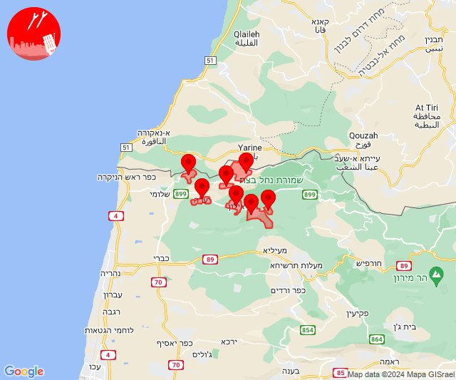
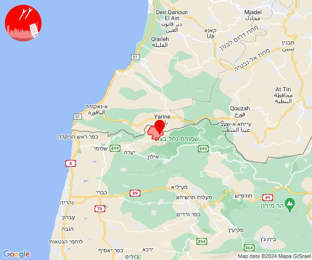
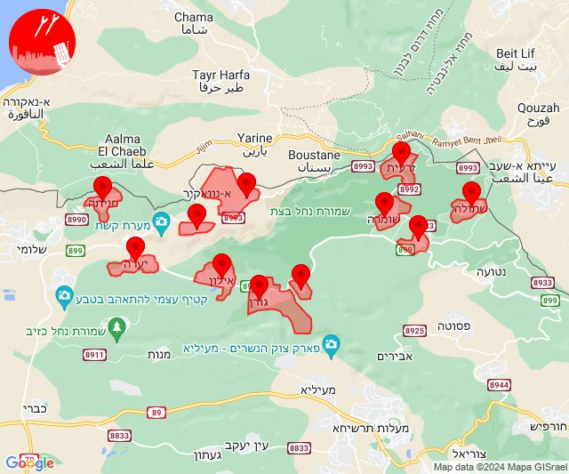
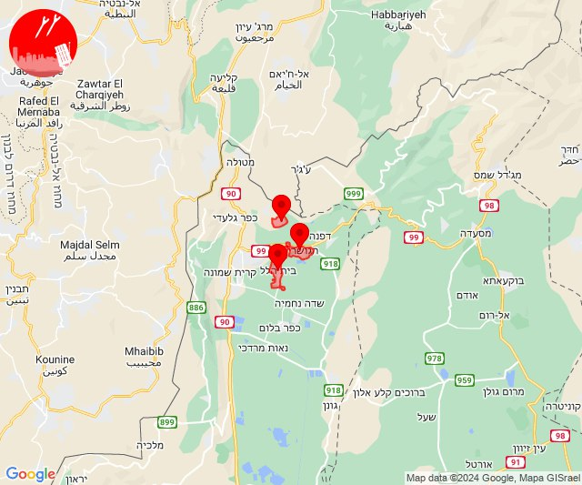
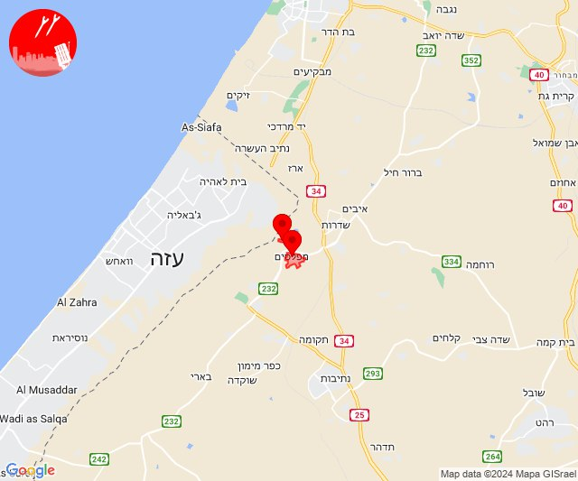
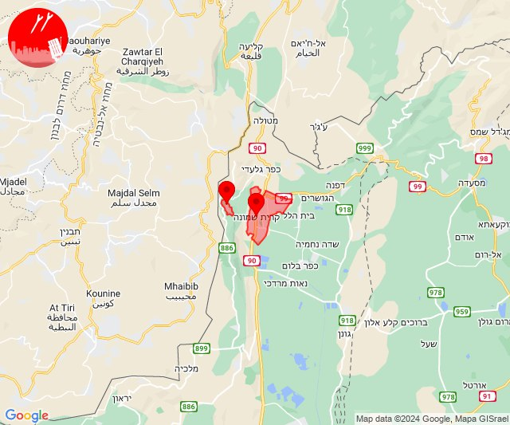
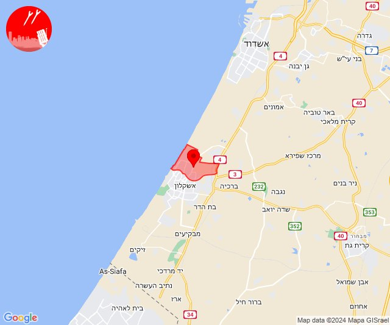

# Alerts for 2024-04-18

## 02:55

🔴 צבע אדום (18/04/2024):

05:55:
• קו העימות: מטולה (מיידי)

צופר - צבע אדום

## 02:55

## 09:45

✈️ חדירת כלי טיס עוין (18/04/2024):

12:45:
• קו העימות: יערה, גורנות הגליל, גורן, ערב אל עראמשה, אדמית, אילון, חניתה 

צופר - צבע אדום

## 09:45

## 14:56

✈️ חדירת כלי טיס עוין (18/04/2024):

17:56:
• קו העימות: אדמית, אילון, גורן, גורנות הגליל, חניתה, יערה, ערב אל עראמשה 

צופר - צבע אדום

## 14:56

## 15:02

🔴 צבע אדום (18/04/2024):

18:02:
• קו העימות: ערב אל עראמשה (מיידי)

צופר - צבע אדום

## 15:02

## 15:55

✈️ חדירת כלי טיס עוין (18/04/2024):

18:55:
• קו העימות: אבן מנחם, אדמית, אילון, גורן, גורנות הגליל, זרעית, חניתה, יערה, ערב אל עראמשה, שומרה, שתולה 

צופר - צבע אדום

## 15:55

## 17:16

🔴 צבע אדום (18/04/2024):

20:16:
• קו העימות: מעיין ברוך, בית הלל, הגושרים (מיידי)

צופר - צבע אדום

## 17:16

## 18:01

🔴 צבע אדום (18/04/2024):

21:01:
• עוטף עזה: מפלסים, מטווח ניר עם (15 שניות)

צופר - צבע אדום

## 18:01

## 18:43

🔴 צבע אדום (18/04/2024):

21:42:
• קו העימות: מרגליות (מיידי)

21:43:
• קו העימות: קריית שמונה (מיידי)

צופר - צבע אדום

## 18:43

## 19:01

🔴 צבע אדום (18/04/2024):

22:01:
• מערב לכיש: אשקלון - צפון (30 שניות)

צופר - צבע אדום

## 19:01

