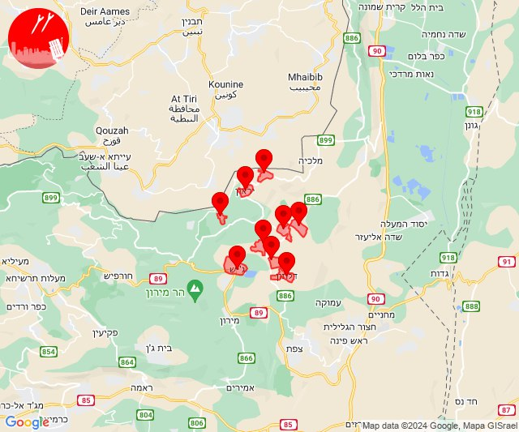
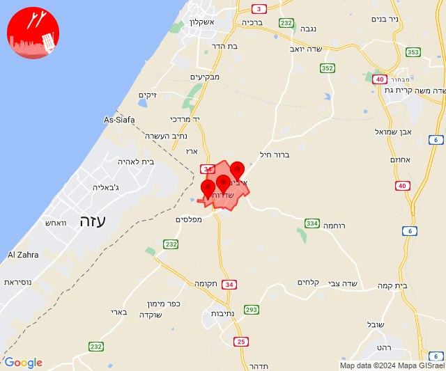

# Alerts for 2024-04-19

## 02:46

✈️ חדירת כלי טיס עוין (19/04/2024):

05:46:
• קו העימות: אביבים, אזור תעשייה רמת דלתון, ברעם, ג'ש - גוש חלב, דלתון, יראון, כרם בן זמרה, עלמה, ריחאנייה 

צופר - צבע אדום

## 02:46

## 17:02

🔴 צבע אדום (19/04/2024):

20:02:
• עוטף עזה: שדרות, איבים, ניר עם (15 שניות)

צופר - צבע אדום

## 17:02

