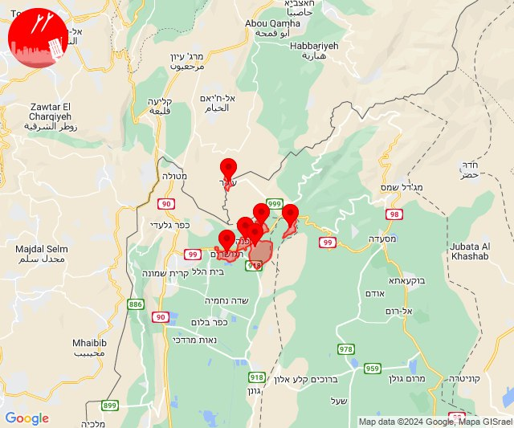
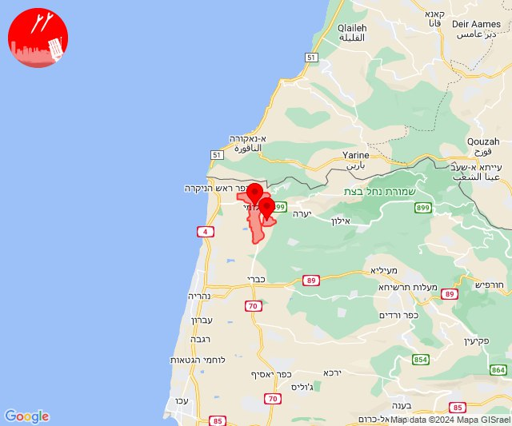

# Alerts for 2024-04-20

## 04:46

✈️ חדירת כלי טיס עוין (20/04/2024):

07:46:
• קו העימות: אביבים, אזור תעשייה רמת דלתון, ברעם, ג'ש - גוש חלב, דלתון, יראון, כרם בן זמרה, עלמה, ריחאנייה 

צופר - צבע אדום

## 04:46

## 06:52

🔴 צבע אדום (20/04/2024):

09:52:
• קו העימות: סאסא (מיידי)

צופר - צבע אדום

## 06:52

## 07:40

✈️ חדירת כלי טיס עוין (20/04/2024):

10:40:
• קו העימות: מטולה, בית הלל, מעיין ברוך, משגב עם, מרגליות, כפר יובל, כפר גלעדי, מנרה, קריית שמונה, תל חי 

צופר - צבע אדום

## 07:40

## 08:52

✈️ חדירת כלי טיס עוין (20/04/2024):

11:52:
• קו העימות: דפנה, הגושרים, ע'ג'ר, קיבוץ דן, שאר ישוב, שניר 

צופר - צבע אדום

## 08:52

## 09:28

✈️ חדירת כלי טיס עוין (20/04/2024):

12:28:
• קו העימות: קריית שמונה, מרגליות, הגושרים, שאר ישוב, משגב עם, קיבוץ דן, מעיין ברוך, תל חי, כפר גלעדי, ע'ג'ר, מטולה, מנרה, כפר יובל, שניר, בית הלל, דפנה 

צופר - צבע אדום

## 09:28

## 09:59

✈️ חדירת כלי טיס עוין (20/04/2024):

12:59:
• קו העימות: בית הלל, כפר גלעדי, כפר יובל, מטולה, מנרה, מעיין ברוך, מרגליות, משגב עם, קריית שמונה, תל חי 

צופר - צבע אדום

## 09:59

## 11:00

🔴 צבע אדום (20/04/2024):

14:00:
• קו העימות: אבן מנחם (מיידי)

צופר - צבע אדום

## 11:00

## 14:50

🔴 צבע אדום (20/04/2024):

17:50:
• קו העימות: מצובה, שלומי (מיידי)

צופר - צבע אדום

## 14:50

## 17:49

🔴 צבע אדום (20/04/2024):

20:49:
• עוטף עזה: כיסופים (15 שניות)

צופר - צבע אדום

## 17:49

