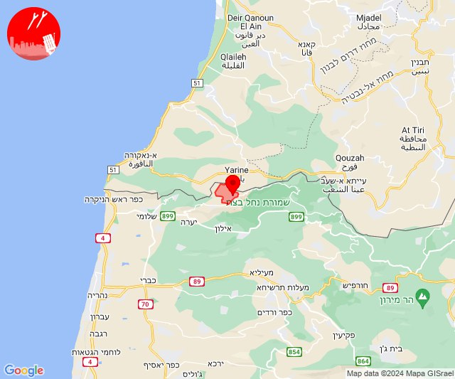
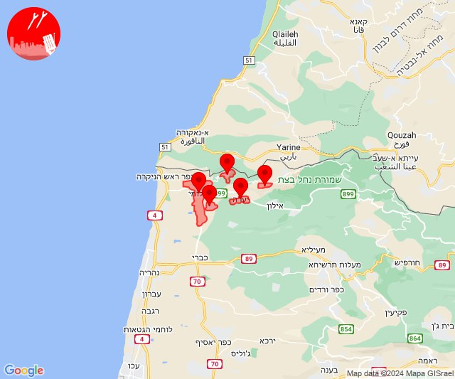
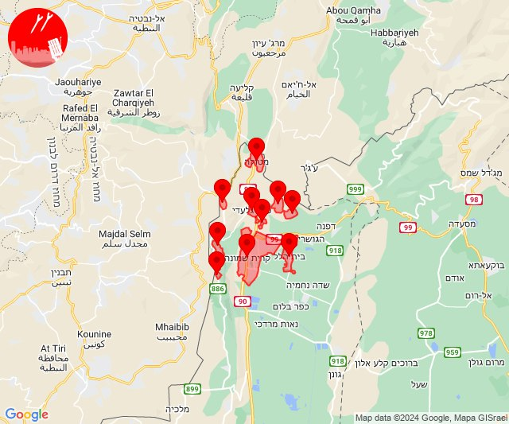
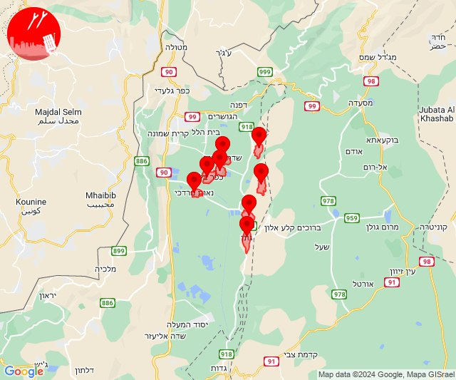
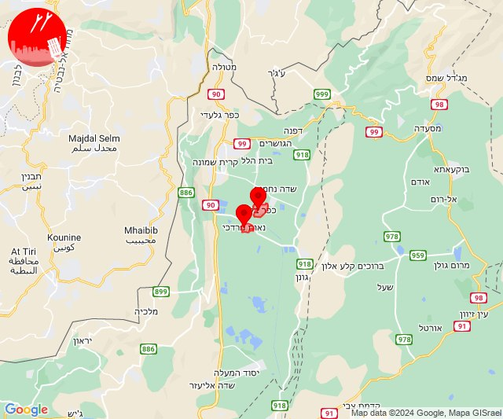
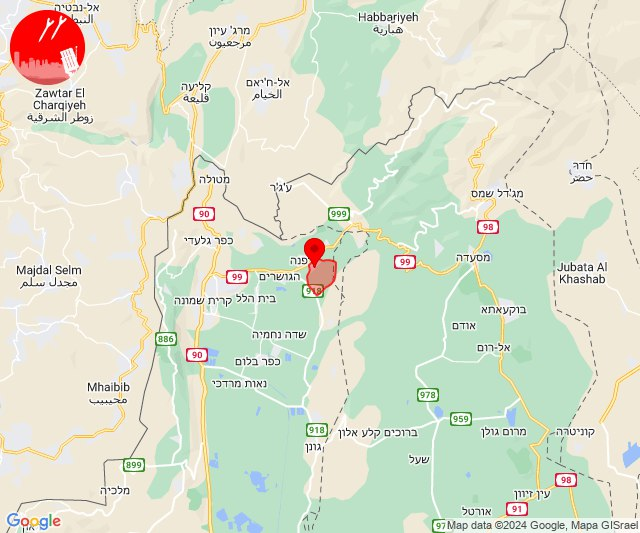
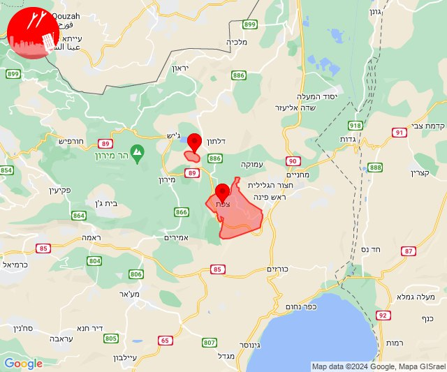
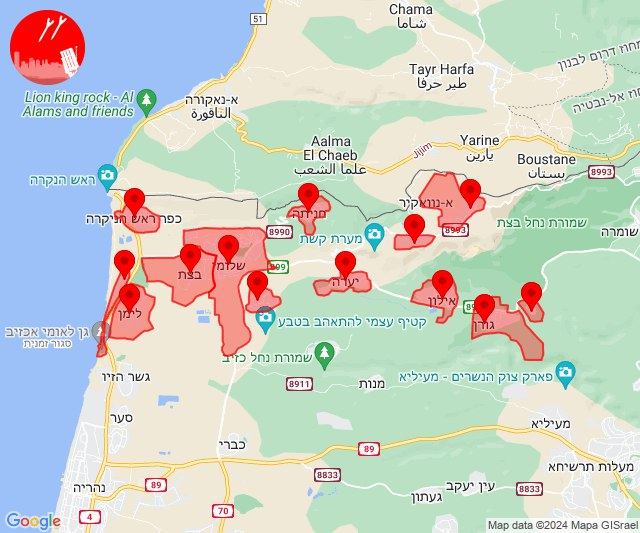

# Alerts for 2024-04-22

## 03:58

🔴 צבע אדום (22/04/2024):

06:58:
• קו העימות: ערב אל עראמשה (מיידי)

צופר - צבע אדום

## 03:58

## 06:53

🔴 צבע אדום (22/04/2024):

09:53:
• קו העימות: אדמית, חניתה, יערה, מצובה, שלומי (מיידי)

צופר - צבע אדום

## 06:53

## 11:14

✈️ חדירת כלי טיס עוין (22/04/2024):

14:14:
• קו העימות: בית הלל, כפר גלעדי, כפר יובל, מטולה, מנרה, מעיין ברוך, מרגליות, משגב עם, קריית שמונה, תל חי 

צופר - צבע אדום

## 11:14

## 11:18

✈️ חדירת כלי טיס עוין (22/04/2024):

14:18:
• קו העימות: כפר סאלד, כפר בלום, שדה נחמיה, שמיר, להבות הבשן, גונן, נאות מרדכי, עמיר 

צופר - צבע אדום

## 11:18

## 11:19

🔴 צבע אדום (22/04/2024):

14:19:
• קו העימות: נאות מרדכי, כפר בלום (מיידי)

צופר - צבע אדום

## 11:19

## 11:34

🔴 צבע אדום (22/04/2024):

14:34:
• קו העימות: שאר ישוב (מיידי)

צופר - צבע אדום

## 11:34

## 15:57

🔴 צבע אדום (22/04/2024):

18:57:
• גליל עליון: קדיתא, צפת (30 שניות)

צופר - צבע אדום

## 15:57

## 16:00

✈️ חדירת כלי טיס עוין (22/04/2024):

19:00:
• קו העימות: ראש הנקרה, לימן, שלומי, בצת, אילון, חניתה, אדמית, אזור תעשייה אכזיב מילואות, גורן, ערב אל עראמשה, מצובה, יערה, גורנות הגליל 

צופר - צבע אדום

## 16:00

