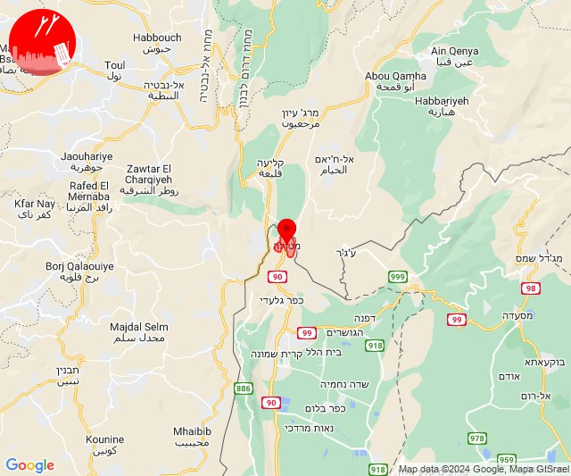
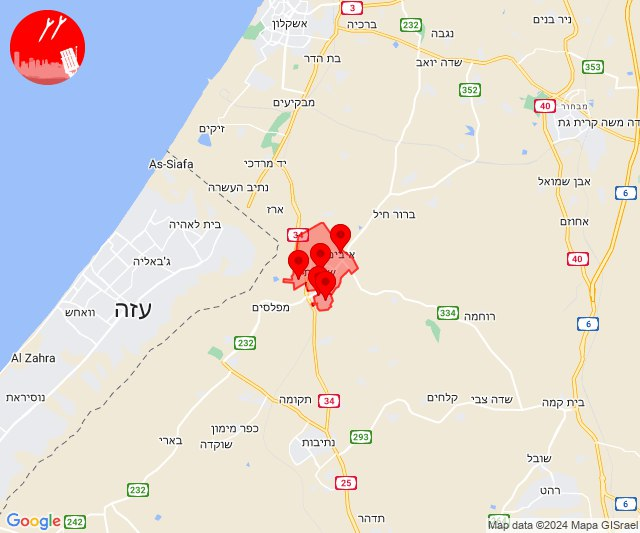
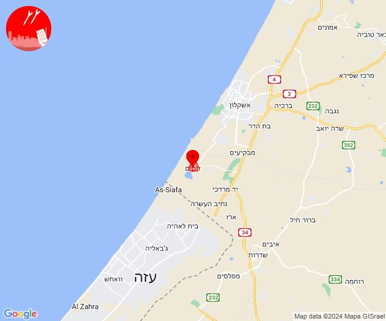
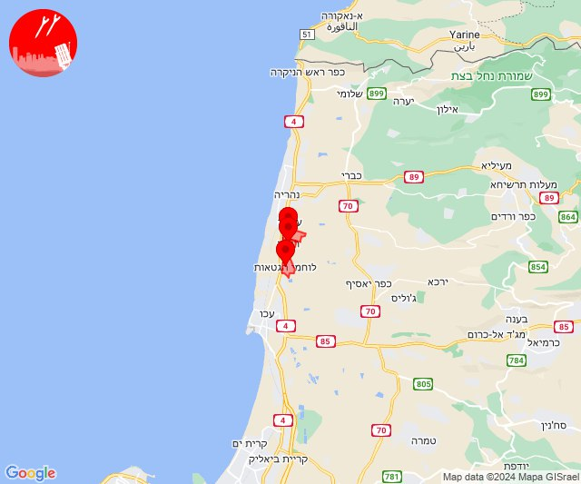
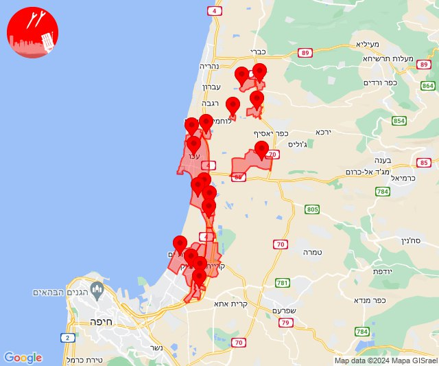
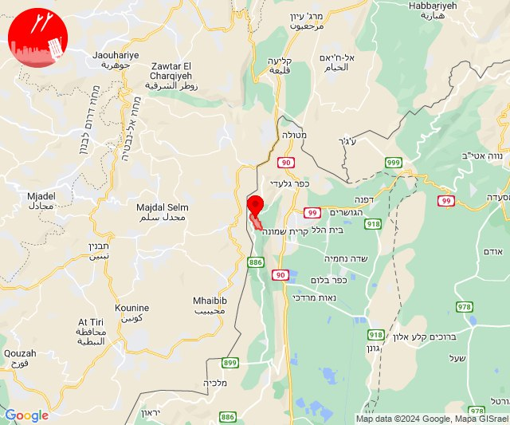
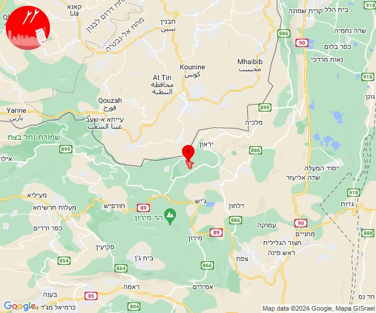
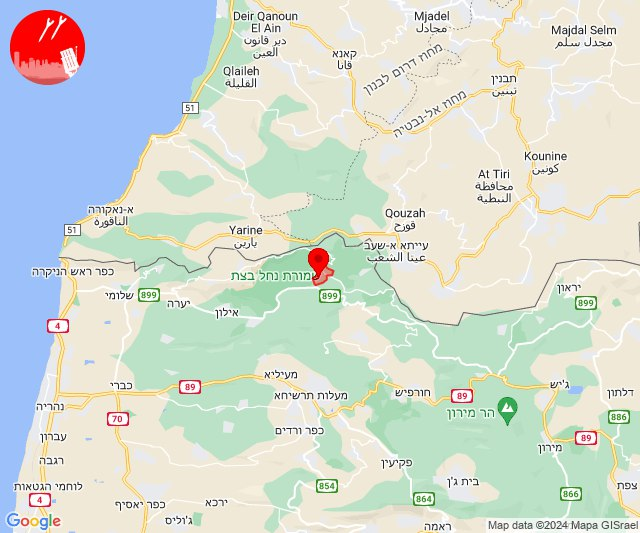
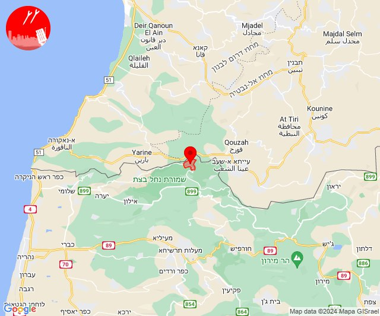
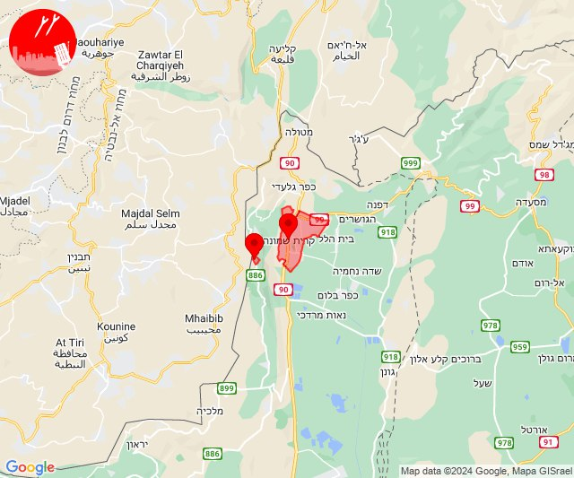

# Alerts for 2024-04-23

## 01:09

🔴 צבע אדום (23/04/2024):

04:09:
• קו העימות: מטולה (מיידי)

צופר - צבע אדום

## 01:09

## 01:13

🔴 צבע אדום (23/04/2024):

04:13:
• קו העימות: מטולה (מיידי)

צופר - צבע אדום

## 01:13

## 06:34

🔴 צבע אדום (23/04/2024):

09:34:
• עוטף עזה: גבים, מכללת ספיר, שדרות, איבים, ניר עם (15 שניות)

צופר - צבע אדום

## 06:34

## 09:26

🔴 צבע אדום (23/04/2024):

12:26:
• עוטף עזה: זיקים (15 שניות)

צופר - צבע אדום

## 09:26

## 10:08

✈️ חדירת כלי טיס עוין (23/04/2024):

13:08:
• גליל עליון: לוחמי הגטאות, מזרעה, רגבה 

צופר - צבע אדום

## 10:08

## 10:41

✈️ חדירת כלי טיס עוין (23/04/2024):

13:41:
• גליל עליון: מזרעה, רגבה, לוחמי הגטאות 

צופר - צבע אדום

## 10:41

## 10:47

✈️ חדירת כלי טיס עוין (23/04/2024):

13:45:
• גליל עליון: בוסתן הגליל, בית העמק, ג'דידה מכר, כפר מסריק, נס עמים, נתיב השיירה, עין המפרץ, עכו - אזור תעשייה, עכו, שומרת, שייח' דנון 

13:47:
• גליל עליון: אזור תעשייה שער נעמן 
• המפרץ: כפר ביאליק, קריית ביאליק, קריית ים, קריית מוצקין 

צופר - צבע אדום

## 10:47

## 10:47

🔴 צבע אדום (23/04/2024):

13:47:
• גליל עליון: עכו (30 שניות)

צופר - צבע אדום

## 10:47

## 13:10

🔴 צבע אדום (23/04/2024):

16:10:
• קו העימות: מרגליות, מרגליות (מיידי)

צופר - צבע אדום

## 13:10

## 13:24

🔴 צבע אדום (23/04/2024):

16:24:
• קו העימות: ברעם (מיידי)

צופר - צבע אדום

## 13:24

## 16:08

🔴 צבע אדום (23/04/2024):

19:08:
• קו העימות: שומרה (מיידי)

צופר - צבע אדום

## 16:08

## 16:12

🔴 צבע אדום (23/04/2024):

19:12:
• קו העימות: זרעית (מיידי)

צופר - צבע אדום

## 16:12

## 16:31

🔴 צבע אדום (23/04/2024):

19:31:
• קו העימות: קריית שמונה, מנרה (מיידי)

צופר - צבע אדום

## 16:31

