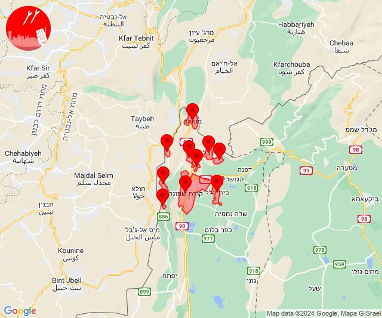
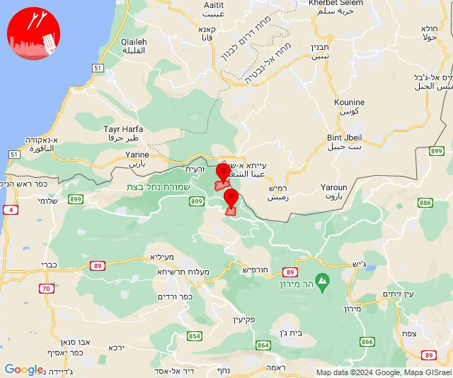
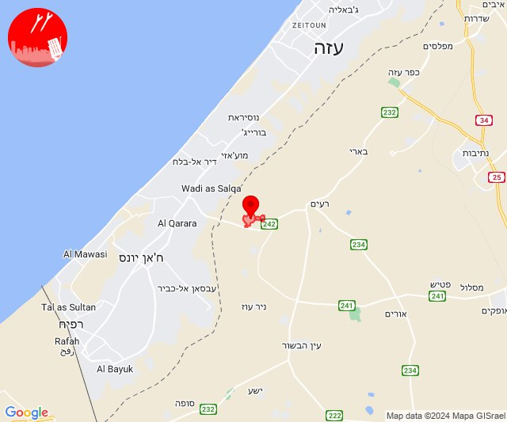
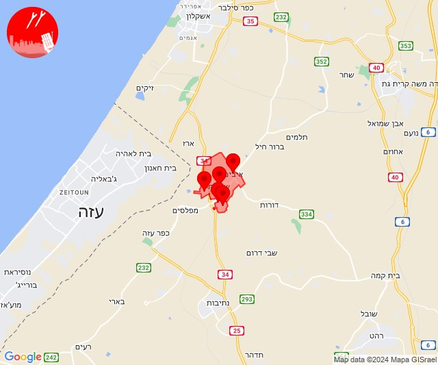
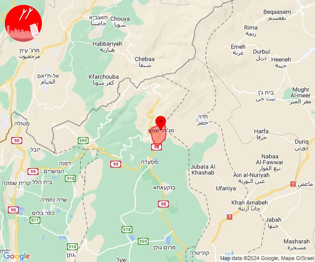

# Alerts for 2024-04-24

## 06:31

✈️ חדירת כלי טיס עוין (24/04/2024):

09:31:
• קו העימות: בית הלל, כפר גלעדי, כפר יובל, מטולה, מנרה, מעיין ברוך, מרגליות, משגב עם, קריית שמונה, תל חי 

צופר - צבע אדום

## 06:31

## 07:06

🔴 צבע אדום (24/04/2024):

10:05:
• קו העימות: נטועה, שתולה (מיידי)

10:06:
• קו העימות: שתולה (מיידי)

צופר - צבע אדום

## 07:06

## 11:33

🔴 צבע אדום (24/04/2024):

14:33:
• עוטף עזה: כיסופים (15 שניות)

צופר - צבע אדום

## 11:34

## 14:57

🔴 צבע אדום (24/04/2024):

17:57:
• עוטף עזה: שדרות, איבים, ניר עם, גבים, מכללת ספיר (15 שניות)

צופר - צבע אדום

## 14:57

## 15:05

🔴 צבע אדום (24/04/2024):

18:05:
• צפון הגולן: מג'דל שמס (מיידי)

צופר - צבע אדום

## 15:05

