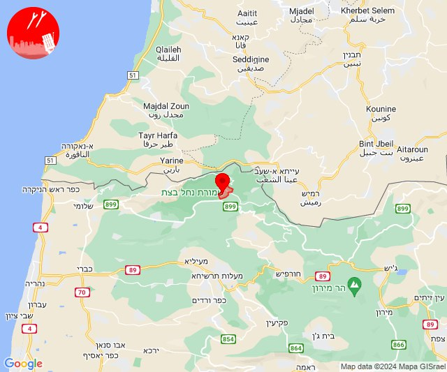
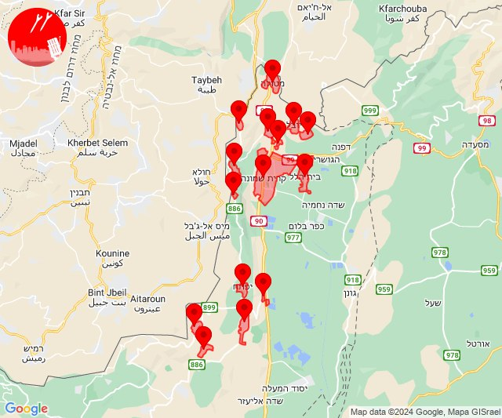
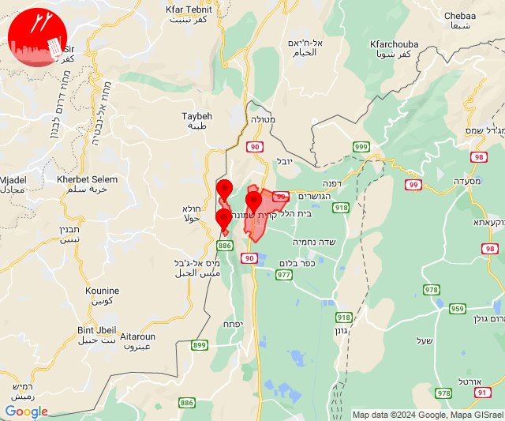
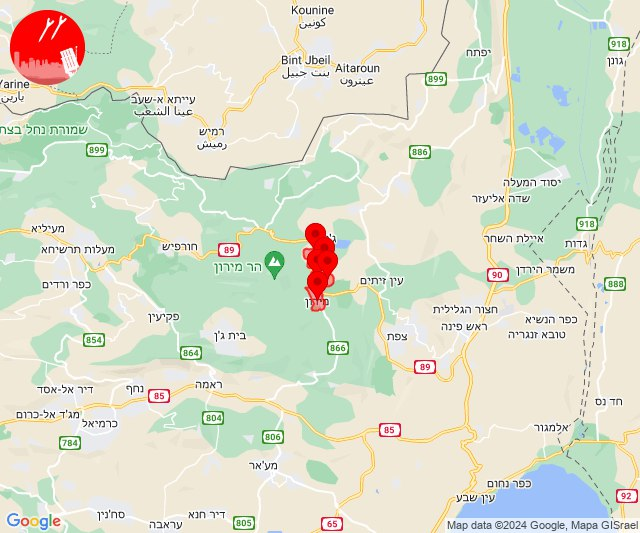

# Alerts for 2024-04-27

## 05:33

🔴 צבע אדום (27/04/2024):

08:33:
• קו העימות: שומרה (מיידי)

צופר - צבע אדום

## 05:33

## 14:05

✈️ חדירת כלי טיס עוין (27/04/2024):

17:05:
• קו העימות: בית הלל, כפר גלעדי, כפר יובל, מטולה, מנרה, מעיין ברוך, מרגליות, משגב עם, קריית שמונה, תל חי, דישון, יפתח, מלכיה, מרכז אזורי מבואות חרמון, רמות נפתלי 

צופר - צבע אדום

## 14:05

## 14:09

🔴 צבע אדום (27/04/2024):

17:09:
• קו העימות: מנרה, מרגליות, קריית שמונה (מיידי)

צופר - צבע אדום

## 14:09

## 14:12

🔴 צבע אדום (27/04/2024):

17:12:
• קו העימות: מרגליות, מנרה, קריית שמונה (מיידי)

צופר - צבע אדום

## 14:12

## 20:52

🔴 צבע אדום (27/04/2024):

23:51:
• גליל עליון: מירון, מרכז אזורי מרום גליל, ספסופה - כפר חושן, אור הגנוז, בר יוחאי (30 שניות)

23:52:
• גליל עליון: מירון, מרכז אזורי מרום גליל, ספסופה - כפר חושן (30 שניות)

צופר - צבע אדום

## 20:52

