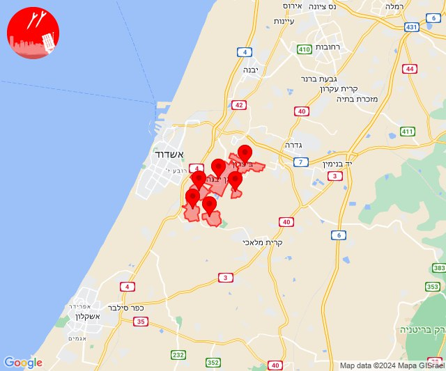
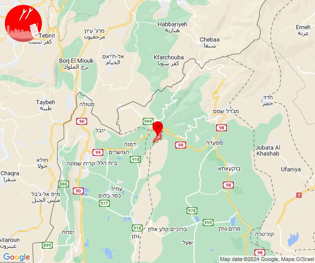
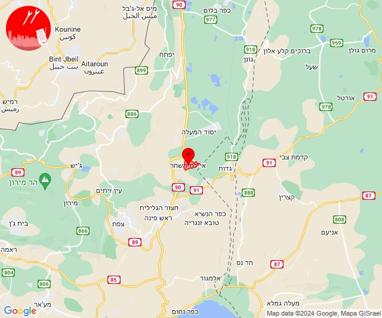
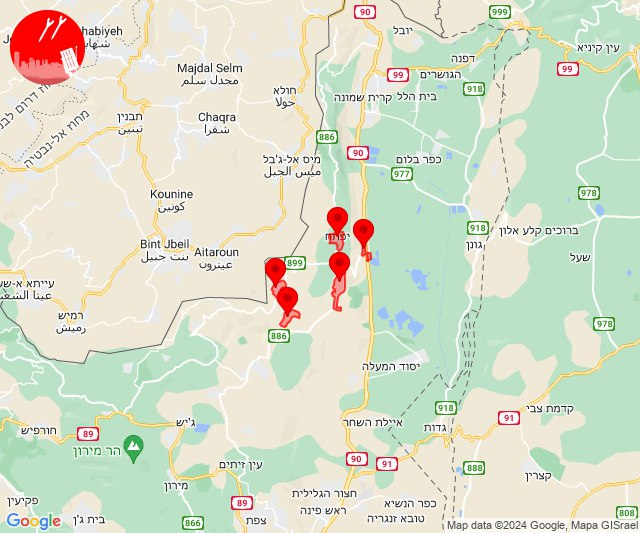
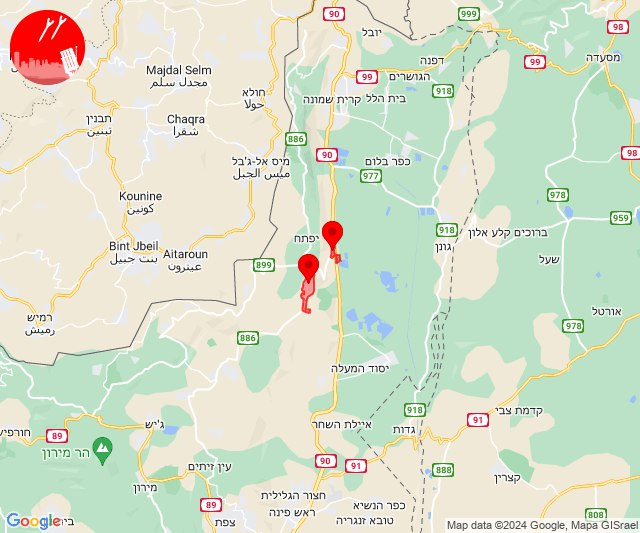
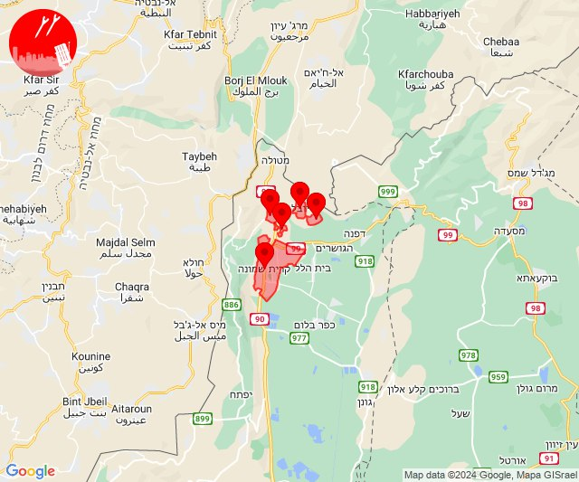
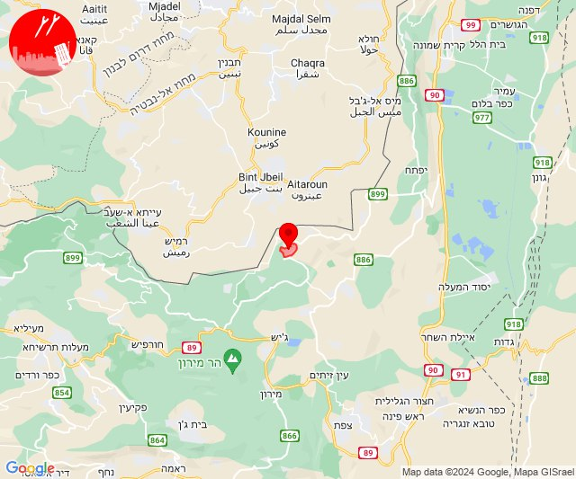

# Alerts for 2024-08-04

## 09:10

🔴 צבע אדום (04/08/2024):

12:09:
• לכיש: ביצרון (דקה)

12:10:
• לכיש: גן יבנה, חצור, עזריקם, שדה עוזיהו, שתולים (45 שניות)

צופר - צבע אדום

## 09:10

## 10:09

🔴 צבע אדום (04/08/2024):

13:09:
• קו העימות: שניר (מיידי)

צופר - צבע אדום

## 10:09

## 21:04

🔴 צבע אדום (05/08/2024):

00:04:
• קו העימות: שניר (מיידי)

צופר - צבע אדום

## 21:04

## 22:59

✈️ חדירת כלי טיס עוין (05/08/2024):

01:59:
• גליל עליון: איילת השחר 

צופר - צבע אדום

## 22:59

## 23:02

🔴 צבע אדום (05/08/2024):

02:01:
• קו העימות: יפתח (מיידי)

02:02:
• קו העימות: יפתח, דישון, מלכיה, מרכז אזורי מבואות חרמון, רמות נפתלי (מיידי)

צופר - צבע אדום

## 23:02

## 23:03

✈️ חדירת כלי טיס עוין (05/08/2024):

02:01:
• קו העימות: רמות נפתלי 

02:02:
• קו העימות: מרכז אזורי מבואות חרמון 

02:03:
• קו העימות: מרכז אזורי מבואות חרמון, רמות נפתלי 

צופר - צבע אדום

## 23:03

## 23:08

✈️ חדירת כלי טיס עוין (05/08/2024):

02:08:
• גליל עליון: איילת השחר 

צופר - צבע אדום

## 23:08

## 23:19

✈️ חדירת כלי טיס עוין (05/08/2024):

02:18:
• קו העימות: כפר גלעדי, כפר יובל, מעיין ברוך 

02:19:
• קו העימות: תל חי, כפר גלעדי, קריית שמונה 

צופר - צבע אדום

## 23:19

## 23:29

🔴 צבע אדום (05/08/2024):

02:29:
• קו העימות: יראון (מיידי)

צופר - צבע אדום

## 23:29

