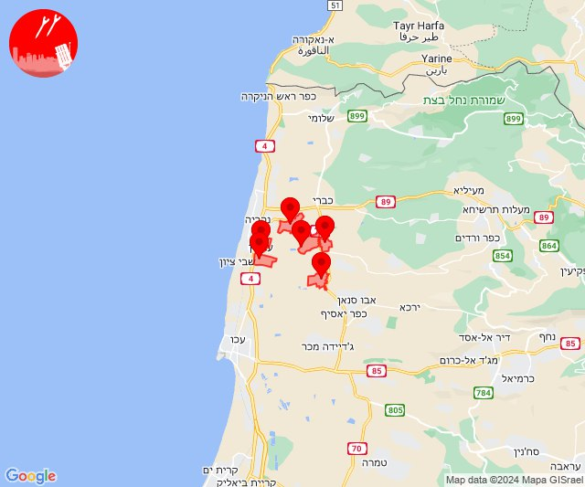
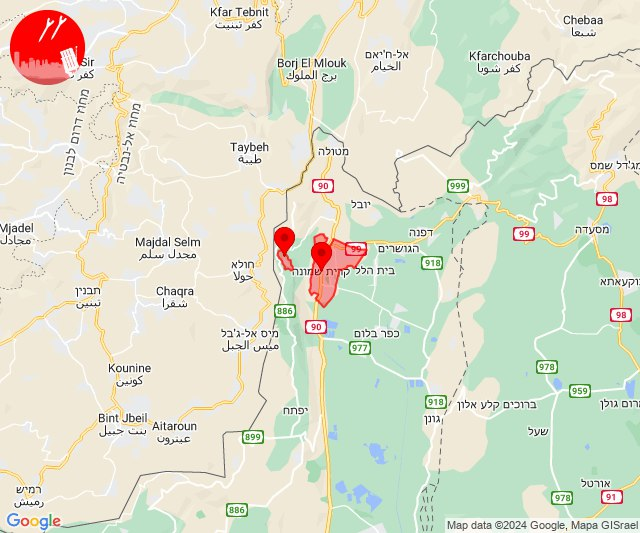
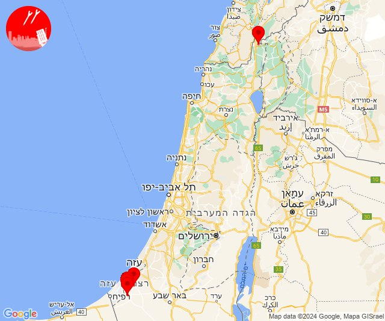
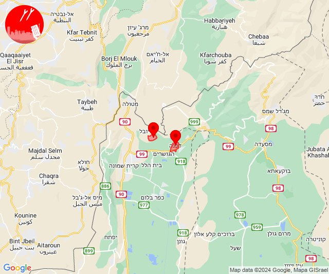
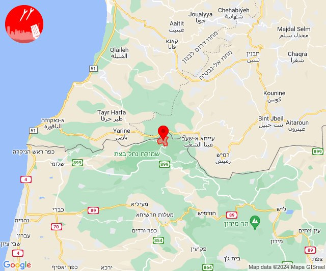
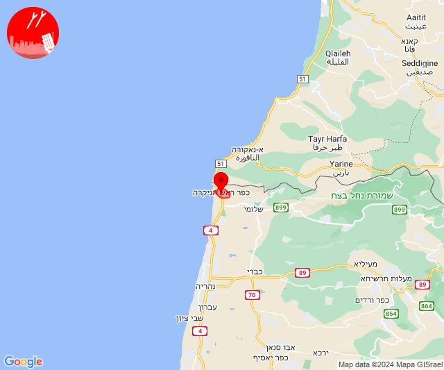
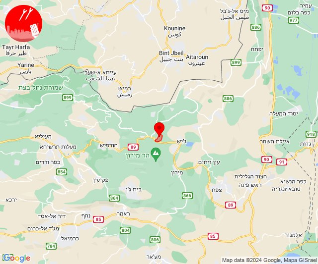
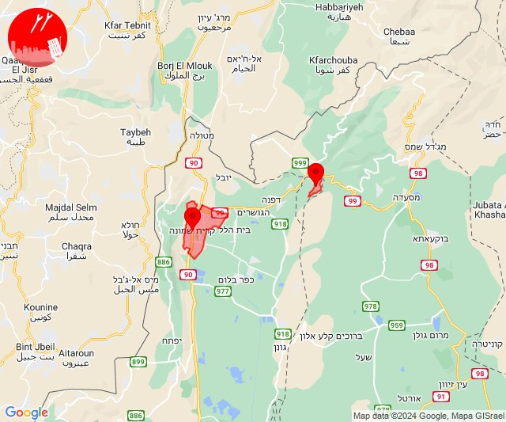

# Alerts for 2024-08-05

## 04:26

🔴 צבע אדום (05/08/2024):

07:26:
• גליל עליון: בית העמק, נתיב השיירה, שייח' דנון, מזרעה (30 שניות)
• קו העימות: בן עמי, עברון (מיידי, 15 שניות)

צופר - צבע אדום

## 04:26

## 07:05

🔴 צבע אדום (05/08/2024):

10:05:
• קו העימות: מרגליות, קריית שמונה (מיידי)

צופר - צבע אדום

## 07:05

## 08:50

🔴 צבע אדום (05/08/2024):

11:49:
• עוטף עזה: נירים, עין השלושה (15 שניות)

11:50:
• עוטף עזה: ניר עוז, רעים, נירים (15 שניות)
• קו העימות: כפר יובל (מיידי)

צופר - צבע אדום

## 08:50

## 08:52

🔴 צבע אדום (05/08/2024):

11:52:
• קו העימות: מעיין ברוך, דפנה (מיידי)

צופר - צבע אדום

## 08:52

## 09:36

🔴 צבע אדום (05/08/2024):

12:35:
• קו העימות: זרעית (מיידי)

12:36:
• קו העימות: זרעית (מיידי)

צופר - צבע אדום

## 09:36

## 09:48

🔴 צבע אדום (05/08/2024):

12:48:
• קו העימות: ראש הנקרה (מיידי)

צופר - צבע אדום

## 09:48

## 17:38

🔴 צבע אדום (05/08/2024):

20:38:
• קו העימות: נטועה (מיידי)

צופר - צבע אדום

## 17:38

## 17:46

🔴 צבע אדום (05/08/2024):

20:45:
• קו העימות: צבעון (מיידי)

20:46:
• קו העימות: צבעון (מיידי)

צופר - צבע אדום

## 17:46

## 17:46

✈️ חדירת כלי טיס עוין (05/08/2024):

20:42:
• קו העימות: חורפיש, צוריאל 

20:43:
• קו העימות: חורפיש 

20:44:
• קו העימות: בית ספר שדה מירון 

20:45:
• קו העימות: בית ספר שדה מירון 

20:46:
• קו העימות: ג'ש - גוש חלב, כרם בן זמרה 

צופר - צבע אדום

## 17:46

## 19:27

🔴 צבע אדום (05/08/2024):

22:27:
• קו העימות: קריית שמונה, שניר (מיידי)

צופר - צבע אדום

## 19:28

