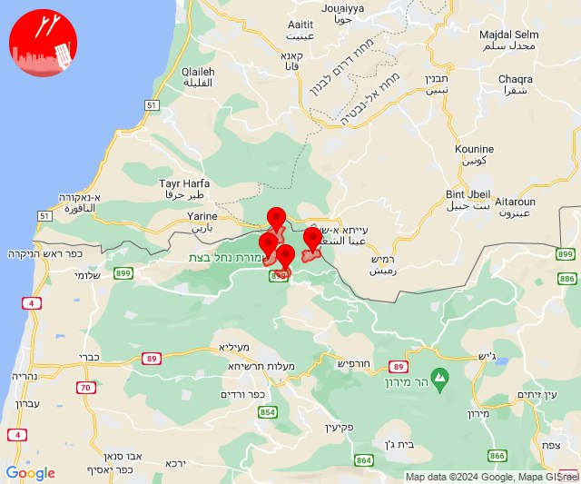

# Alerts for 2024-08-06

## 02:27

🔴 צבע אדום (06/08/2024):

05:27:
• קו העימות: כרם בן זמרה, ג'ש - גוש חלב (מיידי)

צופר - צבע אדום

## 02:27

## 08:38

🔴 צבע אדום (06/08/2024):

11:38:
• קו העימות: כפר גלעדי, מרגליות, משגב עם, קריית שמונה, תל חי (מיידי)

צופר - צבע אדום

## 08:38

## 09:21

✈️ חדירת כלי טיס עוין (06/08/2024):

12:16:
• קו העימות: חניתה 

12:17:
• קו העימות: שלומי 

12:18:
• קו העימות: שלומי, בצת 

12:19:
• קו העימות: שלומי, לימן, בצת 

12:20:
• קו העימות: גשר הזיו, נהריה, אזור תעשייה אכזיב מילואות, לימן 

12:21:
• קו העימות: סער 
• גליל עליון: לוחמי הגטאות 

צופר - צבע אדום

## 09:21

## 09:25

🔴 צבע אדום (06/08/2024):

12:24:
• קו העימות: נהריה, עברון, בן עמי (15 שניות, מיידי)
• גליל עליון: לוחמי הגטאות, מזרעה (30 שניות)

12:25:
• קו העימות: נהריה, עברון (15 שניות)
• גליל עליון: לוחמי הגטאות, מזרעה (30 שניות)

צופר - צבע אדום

## 09:25

## 09:26

✈️ חדירת כלי טיס עוין (06/08/2024):

12:22:
• קו העימות: נהריה 

12:23:
• קו העימות: עברון, בן עמי 
• גליל עליון: נתיב השיירה, מזרעה 

12:24:
• גליל עליון: שבי ציון, רגבה, לוחמי הגטאות 

12:25:
• גליל עליון: שבי ציון, רגבה, בוסתן הגליל, שומרת 
• קו העימות: נהריה 

12:26:
• גליל עליון: עכו 

צופר - צבע אדום

## 09:26

## 09:56

✈️ חדירת כלי טיס עוין (06/08/2024):

12:56:
• גליל עליון: בוסתן הגליל, עכו, שומרת 

צופר - צבע אדום

## 09:56

## 12:46

🔴 צבע אדום (06/08/2024):

15:46:
• קו העימות: הילה (מיידי)

צופר - צבע אדום

## 12:46

## 12:50

✈️ חדירת כלי טיס עוין (06/08/2024):

15:50:
• צפון הגולן: שעל, קלע 

צופר - צבע אדום

## 12:50

## 12:53

🔴 צבע אדום (06/08/2024):

15:53:
• קו העימות: אבן מנחם, זרעית, שומרה, שתולה (מיידי)

צופר - צבע אדום

## 12:53

## 14:00

🔴 צבע אדום (06/08/2024):

17:00:
• קו העימות: ברעם (מיידי)

צופר - צבע אדום

## 14:00

## 14:20

✈️ חדירת כלי טיס עוין (06/08/2024):

17:20:
• צפון הגולן: קלע, שעל 

צופר - צבע אדום

## 14:20

## 15:26

🔴 צבע אדום (06/08/2024):

18:26:
• קו העימות: דפנה, הגושרים, כפר סאלד, קיבוץ דן, שאר ישוב, שניר (מיידי, 15 שניות)
• צפון הגולן: מסעדה (מיידי)

צופר - צבע אדום

## 15:26

## 16:03

🔴 צבע אדום (06/08/2024):

19:00:
• קו העימות: כפר גלעדי, קריית שמונה, תל חי, מטולה, כפר יובל (מיידי)

19:01:
• קו העימות: קריית שמונה, תל חי, כפר גלעדי, מטולה, כפר יובל (מיידי)

19:02:
• קו העימות: מעיין ברוך, תל חי, קריית שמונה, כפר גלעדי, מטולה, ע'ג'ר, כפר יובל (מיידי)

19:03:
• קו העימות: מטולה (מיידי)

צופר - צבע אדום

## 16:03

## 17:59

🔴 צבע אדום (06/08/2024):

20:58:
• מערב לכיש: אשקלון - דרום, אזור תעשייה הדרומי אשקלון (30 שניות)
• עוטף עזה: שדרות, איבים, ניר עם (15 שניות)

20:59:
• עוטף עזה: זיקים (15 שניות)

צופר - צבע אדום

## 17:59

## 19:31

✈️ חדירת כלי טיס עוין (06/08/2024):

22:31:
• קו העימות: ע'ג'ר 
• צפון הגולן: קלע, שעל 

צופר - צבע אדום

## 19:31

## 19:33

✈️ חדירת כלי טיס עוין (06/08/2024):

22:33:
• קו העימות: דפנה, הגושרים 

צופר - צבע אדום

## 19:33

