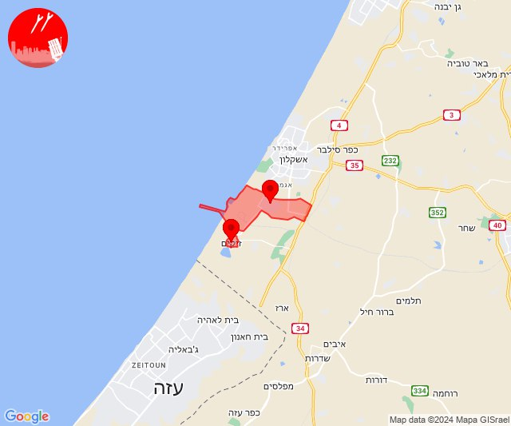
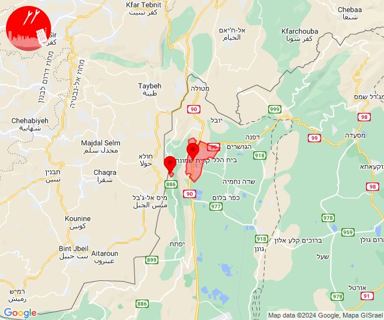
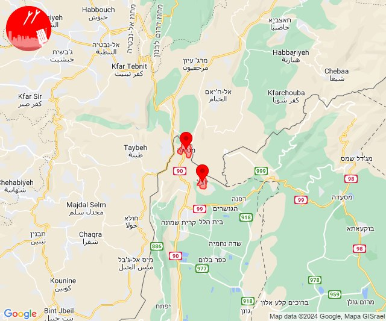
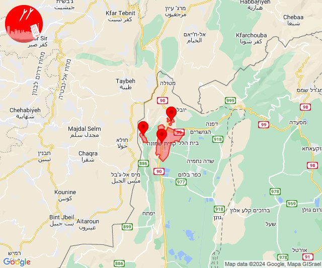
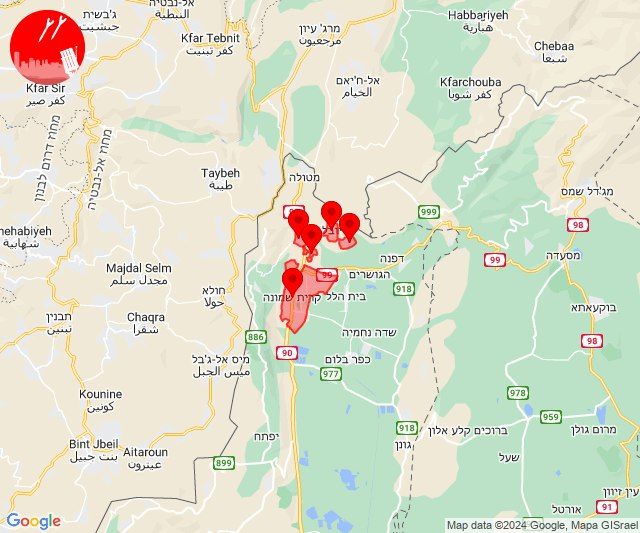
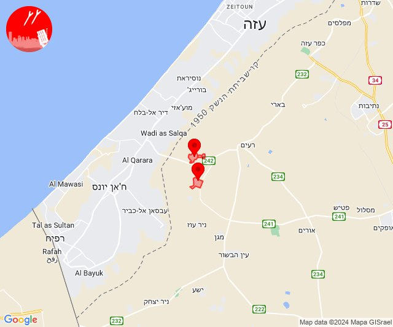
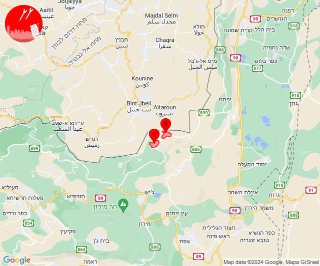
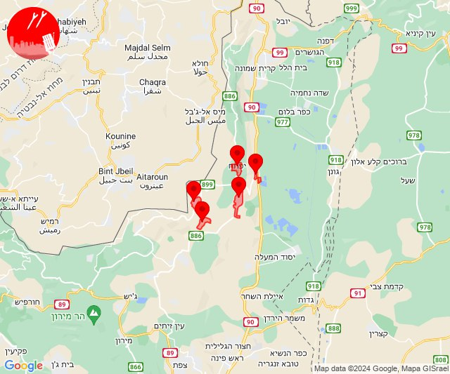

# Alerts for 2024-08-09

## 02:56

🔴 צבע אדום (09/08/2024):

05:56:
• מערב לכיש: אזור תעשייה הדרומי אשקלון (30 שניות)
• עוטף עזה: זיקים (15 שניות)

צופר - צבע אדום

## 02:56

## 03:22

🔴 צבע אדום (09/08/2024):

06:21:
• קו העימות: קריית שמונה, מנרה (מיידי)

06:22:
• קו העימות: מנרה (מיידי)

צופר - צבע אדום

## 03:22

## 06:41

🔴 צבע אדום (09/08/2024):

09:41:
• קו העימות: מטולה, כפר יובל (מיידי)

צופר - צבע אדום

## 06:41

## 08:45

🔴 צבע אדום (09/08/2024):

11:45:
• קו העימות: קריית שמונה, תל חי, מרגליות (מיידי)

צופר - צבע אדום

## 08:45

## 09:30

🔴 צבע אדום (09/08/2024):

12:30:
• קו העימות: קריית שמונה, תל חי, מעיין ברוך, כפר גלעדי, כפר יובל (מיידי)

צופר - צבע אדום

## 09:30

## 11:02

🔴 צבע אדום (09/08/2024):

14:02:
• עוטף עזה: כיסופים, עין השלושה (15 שניות)

צופר - צבע אדום

## 11:02

## 13:07

🔴 צבע אדום (09/08/2024):

16:07:
• קו העימות: אביבים, יראון (מיידי)

צופר - צבע אדום

## 13:07

## 14:41

✈️ חדירת כלי טיס עוין (09/08/2024):

17:41:
• קו העימות: דישון, יפתח, מלכיה, מרכז אזורי מבואות חרמון, רמות נפתלי 

צופר - צבע אדום

## 14:41

