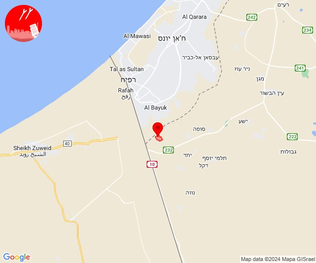

# Alerts for 2024-08-15

## 00:40

✈️ חדירת כלי טיס עוין (15/08/2024):

03:39:
• קו העימות: אבירים, פסוטה 

03:40:
• קו העימות: אלקוש, מעלות תרשיחא, מעונה, מעיליא 

צופר - צבע אדום

## 00:40

## 05:00

🔴 צבע אדום (15/08/2024):

08:00:
• עוטף עזה: כיסופים (15 שניות)

צופר - צבע אדום

## 05:00

## 06:12

🔴 צבע אדום (15/08/2024):

09:11:
• קו העימות: מעיין ברוך (מיידי)

09:12:
• קו העימות: כפר יובל, ע'ג'ר, מעיין ברוך, כפר יובל (מיידי)

צופר - צבע אדום

## 06:12

## 06:23

🔴 צבע אדום (15/08/2024):

09:23:
• עוטף עזה: כיסופים (15 שניות)

צופר - צבע אדום

## 06:23

## 07:51

🔴 צבע אדום (15/08/2024):

10:51:
• קו העימות: מלכיה (מיידי)

צופר - צבע אדום

## 07:51

## 08:11

✈️ חדירת כלי טיס עוין (15/08/2024):

11:11:
• קו העימות: אדמית, אילון, גורן, גורנות הגליל, חניתה, יערה, ערב אל עראמשה 

צופר - צבע אדום

## 08:11

## 08:52

🔴 צבע אדום (15/08/2024):

11:52:
• קו העימות: אלקוש (מיידי)

צופר - צבע אדום

## 08:53

## 11:10

✈️ חדירת כלי טיס עוין (15/08/2024):

14:09:
• צפון הגולן: קלע, שעל 

14:10:
• קו העימות: נאות מרדכי 

צופר - צבע אדום

## 11:10

## 11:29

🔴 צבע אדום (15/08/2024):

14:29:
• קו העימות: שמיר, מנרה, מרגליות, קריית שמונה, כפר בלום, עמיר, שדה נחמיה, בית הלל (15 שניות, מיידי)

צופר - צבע אדום

## 11:29

## 12:02

🔴 צבע אדום (15/08/2024):

15:02:
• עוטף עזה: כרם שלום (15 שניות)

צופר - צבע אדום

## 12:02

## 14:43

🔴 צבע אדום (15/08/2024):

17:43:
• קו העימות: משגב עם (מיידי)

צופר - צבע אדום

## 14:43

## 15:21

✈️ חדירת כלי טיס עוין (15/08/2024):

18:20:
• קו העימות: דישון, יפתח, מלכיה, מרכז אזורי מבואות חרמון, רמות נפתלי 

18:21:
• קו העימות: גונן, כפר בלום, כפר סאלד, להבות הבשן, נאות מרדכי, עמיר, שדה נחמיה, שמיר 

צופר - צבע אדום

## 15:21

## 21:26

🔴 צבע אדום (16/08/2024):

00:26:
• צפון הגולן: נווה אטי''ב (מיידי)

צופר - צבע אדום

## 21:26

## 21:28

✈️ חדירת כלי טיס עוין (16/08/2024):

00:26:
• צפון הגולן: נווה אטי''ב 

00:27:
• צפון הגולן: נמרוד, עין קנייא, מסעדה 

00:28:
• צפון הגולן: עין קנייא, מסעדה 

צופר - צבע אדום

## 21:28

## 21:31

✈️ חדירת כלי טיס עוין (16/08/2024):

00:30:
• צפון הגולן: אודם 

00:31:
• צפון הגולן: אודם 

צופר - צבע אדום

## 21:31

