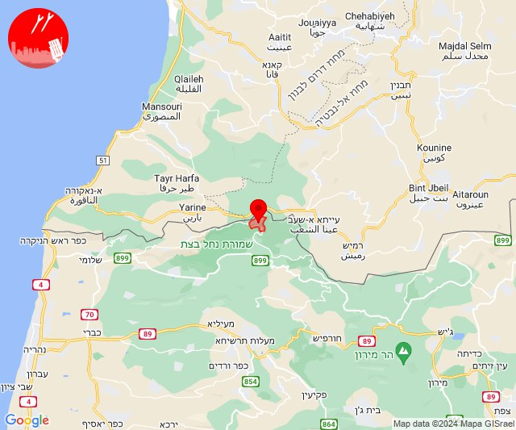

# Alerts for 2024-08-20

## 01:00

🔴 צבע אדום (20/08/2024):

04:00:
• קו העימות: ברעם, דוב''ב (מיידי)

צופר - צבע אדום

## 01:00

## 05:02

🔴 צבע אדום (20/08/2024):

08:01:
• גליל עליון: גדות, יסוד המעלה, חולתה, גדות (30 שניות)

08:02:
• גליל עליון: יסוד המעלה (30 שניות)
• צפון הגולן: אורטל (מיידי)

צופר - צבע אדום

## 05:02

## 05:16

🔴 צבע אדום (20/08/2024):

08:14:
• צפון הגולן: אורטל (מיידי)

08:15:
• קו העימות: מלכיה (מיידי)
• דרום הגולן: קצרין (30 שניות)

08:16:
• גליל עליון: גדות (30 שניות)

צופר - צבע אדום

## 05:16

## 09:22

🔴 צבע אדום (20/08/2024):

12:22:
• קו העימות: שתולה (מיידי)

צופר - צבע אדום

## 09:22

## 09:33

🔴 צבע אדום (20/08/2024):

12:32:
• קו העימות: כברי, אילון, יערה, מנות, עבדון, נווה זיו (מיידי)

12:33:
• קו העימות: כברי (מיידי)

צופר - צבע אדום

## 09:33

## 16:14

✈️ חדירת כלי טיס עוין (20/08/2024):

19:14:
• קו העימות: בית הלל, כפר גלעדי, כפר יובל, מטולה, מנרה, מעיין ברוך, מרגליות, משגב עם, קריית שמונה, תל חי 

צופר - צבע אדום

## 16:14

## 16:20

✈️ חדירת כלי טיס עוין (20/08/2024):

19:16:
• קו העימות: דפנה, הגושרים, ע'ג'ר, קיבוץ דן, שאר ישוב, שניר 

19:18:
• קו העימות: קיבוץ דן, בית הלל, כפר גלעדי, כפר יובל, מטולה, מנרה, מעיין ברוך, מרגליות, משגב עם, קריית שמונה, תל חי 

19:19:
• קו העימות: שאר ישוב, שניר, קיבוץ דן 

19:20:
• קו העימות: שאר ישוב, קיבוץ דן 

צופר - צבע אדום

## 16:20

## 16:28

✈️ חדירת כלי טיס עוין (20/08/2024):

19:25:
• צפון הגולן: מרום גולן 

19:27:
• צפון הגולן: שעל 

19:28:
• צפון הגולן: אורטל 

צופר - צבע אדום

## 16:28

## 16:32

✈️ חדירת כלי טיס עוין (20/08/2024):

19:31:
• צפון הגולן: שעל, קלע 

19:32:
• דרום הגולן: קדמת צבי, קצרין - אזור תעשייה, קצרין 

צופר - צבע אדום

## 16:32

## 16:38

🔴 צבע אדום (20/08/2024):

19:38:
• קו העימות: נטועה, שתולה (מיידי)

צופר - צבע אדום

## 16:38

## 16:49

🔴 צבע אדום (20/08/2024):

19:48:
• קו העימות: פסוטה, שומרה (מיידי)

19:49:
• קו העימות: שומרה (מיידי)

צופר - צבע אדום

## 16:49

## 16:49

✈️ חדירת כלי טיס עוין (20/08/2024):

19:49:
• קו העימות: דוב''ב 

צופר - צבע אדום

## 16:49

## 17:12

🔴 צבע אדום (20/08/2024):

20:12:
• קו העימות: מתת, סאסא (מיידי)

צופר - צבע אדום

## 17:12

## 18:31

🔴 צבע אדום (20/08/2024):

21:31:
• קו העימות: יערה, אדמית, עבדון (מיידי)

צופר - צבע אדום

## 18:31

## 23:43

🔴 צבע אדום (21/08/2024):

02:43:
• קו העימות: זרעית (מיידי)

צופר - צבע אדום

## 23:43

