# Alerts for 2024-08-25

## 01:45

🔴 צבע אדום (25/08/2024):

04:45:
• קו העימות: דוב''ב, ברעם, עין יעקב (מיידי, 15 שניות)

צופר - צבע אדום

## 01:46

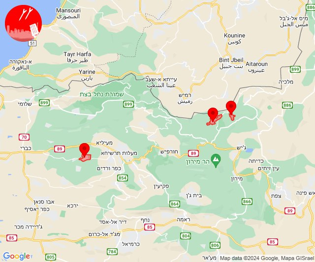

## 02:32

✈️ חדירת כלי טיס עוין (25/08/2024):

05:31:
• קו העימות: אדמית, חניתה, יערה, מצובה, ערב אל עראמשה, שלומי 

05:32:
• קו העימות: אילון, מנות, נווה זיו, עבדון 

צופר - צבע אדום

## 02:32

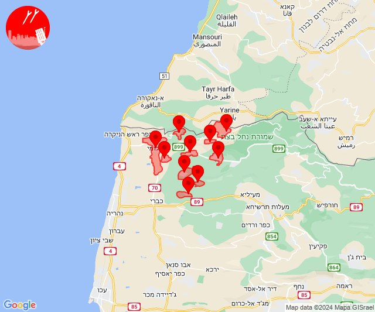

## 02:32

🔴 צבע אדום (25/08/2024):

05:30:
• קו העימות: מנות, אילון, נווה זיו, עבדון (מיידי)

05:31:
• קו העימות: אילון, גורן, מנות, נווה זיו, עבדון, אילון (מיידי)

05:32:
• קו העימות: חניתה (מיידי)

צופר - צבע אדום

## 02:32

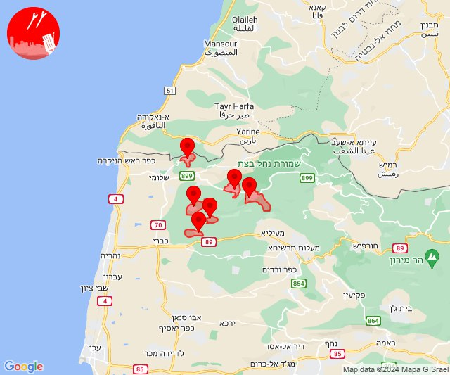

## 02:36

🔴 צבע אדום (25/08/2024):

05:34:
• קו העימות: יערה, אדמית, בצת (מיידי)

05:36:
• קו העימות: בית ספר שדה מירון, סאסא (מיידי)

צופר - צבע אדום

## 02:36

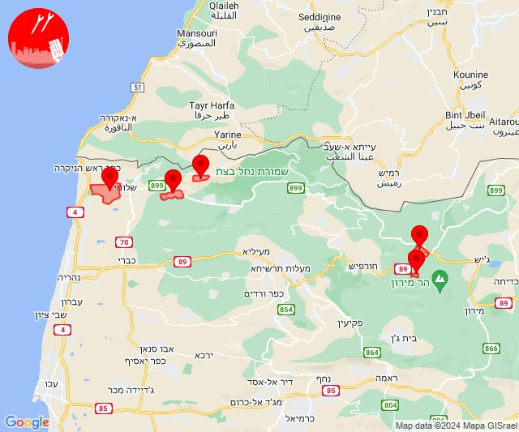

## 02:36

✈️ חדירת כלי טיס עוין (25/08/2024):

05:34:
• קו העימות: אילון, חניתה, מנות, מצובה, נווה זיו, עבדון, ערב אל עראמשה, שלומי 

05:35:
• קו העימות: אדמית, יערה 

05:36:
• קו העימות: אדמית, אילון, חניתה, יערה, מנות, מצובה, נווה זיו, עבדון, ערב אל עראמשה, שלומי 

צופר - צבע אדום

## 02:36

## 02:38

✈️ חדירת כלי טיס עוין (25/08/2024):

05:38:
• קו העימות: כברי 

צופר - צבע אדום

## 02:38

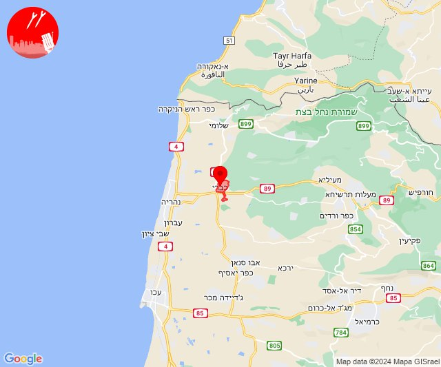

## 02:39

🔴 צבע אדום (25/08/2024):

05:38:
• קו העימות: בן עמי, נווה זיו, עבדון (מיידי)
• גליל עליון: נתיב השיירה, שייח' דנון (30 שניות)

05:39:
• קו העימות: כברי, נווה זיו, עבדון (מיידי)

צופר - צבע אדום

## 02:39

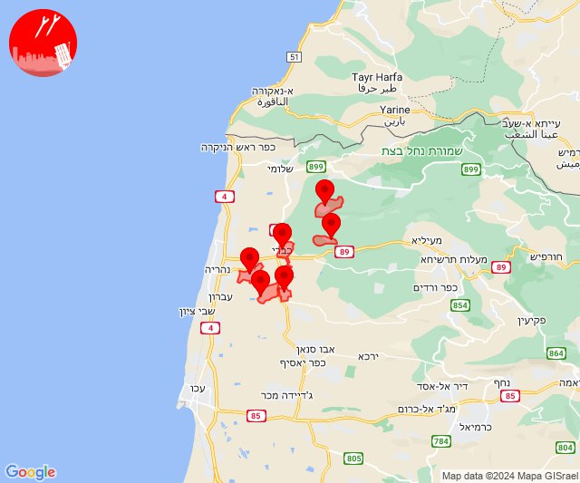

## 02:45

🔴 צבע אדום (25/08/2024):

05:42:
• קו העימות: ערב אל עראמשה (מיידי)

05:43:
• גליל עליון: בוסתן הגליל, עכו, שומרת (30 שניות)

05:44:
• קו העימות: בית הלל, קריית שמונה, הגושרים, כפר גלעדי, תל חי (מיידי)

05:45:
• גליל עליון: עין המפרץ, עכו - אזור תעשייה, עכו (30 שניות)

צופר - צבע אדום

## 02:45

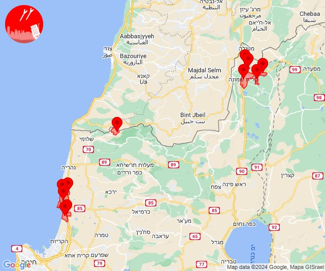

## 02:47

🔴 צבע אדום (25/08/2024):

05:47:
• קו העימות: שניר (מיידי)

צופר - צבע אדום

## 02:47

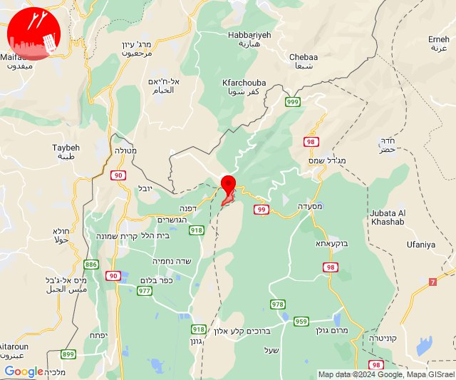

## 02:52

✈️ חדירת כלי טיס עוין (25/08/2024):

05:51:
• גליל עליון: אזור תעשייה חצור הגלילית, חצור הגלילית, איילת השחר, עמוקה, שדה אליעזר 

05:52:
• גליל עליון: אזור תעשייה חצור הגלילית, חצור הגלילית, איילת השחר, עמוקה, שדה אליעזר 

צופר - צבע אדום

## 02:52

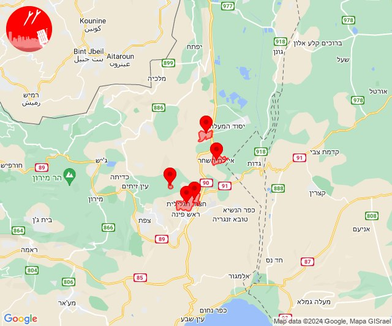

## 02:57

🔴 צבע אדום (25/08/2024):

05:51:
• קו העימות: דישון, מלכיה, אלקוש, פסוטה (מיידי)

05:53:
• דרום הגולן: קצרין (30 שניות)
• קו העימות: מתת (מיידי)

05:54:
• קו העימות: נטועה, חורפיש, סאסא (מיידי)

05:55:
• קו העימות: כפר ורדים, מעונה, מעלות תרשיחא (15 שניות, מיידי)

05:56:
• קו העימות: נטועה, פסוטה (מיידי)
• צפון הגולן: שעל, אורטל, עין זיוון (15 שניות, מיידי)

05:57:
• צפון הגולן: מסעדה, נמרוד, עין קנייא (מיידי)

צופר - צבע אדום

## 02:57

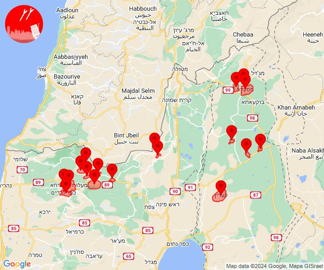

## 03:01

🔴 צבע אדום (25/08/2024):

06:01:
• גליל עליון: נס עמים, לוחמי הגטאות, מזרעה, רגבה, מירון (30 שניות)

צופר - צבע אדום

## 03:01

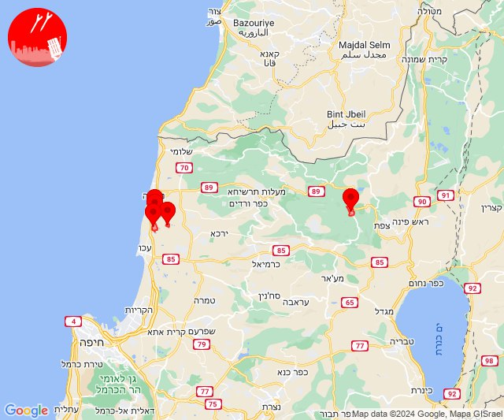

## 03:07

🔴 צבע אדום (25/08/2024):

06:06:
• קו העימות: דוב''ב, צבעון, ג'ש - גוש חלב, דלתון, אזור תעשייה רמת דלתון, כרם בן זמרה (מיידי)
• גליל עליון: קדיתא, ביריה, צפת, חצור הגלילית, אור הגנוז, בר יוחאי, ספסופה - כפר חושן, עמוקה (30 שניות)

06:07:
• קו העימות: סאסא, צבעון (מיידי)

צופר - צבע אדום

## 03:07

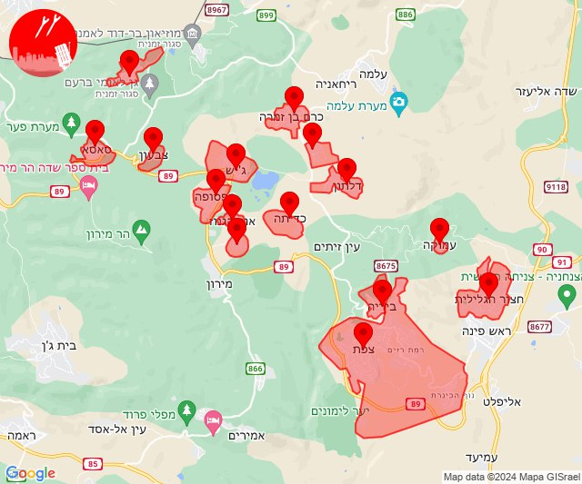

## 03:14

🔴 צבע אדום (25/08/2024):

06:09:
• קו העימות: מעיין ברוך, הגושרים, בית הלל (מיידי)

06:10:
• קו העימות: ע'ג'ר (מיידי)

06:11:
• קו העימות: דפנה, קיבוץ דן, שאר ישוב, שניר (מיידי)

06:12:
• קו העימות: דפנה, קיבוץ דן, שאר ישוב, שניר (מיידי)

06:13:
• קו העימות: שמיר (15 שניות)

06:14:
• קו העימות: שמיר, כפר סאלד, סאסא, ג'ש - גוש חלב, בית ספר שדה מירון, צבעון (15 שניות, מיידי)
• גליל עליון: אור הגנוז, ספסופה - כפר חושן (30 שניות)

צופר - צבע אדום

## 03:14

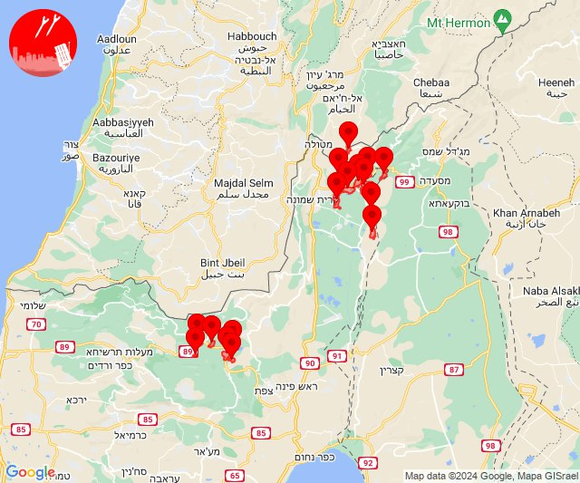

## 03:15

✈️ חדירת כלי טיס עוין (25/08/2024):

06:15:
• דרום הגולן: קדמת צבי, קצרין - אזור תעשייה, קצרין 
• גליל עליון: אזור תעשייה חצור הגלילית, חצור הגלילית, איילת השחר, עמוקה, שדה אליעזר 

צופר - צבע אדום

## 03:15

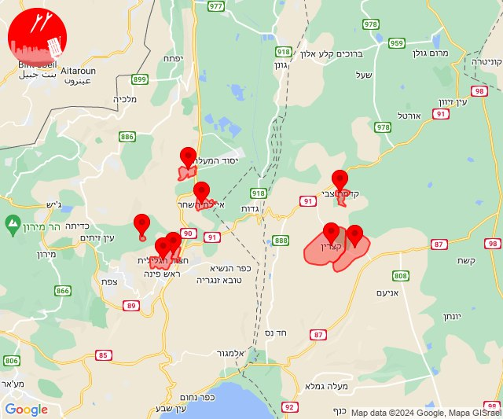

## 03:17

✈️ חדירת כלי טיס עוין (25/08/2024):

06:17:
• דרום הגולן: קדמת צבי, קצרין - אזור תעשייה, קצרין, אניעם 
• גליל עליון: איילת השחר 

צופר - צבע אדום

## 03:17

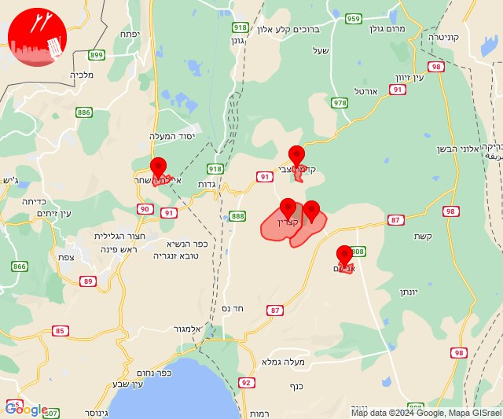

## 03:20

🔴 צבע אדום (25/08/2024):

06:20:
• גליל עליון: קדיתא, גדות, משמר הירדן, ספסופה - כפר חושן (30 שניות)
• קו העימות: דלתון, ג'ש - גוש חלב, כרם בן זמרה (מיידי)

צופר - צבע אדום

## 03:20

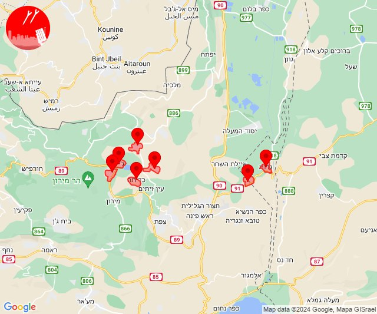

## 03:30

🔴 צבע אדום (25/08/2024):

06:30:
• קו העימות: רמות נפתלי, רמות נפתלי (מיידי)
• גליל עליון: איילת השחר, משמר הירדן (30 שניות)

צופר - צבע אדום

## 03:30

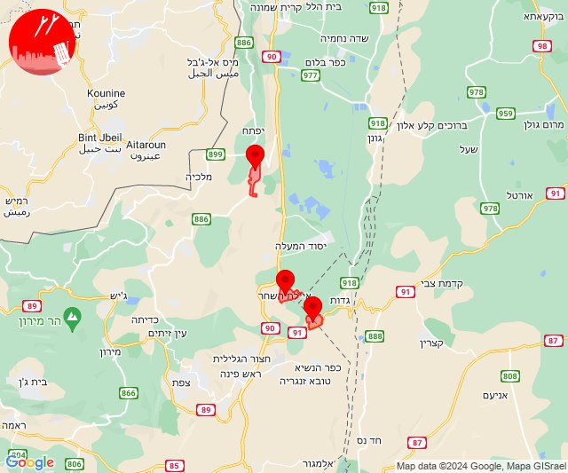

## 03:39

🔴 צבע אדום (25/08/2024):

06:38:
• צפון הגולן: נווה אטי''ב (מיידי)

06:39:
• צפון הגולן: מג'דל שמס, נווה אטי''ב, נמרוד, עין קנייא (מיידי)

צופר - צבע אדום

## 03:39

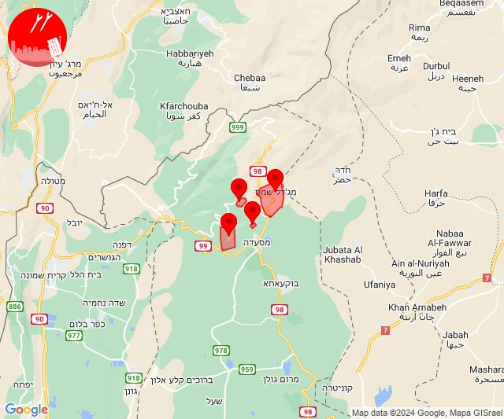

## 03:41

🔴 צבע אדום (25/08/2024):

06:41:
• קו העימות: קיבוץ דן, שאר ישוב, שניר (מיידי)

צופר - צבע אדום

## 03:41

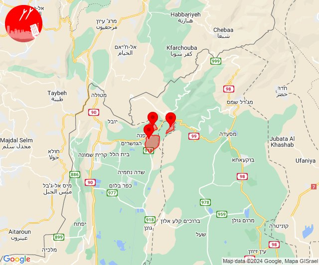

## 04:33

🔴 צבע אדום (25/08/2024):

07:33:
• קו העימות: חורפיש, סאסא (מיידי)

צופר - צבע אדום

## 04:34

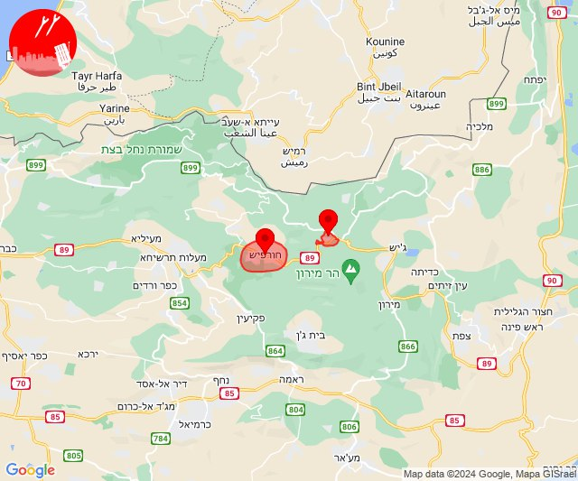

## 04:36

🔴 צבע אדום (25/08/2024):

07:35:
• קו העימות: בית ספר שדה מירון (מיידי)

07:36:
• קו העימות: סאסא (מיידי)

צופר - צבע אדום

## 04:36

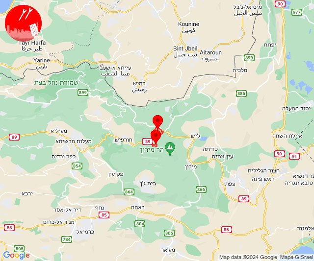

## 06:09

🔴 צבע אדום (25/08/2024):

09:09:
• עוטף עזה: כרם שלום (15 שניות)

צופר - צבע אדום

## 06:09

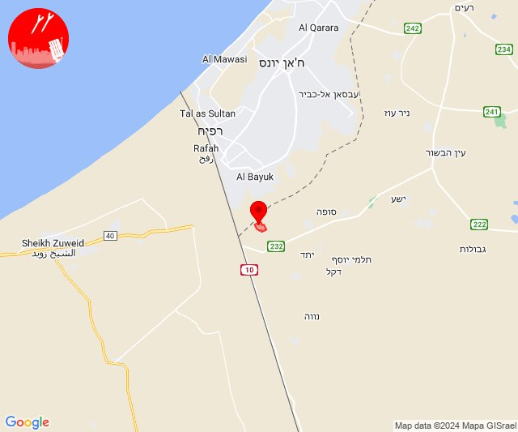

## 19:01

🔴 צבע אדום (25/08/2024):

22:01:
• השפלה: ראשון לציון - מערב (דקה וחצי)

צופר - צבע אדום

## 19:01

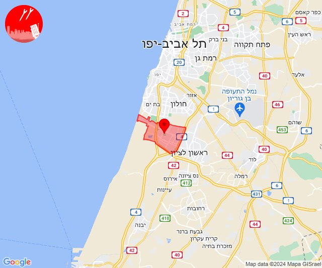

