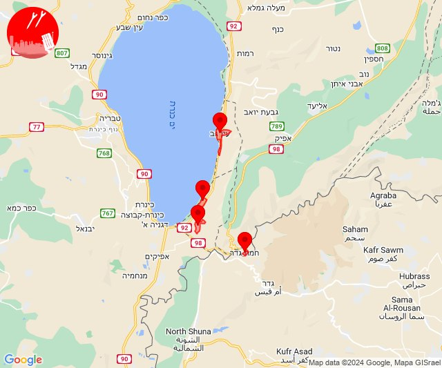
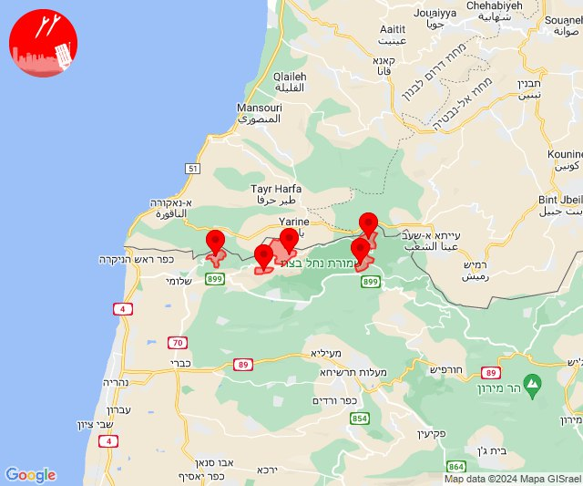
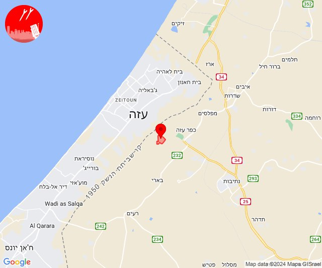
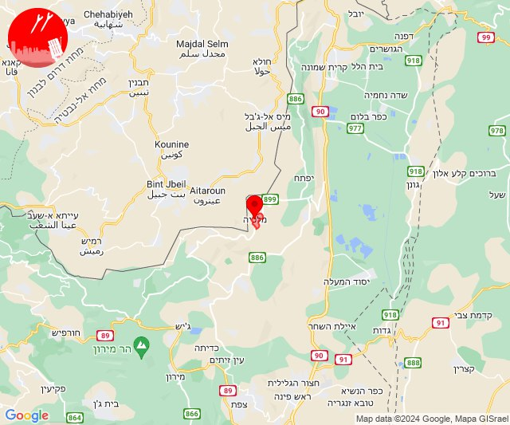
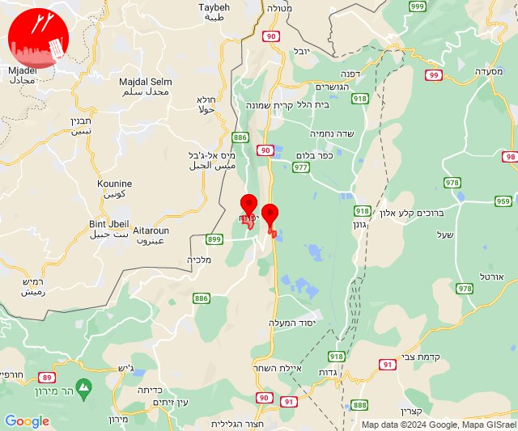
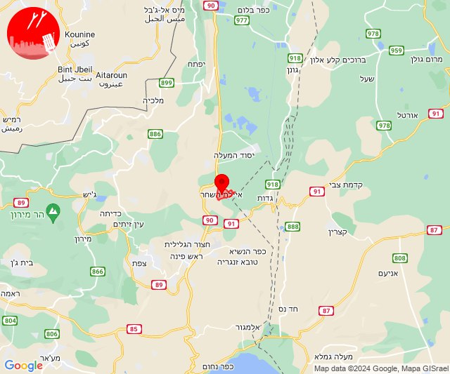
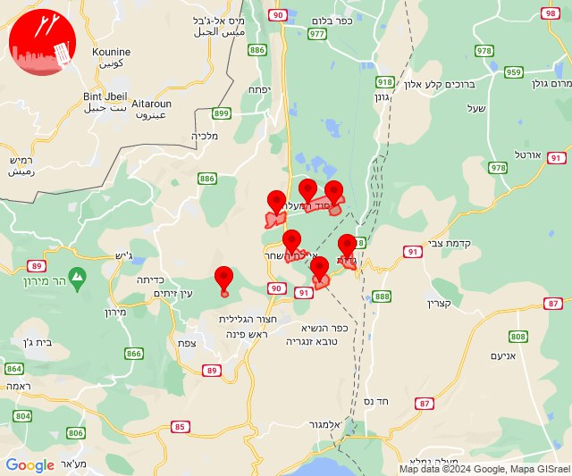
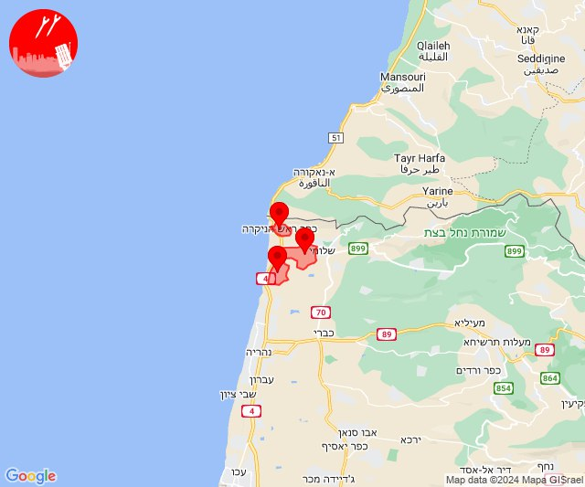
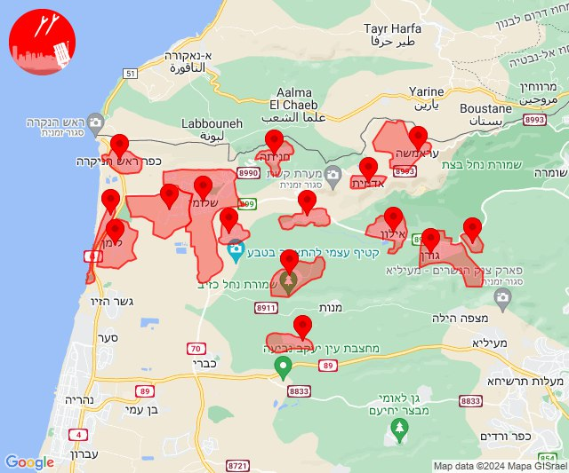
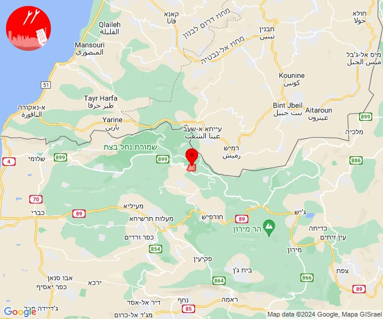

# Alerts for 2024-08-26

## 04:05

✈️ חדירת כלי טיס עוין (26/08/2024):

07:03:
• דרום הגולן: חמת גדר 

07:04:
• דרום הגולן: חמת גדר 

07:05:
• דרום הגולן: האון, עין גב, תל קציר 

צופר - צבע אדום

## 04:05

## 11:17

🔴 צבע אדום (26/08/2024):

14:16:
• קו העימות: אדמית, חניתה, ערב אל עראמשה (מיידי)

14:17:
• קו העימות: זרעית, שומרה (מיידי)

צופר - צבע אדום

## 11:17

## 11:31

🔴 צבע אדום (26/08/2024):

14:31:
• עוטף עזה: נחל עוז (15 שניות)

צופר - צבע אדום

## 11:31

## 14:53

🔴 צבע אדום (26/08/2024):

17:53:
• קו העימות: מלכיה (מיידי)

צופר - צבע אדום

## 14:53

## 15:36

✈️ חדירת כלי טיס עוין (26/08/2024):

18:36:
• קו העימות: יפתח, מרכז אזורי מבואות חרמון 

צופר - צבע אדום

## 15:36

## 15:40

✈️ חדירת כלי טיס עוין (26/08/2024):

18:40:
• גליל עליון: איילת השחר 

צופר - צבע אדום

## 15:40

## 15:42

✈️ חדירת כלי טיס עוין (26/08/2024):

18:42:
• גליל עליון: גדות, חולתה, איילת השחר, עמוקה, יסוד המעלה, משמר הירדן, שדה אליעזר 

צופר - צבע אדום

## 15:42

## 16:00

🔴 צבע אדום (26/08/2024):

19:00:
• קו העימות: בצת, לימן, ראש הנקרה (מיידי)

צופר - צבע אדום

## 16:00

## 16:03

✈️ חדירת כלי טיס עוין (26/08/2024):

18:59:
• קו העימות: חניתה 

19:00:
• קו העימות: שלומי, חניתה, יערה, מצובה, עבדון, נווה זיו 

19:01:
• קו העימות: חניתה 

19:02:
• קו העימות: אדמית, אזור תעשייה אכזיב מילואות, אילון, בצת, גורן, גורנות הגליל, חניתה, יערה, לימן, מצובה, ערב אל עראמשה, ראש הנקרה, שלומי 

19:03:
• קו העימות: חניתה, עבדון 

צופר - צבע אדום

## 16:03

## 17:58

🔴 צבע אדום (26/08/2024):

20:58:
• קו העימות: נטועה (מיידי)

צופר - צבע אדום

## 17:58

