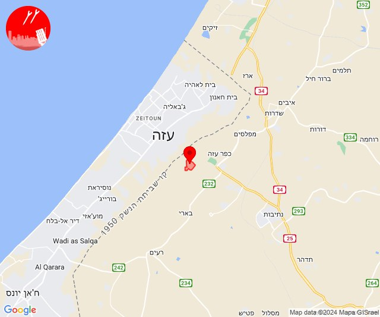
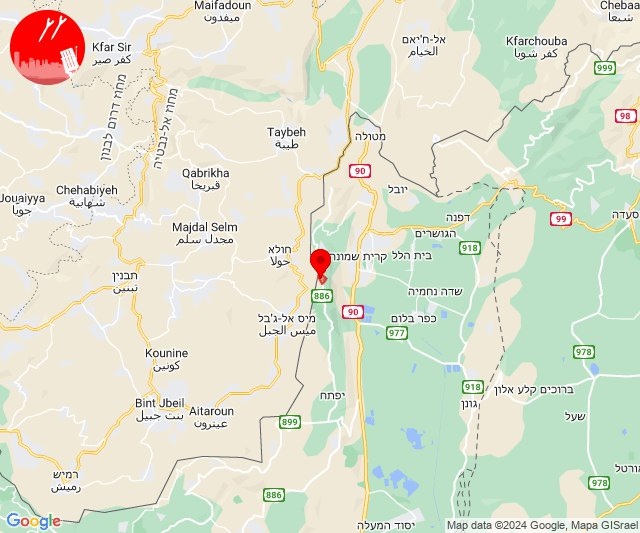
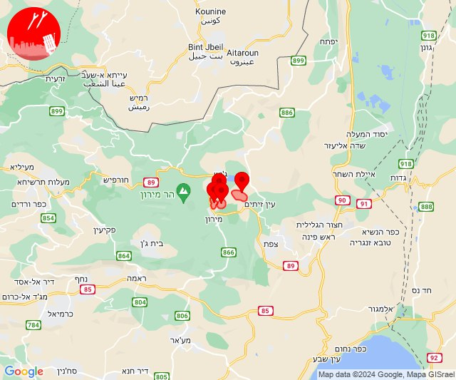
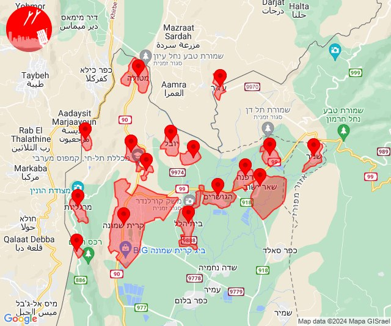

# Alerts for 2024-08-27

## 04:37

🔴 צבע אדום (27/08/2024):

07:37:
• עוטף עזה: נחל עוז (15 שניות)

צופר - צבע אדום

## 04:37

## 04:52

🔴 צבע אדום (27/08/2024):

07:52:
• קו העימות: מנרה (מיידי)

צופר - צבע אדום

## 04:52

## 12:14

🔴 צבע אדום (27/08/2024):

15:14:
• גליל עליון: אור הגנוז, בר יוחאי, מרכז אזורי מרום גליל, קדיתא (30 שניות)

צופר - צבע אדום

## 12:14

## 16:27

✈️ חדירת כלי טיס עוין (27/08/2024):

19:26:
• קו העימות: בית הלל, כפר גלעדי, כפר יובל, מטולה, מנרה, מעיין ברוך, מרגליות, משגב עם, קריית שמונה, תל חי 

19:27:
• קו העימות: דפנה, הגושרים, ע'ג'ר, קיבוץ דן, שאר ישוב, שניר 

צופר - צבע אדום

## 16:27

