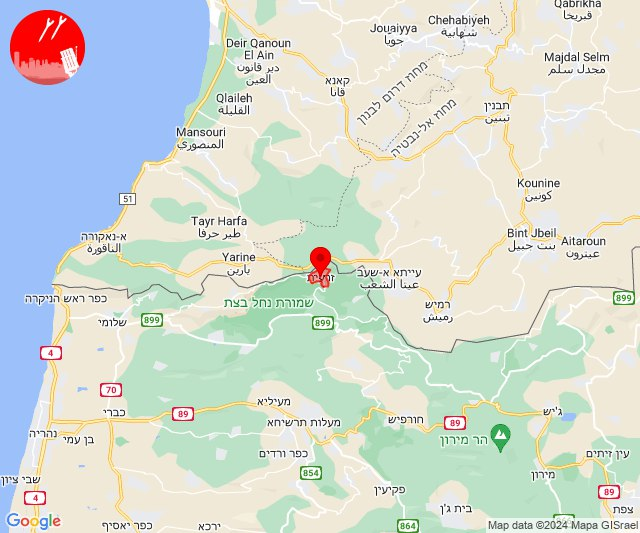

# Alerts for 2024-08-29

## 02:15

🔴 צבע אדום (29/08/2024):

05:15:
• קו העימות: ערב אל עראמשה (מיידי)

צופר - צבע אדום

## 02:15

## 05:31

🔴 צבע אדום (29/08/2024):

08:31:
• עוטף עזה: כיסופים (15 שניות)

צופר - צבע אדום

## 05:31

## 09:59

✈️ חדירת כלי טיס עוין (29/08/2024):

12:59:
• צפון הגולן: קלע, שעל 

צופר - צבע אדום

## 09:59

## 10:03

✈️ חדירת כלי טיס עוין (29/08/2024):

13:02:
• צפון הגולן: קלע, שעל, עין קנייא 

13:03:
• צפון הגולן: קלע, שעל 

צופר - צבע אדום

## 10:03

## 11:00

🔴 צבע אדום (29/08/2024):

14:00:
• קו העימות: דפנה, קיבוץ דן, שאר ישוב (מיידי)

צופר - צבע אדום

## 11:00

## 12:09

🔴 צבע אדום (29/08/2024):

15:09:
• קו העימות: זרעית (מיידי)

צופר - צבע אדום

## 12:09

## 13:36

🔴 צבע אדום (29/08/2024):

16:36:
• קו העימות: שתולה, נטועה (מיידי)

צופר - צבע אדום

## 13:36

## 22:49

🔴 צבע אדום (30/08/2024):

01:49:
• גליל עליון: כיסרא סמיע, מגדל תפן (30 שניות)

צופר - צבע אדום

## 22:49

