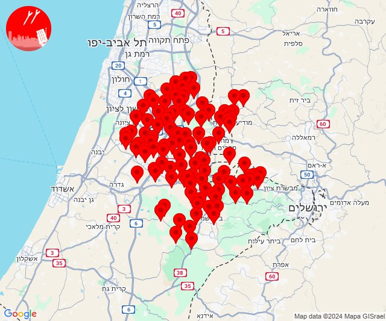

# Alerts for 2024-12-01

## 04:22

🔴 צבע אדום (01/12/2024):

06:21:
• השפלה: כפר בן נון, משמר איילון, אזור תעשייה נשר - רמלה, אזור תעשייה רגמ, אחיסמך, באר יעקב, בן שמן, גינתון, ישרש, כפר נוער בן שמן, לוד, מצליח, ניר צבי, רמלה, בית חשמונאי, בית עוזיאל, גזר, גני הדר, גני יוחנן, זיתן, חולדה, יד רמב''ם, יסודות, יציץ, כפר ביל''ו, כפר שמואל, כרמי יוסף, מזכרת בתיה, משמר דוד, נען, נצר חזני, סתריה, עזריה, פדיה, פתחיה, רמות מאיר (דקה וחצי)
• שפלת יהודה: לטרון, מיני ישראל - נחשון, נווה שלום, נחשון, אזור תעשייה הר טוב - צרעה, אשתאול, בית שמש, בקוע, גיזו, הראל, טל שחר, ישעי, כפר אוריה, מסילת ציון, נחם, צלפון, צרעה, רטורנו - גבעת שמש, שער הגיא, תעוז, תרום, בית מאיר, יד השמונה, כסלון, כפר הנוער קריית יערים, נווה אילן, נטף, שואבה, שורש (דקה וחצי)
• ירקון: גמזו, חשמונאים, כפר דניאל, כפר רות, לפיד, מבוא חורון, מבוא מודיעים, מודיעין - ליגד סנטר, מודיעין מכבים רעות, מודיעין עילית, מתתיהו, נוף איילון, שילת, שעלבים, בית נחמיה, בית עריף, חדיד, כפר טרומן, נאות קדומים, איירפורט סיטי, כפר האורנים, מודיעין - ישפרו סנטר (דקה וחצי)
• שומרון: נילי, נעלה (דקה וחצי)

06:22:
• שפלת יהודה: גפן, זכריה, עגור, שדות מיכה, תירוש, צומת האלה, רמת רזיאל, קריית יערים, אזור תעשייה ברוש, מחסיה, זנוח (דקה, דקה וחצי)
• לכיש: מפעל אגריגדה (דקה)
• השפלה: קריית עקרון, גן שלמה, רחובות, גיבתון, נצר סרני, תעשיון צריפין (דקה וחצי)
• ירקון: שוהם (דקה וחצי)

צופר - צבע אדום

## 04:22

