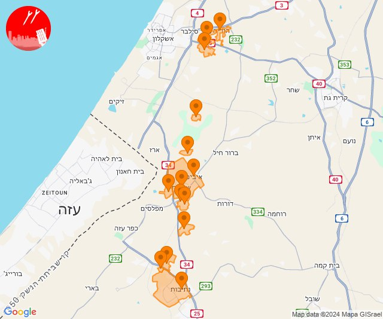

# Alerts for 2024-12-12

## 07:05

✈️ חדירת כלי טיס עוין (12/12/2024):

08:52:
• מערב הנגב: נתיבות 

08:53:
• עוטף עזה: חוות יזרעם, תקומה 

08:55:
• עוטף עזה: יכיני 

08:56:
• עוטף עזה: גבים, מכללת ספיר 

08:57:
• עוטף עזה: שדרות, איבים, ניר עם 

09:00:
• עוטף עזה: אור הנר 

09:01:
• עוטף עזה: גברעם 

09:05:
• מערב לכיש: ברכיה, הודיה, משען 

צופר - צבע אדום

## 07:05

